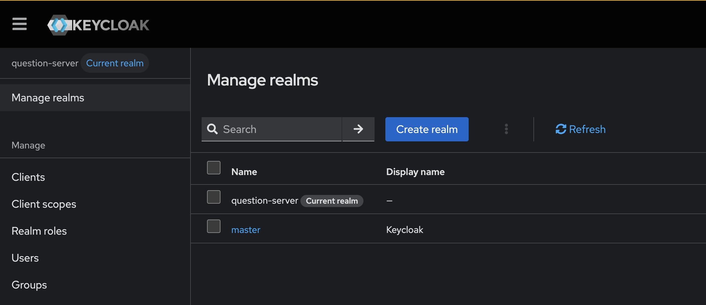
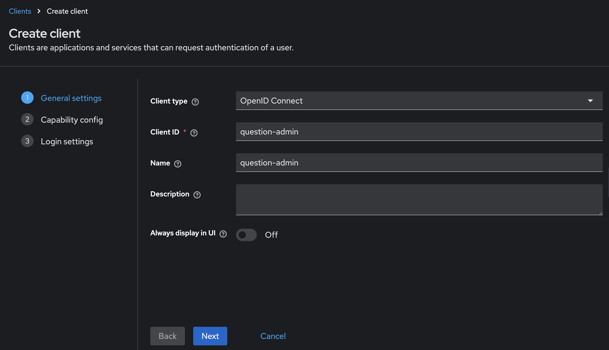
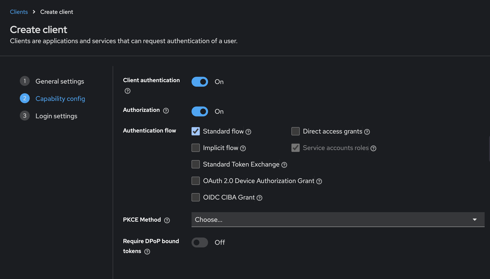
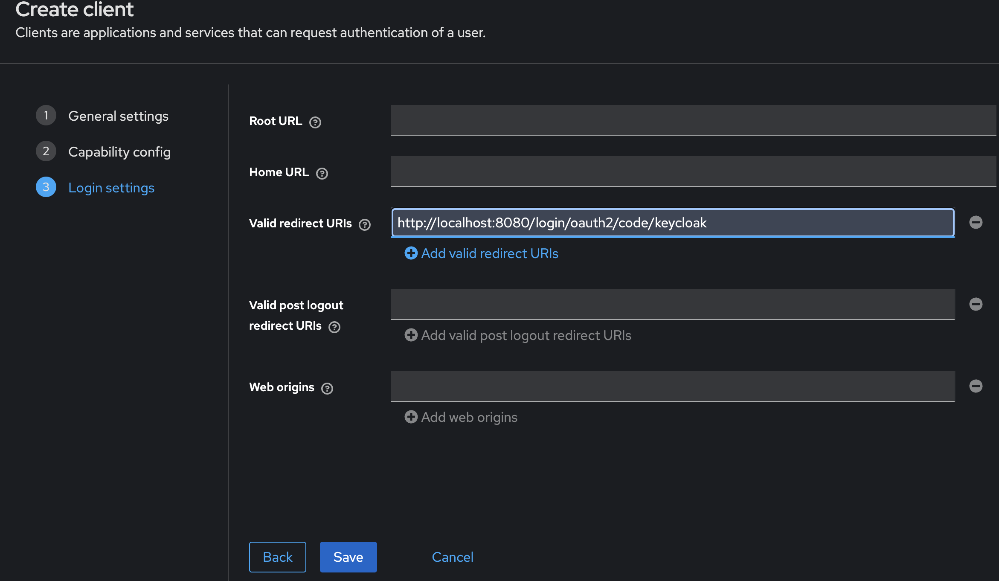
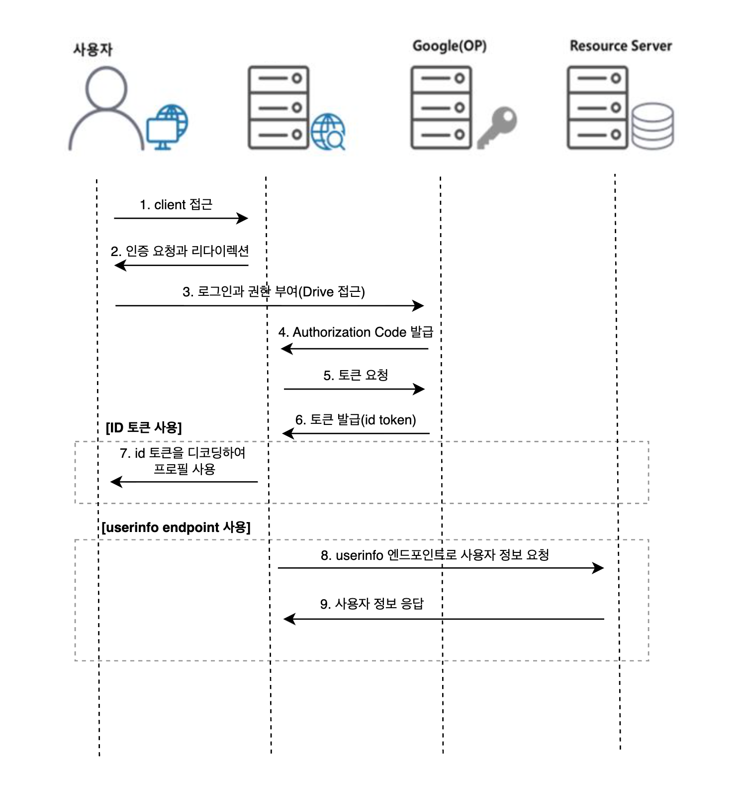

<Header />

[[toc]]

# 1. keycloak 이란

Keycloak은 **오픈소스 인증·인가(Identity and Access Management, IAM) 솔루션**으로, 사용자 로그인/로그아웃, 회원가입, 권한 부여 등을 쉽게 구현할 수 있도록 도와주는 서버다. 

특히, 다양한 애플리케이션과 서비스에서 공통으로 쓸 수 있는 **중앙 인증 서버** 역할로 SSO(Single Sign-on)을 가능하게 해주기 때문에, 각각의 앱마다 로그인 기능을 따로 구현할 필요가 없다.

## 1.1 SSO 란?

**SSO(Single-Sign-On)** 은 여러 개의 애플리케이션에서 사용자가 한 번 로그인하면, 추가 인증 없이 모든 서비스에 자동으로 로그인되는 기능을 의미한다.

예를 들어,

- 구글 계정으로 Gmail, Drive, YouTube 에 동시에 접근
- 회사의 사내 포털에 로그인하면 메일, 인사시스템, 메신저에도 자동 로그인

와 같은 것들이 SSO 의 사례다. Keycloak은 이러한 SSO 기능을 표준 프로토콜(OIDC, OAuth2.0, SAML)을 기반으로 제공한다.

## 1.2 제공 기능

Keycloak이 제공하는 대표적인 기능은 다음과 같다.

1. **중앙 인증 및 인가**
   - 회원가입, 로그인, 로그아웃, 비밀번호 재설정 같은 기능 제공
   - Role 기반 접근 제어(RBAC) 지원
2. **SSO / SLO 지원**
   - 한 번 로그인하면 여러 서비스에서 재인증 없이 사용 가능
   - Single Logout(SLO)도 제공하여 한 번 로그아웃 시 모든 앱에서 로그아웃
3. **표준 프로토콜 지원**
   - OpenID Connect (OIDC)
   - OAuth 2.0
   - SAML 2.0
4. **사용자 관리 기능**
   - Admin Console에서 사용자(User) 생성/조회/수정/삭제
   - 그룹(Group) 관리, Role 매핑
   - 사용자 속성(Attribute) 확장 가능
5. **소셜 로그인 및 외부 ID 연동**
   - Google, Facebook, GitHub 같은 외부 IdP 연동 가능
   - LDAP, Active Directory 같은 사내 인증 시스템 연계
6. **다양한 보안 기능**
   - 2단계 인증(OTP, MFA)
   - 이메일/휴대폰 인증
   - 세션/토큰 관리

# 2. keycloak 구축

## 2.1 docker-compose

도커 컴포즈로 간단하게 구성할 수 있다.

```yml
services:
  keycloak:
    image: quay.io/keycloak/keycloak:latest   # 필요 시 고정 버전으로 변경 권장 (예: 26.0)
    container_name: keycloak
    ports:
      - "9010:8080"        # http://localhost:8080
    environment:
      KEYCLOAK_ADMIN: admin
      KEYCLOAK_ADMIN_PASSWORD: admin

      # --- DB 연결 설정 (Keycloak Quarkus) ---
      KC_DB: postgres
      KC_DB_USERNAME: postgres
      KC_DB_PASSWORD: 1234
      KC_DB_URL_HOST: host.docker.internal   # 호스트의 Postgres 로 연결
      KC_DB_URL_PORT: "5432"
      KC_DB_URL_DATABASE: keycloak

      # 선택: 헬스/메트릭
      KC_HEALTH_ENABLED: "true"
      KC_METRICS_ENABLED: "true"
    command: ["start-dev"]

    # Linux에서 host.docker.internal 사용을 위한 매핑 (Docker 20.10+)
    extra_hosts:
      - "host.docker.internal:host-gateway"
```

## 2.2 keycloak 구성

백엔드 서버에서 통신하며 기본적인 로그인 및 회원가입 기능을 할 수 있도록 구성한다.

### 2.2.1 realm 생성

realm 은 인증/인가를 담당하는 논리적 보안 영역이다. **하나의 Realm 은 독립적인 사용자(User), 클라이언트(Client), 보안 정책을 가지며 다른 Realm과는 격리돼 있어 계정/권한이 공유되지 않는다.**



해당 페이지에서 Create realm 을 누르고 생성한다. (question-server)

### 2.2.2 client 생성 및 설정

Client 는 <u>Keycloak에 인증을 위임하는 애플리케이션을 의미</u>한다. 생성된 realm 에서 Manage > Client > Create Client 를 클릭한다. 그러면 아래와 같은 생성 페이지가 보인다.





**Client authentication**

- 의미: 이 Client가 Keycloak에 토큰을 요청할 때 **자신을 인증할 필요가 있는지** 여부
- 켜면 Confidential Client
  - 토큰 요청 시 `client_id` + `client_secret` 또는 private key 같은 **클라이언트 자격 증명**이 필요
  - 보통 **백엔드 애플리케이션 / 서버 간 통신**에서 사용
- 끄면 Public Client
  - 토큰 요청 시 클라이언트 인증 불필요, `client_id`만 있으면 됨
  - 보통 **SPA(React/Vue), 모바일 앱**처럼 client_secret을 안전하게 숨길 수 없는 환경에서 사용

**Authorization**

- 의미: **Keycloak의 Authorization Services** 기능을 활성화할지 여부
- 켜면 이 Client에 대해 **리소스(Resource), 권한(Policy), 퍼미션(Permission)** 을 정의할 수 있음
  - 즉, 단순한 Role 기반이 아니라 세밀한 권한 제어(ABAC, RBAC 혼합)를 적용 가능
- 끄면 일반적인 인증(Client → User 로그인/토큰 발급)만 수행한다.
- 사례
  - 전자문서 서비스에서 “문서 소유자만 열람 가능”, “관리자만 삭제 가능” 같은 세밀한 정책을 Client 안에서 정의하고 싶을 때 Authorization ON
  - 단순히 USER vs ADMIN Role만 구분하면 되는 경우 Authorization OFF




인증을 수행하는 redirect URL 을 입력한다.

### 2.2.3 백엔드 설정 (로그인)

`build.gradle.kts` 는 아래와 같이 추가한다.

```groovy
// security & oauth2
implementation("org.springframework.boot:spring-boot-starter-security")
implementation("org.springframework.boot:spring-boot-starter-oauth2-client")
// Protect APIs with JWT from Keycloak
implementation("org.springframework.boot:spring-boot-starter-oauth2-resource-server")
```

그리고 configuration 파일은 아래와 같이 oauth2 설정을 추가한다.

```yml
spring:
  application:
    name: user-service
  security:
    oauth2:
      client:
        registration:
          keycloak:
            scope:
              - openid
              - profile
              - email
            authorization-grant-type: authorization_code
            redirect-uri: "{baseUrl}/login/oauth2/code/{registrationId}"
            client-id: question-admin
            client-secret: {client-secret}
        provider:
          keycloak:
            issuer-uri: http://localhost:9010/realms/question-server
      resource-server:
        jwt:
          issuer-uri: http://localhost:9010/realms/question-server
```

그럼 추가적인 코드 없이 OAuth2 가 설정된다.

# 3. keycloak 설정 알아보기

소셜 로그인은 몇번 구현해봤지만 keycloak 설정은 익숙하지 않아서 정리해봤다.

## 3.1 Keycloak 주요 개념

### Realm

- **사용자와 보안 정책을 관리하는 독립된 공간**
- 하나의 Realm은 자체 사용자(User), 클라이언트(Client), 역할(Role)을 가짐
- 서로 다른 Realm 간에는 사용자와 토큰이 공유되지 않음
- **사례**: 회사 서비스 A와 B를 각각 분리된 Realm으로 두어 사용자 풀을 분리 운영

### Client

- Keycloak에 인증을 위임하는 **애플리케이션 또는 서비스**
- 웹앱, 모바일앱, API 서버 등
- Client 설정에 따라 어떤 방식(OIDC/OAuth2/SAML)으로 토큰을 발급받을지 정의

### User

- Realm 안에 속한 **실제 사용자 계정**
- username, email, password, 속성(Attribute)을 가짐
- Group이나 Role을 할당받아 권한이 결정됨
- **사례**: `alice`, `bob` 같은 사용자 계정

### Role

- 권한 단위
- Realm Role: Realm 전체에서 사용되는 권한
- Client Role: 특정 Client 안에서만 유효한 권한

### Client Role

- 특정 **Client** 안에서만 유효한 Role
- 사용자(User)에게 부여할 수 있고, 그 사용자가 해당 Client로 로그인했을 때 토큰에 포함됨
- 즉, **"이 Client 안에서 어떤 권한을 가질지"**를 정의하는 역할

**사례**

- Realm: `question-server`
- Client: `question-backend`
  - Client Role: `ROLE_USER`, `ROLE_ADMIN`
- User `alice`에게 `question-backend` Client의 `ROLE_USER`를 매핑 →
   alice이 `question-backend`로 로그인할 때 발급받는 토큰 안에 `"resource_access": {"question-backend": {"roles":["ROLE_USER"]}}` 가 들어감

### Service Account Role

- **Service Account**는 `client_credentials` 방식으로 토큰을 받는 Client(=머신)용 계정
- 이 Service Account에게 부여하는 Role이 **Service Account Role**
- 사람이 로그인하는 게 아니라, **머신 간 통신**이나 **백엔드에서 Keycloak Admin REST API 호출** 등에 쓰임
- Service Account는 User가 아니고 Client에 딸린 “특수 User”라고 생각하면 됨

**사례**

- Client: `question-admin` (confidential, Service Account enabled)
- 이 Client의 `Service Account` User에게 Realm Role `manage-users` 부여
- 이제 `question-admin`이 `client_credentials` grant로 토큰을 요청하면 → 토큰에 `manage-users` 권한 포함됨 → Keycloak Admin API(`/admin/realms/...`) 호출 가능

### Group

- 사용자를 묶는 단위
- Group에 Role을 매핑하면, Group에 속한 사용자들이 자동으로 해당 Role 을 상속


## 3.2 keycloak 로그인 플로우

아래 내용에서 google 을  keycloak 으로 변경하면 같다. 관련 글은 [여기로](https://hobeen-kim.github.io/posts/tech/2025-08-29-oidc.html)



<Footer />