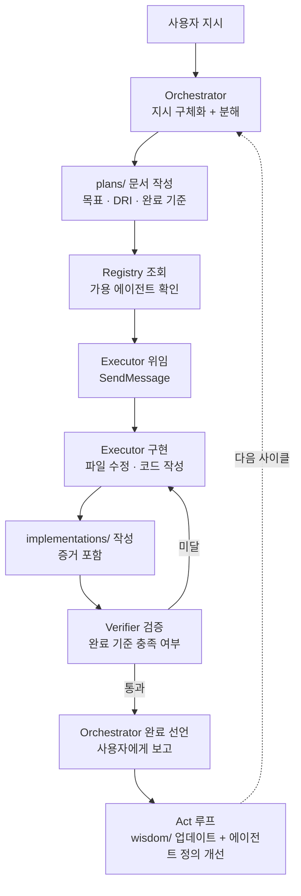
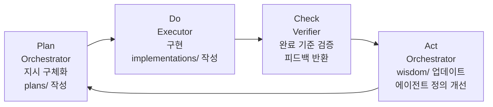
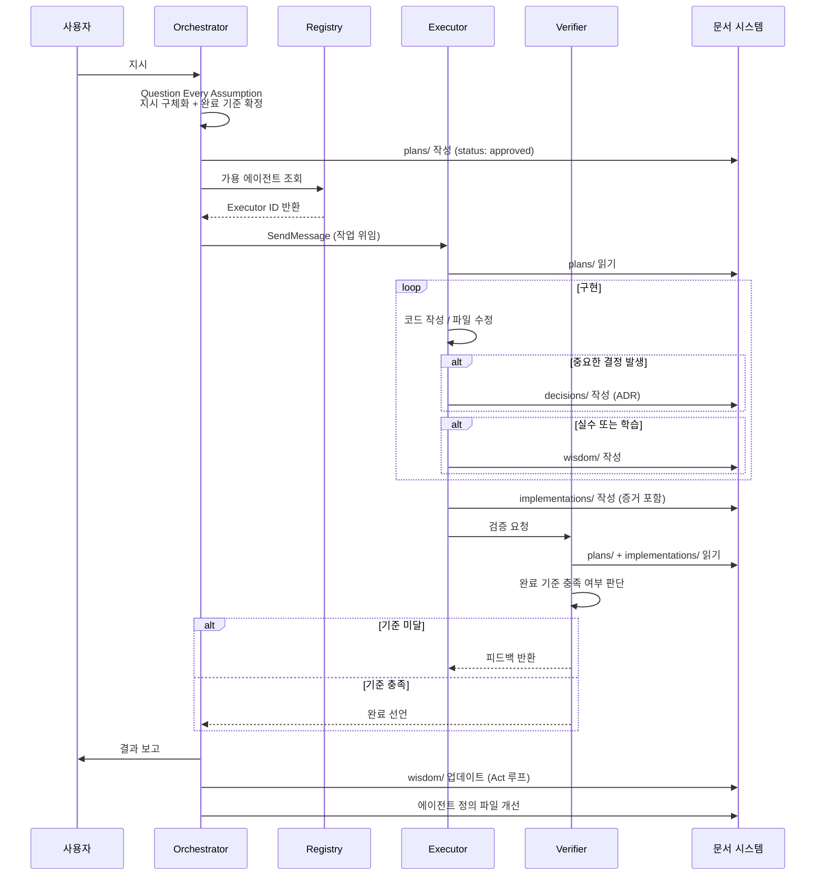
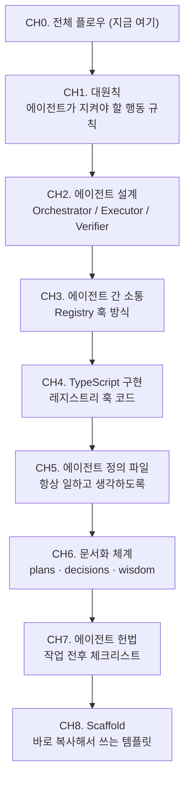

# CH0. 전체 플로우 — 지시에서 완료까지

에이전트 시스템을 처음 설계하면 "어떤 에이전트가 어떤 순서로 무엇을 하는가"가 불분명하다. 이 챕터는 지시 한 줄이 어떻게 구체적인 결과물이 되는지 전체 흐름을 한눈에 보여준다. 이후 챕터들은 이 흐름의 각 구간을 상세히 다룬다.

## 학습 목표
- 지시에서 완료까지의 전체 플로우를 설명할 수 있다.
- PDCA 사이클이 에이전트 워크플로우에 어떻게 매핑되는지 이해한다.
- 각 역할(Orchestrator / Executor / Verifier)이 언제 무엇을 하는지 파악한다.

## 전체 플로우 한눈에 보기

지시는 Orchestrator가 받는다. Orchestrator는 지시를 구체화하고, 작업 단위로 분해하고, 각 단위에 DRI를 배분한다. 분해 결과는 `plans/` 문서에 기록된다. Registry에서 가용 에이전트를 확인하고, Executor에게 `SendMessage`로 위임한다. Executor는 구현 후 `implementations/` 문서에 증거를 남긴다. Verifier가 기준 충족 여부를 검증하고, 통과하면 Orchestrator가 완료를 선언한다. 완료 후에는 Act 루프가 실행되어 `wisdom/`을 업데이트하고 에이전트 정의 파일을 개선한다.

## PDCA 사이클 매핑

에이전트 워크플로우는 PDCA(Plan-Do-Check-Act) 사이클의 구현이다.

| PDCA | 에이전트 | 문서 | 챕터 |
|------|---------|------|------|
| Plan | Orchestrator | plans/ | CH2, CH6 |
| Do | Executor | implementations/ | CH2, CH6 |
| Check | Verifier | implementations/ 검토 | CH2, CH7 |
| Act | Orchestrator | wisdom/, 에이전트 정의 파일 | CH1, CH5, CH6 |

PDCA에서 가장 자주 생략되는 단계는 Act다. 에이전트가 완료를 선언하고 끝내면 같은 실수가 반복된다. Act 루프가 작동해야 다음 사이클에서 더 나은 결과가 나온다.

## 단계별 상세 설명

### Plan — 지시 구체화

Orchestrator가 사용자의 지시를 받으면 바로 실행하지 않는다. 먼저 질문한다.

- 완료 기준이 명확한가?
- 어떤 에이전트가 DRI인가?
- 완료 기준을 어떻게 검증할 것인가?

이 세 가지가 확정되면 `plans/` 문서를 작성한다. plans 없이 Executor에 위임하면 나중에 "이게 맞냐"는 재작업이 발생한다.

::: info 관련 챕터
- [CH1. 대원칙](/study/ai-agent-workflow/01-core-principles) — Question Every Assumption: 지시를 받기 전에 전제를 먼저 의심한다.
- [CH2. 에이전트 설계](/study/ai-agent-workflow/02-agent-design) — DRI 배분 원칙
:::

### Do — 구현과 증거 수집

Executor는 plans/ 문서를 읽고 시작한다. 완료 기준이 기록되어 있기 때문에 "무엇을 만들어야 하는가"가 명확하다.

구현 중 중요한 결정이 내려지면 `decisions/`에 ADR을 작성한다. 예상치 못한 문제가 발생하면 `wisdom/`에 기록한다. 구현이 완료되면 `implementations/`에 증거를 남긴다.

::: info 관련 챕터
- [CH3. 에이전트 간 소통](/study/ai-agent-workflow/03-communication) — Registry 조회 + SendMessage 위임
- [CH6. 문서화 체계](/study/ai-agent-workflow/06-documentation) — implementations/ 작성 규칙
:::

### Check — 검증

Verifier는 `implementations/`와 `plans/`를 함께 읽는다. implementations에 기록된 증거가 plans에 명시된 완료 기준을 충족하는지 비교한다.

구두 확인이나 Executor의 자기 선언은 검증이 아니다. 파일 경로, 커밋 해시, 테스트 결과 같은 객관적 증거가 기준을 충족해야 통과다.

::: info 관련 챕터
- [CH7. 에이전트 헌법](/study/ai-agent-workflow/07-constitution) — Verifier 역할별 체크리스트
:::

### Act — 개선 루프

Verifier가 통과를 선언하면 즉시 Act 루프가 시작된다.

1. 이번 사이클에서 발생한 실수나 학습 → `wisdom/` 업데이트
2. 재발 방지가 에이전트 수준에서 가능하면 → 에이전트 정의 파일 수정
3. 패턴이 팀 전체에 적용되면 → `CLAUDE.md` 또는 `CONSTITUTION.md` 업데이트

Act 없는 PDCA는 같은 실수를 반복한다. "이번엔 실수했지만 다음엔 안 그럴 것"이라는 생각은 문서화하지 않으면 거짓이다.

::: info 관련 챕터
- [CH1. 대원칙](/study/ai-agent-workflow/01-core-principles) — Learn Proactively: 같은 실수를 두 번 반복하지 않는다.
- [CH5. 에이전트 정의 파일](/study/ai-agent-workflow/05-agent-definition-files) — 에이전트 정의 파일 업데이트 방법
:::

## 전체 시퀀스 다이어그램

## 이 스터디의 구성

각 챕터는 위 플로우의 특정 구간을 깊이 다룬다.

::: tip 핵심 정리
- 지시 → Plan(plans/) → Do(Executor) → Check(Verifier) → Act(wisdom/) → 다음 사이클 순서로 흐른다.
- PDCA에서 Act가 가장 자주 생략된다. Act 없는 PDCA는 같은 실수를 반복한다.
- 각 역할은 문서로 소통한다. 구두 약속은 에이전트 시스템에서 증거가 아니다.

[CH1. 대원칙](/study/ai-agent-workflow/01-core-principles)으로 이어진다.
:::
