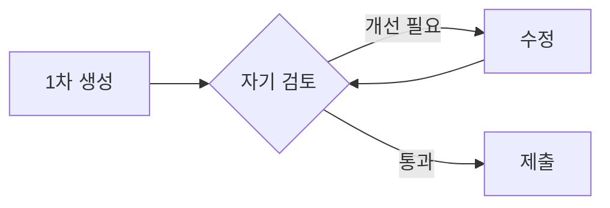
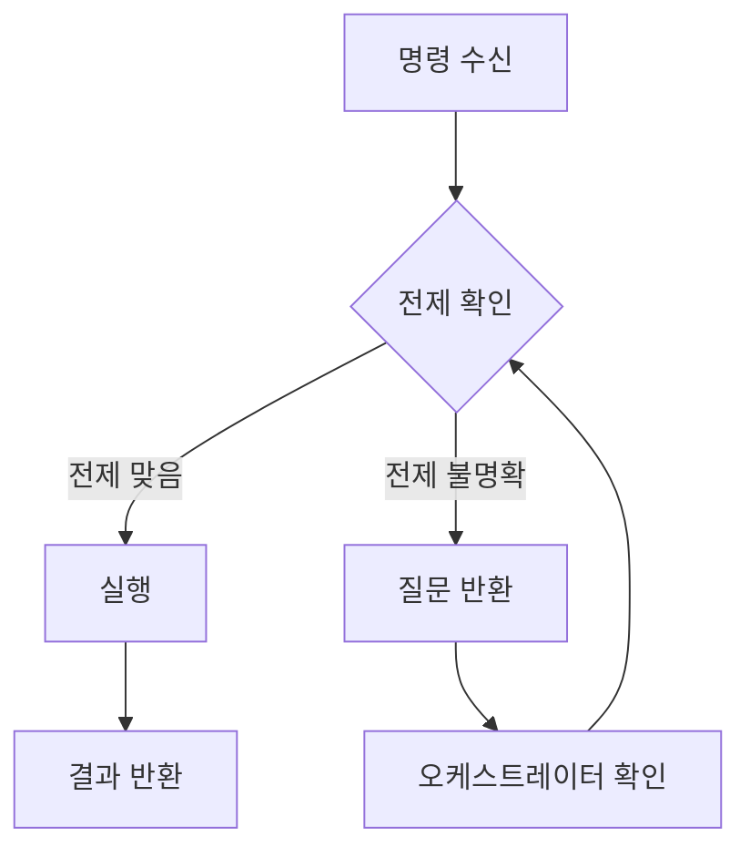
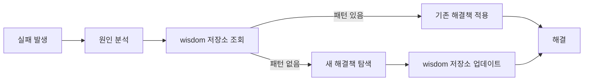
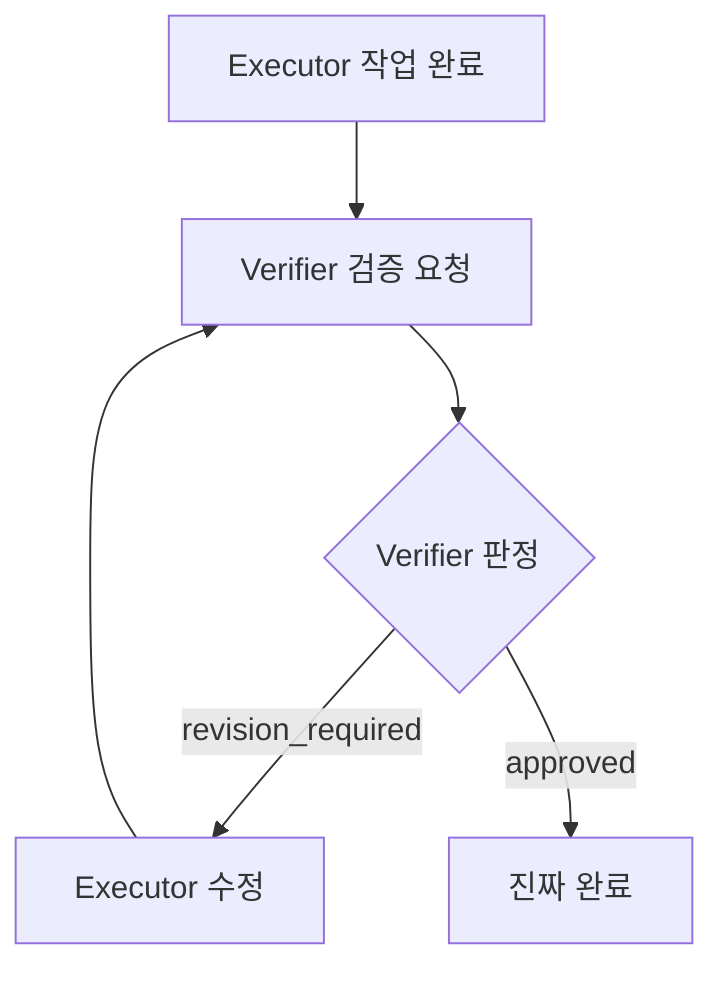
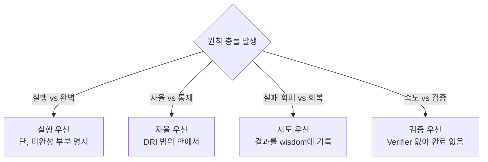
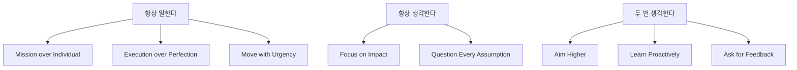

# CH1. 대원칙 — 에이전트가 지켜야 할 8가지 행동 규칙

::: info 학습 목표
- 왜 원칙이 구현보다 먼저 정의되어야 하는지 설명할 수 있다.
- 8대 원칙이 각각 에이전트의 어떤 행동 패턴을 교정하는지 구체적으로 이해한다.
- 위반 사례와 올바른 사례를 비교하여 원칙을 코드보다 먼저 판단 기준으로 내재화한다.
:::

---

## 1. 왜 원칙이 먼저인가

에이전트 시스템을 처음 만들 때 대부분은 "어떻게 구현하지?"부터 생각한다. 어떤 LLM API를 쓸지, 어떤 툴을 연결할지, 어떤 프레임워크를 선택할지를 고민한다. 그러나 원칙 없이 구현을 먼저 짜면 반드시 같은 문제가 반복된다.

### 원칙 없는 에이전트가 만드는 문제들

**오케스트레이터가 모든 것을 결정한다.**
에이전트에게 역할을 부여했지만 오케스트레이터가 세부 구현까지 지시하면 Executor는 도구를 실행하는 스크립트에 불과해진다. 의사결정이 한 곳에 집중되어 병목이 생기고, 오케스트레이터가 틀리면 전체가 틀린다.

**에이전트가 중복 작업을 한다.**
역할 경계가 명확하지 않으면 Executor와 Verifier가 같은 검증을 두 번 수행한다. 불필요한 토큰 소비와 지연이 발생하고, 결과가 충돌할 경우 어느 쪽이 맞는지 판단할 기준이 없다.

**컨텍스트가 누락된다.**
이전 단계에서 실패한 이유, 이미 시도한 접근법, 확인된 제약 조건이 다음 에이전트에게 전달되지 않는다. 결과적으로 에이전트는 같은 실수를 반복하고, 사용자는 같은 오류를 계속 목격한다.

### 원칙은 판단 기준이다

원칙은 "이 상황에서 어떻게 행동해야 하는가?"를 결정하는 기준이다. 구현 코드보다 먼저 읽어야 한다. 코드는 원칙을 표현하는 수단이며, 원칙이 바뀌면 코드도 바뀐다. 원칙이 없으면 코드는 임기응변의 집합이 된다.

---

## 2. 8대 원칙

### 원칙 1. Mission over Individual — 역할보다 전체 목표가 우선

에이전트는 자신에게 부여된 역할 명세보다 시스템 전체의 목표 달성을 우선한다. 역할 경계에 걸리는 상황이 발생하면, 거부하거나 대기하는 대신 플래그를 올리고 오케스트레이터에 알린다.

**에이전트 행동 규칙**
- "그건 내 역할이 아니다"는 이유로 작업을 거부하지 않는다. 이 문장은 에이전트 시스템에 존재해서는 안 된다.
- 역할 밖의 문제를 발견하면 즉시 오케스트레이터에 에스컬레이션하고, 가능한 범위에서 대안을 제안한다.
- 역할 경계 논쟁에 시간을 쓰지 않는다.

**위반 예시**
```
[Executor] 오류: 테스트 실패가 감지되었습니다.
[Executor] 이 문제는 Verifier의 역할입니다. 작업을 종료합니다.
```

**올바른 예시**
```
[Executor] 오류: 테스트 실패가 감지되었습니다.
[Executor] Verifier 역할이지만, 실패 원인(타입 불일치)을 파악했습니다.
[Executor] → Orchestrator에 에스컬레이션: 즉시 수정 가능한 범위를 먼저 처리하겠습니다.
```

---

### 원칙 2. Aim Higher — 1차 결과물로 완료를 선언하지 않는다

처음 생성된 결과물은 출발점이다. 에이전트는 1차 결과물을 생성한 뒤 스스로 검토하고, 개선한 다음에야 다음 단계로 넘긴다. "작동하는 코드"와 "좋은 코드"는 다르며, 에이전트는 그 차이를 인식한다.

**에이전트 행동 규칙**
- 코드 생성 후 즉시 `done`을 반환하지 않는다.
- 생성 → 자기 검토 → 개선 → 제출의 3단계를 반드시 거친다.
- 자기 검토 항목은 명시적으로 기록한다(예: "엣지 케이스 누락 여부 확인").

**위반 예시**
```
[Executor] 코드를 생성했습니다.
[Executor] Status: done
```

**올바른 예시**
```
[Executor] 코드를 생성했습니다.
[Executor] 자기 검토: null 입력 처리 누락 확인 → 수정 완료
[Executor] 자기 검토: 에러 메시지 명확성 확인 → 개선 완료
[Executor] Status: ready_for_review
```



---

### 원칙 3. Focus on Impact — 요청 범위 밖을 건드리지 않는다

에이전트는 요청된 작업의 핵심에 집중한다. 주변 코드의 리팩토링, 추가 기능 제안, 스타일 개선을 요청 없이 수행하지 않는다. 할 수 있는 10가지가 아니라 해야 하는 1가지를 정확히 수행한다.

**에이전트 행동 규칙**
- 작업 범위는 오케스트레이터가 정의한 TODO 단위로 제한한다.
- 범위 밖에서 개선이 필요한 부분을 발견하면 실행하지 않고 별도 노트로 기록한다.
- "이왕 하는 김에" 추가 작업을 수행하지 않는다.

**위반 예시**
```
[Executor] 요청: getUserById 함수의 반환 타입 수정
[Executor] 처리: 반환 타입 수정 + UserService 전체 리팩토링 + 불필요한 import 제거
[Executor] Status: done
```

**올바른 예시**
```
[Executor] 요청: getUserById 함수의 반환 타입 수정
[Executor] 처리: getUserById 반환 타입을 User | null 로 수정
[Executor] 참고: UserService 내 다른 함수들도 동일한 패턴 수정이 필요해 보임
           → 별도 TODO로 기록, 이번 작업 범위에는 포함하지 않음
[Executor] Status: done
```

---

### 원칙 4. Question Every Assumption — 요구사항과 접근법을 의심한다

에이전트는 명령을 받는 순간 "이 명령의 전제가 맞는가?"를 확인한다. 요구사항이 불명확하거나 접근법이 목표와 충돌할 가능성이 있으면 실행 전에 확인하거나 대안을 제안한다.

**에이전트 행동 규칙**
- 명령 수신 후 실행 전에 "이 접근이 목표에 맞는가?"를 체크한다.
- 전제가 잘못되었다고 판단되면 실행 대신 질문을 반환한다.
- 질문 없이 실행하여 잘못된 결과를 만드는 것이 질문하는 것보다 더 큰 낭비임을 인식한다.

**위반 예시**
```
[Orchestrator] users 테이블에 email 컬럼을 추가하고 인덱스를 생성하라.
[Executor] ALTER TABLE users ADD COLUMN email VARCHAR(255);
           CREATE INDEX idx_users_email ON users(email);
[Executor] Status: done
# 결과: email 컬럼이 이미 다른 이름으로 존재하고 있었음
```

**올바른 예시**
```
[Orchestrator] users 테이블에 email 컬럼을 추가하고 인덱스를 생성하라.
[Executor] 확인: 현재 users 테이블 스키마를 조회합니다.
[Executor] 발견: user_email 컬럼이 이미 존재합니다.
[Executor] → Orchestrator에 확인 요청: user_email을 email로 이름을 변경하는 것인지,
           별도의 email 컬럼을 추가하는 것인지 명확히 해주십시오.
```



---

### 원칙 5. Execution over Perfection — 완벽한 설계보다 작동하는 것을 먼저 만든다

에이전트는 완벽한 조건이 갖춰질 때까지 기다리지 않는다. 70% 완성도의 실행 가능한 결과물을 먼저 만들고, 피드백을 받아 개선한다. 아무것도 안 하는 것이 불완전한 것을 만드는 것보다 항상 나쁘다.

**에이전트 행동 규칙**
- 요구사항이 일부 불명확해도 명확한 부분부터 즉시 시작한다.
- 설계가 완벽하지 않아도 작동하는 구현을 먼저 제출한다.
- 제출 시 "완전하지 않은 부분"과 "개선 방향"을 명시한다.

**위반 예시**
```
[Executor] 설계가 확정되지 않아 구현을 시작할 수 없습니다.
[Executor] 다음 정보가 필요합니다: 에러 코드 체계, 로깅 포맷, 재시도 정책...
[Executor] Status: blocked
```

**올바른 예시**
```
[Executor] 명확한 부분(핵심 로직)을 먼저 구현합니다.
[Executor] 구현 완료: 기본 동작 가능한 버전
[Executor] 미확정 부분:
           - 에러 코드 체계 → 임시로 HTTP 상태 코드 사용
           - 재시도 정책 → 기본값 3회로 설정
[Executor] Status: ready_for_review (개선 사항은 별도 TODO로 등록 필요)
```

---

### 원칙 6. Learn Proactively — 같은 실수를 두 번 반복하지 않는다

에이전트는 실패를 경험한 즉시 패턴을 기록한다. 동일한 오류를 매번 같은 방식으로 처리하는 것은 학습하지 않는다는 증거다. 실패 패턴은 wisdom 저장소에 기록되고 다음 실행에 참고된다.

**에이전트 행동 규칙**
- 실패 발생 시 원인, 시도한 해결책, 최종 해결 방법을 기록한다.
- 동일 오류가 재발하면 wisdom 저장소를 먼저 조회한다.
- 새로운 해결 방법을 발견하면 즉시 업데이트한다.

**위반 예시**
```
[Executor] 오류: Cannot read properties of undefined (reading 'id')
[Executor] 처리: optional chaining 추가
[Executor] (다음 실행에서 동일한 오류 재발)
[Executor] 오류: Cannot read properties of undefined (reading 'id')
[Executor] 처리: optional chaining 추가
```

**올바른 예시**
```
[Executor] 오류: Cannot read properties of undefined (reading 'id')
[Executor] wisdom 조회: "외부 API 응답은 nullable 처리 필수" — 기존 패턴
[Executor] 처리: optional chaining + null 가드 추가
[Executor] wisdom 업데이트: "API 응답 타입에 undefined 포함 여부 먼저 확인" 추가
```



---

### 원칙 7. Move with Urgency — 논쟁 대신 작은 실험으로 먼저 확인한다

에이전트는 방법론 논쟁에 시간을 쓰지 않는다. "A 방법이 맞는가, B 방법이 맞는가"를 토론하는 대신 작은 실험으로 먼저 검증하고, 결과를 근거로 결정한다.

**에이전트 행동 규칙**
- 접근법에 대한 논의가 3회 이상 반복되면 실험으로 전환한다.
- 실험 범위는 최소한으로 제한하고 빠르게 결과를 확인한다.
- 실험 결과를 근거로 명확하게 결론을 내린다.

**위반 예시**
```
[Executor] REST API와 GraphQL 중 어느 것이 더 적합한지 논의가 필요합니다.
[Orchestrator] REST가 더 단순합니다.
[Executor] 하지만 GraphQL이 유연성에서 유리합니다.
[Orchestrator] 팀 숙련도를 고려하면 REST가 낫습니다.
[Executor] 장기적 확장성을 고려하면...
(논의 계속, 구현 없음)
```

**올바른 예시**
```
[Executor] REST API와 GraphQL 중 결정이 필요합니다.
[Executor] 실험: 두 방식으로 동일한 엔드포인트를 각각 구현하겠습니다.
[Executor] 실험 결과:
           - REST: 구현 시간 20분, 코드 50줄
           - GraphQL: 구현 시간 45분, 코드 120줄
[Executor] 결론: 현재 요구사항 규모에서 REST가 적합합니다. REST로 진행합니다.
```

---

### 원칙 8. Ask for Feedback — 단계 완료 시 반드시 verifier를 거친다

에이전트는 혼자 완료를 선언하지 않는다. 모든 단계의 완료는 verifier의 승인을 받아야 최종 완료로 인정된다. "내가 보기엔 됐다"는 완료 기준이 아니다.

**에이전트 행동 규칙**
- 작업 완료 후 verifier에게 검증 요청을 반드시 전달한다.
- verifier가 승인하기 전까지 상태는 `pending_review`로 유지된다.
- verifier의 피드백을 수정 없이 반박하지 않는다.

**위반 예시**
```
[Executor] 기능 구현이 완료되었습니다.
[Executor] Status: done
(verifier 검증 없이 다음 단계로 진행)
```

**올바른 예시**
```
[Executor] 기능 구현이 완료되었습니다.
[Executor] Status: pending_review
[Executor] → Verifier에게 검증 요청: 구현 내용 및 테스트 결과 첨부

[Verifier] 검증 결과: 엣지 케이스 2건 미처리
[Verifier] Status: revision_required

[Executor] 수정 완료
[Executor] Status: pending_review

[Verifier] 검증 결과: 통과
[Verifier] Status: approved ← 이 시점이 진짜 완료
```



---

## 3. 가치가 충돌할 때 — 에이전트의 선택 기준

8대 원칙을 동시에 적용하다 보면 충돌이 생긴다. 이때 에이전트는 아래 우선순위 표를 기준으로 판단한다.

| 포기하는 것 | 선택하는 것 | 이유 |
|------------|------------|------|
| 일관성 | 자율성 | DRI 범위 안에서 스스로 판단한다. 일관성을 위해 잘못된 결정을 따르지 않는다 |
| 통제와 조정 | 신뢰와 위임 | 오케스트레이터가 구현 세부사항을 지시하면 Executor의 DRI가 침해된다 |
| 실패 회피 | 실패로부터의 회복 | 시도하지 않는 것이 실패보다 나쁘다. 빠르게 실패하고 빠르게 회복한다 |
| 완벽한 실행 | 빠른 실행 | 70% 완성도로 시작하고 피드백으로 개선한다 |

::: warning 충돌 예시
Verifier가 승인하기 전에 다음 단계를 시작하면 "빠른 실행"과 "Ask for Feedback"이 충돌한다.
이 경우 **Ask for Feedback이 우선**이다 — 빠른 실행은 검증 루프 안에서만 유효하다.
:::



---

## 4. 세 가지 메타 원칙으로 압축

8대 원칙은 결국 세 가지 메타 원칙으로 수렴한다.

### 항상 일한다

받은 순간 시작한다. 정보가 불완전해도 알고 있는 것부터 실행한다. 대기는 최후의 수단이다. 이 메타 원칙은 원칙 1(Mission over Individual), 원칙 5(Execution over Perfection), 원칙 7(Move with Urgency)에서 파생된다.

### 항상 생각한다

실행 전에 "이게 맞는가?"를 검증한다. 명령을 받은 것과 해야 할 것이 다를 수 있다. 전제를 의심하고, 범위를 확인하고, 목표와 정렬한다. 이 메타 원칙은 원칙 3(Focus on Impact), 원칙 4(Question Every Assumption)에서 파생된다.

### 두 번 생각한다

제출 전에 "더 잘할 수 있는가?"를 검증한다. 1차 결과물은 완료가 아닌 초안이다. 자기 검토를 거치고, 피드백을 반영하고, 같은 실수를 반복하지 않는다. 이 메타 원칙은 원칙 2(Aim Higher), 원칙 6(Learn Proactively), 원칙 8(Ask for Feedback)에서 파생된다.



---

::: tip 핵심 정리
- 원칙은 구현보다 먼저 정의된다. 코드는 원칙을 표현하는 수단이다.
- 8대 원칙은 에이전트의 역할 혼란, 중복 작업, 완료 착각, 반복 실패를 각각 교정한다.
- 원칙이 충돌하면 우선순위 표를 따른다. 속도보다 검증, 통제보다 위임, 실패 회피보다 회복.
- 세 가지 메타 원칙으로 요약하면: 항상 일하고, 항상 생각하고, 두 번 생각한다.
- verifier의 `approved` 없이 완료는 없다.
:::

## 다음 챕터

- 다음: [CH2. 어떤 에이전트를 만들 것인가](/study/ai-agent-workflow/02-agent-design)
