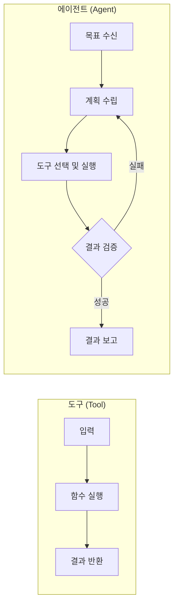
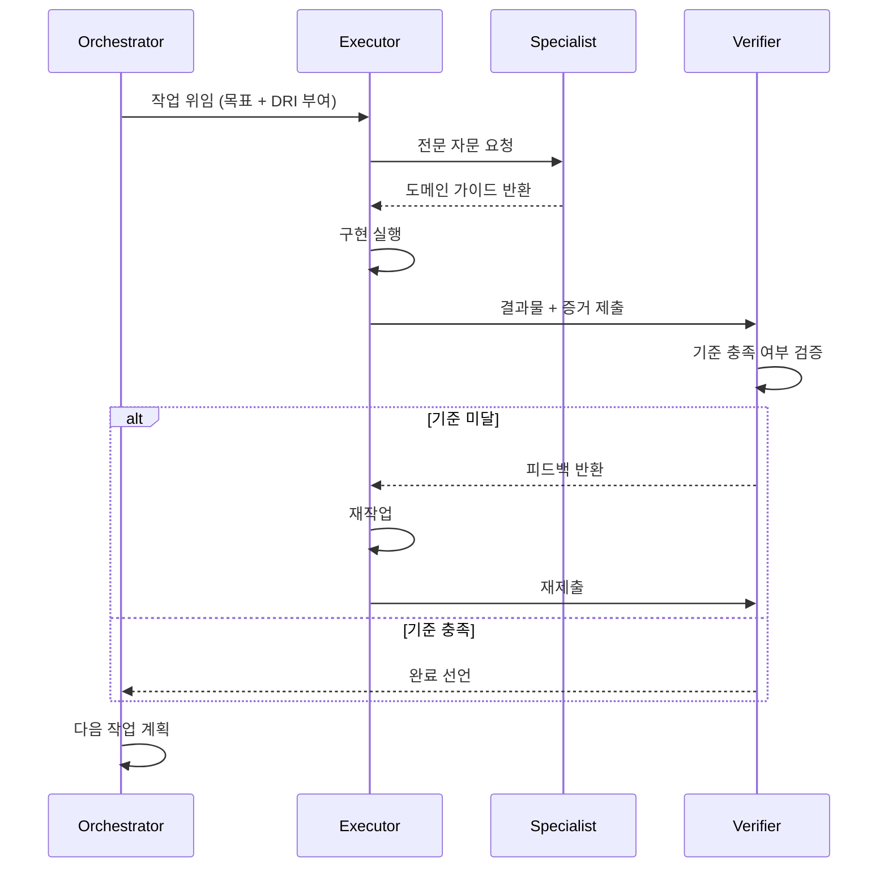
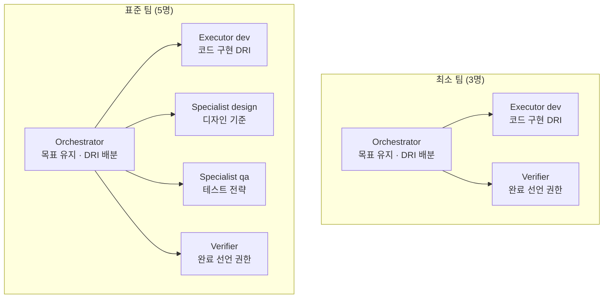

# 어떤 에이전트를 만들 것인가

::: info 학습 목표
- 도구(tool)와 에이전트의 차이를 설명할 수 있다.
- 4가지 역할 분류 체계와 각 역할의 책임을 구분할 수 있다.
- DRI 개념을 에이전트에 적용하여 의사결정 경계를 설계할 수 있다.
- 최소 팀과 표준 팀의 구성 차이를 설명하고 상황에 맞게 선택할 수 있다.
:::

## 1. 에이전트란 무엇인가

### 도구(tool)와 에이전트의 차이

도구는 호출하면 결과를 반환한다. 판단하지 않는다. 입력을 받아 출력을 돌려줄 뿐이며, "지금 이 도구를 써야 하는가"라는 질문은 도구 바깥에서 결정한다.

에이전트는 목표를 받아서 스스로 계획하고, 실행하고, 결과를 검증한다. 어떤 도구를 어떤 순서로 쓸지 스스로 결정하며, 실패하면 재시도 방법을 판단한다.

단순 LLM 호출과의 차이는 세 가지다.

| 구분 | 단순 LLM 호출 | 에이전트 |
|------|-------------|---------|
| 컨텍스트 유지 | 단일 요청·응답으로 끝난다 | 여러 단계에 걸쳐 컨텍스트를 유지한다 |
| 재시도 | 없다 | 실패를 감지하고 전략을 바꿔 재시도한다 |
| 도구 선택 | 없다 | 목표에 맞는 도구를 스스로 선택한다 |

### 에이전트가 필요한 시점

다음 조건 중 하나라도 해당하면 단순 LLM 호출 대신 에이전트를 설계한다.

- 작업이 여러 단계로 나뉘고 각 단계의 결과가 다음 단계에 영향을 준다.
- 실패 가능성이 있고, 실패 시 복구 전략이 필요하다.
- 목표 달성을 위해 선택해야 할 도구가 여럿 존재한다.

## 2. 역할 분류 체계

토스의 <strong>사일로</strong>조직 구조에서 각 팀은 자율적으로 목표를 달성하되, 전문 챕터가 기술 수준을 관리한다. 이 구조를 에이전트 Squad 개념으로 매핑한다.

사일로 → 에이전트 Squad: 자율적으로 목표를 추진하는 에이전트 그룹  
챕터 → Specialist 에이전트: 특정 도메인의 전문성을 유지하는 역할

### 4가지 역할

**Orchestrator**

전체 목표를 유지하고, 작업을 분해하여 적절한 에이전트에게 위임한다. DRI를 배분하는 역할이다. 직접 코드를 짜거나 결과물을 검증하지 않는다. Orchestrator가 모든 것을 결정하는 순간 단일 장애점이 된다.

**Executor**

구체적인 실행을 담당하며, 해당 작업의 DRI를 보유한다. 결과물을 증거로 남겨 Verifier에게 보고한다. "어떻게 구현하는가"는 Executor가 결정한다.

**Specialist**

특정 도메인 전문성(개발, 디자인, QA 등)을 제공한다. 챕터 역할에 해당하며, 여러 Squad에 걸쳐 일관된 전문 기준을 유지한다. Executor와 협력하되, 의사결정 범위는 자신의 도메인에 한정된다.

**Verifier**

결과물이 기준을 충족하는지 검증하고 피드백을 반환한다. "완료"를 선언할 수 있는 유일한 권한을 보유한다. Verifier를 거치지 않은 완료 선언은 유효하지 않다.

### 역할 간 상호작용 흐름

## 3. DRI: 각 에이전트의 최종 결정 영역

DRI(Directly Responsible Individual)는 해당 영역의 최종 의사결정권자를 의미한다. 에이전트 시스템에서 DRI가 없으면 모든 결정이 Orchestrator에게 몰린다. Orchestrator가 코드 구현 방식까지 결정하기 시작하면 전문성이 희석되고 병목이 생긴다.

DRI의 핵심 규칙은 단순하다. 각 에이전트는 자신의 DRI 범위 안에서만 최종 결정을 내린다. 범위 밖의 결정은 해당 DRI를 가진 에이전트에게 위임한다.

| 역할 | DRI 범위 | 결정 못하는 것 |
|------|----------|----------------|
| Orchestrator | 작업 우선순위, 에이전트 배분 | 코드 구현 방식 |
| Executor(dev) | 코드 구현 방식, 기술 선택 | 제품 방향 |
| Specialist(design) | 디자인 결정 | 개발 아키텍처 |
| Verifier | 완료 기준 판단 | 구현 방법 |

::: warning DRI 침범 안티패턴
Orchestrator가 Executor에게 "이 함수는 이렇게 구현해라"고 지정하는 순간 DRI가 침범된다. Orchestrator는 "무엇을" 만들지를 정의하고, "어떻게" 만들지는 Executor의 DRI다.
:::

## 4. 언제 새 에이전트를 만드는가

새 에이전트를 만들기 전에 두 가지를 확인한다.

1. 역할이 명확히 분리되는가? — 기존 에이전트의 DRI와 겹치지 않는 고유한 책임 영역이 있어야 한다.
2. DRI가 겹치지 않는가? — 동일한 결정 영역에 두 에이전트가 권한을 공유하면 충돌이 발생한다.

### 안티패턴

**너무 잘게 쪼개기**: "파일 읽기 에이전트", "파일 쓰기 에이전트"처럼 단순 도구 호출 수준으로 분리하면 오케스트레이션 비용만 늘어난다. 도구로 충분한 것은 도구로 유지한다.

**역할 모호한 에이전트**: "리서치도 하고 구현도 하는 에이전트"는 DRI가 없는 것과 같다. 결국 Orchestrator가 모든 것을 결정하게 된다.

::: details 역할 분리 판단 체크리스트
- [ ] 이 에이전트만이 내릴 수 있는 결정이 존재하는가?
- [ ] 이 에이전트의 DRI 범위를 한 문장으로 설명할 수 있는가?
- [ ] 기존 에이전트의 DRI와 겹치는 부분이 없는가?
- [ ] 이 역할은 도구 하나로 대체할 수 없는가?

4가지 모두 Yes일 때 새 에이전트를 만든다.
:::

## 5. 실전 팀 구성 예시

### 최소 팀 (3명)

빠르게 시작해야 할 때, 또는 단일 도메인 작업에 적합하다.

| 에이전트 | 역할 |
|---------|------|
| Orchestrator | 목표 관리, 작업 위임 |
| Executor(dev) | 코드 구현, DRI 보유 |
| Verifier | 결과 검증, 완료 선언 |

### 표준 팀 (5명)

복수의 도메인이 관련된 작업, 또는 품질 기준이 높은 프로젝트에 적합하다.

| 에이전트 | 역할 |
|---------|------|
| Orchestrator | 목표 관리, 작업 위임 |
| Executor(dev) | 코드 구현 |
| Specialist(design) | 디자인 기준 유지 |
| Specialist(qa) | 테스트 전략 수립 |
| Verifier | 결과 검증, 완료 선언 |

### 팀 구성도

::: tip 핵심 정리
- 에이전트는 목표를 받아 계획·실행·검증을 스스로 수행한다. 도구와의 차이는 판단과 재시도다.
- 4가지 역할(Orchestrator, Executor, Specialist, Verifier)은 DRI를 기준으로 분리한다.
- Orchestrator는 "무엇을"을 정의하고, "어떻게"는 Executor의 DRI다. 이 경계를 침범하면 병목이 생긴다.
- 완료 선언 권한은 Verifier에게만 있다. Verifier를 거치지 않은 완료는 유효하지 않다.
- 새 에이전트를 만들기 전에 DRI 중복 여부를 먼저 확인한다.

다음 챕터: [CH3. 에이전트 간 소통](/study/ai-agent-workflow/03-communication)
:::
