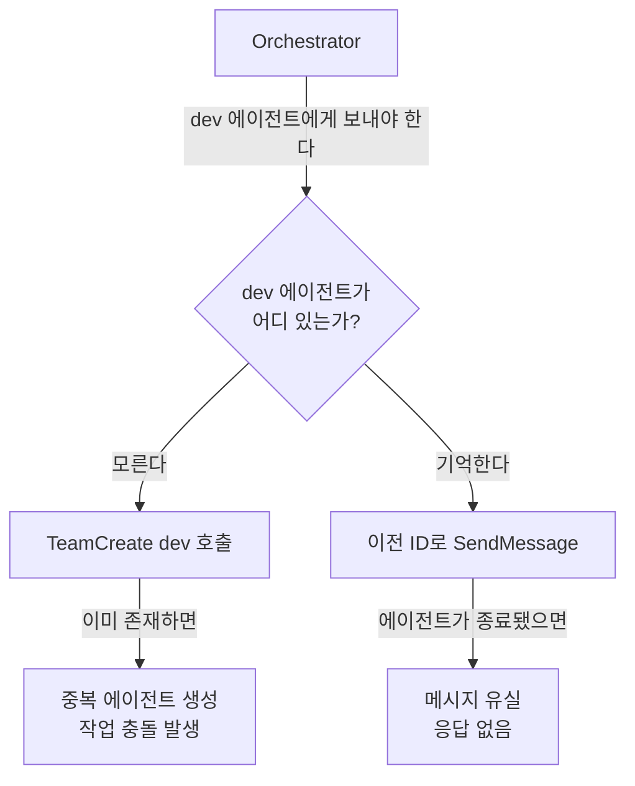
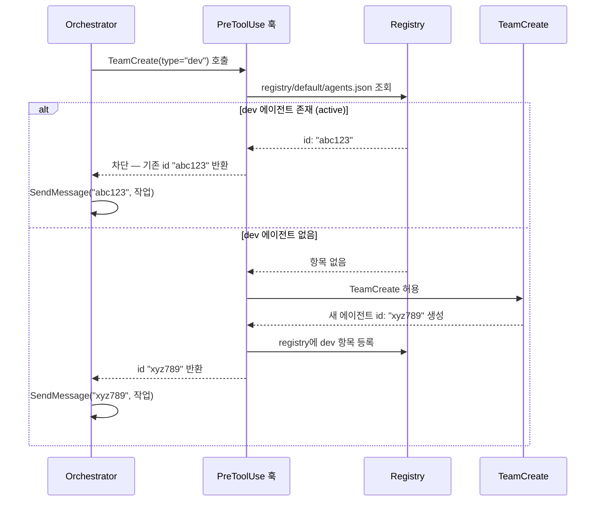
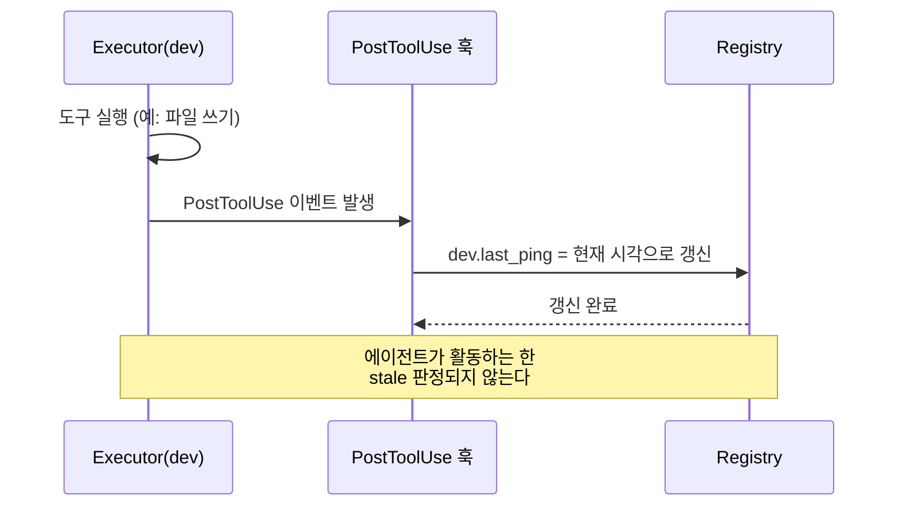
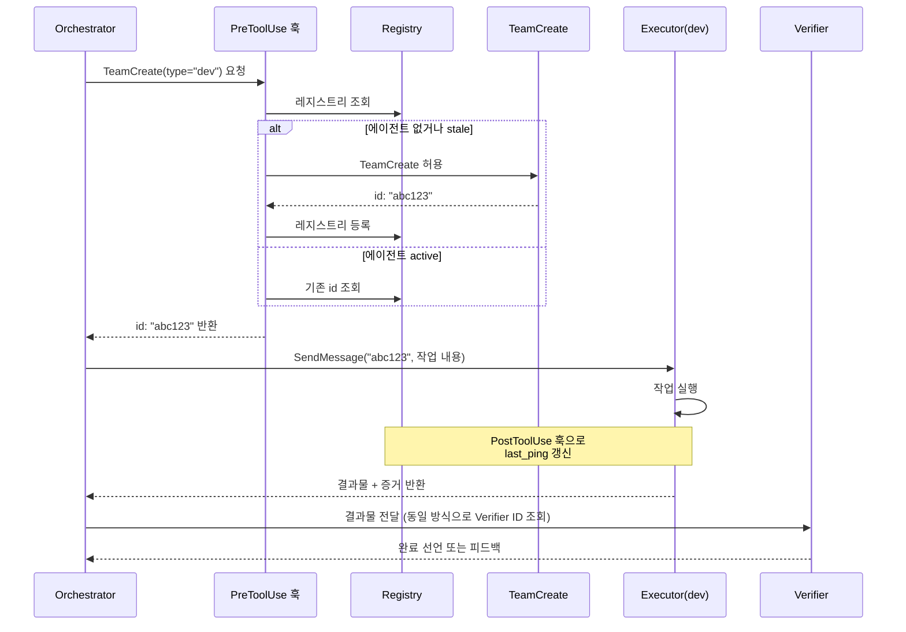

# 에이전트 간 소통 — 레지스트리 훅 방식

::: info 학습 목표
- 에이전트 없는 라우팅 구조에서 발생하는 두 가지 핵심 문제를 설명할 수 있다.
- 레지스트리 기반 통신 방식이 다른 방식 대비 왜 채택되었는지 근거를 설명할 수 있다.
- TeamCreate 중복 방지 흐름과 훅의 역할을 순서대로 설명할 수 있다.
- stale 에이전트 감지 기준과 처리 방법을 설명할 수 있다.
:::

## 1. 핵심 문제: 오케스트레이터는 누구에게 말을 거는가

에이전트 시스템을 처음 설계할 때 빠지기 쉬운 함정이 있다. Orchestrator가 작업을 위임하려 할 때, 어디로 보내야 하는지 알 수 없다는 것이다.

**문제 1: 라우팅 불가**

Orchestrator가 "dev 에이전트에게 이 작업을 보내라"고 결정했다고 가정한다. 그런데 dev 에이전트가 현재 실행 중인지, 어떤 ID를 가지는지, 활성 상태인지 알 방법이 없다. Orchestrator는 추측에 의존하거나 매번 새로 만들게 된다.

**문제 2: TeamCreate 중복 호출**

dev 에이전트가 이미 실행 중인데도 Orchestrator가 TeamCreate(type="dev")를 다시 호출한다. 같은 역할의 에이전트가 중복 생성되면 작업이 분산되거나 충돌한다.

두 문제의 공통 원인은 에이전트 레지스트리가 없다는 것이다.



## 2. 세 가지 통신 방식 비교

세 가지 설계 방식을 검토했다.

**방식 A (채택): 에이전트 레지스트리**

에이전트가 생성될 때 중앙 레지스트리에 등록한다. Orchestrator는 레지스트리를 조회해 대상 에이전트의 ID를 얻은 뒤 통신한다.

**방식 B: 트리거 기반 훅**

특정 이벤트가 발생하면 미리 등록한 훅이 해당 에이전트를 깨운다. 이벤트 정의가 명확할 때 유효하지만, 복잡한 라우팅 조건에는 적합하지 않다.

**방식 C: 브로드캐스트 + 훅 필터**

Orchestrator가 전체에 메시지를 뿌리고, 각 에이전트가 자신에게 해당하는 메시지를 훅으로 필터링한다. 단순하지만 불필요한 메시지가 모든 에이전트에 전달된다.

| 기준 | 방식 A (레지스트리) | 방식 B (트리거 훅) | 방식 C (브로드캐스트) |
|------|------------------|-----------------|-------------------|
| 복잡도 | 중간 | 낮음 | 낮음 |
| 확장성 | 높음 | 낮음 | 중간 |
| 디버깅 난이도 | 낮음 (레지스트리 조회) | 중간 | 높음 (메시지 추적 어려움) |
| 중복 방지 | 가능 | 불가 | 불가 |
| stale 감지 | 가능 | 불가 | 불가 |

방식 A를 채택한 이유는 다음과 같다. 에이전트 ID를 레지스트리에서 항상 조회하므로 Orchestrator가 에이전트 상태를 기억할 필요가 없다. 중복 생성과 stale 감지를 같은 메커니즘으로 처리할 수 있으며, 레지스트리 파일을 직접 확인하여 현재 상태를 디버깅할 수 있다.

## 3. 레지스트리 아키텍처 (방식 A)

### 파일 구조

```
~/.claude/
└── registry/
    ├── team-a/agents.json
    ├── team-b/agents.json
    └── default/agents.json
```

레지스트리는 전역 위치(`~/.claude/registry/`)에 존재하지만 팀별로 디렉터리를 분리한다. 전역에 두는 이유는 훅 프로세스가 어느 작업 디렉터리에서 실행되더라도 동일한 레지스트리에 접근할 수 있어야 하기 때문이다. 팀별로 분리하는 이유는 서로 다른 Squad가 동일한 역할명(예: dev)의 에이전트를 각자 운영할 수 있어야 하기 때문이다.

### agents.json 형식

```json
{
  "dev": {
    "id": "abc123",
    "status": "active",
    "created_at": "2026-04-16T10:00:00Z",
    "last_ping": "2026-04-16T10:04:30Z"
  },
  "verifier": {
    "id": "def456",
    "status": "active",
    "created_at": "2026-04-16T10:01:00Z",
    "last_ping": "2026-04-16T10:04:55Z"
  }
}
```

- `id`: SendMessage 호출 시 사용하는 에이전트 식별자.
- `status`: `active` | `stale` | `terminated`.
- `created_at`: 에이전트 생성 시각. 중복 감지 시 참고한다.
- `last_ping`: 마지막 활동 시각. stale 판정 기준이다.

## 4. TeamCreate 중복 방지 흐름

Orchestrator가 TeamCreate를 호출하면 PreToolUse 훅이 발동한다. 훅은 레지스트리를 조회해 동일 역할의 에이전트가 이미 존재하는지 확인한 뒤 처리를 결정한다.



훅이 TeamCreate를 차단하면 Orchestrator는 새 에이전트를 만들지 않고, 레지스트리에서 반환받은 기존 ID로 즉시 SendMessage를 호출한다. Orchestrator는 에이전트가 새로 만들어졌는지, 기존 것을 재사용했는지 알 필요가 없다.

## 5. Stale 에이전트 감지

### stale 정의

`last_ping`이 임계값(기본 5분) 이상 갱신되지 않은 에이전트를 stale로 판정한다. stale 에이전트는 응답하지 않을 가능성이 높으므로 재생성 대상이 된다.

### stale 감지 및 처리 흐름

1. PreToolUse 훅이 레지스트리에서 dev 항목을 발견한다.
2. `last_ping`과 현재 시각의 차이를 계산한다.
3. 차이가 임계값 이상이면 stale로 판정한다.
4. stale 항목을 레지스트리에서 삭제한다.
5. TeamCreate를 허용하여 새 에이전트를 생성한다.
6. 새 항목을 레지스트리에 등록한다.

::: warning stale 임계값 설정 기준
임계값이 너무 짧으면 정상 작동 중인 에이전트를 stale로 오판한다. 임계값이 너무 길면 실제로 종료된 에이전트를 오래 유지한다. 팀 작업 특성에 따라 조정하되, 에이전트가 가장 오래 응답하지 않는 정상 케이스(예: 긴 빌드 작업)를 기준으로 설정한다.
:::

### last_ping 갱신 방법

에이전트가 도구를 사용할 때마다 PostToolUse 훅이 발동한다. 훅은 해당 에이전트의 `last_ping`을 현재 시각으로 갱신한다. 에이전트가 작업 중인 동안에는 stale로 판정되지 않는다.



## 6. 완전한 소통 흐름

Orchestrator가 작업을 위임하는 전체 흐름을 처음부터 끝까지 정리한다.



::: tip 핵심 정리
- 레지스트리가 없으면 Orchestrator는 에이전트 위치를 알 수 없고, 중복 생성과 메시지 유실이 반복된다.
- PreToolUse 훅이 TeamCreate를 가로채 레지스트리를 조회하고, 중복이면 차단하고 기존 ID를 반환한다.
- stale 에이전트는 `last_ping` 임계값 초과로 감지하며, 감지 즉시 삭제하고 재생성을 허용한다.
- PostToolUse 훅이 에이전트 활동마다 `last_ping`을 갱신하여 정상 에이전트가 stale 판정되는 것을 방지한다.
- Orchestrator는 에이전트 상태를 기억하지 않는다. 항상 레지스트리를 조회해 ID를 얻는다.

다음 챕터: [CH4. TypeScript 레지스트리 훅 구현](/study/ai-agent-workflow/04-registry-hook)
:::
