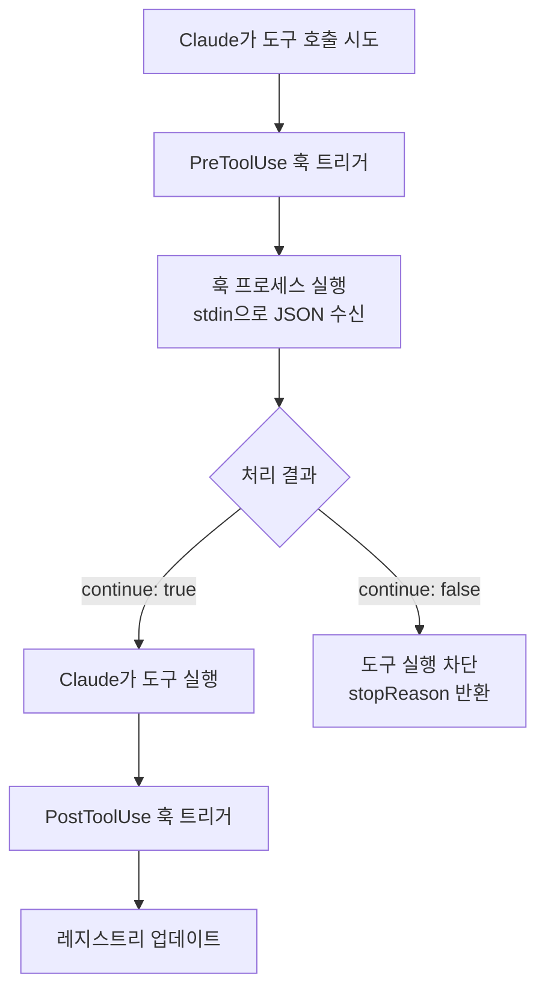
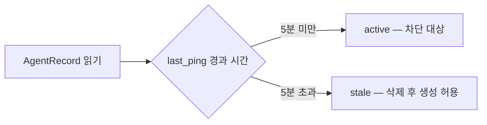
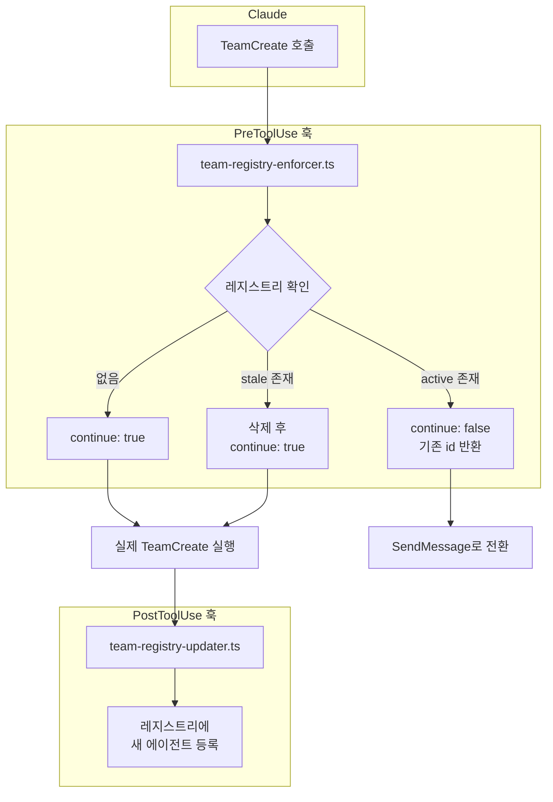

# TypeScript 레지스트리 훅 구현

::: info 학습 목표
- oh-my-claudecode의 훅 패턴을 이해한다.
- PreToolUse 훅으로 TeamCreate 중복 방지를 구현한다.
- Stale 감지 로직을 구현한다.
- hooks.json 설정 방법을 익힌다.
:::

---

## 1. oh-my-claudecode 훅 패턴 개요

[oh-my-claudecode](https://github.com/Yeachan-Heo/oh-my-claudecode) 는 Claude Code에 훅 기반 에이전트 확장 패턴을 제안한다. 핵심 아이디어는 단순하다.

| 구성 요소 | 역할 |
|-----------|------|
| stdin 입력 | Claude가 도구를 호출하기 전에 훅 프로세스로 JSON을 전달한다 |
| stdout 출력 | 훅이 `{ continue: true }` 또는 차단 메시지를 반환한다 |
| `$CLAUDE_PLUGIN_ROOT` | 플러그인 경로를 환경 변수로 참조한다 |

훅의 실행 흐름은 다음과 같다.



훅이 `continue: false`를 반환하면 Claude는 도구를 실행하지 않고 `stopReason`을 읽는다. 이 메시지에 기존 에이전트 id를 담아두면 Claude가 `SendMessage`로 경로를 바꾼다.

---

## 2. 타입 정의

모든 훅 파일이 공유하는 타입을 `types.ts`에 모아둔다.

```typescript
// types.ts

interface AgentRecord {
  id: string;
  status: 'active' | 'stale';
  created_at: string;
  last_ping: string;
  team: string;
}

interface Registry {
  [agentType: string]: AgentRecord;
}

interface HookInput {
  tool_name: string;
  tool_input: Record<string, unknown>;
}

interface HookOutput {
  continue: boolean;
  stopReason?: string;
}
```

`AgentRecord.last_ping`은 에이전트가 마지막으로 활동한 시각을 ISO 8601로 기록한다. 이 값이 오래됐으면 stale로 판정한다.

---

## 3. 레지스트리 유틸리티

레지스트리는 팀별로 `~/.claude/registry/{team}/agents.json` 파일에 저장된다.

```typescript
// registry.ts
import fs from 'fs';
import path from 'path';

const REGISTRY_ROOT = path.join(process.env.HOME!, '.claude', 'registry');
const STALE_THRESHOLD_MS = 5 * 60 * 1000; // 5분

function getRegistryPath(team: string): string {
  return path.join(REGISTRY_ROOT, team, 'agents.json');
}

function readRegistry(team: string): Registry {
  const filePath = getRegistryPath(team);
  if (!fs.existsSync(filePath)) return {};
  return JSON.parse(fs.readFileSync(filePath, 'utf-8'));
}

function writeRegistry(team: string, registry: Registry): void {
  const filePath = getRegistryPath(team);
  fs.mkdirSync(path.dirname(filePath), { recursive: true });
  fs.writeFileSync(filePath, JSON.stringify(registry, null, 2));
}

function isStale(record: AgentRecord): boolean {
  const lastPing = new Date(record.last_ping).getTime();
  return Date.now() - lastPing > STALE_THRESHOLD_MS;
}
```

`isStale`은 `last_ping`과 현재 시각의 차이를 비교한다. 임계값(5분)을 초과하면 해당 에이전트를 dead로 간주하고 레지스트리에서 제거한다.



---

## 4. PreToolUse 훅 — TeamCreate 중복 방지

TeamCreate가 호출될 때마다 레지스트리를 확인한다. 동일한 타입의 에이전트가 이미 활성 상태이면 생성을 차단하고 기존 id를 알려준다.

```typescript
// hooks/team-registry-enforcer.ts
import { readRegistry, writeRegistry, isStale } from './registry.js';

async function readStdin(): Promise<string> {
  return new Promise((resolve) => {
    let data = '';
    process.stdin.on('data', (chunk) => (data += chunk));
    process.stdin.on('end', () => resolve(data));
  });
}

const input: HookInput = JSON.parse(await readStdin());

// TeamCreate가 아니면 즉시 통과
if (input.tool_name !== 'TeamCreate') {
  console.log(JSON.stringify({ continue: true }));
  process.exit(0);
}

const agentType = input.tool_input.subagent_type as string;
const team = (input.tool_input.team as string) ?? 'default';

const registry = readRegistry(team);
const existing = registry[agentType];

if (existing) {
  if (isStale(existing)) {
    // stale → 레지스트리에서 제거하고 생성 허용
    delete registry[agentType];
    writeRegistry(team, registry);
    console.log(JSON.stringify({ continue: true }));
  } else {
    // active → 차단, 기존 id 반환
    console.log(JSON.stringify({
      continue: false,
      stopReason: `Agent '${agentType}' already exists in team '${team}' with id: ${existing.id}. Use SendMessage with this id instead.`
    }));
  }
} else {
  // 없음 → 생성 허용 (PostToolUse에서 등록)
  console.log(JSON.stringify({ continue: true }));
}
```

::: warning stale 임계값 조정
5분은 예시 값이다. 에이전트가 무거운 작업을 처리 중이라면 ping 간격이 더 길어질 수 있다. 실제 운영에서는 `STALE_THRESHOLD_MS`를 환경 변수로 주입하는 것이 안전하다.
:::

---

## 5. PostToolUse 훅 — 레지스트리 등록 및 ping 갱신

TeamCreate가 성공적으로 완료되면 생성된 에이전트를 레지스트리에 등록한다. 에이전트가 활동할 때마다 `last_ping`을 갱신해 stale 판정을 방지한다.

```typescript
// hooks/team-registry-updater.ts
import { readRegistry, writeRegistry } from './registry.js';

async function readStdin(): Promise<string> {
  return new Promise((resolve) => {
    let data = '';
    process.stdin.on('data', (chunk) => (data += chunk));
    process.stdin.on('end', () => resolve(data));
  });
}

interface PostHookInput {
  tool_name: string;
  tool_input: Record<string, unknown>;
  tool_response: Record<string, unknown>;
}

const input: PostHookInput = JSON.parse(await readStdin());

if (input.tool_name === 'TeamCreate') {
  const agentType = input.tool_input.subagent_type as string;
  const team = (input.tool_input.team as string) ?? 'default';
  const agentId = input.tool_response.agent_id as string;

  const registry = readRegistry(team);
  registry[agentType] = {
    id: agentId,
    status: 'active',
    created_at: new Date().toISOString(),
    last_ping: new Date().toISOString(),
    team,
  };
  writeRegistry(team, registry);
}

// ping 갱신: 모든 도구 호출을 에이전트 활동으로 간주
if (input.tool_name === 'Ping') {
  const agentType = input.tool_input.agent_type as string;
  const team = (input.tool_input.team as string) ?? 'default';
  const registry = readRegistry(team);

  if (registry[agentType]) {
    registry[agentType].last_ping = new Date().toISOString();
    writeRegistry(team, registry);
  }
}

console.log(JSON.stringify({ continue: true }));
```

---

## 6. hooks.json 설정

훅을 Claude Code에 등록하려면 프로젝트 루트의 `hooks.json`에 아래와 같이 선언한다.

```json
{
  "hooks": {
    "PreToolUse": [
      {
        "matcher": "TeamCreate",
        "hooks": [
          {
            "type": "command",
            "command": "npx ts-node hooks/team-registry-enforcer.ts",
            "timeout": 5
          }
        ]
      }
    ],
    "PostToolUse": [
      {
        "matcher": "TeamCreate",
        "hooks": [
          {
            "type": "command",
            "command": "npx ts-node hooks/team-registry-updater.ts",
            "timeout": 5
          }
        ]
      }
    ]
  }
}
```

`matcher`는 도구 이름과 정확히 일치해야 한다. `timeout`은 초 단위이며, 초과하면 훅이 강제 종료되고 `continue: true`로 폴백된다.

훅 연결 전체 구조는 다음과 같다.



---

## 7. 전체 디렉토리 구조

```
hooks/
├── types.ts                       # 공통 타입 정의
├── registry.ts                    # 레지스트리 읽기/쓰기 유틸
├── team-registry-enforcer.ts      # PreToolUse — 중복 생성 방지
└── team-registry-updater.ts       # PostToolUse — 등록 및 ping 갱신
```

---

::: tip 핵심 정리
- PreToolUse 훅은 `continue: false` + `stopReason`으로 도구 실행을 차단하고 Claude에게 대안을 알려준다.
- Stale 판정은 `last_ping`과 현재 시각의 차이로 결정하며, stale 에이전트는 삭제 후 재생성을 허용한다.
- PostToolUse 훅은 생성 완료 후 레지스트리에 에이전트를 등록하고, 이후 활동마다 `last_ping`을 갱신한다.
- hooks.json의 `timeout`이 초과되면 훅은 실패하지 않고 `continue: true`로 폴백되므로 훅 내부에서 빠르게 처리해야 한다.

다음 챕터: [CH5. 에이전트 정의 파일 작성법](/study/ai-agent-workflow/05-agent-definition-files)
:::
