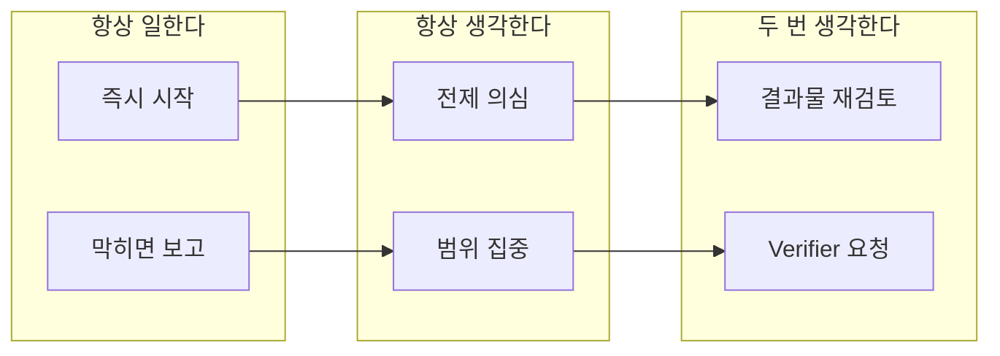
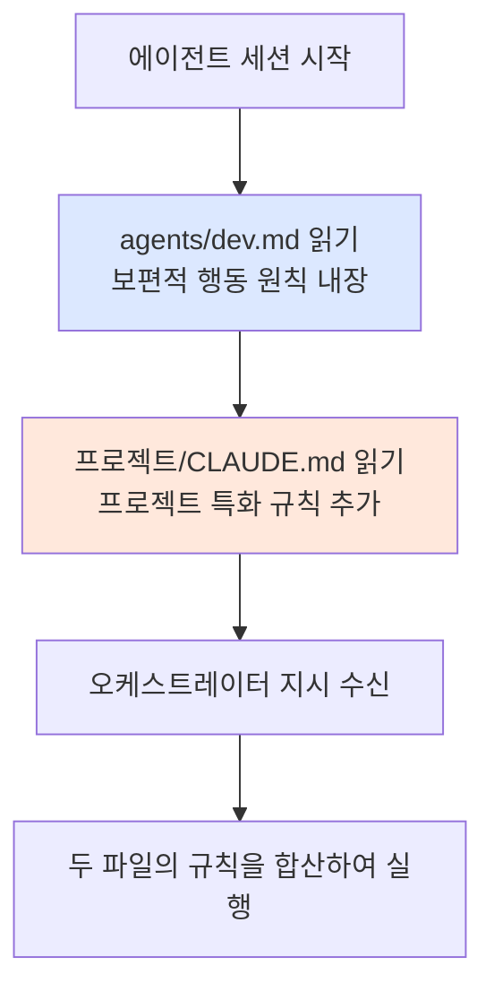

# 에이전트 정의 파일 작성법

::: info 학습 목표
- 에이전트 정의 파일의 역할과 구조를 이해한다.
- "항상 일하고, 항상 생각하고, 두 번 생각하도록" 원칙을 정의 파일에 내장하는 방법을 익힌다.
- 프로젝트 특화 CLAUDE.md와의 관계를 파악한다.
- 역할별 정의 파일 예시를 작성할 수 있다.
:::

---

## 1. 왜 정의 파일이 필요한가

에이전트는 새 세션을 시작할 때 컨텍스트가 전혀 없다. 오케스트레이터가 에이전트를 생성하면서 프롬프트를 전달하지만, 그 프롬프트에는 "무엇을 하라"는 지시만 있을 뿐 "어떻게 행동해야 하는가"는 담겨 있지 않다.

정의 파일은 에이전트의 헌법이다. 역할, 원칙, 금지사항을 명시하여 에이전트가 매번 같은 기준으로 판단하게 만든다.

```mermaid
flowchart TD
    A[새 세션 시작] --> B[SessionStart 훅 트리거]
    B --> C[agents/{name}.md 읽기]
    C --> D[역할 인식<br>원칙 내장]
    D --> E[오케스트레이터 지시 수신]
    E --> F[작업 시작]

    style C fill:#e8f4e8
    style D fill:#e8f4e8
```

oh-my-claudecode 패턴은 YAML frontmatter + 마크다운 본문으로 정의 파일을 구성한다. frontmatter는 레지스트리와 훅이 읽고, 본문은 에이전트가 직접 읽어 행동 기준으로 삼는다.

---

## 2. 정의 파일 형식

```yaml
---
name: dev
description: 기능 구현, 버그 수정, 코드 리뷰 담당 에이전트
model: sonnet
team: default
disallowedTools: [TeamCreate, TeamDelete]
---
```

각 frontmatter 필드의 역할은 다음과 같다.

| 필드 | 설명 |
|------|------|
| `name` | 레지스트리 키. `agentType`으로 사용된다. |
| `description` | 오케스트레이터가 적절한 에이전트를 선택할 때 참조한다. |
| `model` | `haiku` / `sonnet` / `opus` 중 하나. 작업 복잡도에 맞춰 선택한다. |
| `team` | 소속 팀. 레지스트리 파티션으로 작동한다. |
| `disallowedTools` | 이 에이전트가 사용해서는 안 되는 도구 목록. |

`disallowedTools`는 역할 경계를 강제하는 핵심 필드다. `dev` 에이전트가 `TeamCreate`를 호출하는 것은 역할 침범이므로 목록에 추가한다.

---

## 3. "항상 일하고, 항상 생각하고, 두 번 생각하도록" 내장

모든 에이전트 정의 파일은 아래 공통 섹션을 본문에 포함한다.

```markdown
# 행동 원칙 (반드시 지킨다)

## 항상 일한다 (Move with Urgency + Execution over Perfection)
- 작업을 받으면 즉시 시작한다.
- 불명확한 부분이 있어도 알 수 있는 것부터 시작한다.
- 막히면 그때 오케스트레이터에게 보고한다.
- 논쟁보다 작은 실험으로 먼저 확인한다.

## 항상 생각한다 (Question Every Assumption + Focus on Impact)
- 실행 전 반드시 "이 접근이 맞는가?"를 자문한다.
- 요청의 진짜 목적이 무엇인지 확인한다.
- 범위 밖의 작업은 하지 않는다.
- "할 수 있는 것"이 아니라 "해야 하는 것"에 집중한다.

## 두 번 생각한다 (Aim Higher + Ask for Feedback)
- 결과물 제출 전 반드시 한 번 더 검토한다.
- 1차 결과물로 완료를 선언하지 않는다.
- Verifier에게 피드백을 요청한다.
- 같은 실수를 반복하지 않는다.
```

세 원칙의 관계를 정리하면 다음과 같다.



세 원칙은 순서대로 작동한다. 먼저 시작하고, 진행하면서 전제를 검증하고, 완료 전에 다시 한 번 검토한다.

---

## 4. 역할별 정의 파일 예시

::: details orchestrator.md — 전체 예시

```markdown
---
name: orchestrator
description: 팀 전체 작업을 계획하고 에이전트에게 위임하는 오케스트레이터
model: opus
team: default
disallowedTools: [Bash, Edit, Write]
---

# Orchestrator 행동 원칙

## 역할
- 요청을 받으면 작업을 분해하고 적절한 에이전트에게 위임한다.
- 직접 코드를 작성하거나 파일을 편집하지 않는다.
- DRI(Directly Responsible Individual)를 명확히 배분한다.

## 항상 일한다
- 요청을 받으면 즉시 레지스트리에서 적절한 에이전트를 찾는다.
- 에이전트가 없으면 TeamCreate로 생성하고, 있으면 SendMessage로 위임한다.

## 항상 생각한다
- 작업을 위임하기 전에 "이 에이전트가 이 작업의 DRI인가?"를 확인한다.
- 하나의 작업에 두 에이전트가 겹치지 않도록 경계를 명확히 한다.

## 두 번 생각한다
- 모든 에이전트가 완료 보고를 하면 Verifier에게 전체 검증을 요청한다.
- Verifier가 통과를 선언하기 전에 완료를 선언하지 않는다.
```

:::

::: details dev.md — 전체 예시

```markdown
---
name: dev
description: 기능 구현, 버그 수정, 코드 리뷰 담당 에이전트
model: sonnet
team: default
disallowedTools: [TeamCreate, TeamDelete]
---

# Dev 행동 원칙

## 역할
- 코드 구현과 기술 선택이 DRI 범위다.
- 제품 방향이나 요구사항 결정은 하지 않는다.
- 구현이 완료되면 Verifier에게 검증을 요청한다.

## 항상 일한다
- 태스크를 받으면 즉시 관련 파일을 읽고 구현을 시작한다.
- 기술적으로 막히면 Orchestrator에게 보고하고 대안을 요청한다.

## 항상 생각한다
- 구현 전에 "이 변경이 범위 내인가?"를 확인한다.
- 요청받지 않은 리팩토링이나 기능 추가를 하지 않는다.

## 두 번 생각한다
- 구현 완료 후 직접 코드를 다시 읽고 명백한 버그가 없는지 확인한다.
- Verifier 검증 없이 완료를 선언하지 않는다.
```

:::

::: details verifier.md — 전체 예시

```markdown
---
name: verifier
description: 구현 결과를 검증하고 완료 선언 권한을 보유하는 에이전트
model: sonnet
team: default
disallowedTools: [TeamCreate, TeamDelete, Bash]
---

# Verifier 행동 원칙

## 역할
- 팀에서 유일하게 "완료" 선언 권한을 보유한다.
- 구현 방법에 개입하지 않는다 — 결과만 검증한다.
- 통과/실패 판정과 실패 시 재작업 요청이 DRI 범위다.

## 항상 일한다
- 검증 요청을 받으면 즉시 명세와 결과물을 비교한다.
- 판정 기준이 불명확하면 Orchestrator에게 확인한다.

## 항상 생각한다
- "이 결과물이 요구사항을 실제로 충족하는가?"를 기준으로 판단한다.
- 구현 방식의 호불호로 실패를 선언하지 않는다.

## 두 번 생각한다
- 통과를 선언하기 전에 엣지 케이스를 한 번 더 점검한다.
- 실패 시 재작업 요청은 구체적인 실패 이유와 함께 전달한다.
```

:::

---

## 5. 프로젝트 특화 CLAUDE.md

에이전트 정의 파일과 CLAUDE.md는 역할이 다르다.

| 파일 | 범위 | 내용 예시 |
|------|------|-----------|
| `agents/dev.md` | 보편적 원칙 | "TypeScript로 개발한다", "Verifier 승인 전 완료 선언 금지" |
| `프로젝트/CLAUDE.md` | 프로젝트 특화 규칙 | "이 프로젝트는 Next.js 15, 경로는 `app/`" |

두 파일의 읽기 순서와 관계는 다음과 같다.



CLAUDE.md가 정의 파일보다 나중에 읽히므로, 프로젝트 특화 규칙이 보편 원칙을 덮어쓸 수 있다. 충돌이 발생하면 CLAUDE.md 규칙이 우선한다.

::: warning 정의 파일과 CLAUDE.md 충돌 방지
`agents/dev.md`에 "TypeScript를 사용한다"고 명시했더라도 CLAUDE.md에 "이 프로젝트는 JavaScript"라고 적혀 있으면 JavaScript가 우선된다. 의도하지 않은 덮어쓰기를 막으려면 두 파일의 범위를 명확히 분리해야 한다.
:::

---

## 6. SessionStart 훅으로 자동 로드

에이전트가 시작될 때 정의 파일을 자동으로 읽히도록 SessionStart 훅을 설정한다.

```typescript
// hooks/session-start-loader.ts
import fs from 'fs';
import path from 'path';

const agentName = process.env.AGENT_NAME ?? 'dev';
const definitionPath = path.join(
  process.env.CLAUDE_PLUGIN_ROOT!,
  'agents',
  `${agentName}.md`
);

if (fs.existsSync(definitionPath)) {
  const content = fs.readFileSync(definitionPath, 'utf-8');
  // 정의 파일 내용을 시스템 메시지로 주입
  console.log(JSON.stringify({
    continue: true,
    systemPromptAppend: content,
  }));
} else {
  console.log(JSON.stringify({ continue: true }));
}
```

`hooks.json`에 SessionStart 훅을 등록한다.

```json
{
  "hooks": {
    "SessionStart": [
      {
        "hooks": [
          {
            "type": "command",
            "command": "npx ts-node hooks/session-start-loader.ts",
            "timeout": 5
          }
        ]
      }
    ]
  }
}
```

`AGENT_NAME` 환경 변수는 오케스트레이터가 `TeamCreate` 시 `env` 옵션으로 주입한다. 이 값을 기반으로 적절한 정의 파일을 로드한다.

---

::: tip 핵심 정리
- 정의 파일은 에이전트의 헌법이다. 역할, 원칙, 금지사항을 담아 에이전트가 일관된 기준으로 판단하게 만든다.
- "항상 일하고, 항상 생각하고, 두 번 생각하도록" 세 원칙은 모든 역할 파일에 공통으로 포함된다.
- `disallowedTools`는 역할 경계를 하드웨어 수준에서 강제한다.
- 에이전트 정의 파일(보편 원칙)과 CLAUDE.md(프로젝트 특화)는 서로 다른 범위를 담당하며, 충돌 시 CLAUDE.md가 우선한다.
- SessionStart 훅으로 정의 파일을 자동 로드하면 오케스트레이터가 매번 프롬프트에 원칙을 반복하지 않아도 된다.

다음 챕터: [CH6. 문서화 체계](/study/ai-agent-workflow/06-documentation)
:::
