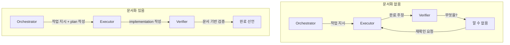
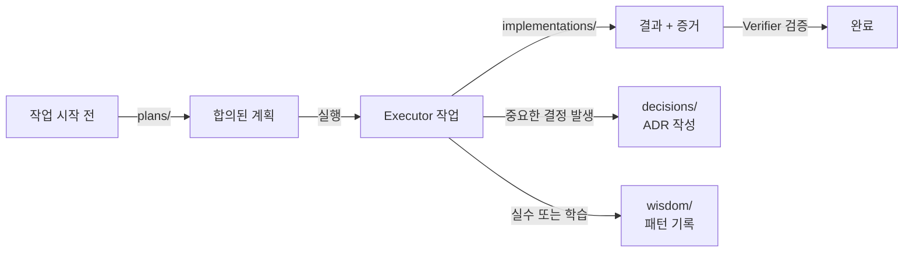
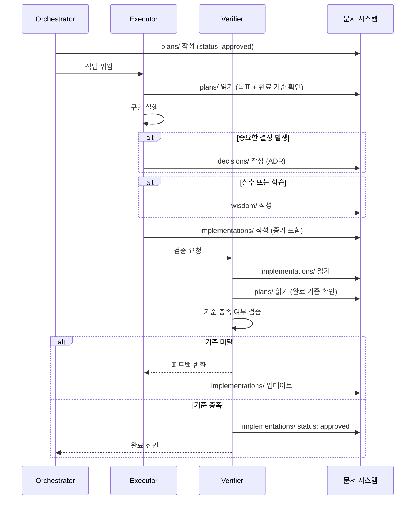

# CH6. 문서화 체계 — 어떤 폴더에 무엇을 남기는가

::: info 학습 목표
- 왜 문서화가 자율성의 전제 조건인지 설명할 수 있다.
- 4종 문서(plans/implementations/decisions/wisdom)의 역할과 차이를 구분한다.
- 상황에 맞는 문서 유형을 선택하고, 올바른 시점에 작성할 수 있다.
:::

## 1. "최고의 자율성은 최고의 정보 공유에서 나온다"

에이전트 시스템을 설계할 때 가장 쉽게 간과하는 것이 문서화다. 각 에이전트가 독립적으로 작업하는 구조에서, 정보가 한 에이전트의 컨텍스트에 갇히면 전체 흐름이 막힌다. 오케스트레이터가 완료 여부를 판단하려 해도, Executor가 무엇을 했는지 알 수 없다면 검증이 불가능하다.

문서화는 에이전트 간 비동기 소통 채널이다. 에이전트가 종료되거나 컨텍스트가 초기화되어도 문서는 남는다. stale 에이전트 문제를 완전히 해결하지는 못하지만, 문서가 있으면 다음 에이전트가 이전 맥락을 이어받을 수 있다.

### 문서화 없을 때 vs 있을 때



정보가 문서로 공유되지 않으면 Verifier는 "무엇을 검증해야 하는가"를 알 수 없다. 에이전트 간 신뢰는 구두 약속이 아니라 문서에 의해 형성된다.

## 2. 4종 문서 체계

문서는 4개의 폴더로 분리된다. 각 폴더는 작업 라이프사이클의 다른 시점을 담당한다.

```
~/.obsidian-vault/ (또는 프로젝트 내)
├── plans/           ← 실행 전 합의 문서
├── implementations/ ← 실행 결과 + 증거
├── decisions/       ← 왜 그 결정을 했는가 (ADR)
└── wisdom/          ← 반복 실수 방지 + 패턴 누적
```



### plans/

작업을 시작하기 전에 Orchestrator와 Planner가 작성한다. 목표, 접근법, DRI 배분, 완료 기준을 담는다. 실행 전 합의 문서이므로 팀 전체가 읽고 동의해야 한다.

| 항목 | 내용 |
|------|------|
| 작성 시점 | 실행 전 |
| 작성자 | Orchestrator + Planner |
| 핵심 내용 | 목표, 접근법, DRI, 완료 기준 |
| frontmatter status | draft → approved |

plans 문서가 없으면 Executor는 "무엇을 만들어야 하는가"의 기준 없이 작업을 시작한다. 이후에 "이게 맞지 않는다"는 재작업이 발생한다.

### implementations/

Executor가 작업을 완료한 뒤 작성한다. "무엇을 했는가"가 아니라 "증거"를 남긴다. 파일 경로, 커밋 해시, 변경된 함수 목록이 증거의 예시다. "기능을 구현했다"는 서술은 증거가 아니다.

| 항목 | 내용 |
|------|------|
| 작성 시점 | 실행 완료 후 |
| 작성자 | Executor |
| 핵심 내용 | 변경 내용, 파일 경로, 커밋, 남은 항목 |
| 규칙 | 결과가 아니라 증거로 보고한다 |

### decisions/

중요한 결정이 내려진 시점에 작성한다. ADR(Architecture Decision Record) 형식을 따른다. "왜 그 결정을 했는가"가 핵심이다. 결정 자체보다 이유를 기록하는 것이 목적이다.

나중에 재구성하면 실제 이유와 달라진다. 결정 당일에 작성해야 한다.

| 항목 | 내용 |
|------|------|
| 작성 시점 | 중요한 결정 발생 시 |
| 형식 | ADR: 배경 / 결정 / 이유 / 대안들 / 결과 |
| 핵심 | "왜 그 결정을 했는가" |

### wisdom/

실수 또는 중요한 학습이 발생한 시점에 작성한다. "무엇이 문제였는가"와 "다음에 어떻게 할 것인가"를 기록한다. CH1의 Learn Proactively 원칙의 구체적 구현이다.

wisdom은 팀 전체가 읽을 수 있어야 한다. 특정 에이전트의 실수가 다른 에이전트의 실수 방지로 이어져야 의미가 있다.

| 항목 | 내용 |
|------|------|
| 작성 시점 | 실수 또는 중요한 학습 발생 시 |
| 핵심 내용 | 문제, 원인, 다음 행동 |
| 접근 권한 | 팀 전체 |

## 3. 각 문서의 frontmatter 형식

### plans/ frontmatter

```yaml
---
title: "작업명"
status: draft          # draft | approved | in-progress | done
date: 2026-04-16
owner: orchestrator
dri: executor-dev
goal: "무엇을 달성하는가"
acceptance_criteria:
  - "기준 1"
  - "기준 2"
---
```

### implementations/ frontmatter

```yaml
---
title: "구현 결과: 작업명"
date: 2026-04-16
executor: executor-dev
plan_ref: "plans/작업명.md"
status: pending_review  # pending_review | approved
evidence:
  - path: "src/foo.ts"
    commit: "abc1234"
  - path: "src/bar.ts"
    commit: "abc1234"
remaining: []
---
```

### decisions/ frontmatter

```yaml
---
title: "ADR-001: 결정 제목"
date: 2026-04-16
status: accepted       # proposed | accepted | deprecated | superseded
deciders: [orchestrator, executor-dev]
---
```

### wisdom/ frontmatter

```yaml
---
title: "패턴 제목"
date: 2026-04-16
source: "어떤 작업에서 발생했는가"
severity: warning      # info | warning | critical
tags: [typescript, api, null-handling]
---
```

## 4. 문서 작성 규칙

4종 문서 각각에 지켜야 할 규칙이 있다. 이 규칙을 어기면 문서가 존재해도 신뢰할 수 없게 된다.

**plans**는 실행 전 반드시 존재해야 한다. Orchestrator의 책임이다. plans 없이 Executor가 작업을 시작하면 완료 기준이 없으므로 Verifier가 검증을 할 수 없다.

**implementations**는 증거 없이 작성이 금지된다. "구현 완료" 한 줄로 끝내는 것은 무효다. Verifier가 확인할 수 있는 파일 경로, 커밋, 변경 목록이 반드시 포함되어야 한다.

**decisions**는 결정 당일에 작성한다. 나중에 재구성하면 기억이 편집되어 실제 이유와 달라진다. 결정이 내려진 그 시점에 15분 안에 초안을 남긴다.

**wisdom**은 팀 전체가 읽을 수 있어야 한다. 특정 에이전트 전용으로 작성하면 패턴이 공유되지 않는다. 작성 후 팀에 알린다.

## 5. 작업 라이프사이클과 문서 작성 타이밍



## 6. Obsidian을 허브로

모든 문서를 Obsidian vault에 보관한다. Obsidian은 마크다운 기반이므로 에이전트가 직접 읽고 쓸 수 있다. 에이전트는 작업 시작 전 vault에서 관련 plans와 wisdom을 조회하여 컨텍스트를 파악한다.

archivist 에이전트가 vault 관리를 담당한다. stale 문서를 정리하고, 중복 wisdom을 통합하고, decisions의 상태를 최신으로 유지한다.

::: tip 핵심 정리
- 문서화는 에이전트 간 비동기 소통 채널이다. 에이전트가 사라져도 문서는 남는다.
- 4종 문서는 작업 라이프사이클의 각기 다른 시점을 담당한다. plans → implementations → decisions → wisdom 순서로 쌓인다.
- plans 없이 시작 금지, implementations는 증거 필수, decisions는 당일 작성, wisdom은 팀 공유.
- Obsidian vault가 문서의 중앙 허브다. 에이전트는 작업 전 vault를 먼저 읽는다.

다음 챕터: [CH7. 에이전트 헌법](/study/ai-agent-workflow/07-constitution)
:::
