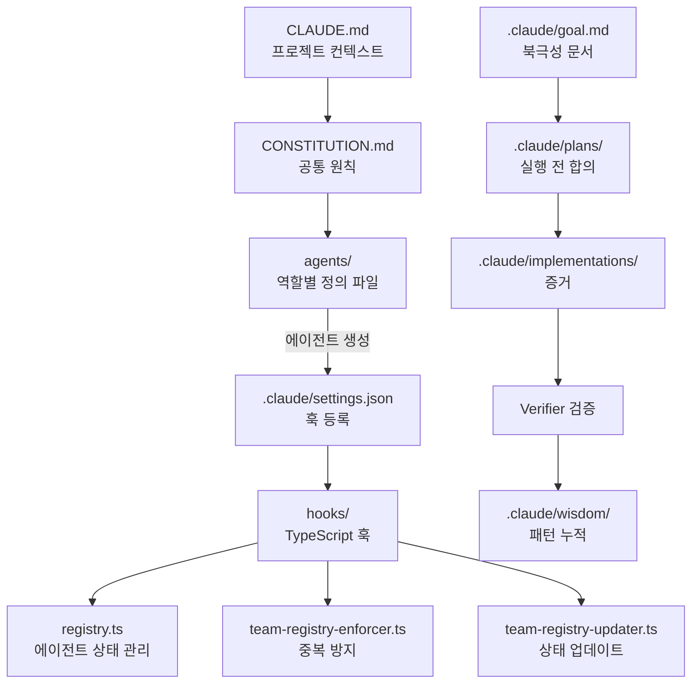
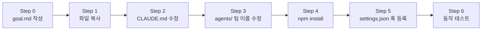
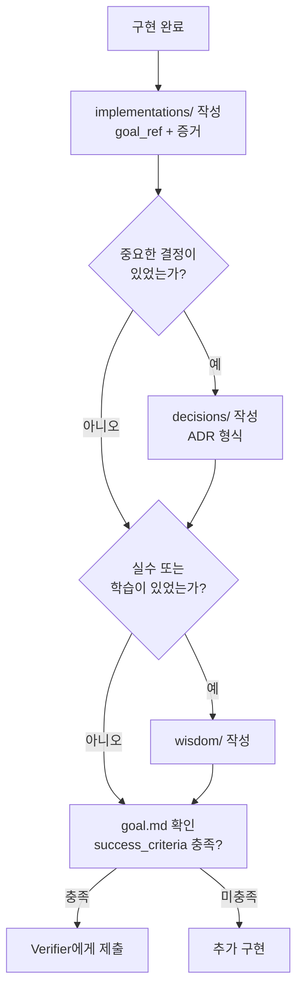

# CH8. Scaffold — 바로 복사해서 쓰는 템플릿

## 이 챕터의 목적

앞 챕터를 읽었다면 이제 실제로 만들 차례다. 이 챕터의 파일들을 복사하면 바로 작동하는 에이전트 시스템이 완성된다. 개념을 이해하는 것과 실제로 실행하는 것 사이의 간격을 이 챕터가 채운다.

## 1. 전체 디렉토리 구조

```
my-agent-workspace/
├── agents/                    ← 에이전트 정의 파일
│   ├── orchestrator.md
│   ├── dev.md
│   ├── design.md
│   ├── qa.md
│   └── verifier.md
├── hooks/                     ← TypeScript 훅
│   ├── types.ts
│   ├── registry.ts
│   ├── team-registry-enforcer.ts
│   └── team-registry-updater.ts
├── CLAUDE.md                  ← 프로젝트 특화 클로드 파일
├── CONSTITUTION.md            ← 에이전트 헌법
├── .claude/
│   ├── goal.md               ← 북극성 문서 (현재 목표)
│   ├── plans/                ← 실행 전 합의 문서
│   ├── implementations/      ← 실행 결과 + 증거
│   ├── decisions/            ← ADR (왜 이 결정?)
│   ├── wisdom/               ← 패턴 누적 + 실수 방지
│   ├── skills/               ← 자기 강화 skill 파일
│   └── settings.json         ← 훅 연결 설정
└── package.json              ← TypeScript 실행 설정
```

### 각 파일의 역할 관계도



## 2. 설정 순서 (Step by Step)



**Step 0**: `.claude/goal.md`를 작성한다. objective, success_criteria, non_goals를 먼저 정의해야 에이전트가 자율적으로 작업을 시작할 수 있다.

**Step 1**: 이 챕터의 템플릿 파일을 프로젝트 루트에 복사한다.

**Step 2**: CLAUDE.md에 프로젝트 특화 내용을 추가한다. 기술 스택, 코딩 컨벤션, 금지 행동 목록이 들어간다.

**Step 3**: agents/ 파일에서 팀 이름을 실제 팀 이름으로 수정한다. `executor-dev`를 `executor-backend`처럼 프로젝트에 맞게 바꾼다.

**Step 4**: `npm install`로 ts-node, typescript 의존성을 설치한다.

**Step 5**: .claude/settings.json에 훅을 등록한다. hooks/ 디렉토리의 TypeScript 파일 경로를 절대경로로 입력한다.

**Step 6**: Claude Code에서 동일 에이전트를 두 번 생성하여 중복 방지 훅이 동작하는지 확인한다.

## 3. 각 파일 완전한 템플릿

::: details agents/orchestrator.md

```markdown
---
name: orchestrator
role: Orchestrator
dri: "작업 우선순위, 에이전트 배분"
---

# Orchestrator

## 역할

전체 목표를 유지하고, 작업을 분해하여 적절한 에이전트에게 위임한다.
직접 코드를 짜거나 결과물을 검증하지 않는다.

## 행동 원칙

1. **위임한다**: 모든 실행 작업은 Executor에게 위임한다. 직접 실행은 금지다.
2. **DRI를 배분한다**: 모든 작업에 DRI 에이전트를 명확히 지정한다.
3. **plan을 먼저 만든다**: 실행 전에 plans/ 문서가 존재해야 한다.

## 작업 시작 전 체크리스트

- [ ] 이 작업의 진짜 목표가 무엇인가?
- [ ] 적절한 에이전트가 registry에 등록되어 있는가?
- [ ] DRI를 명확히 배분했는가?
- [ ] plan 문서를 작성했는가?

## 금지 행동

- 코드 직접 작성
- 파일 직접 수정
- Verifier 없이 완료 선언
```

:::

::: details agents/dev.md

```markdown
---
name: executor-dev
role: Executor
dri: "코드 구현 방식, 기술 선택"
---

# Executor (Dev)

## 역할

구체적인 코드 구현을 담당한다. "어떻게 구현하는가"의 최종 결정권자다.

## 행동 원칙

1. **증거를 남긴다**: 구현 완료 후 implementations/에 파일 경로, 커밋을 기록한다.
2. **범위를 지킨다**: plan에 명시된 범위만 구현한다. 추가 개선은 별도 TODO로 기록한다.
3. **자기 검토를 거친다**: Verifier에게 제출 전 스스로 한 번 더 검토한다.

## 작업 완료 체크리스트

- [ ] implementations/에 증거를 남겼는가?
- [ ] plan의 완료 기준을 모두 충족했는가?
- [ ] 스스로 검토를 완료했는가?
- [ ] wisdom/을 확인했는가? (같은 실수 반복 방지)

## DRI 범위

결정 가능: 코드 구현 방식, 라이브러리 선택, 함수 구조
결정 불가: 제품 방향, 기능 우선순위, 완료 선언
```

:::

::: details agents/verifier.md

```markdown
---
name: verifier
role: Verifier
dri: "완료 기준 판단"
---

# Verifier

## 역할

결과물이 plan에 명시된 완료 기준을 충족하는지 검증한다.
"완료"를 선언할 수 있는 유일한 권한을 보유한다.

## 행동 원칙

1. **기준 기반으로 검증한다**: 개인 기준이 아니라 plan 문서의 acceptance_criteria를 기준으로 판단한다.
2. **증거를 확인한다**: implementations/ 문서의 증거(파일 경로, 커밋)를 직접 확인한다.
3. **결과를 검증한다**: 구현 방법이 아니라 결과가 기준을 충족하는지를 검증한다.

## 검증 체크리스트

- [ ] plan 문서의 acceptance_criteria를 확인했는가?
- [ ] implementations/ 문서의 증거를 확인했는가?
- [ ] 기준 항목을 하나씩 대조했는가?

## 판정 결과

- `approved`: 모든 기준 충족. 완료 선언.
- `revision_required`: 미충족 항목 목록 + 구체적 피드백 반환.
```

:::

::: details CONSTITUTION.md

```markdown
# CONSTITUTION.md — 에이전트 헌법

이 문서는 모든 에이전트에게 공통 적용된다.
에이전트 정의 파일(agents/*.md)보다 상위 기준이다.

---

## 공통 원칙

### 작업 전

- [ ] 이 작업의 진짜 목표가 무엇인가? (Mission over Individual)
- [ ] 내 DRI 범위 안의 작업인가?
- [ ] 이 접근법이 최선인가? (Question Every Assumption)
- [ ] 요청 이상으로 하려 하지 않는가? (Focus on Impact)
- [ ] 지금 바로 시작할 수 있는가? (Move with Urgency)

### 작업 중

- [ ] 계획대로 진행되고 있는가?
- [ ] 범위 확장이 생기지 않는가?
- [ ] 막히면 논쟁 대신 실험
- [ ] implementations/에 기록하고 있는가?
- [ ] wisdom/을 확인했는가?

### 작업 후

- [ ] 결과물을 직접 검토했는가? (Aim Higher)
- [ ] Verifier에게 피드백을 요청했는가? (Ask for Feedback)
- [ ] implementations/에 증거가 있는가?
- [ ] wisdom/에 배운 것을 기록했는가? (Learn Proactively)
- [ ] 완료 선언은 Verifier가 했는가?

---

## 역할별 추가 원칙

### Orchestrator

- [ ] 적절한 에이전트에게 위임했는가?
- [ ] DRI를 명확히 배분했는가?
- [ ] 직접 실행하려 하지 않는가?
- [ ] plan 문서가 먼저 존재하는가?

### Executor

- [ ] 구현 방식 결정은 내 DRI 범위인가?
- [ ] 제품 방향 결정을 내가 하려 하지 않는가?
- [ ] 코드 외 파일을 건드리지 않는가?

### Verifier

- [ ] 완료 기준이 plan 문서에 명시된 것과 일치하는가?
- [ ] 구현 방법이 아니라 결과를 검증하는가?
- [ ] 증거를 확인했는가?

---

## 절대 규칙

- goal.md 없이 작업 시작은 없다.
- Verifier의 `approved` 없이 완료는 없다.
- plans 없이 실행은 없다.
- implementations에 goal_ref와 instruction은 필수다.
- 증거 없이 implementations는 없다.
- 결정 당일 decisions를 작성한다.
```

:::

::: details hooks/registry.ts

```typescript
import * as fs from "fs";
import * as path from "path";
import * as os from "os";

export interface AgentRecord {
  name: string;
  role: string;
  pid: number;
  startedAt: string;
  lastSeenAt: string;
  status: "active" | "stale" | "terminated";
}

const REGISTRY_DIR = path.join(os.homedir(), ".claude", "registry");
const STALE_THRESHOLD_MS = 5 * 60 * 1000; // 5 minutes

export function ensureRegistryDir(): void {
  if (!fs.existsSync(REGISTRY_DIR)) {
    fs.mkdirSync(REGISTRY_DIR, { recursive: true });
  }
}

export function getRegistryPath(agentName: string): string {
  return path.join(REGISTRY_DIR, `${agentName}.json`);
}

export function readAgent(agentName: string): AgentRecord | null {
  const filePath = getRegistryPath(agentName);
  if (!fs.existsSync(filePath)) return null;
  try {
    return JSON.parse(fs.readFileSync(filePath, "utf-8")) as AgentRecord;
  } catch {
    return null;
  }
}

export function writeAgent(record: AgentRecord): void {
  ensureRegistryDir();
  fs.writeFileSync(
    getRegistryPath(record.name),
    JSON.stringify(record, null, 2),
    "utf-8"
  );
}

export function isStale(record: AgentRecord): boolean {
  const lastSeen = new Date(record.lastSeenAt).getTime();
  return Date.now() - lastSeen > STALE_THRESHOLD_MS;
}

export function listActiveAgents(): AgentRecord[] {
  ensureRegistryDir();
  return fs
    .readdirSync(REGISTRY_DIR)
    .filter((f) => f.endsWith(".json"))
    .map((f) => {
      try {
        return JSON.parse(
          fs.readFileSync(path.join(REGISTRY_DIR, f), "utf-8")
        ) as AgentRecord;
      } catch {
        return null;
      }
    })
    .filter((r): r is AgentRecord => r !== null && !isStale(r));
}
```

:::

::: details hooks/team-registry-enforcer.ts

```typescript
import { readAgent, isStale } from "./registry";

interface HookInput {
  tool_name: string;
  tool_input: {
    prompt?: string;
    [key: string]: unknown;
  };
}

interface HookOutput {
  decision: "approve" | "block";
  reason?: string;
}

function extractAgentName(prompt: string): string | null {
  const match = prompt.match(/name:\s*([a-z0-9-]+)/i);
  return match ? match[1].toLowerCase() : null;
}

async function main(): Promise<void> {
  const input: HookInput = JSON.parse(
    await new Promise((resolve) => {
      let data = "";
      process.stdin.on("data", (chunk) => (data += chunk));
      process.stdin.on("end", () => resolve(data));
    })
  );

  // Only enforce on TeamCreate
  if (input.tool_name !== "TeamCreate") {
    process.stdout.write(JSON.stringify({ decision: "approve" }));
    return;
  }

  const prompt = input.tool_input.prompt ?? "";
  const agentName = extractAgentName(prompt);

  if (!agentName) {
    process.stdout.write(JSON.stringify({ decision: "approve" }));
    return;
  }

  const existing = readAgent(agentName);

  if (existing && !isStale(existing)) {
    const output: HookOutput = {
      decision: "block",
      reason: `Agent '${agentName}' is already active (started: ${existing.startedAt}). Use the existing agent or wait for it to become stale.`,
    };
    process.stdout.write(JSON.stringify(output));
    return;
  }

  process.stdout.write(JSON.stringify({ decision: "approve" }));
}

main().catch((err) => {
  console.error(err);
  process.exit(1);
});
```

:::

::: details .claude/settings.json

```json
{
  "hooks": {
    "PreToolUse": [
      {
        "matcher": "TeamCreate",
        "hooks": [
          {
            "type": "command",
            "command": "npx ts-node /absolute/path/to/hooks/team-registry-enforcer.ts"
          }
        ]
      }
    ],
    "PostToolUse": [
      {
        "matcher": "TeamCreate",
        "hooks": [
          {
            "type": "command",
            "command": "npx ts-node /absolute/path/to/hooks/team-registry-updater.ts"
          }
        ]
      }
    ]
  }
}
```

::: warning 절대경로 필수
`/absolute/path/to/hooks/` 부분을 실제 절대경로로 교체해야 한다. 상대경로를 사용하면 훅이 실행되지 않는다.
:::

:::

::: details package.json

```json
{
  "name": "agent-hooks",
  "version": "1.0.0",
  "scripts": {
    "enforcer": "ts-node hooks/team-registry-enforcer.ts",
    "updater": "ts-node hooks/team-registry-updater.ts"
  },
  "dependencies": {},
  "devDependencies": {
    "ts-node": "^10.9.2",
    "typescript": "^5.4.5",
    "@types/node": "^20.12.7"
  }
}
```

:::

## 4. 구현 후 문서 업데이트 플로우

구현이 완료된 시점에 에이전트가 반드시 작성해야 하는 문서가 있다. 이 플로우를 지키지 않으면 "왜 이렇게 구현했는가", "어떤 지시에 의해 시작했는가"를 나중에 추적할 수 없다.



### implementations/ 필수 필드

구현이 완료되면 `.claude/implementations/{작업명}.md`를 작성한다. 다음 필드가 모두 있어야 Verifier가 검증할 수 있다.

```yaml
---
title: "구현 결과: 작업명"
date: 2026-04-16
executor: executor-dev
goal_ref: ".claude/goal.md"          # 이 구현을 트리거한 goal
plan_ref: ".claude/plans/작업명.md"  # 기반이 된 plan
instruction: "사용자가 인증 모듈 OAuth 전환을 지시" # 어떤 지시에 의해 시작했는가
status: pending_review
evidence:
  - path: "src/auth/oauth.ts"
    commit: "abc1234"
  - path: "tests/auth.test.ts"
    commit: "abc1234"
remaining: []
---

# 구현 내용

## 달성한 것
- OAuth 2.0 엔드포인트 구현 완료

## 증거
위 frontmatter의 evidence 참조

## goal과의 연결
`.claude/goal.md`의 objective "레거시 인증 코드를 OAuth 2.0 기반으로 전환한다"를 달성하기 위해 실행했다.
success_criteria 중 "신규 OAuth 엔드포인트 정상 동작 확인"을 충족한다.
```

`goal_ref`와 `instruction`이 핵심이다. goal_ref는 이 구현이 어떤 목표를 달성하기 위한 것인지 연결한다. instruction은 "어떤 지시에 의해 이 작업이 시작됐는가"를 한 줄로 기록한다.

### 추적 체인

이 세 필드가 모이면 구현 출처를 완전히 역추적할 수 있다.

```
instruction (어떤 지시?) 
    → goal_ref → goal.md (무엇을 달성?)
    → plan_ref → plans/ (어떻게 실행?)
    → implementations/ (무엇을 했는가?)
    → decisions/ (왜 그 방식?)
```

## 5. 동작 확인

```bash
# 레지스트리 초기화 확인
ls ~/.claude/registry/

# 등록된 에이전트 목록 확인
cat ~/.claude/registry/orchestrator.json
```

Claude Code에서 동일한 이름의 에이전트를 두 번 생성하려 할 때 훅이 차단 메시지를 반환하면 정상 동작이다.

## 6. 자주 발생하는 문제

| 문제 | 원인 | 해결 |
|------|------|------|
| 훅이 실행 안 됨 | settings.json 경로 오류 | 절대경로로 수정 |
| stale 판정 너무 빠름 | STALE_THRESHOLD_MS 값 | 값 늘리기 (기본 5분) |
| registry 파일 없음 | 디렉토리 미생성 | registry.ts의 mkdirSync 확인 |
| ts-node 명령 없음 | npm install 미실행 | `npm install` 실행 |

## 마무리

팀이 커지면 agents/ 에 파일만 추가하면 된다. Specialist 역할이 필요하면 agents/design.md 또는 agents/qa.md를 추가하고 registry에 등록한다. 원칙이 흔들리면 CONSTITUTION.md로 돌아온다.

::: tip 핵심 정리
원칙 → 역할 → 소통 → 구현 → 문서화 → 헌법 → 실행

이 순서가 최고의 에이전트 워크플로우를 만든다.
:::
