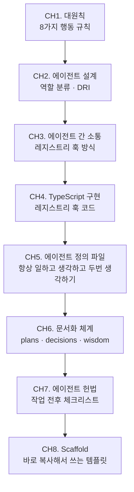

# AI Agent 워크플로우 만들기

단일 LLM 호출로는 복잡한 소프트웨어 작업을 안정적으로 수행하기 어렵다. 이 스터디는 서로 다른 역할을 가진 에이전트들이 협력하는 <strong>팀메이트</strong>시스템을 처음부터 설계하고 구현하는 과정을 담는다.

## 왜 단일 LLM이 부족한가

단일 LLM에 모든 것을 맡기면 다음 문제가 반복된다.

| 문제 | 설명 |
|------|------|
| 컨텍스트 과부하 | 요구사항, 코드, 검증, 회고를 한 번에 처리하면 집중도가 분산된다. |
| 역할 혼란 | "설계자이면서 구현자이면서 검수자"는 현실에서도 실패하는 구조다. |
| 오류 전파 | 한 단계의 실수가 다음 단계로 그대로 흘러가며 증폭된다. |
| 반복 학습 불가 | 단일 세션 LLM은 이전 실패 패턴을 다음 실행에 반영하지 못한다. |

팀으로 일하는 에이전트 시스템은 역할을 분리하고, 각 역할이 서로를 검증하며, 실패 패턴을 누적 학습할 수 있도록 설계된다.

## 핵심 대원칙 미리보기

이 스터디 전체를 관통하는 8가지 행동 원칙은 토스(Toss)의 핵심 가치를 에이전트 행동 규칙으로 번역한 것이다. CH1에서 상세히 다루며, 아래는 한 줄 요약이다.

| 원칙 | 에이전트 적용 |
|------|--------------|
| Mission over Individual | 역할보다 전체 목표가 우선이다. |
| Aim Higher | 1차 결과물로 완료를 선언하지 않는다. |
| Focus on Impact | 요청 범위 밖을 건드리지 않는다. |
| Question Every Assumption | 명령을 받기 전에 전제를 먼저 의심한다. |
| Execution over Perfection | 완벽한 설계보다 작동하는 것을 먼저 만든다. |
| Learn Proactively | 같은 실수를 두 번 반복하지 않는다. |
| Move with Urgency | 논쟁 대신 작은 실험으로 먼저 확인한다. |
| Ask for Feedback | 혼자 완료를 선언하지 않고 verifier를 거친다. |

## 학습 로드맵

## 목차

### 원칙
1. [대원칙 — 에이전트가 지켜야 할 8가지 행동 규칙](/study/ai-agent-workflow/01-core-principles) — Mission, Aim Higher, Focus, Question, Execution, Learn, Urgency, Feedback

### 에이전트 설계
2. [어떤 에이전트를 만들 것인가](/study/ai-agent-workflow/02-agent-design) — 역할 분류, DRI, 팀 구성 설계
3. [에이전트 간 소통 — 레지스트리 훅 방식](/study/ai-agent-workflow/03-communication) — TeamCreate 중복 방지, Stale 감지
4. [TypeScript 레지스트리 훅 구현](/study/ai-agent-workflow/04-registry-hook) — oh-my-claudecode 패턴, PreToolUse 훅
5. [에이전트 정의 파일 작성법](/study/ai-agent-workflow/05-agent-definition-files) — 항상 일하고, 항상 생각하고, 두 번 생각하도록

### 운영
6. [문서화 체계 — 어떤 폴더에 무엇을 남기는가](/study/ai-agent-workflow/06-documentation) — plans / implementations / decisions / wisdom
7. [에이전트 헌법](/study/ai-agent-workflow/07-constitution) — 작업 전·중·후 체크리스트, 역할별 원칙
8. [Scaffold — 바로 복사해서 쓰는 템플릿](/study/ai-agent-workflow/08-scaffold) — 완전한 파일 세트, 설정 순서
