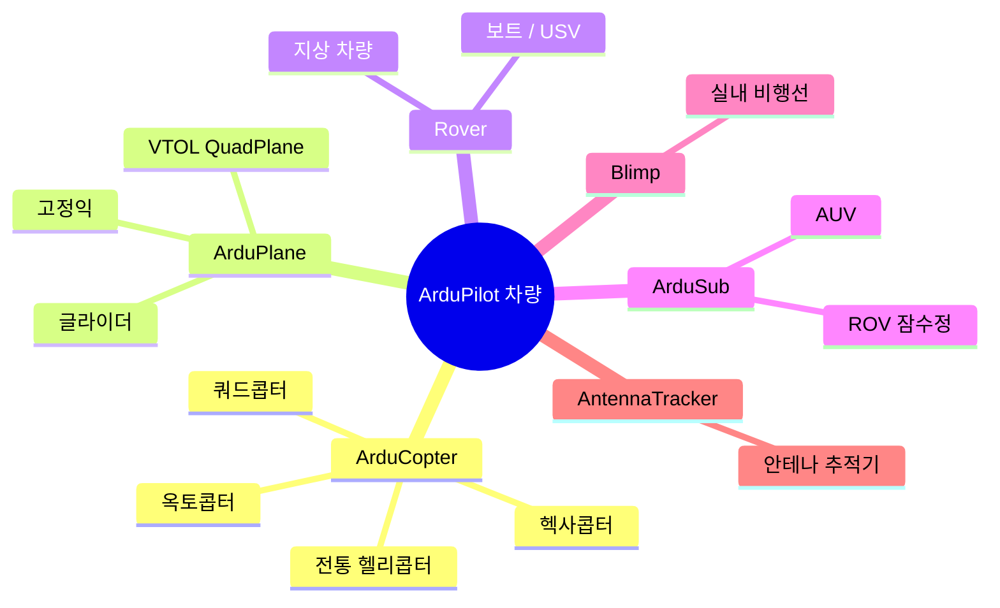
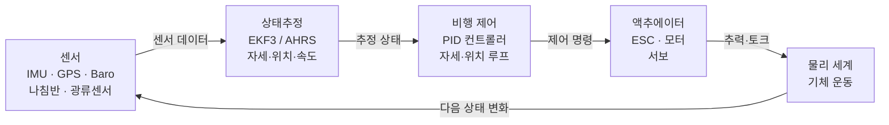
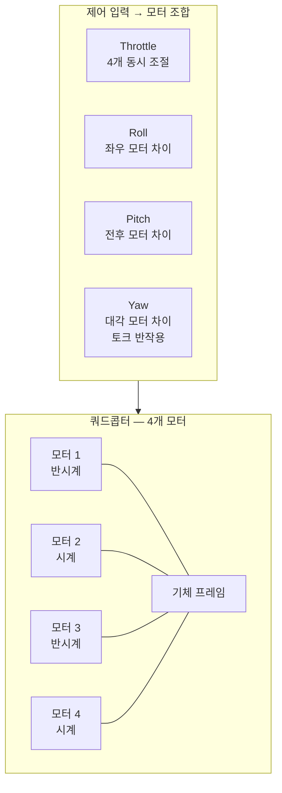
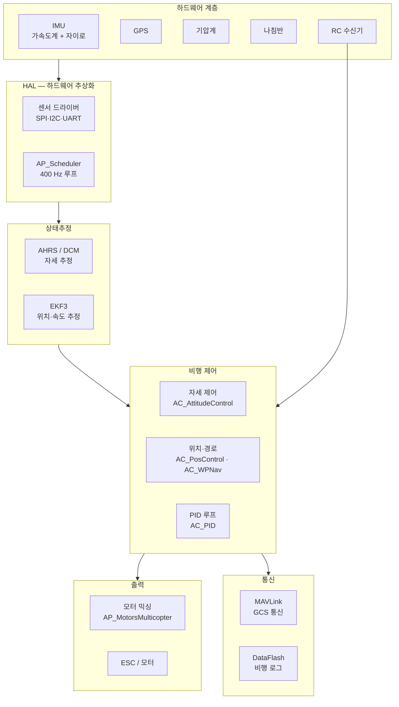

# UAV란 무엇인가

::: info 학습 목표
- UAV(무인항공기)와 무인이동체의 개념을 정의하고, ArduPilot이 지원하는 6종 차량을 구분할 수 있다.
- 멀티콥터가 4개 로터 추력의 차이로 자세를 제어하는 원리를 설명할 수 있다.
- 왜 멀티콥터가 본질적으로 불안정(unstable)한지, 이것이 제어 시스템에 어떤 요구를 만드는지 이해한다.
- 오토파일럿이 하는 일을 "센서 → 상태추정 → 제어 → 액추에이터" 폐루프로 설명할 수 있다.
- 이후 챕터(스케줄러, 센서, EKF, 제어 루프)가 왜 필요한지 전체 그림을 그릴 수 있다.
:::

## 1. UAV, 드론, 무인이동체

<strong>UAV(Unmanned Aerial Vehicle)</strong>는 조종사가 탑승하지 않고 비행하는 항공기를 통칭한다. 일상에서는 '드론(drone)'이라는 단어가 더 흔히 쓰이지만, 드론은 원래 군용 표적기를 가리키는 말이었다. 현재는 멀티콥터·고정익·헬리콥터 형태의 소형 무인기를 두루 드론이라 부른다.

더 넓은 범주는 <strong>무인이동체(UxV)</strong>다. 공중을 나는 UAV뿐 아니라 지상을 달리는 UGV(Unmanned Ground Vehicle), 수면을 항행하는 USV(Unmanned Surface Vehicle), 수중을 유영하는 UUV(Unmanned Underwater Vehicle)까지 포함한다. ArduPilot은 이 모든 종류를 하나의 오픈소스 코드베이스로 지원한다.

### ArduPilot이 지원하는 6종 차량

ArduPilot 레포지토리(`/tmp/ardupilot_study/`) 최상위 디렉토리를 보면 차량 타입별 디렉토리가 그대로 존재한다(`README.md` 참고).

| 디렉토리 | 차량 타입 | 대표 플랫폼 |
|---------|-----------|------------|
| `ArduCopter/` | 멀티콥터 / 헬리콥터 | 쿼드콥터, 헥사콥터, 전통 헬리 |
| `ArduPlane/` | 고정익 / 틸트로터 VTOL | 일반 비행기, QuadPlane |
| `Rover/` | 지상차량 / 보트 | 4륜 로버, 스키드 스티어 보트 |
| `ArduSub/` | 잠수정 (ROV) | 수중 드론, ROV |
| `Blimp/` | 비행선 (Blimp) | 소형 실내 비행선 |
| `AntennaTracker/` | 안테나 추적기 | 지상국 안테나 자동 추적 |

`README.md`는 ArduPilot을 다음과 같이 소개한다.

> "ArduPilot is the most advanced, full-featured, and reliable open source autopilot software available. It has been under development since 2010 by a diverse team of professional engineers, computer scientists, and community contributors."

6개 차량 모두 `libraries/` 폴더의 공통 라이브러리(AP_HAL, AP_GPS, AP_Baro, AP_AHRS, EKF3 등)를 공유한다. 차량 타입별로 추가 라이브러리만 교체하는 구조다. 이 공유 구조는 03장에서 자세히 다룬다.

## 2. 오토파일럿이란 무엇인가

비행기를 조종한다는 것은 매 순간 기체의 자세와 위치를 파악하고 그에 맞게 제어 입력을 내리는 일이다. 사람이 이 일을 직접 하면 RC 조종기(수동 조종), 자동화 장치가 대신 하면 <strong>오토파일럿(autopilot)</strong>이다.

오토파일럿의 핵심은 <strong>폐루프 제어(closed-loop control)</strong>다. 단순히 미리 짜둔 명령을 순서대로 실행하는 것이 아니라, 실제 측정값과 목표값의 차이(오차)를 계속 보면서 제어 입력을 조정한다. 세 단계가 반복된다.

1. <strong>측정</strong> — IMU(자이로·가속도계), GPS, 기압계, 나침반 등 센서로 현재 상태를 측정한다.
2. <strong>추정</strong> — 노이즈가 많은 센서 데이터를 EKF(Extended Kalman Filter)로 융합해 자세·위치·속도를 추정한다.
3. <strong>제어</strong> — 목표값과 추정값의 오차를 PID 컨트롤러로 계산해 각 모터·서보에 출력한다.

이 세 단계가 초당 수백 번 반복된다. ArduCopter의 기본 루프 속도는 400 Hz다(`libraries/AP_Scheduler/AP_Scheduler.cpp:44` — `SCHEDULER_DEFAULT_LOOP_RATE 400`).

각 단계는 이 스터디의 별도 섹션으로 깊이 다룬다. 지금은 "폐루프가 초당 수백 번 돌아야 한다"는 사실만 기억하면 충분하다.

## 3. 멀티콥터 비행 원리

멀티콥터는 여러 개의 로터(rotor)가 만드는 추력으로 날아다닌다. 가장 흔한 형태는 <strong>쿼드콥터(quadrotor)</strong> — 로터 4개.

### 3.1 추력으로 자세를 바꾸는 방법

각 모터는 위로 향하는 추력(thrust)을 발생시킨다. 4개 모터의 추력 합이 중력보다 크면 기체가 뜨고, 같으면 제자리에 뜨고, 작으면 내려온다.

자세 제어는 4개 모터 추력의 <strong>차이(差)</strong>로 이루어진다.

- <strong>Roll(좌우 기울기)</strong> — 좌측 두 모터를 올리고 우측 두 모터를 낮추면 우측으로 기운다.
- <strong>Pitch(앞뒤 기울기)</strong> — 앞 두 모터를 낮추고 뒤 두 모터를 올리면 앞으로 기운다.
- <strong>Yaw(좌우 방향 회전)</strong> — 모터는 회전하면서 토크 반작용(Newton의 제3법칙)이 기체에 전달된다. 쿼드콥터는 대각선 방향 두 모터가 시계방향, 나머지 두 모터가 반시계방향으로 돌도록 설계된다. 같은 방향 모터 두 개의 속도를 올리면 그 반작용으로 기체가 반대 방향으로 돈다.
- <strong>Throttle(상승/하강)</strong> — 4개 모터를 동시에 올리거나 낮춘다.

이 네 가지 제어 입력(roll, pitch, yaw, throttle)이 모터 믹싱 행렬을 통해 4개 모터 속도 명령으로 변환된다. 모터 믹싱은 23장에서 다룬다.

### 3.2 본질적 불안정성

고정익 항공기는 날개 형상 덕분에 기류를 가르며 스스로 수평을 유지하려는 경향(양의 정적 안정성)이 있다. 하지만 멀티콥터는 <strong>본질적으로 불안정(inherently unstable)</strong>하다.

로터 하나라도 정지하면 기체는 즉시 한쪽으로 기울기 시작하며, 아무런 제어 없이는 1초도 안 돼 추락한다. 중력과 로터 추력이 정확히 균형을 이루지 않는 한, 기체는 항상 어느 방향으로든 가속한다. 이것이 사람이 손으로 멀티콥터 균형을 잡기 어려운 이유다.

그러므로 오토파일럿은 <strong>매우 빠르게, 매우 자주</strong> 모터 속도를 조정해야 한다. ArduCopter가 400 Hz 루프를 사용하는 이유가 바로 여기에 있다. 이 요구사항이 뒤에서 다룰 스케줄러(07장)의 설계 동기다.

::: tip 고정익과의 차이
고정익(ArduPlane)은 양력이 날개에서 나오므로 기본 안정성이 있다. 그래서 ArduPlane의 기본 루프 속도는 50 Hz다(`libraries/AP_Scheduler/AP_Scheduler.cpp:46` — `SCHEDULER_DEFAULT_LOOP_RATE 50`). 멀티콥터 400 Hz와 8배 차이가 난다. "왜 스케줄러가 그렇게 설계됐는가"는 이 물리적 차이에서 시작한다.
:::

## 4. ArduPilot 오토파일럿 개관 — 이 스터디의 지도

ArduPilot이 비행 중에 실제로 하는 일을 한 눈에 보면 다음과 같다.

각 블록이 이 스터디에서 다루는 섹션이다.

| 블록 | 스터디 섹션 |
|------|------------|
| HAL / 하드웨어 추상화 | 섹션 2 (04~06장) |
| AP_Scheduler | 섹션 3 (07~08장) |
| 센서 드라이버 | 섹션 4 (09~13장) |
| AHRS / EKF3 | 섹션 5 (14~18장) |
| PID / 자세·위치 제어 | 섹션 6 (19~23장) |
| RC 입력 / 비행 모드 | 섹션 7 (24~26장) |
| MAVLink / 안전 / 로그 | 섹션 8 (27~31장) |
| SITL / 스크립팅 / 통합 | 섹션 9 (32~34장) |

::: tip 핵심 정리
- UAV는 조종사 없이 비행하는 무인항공기다. ArduPilot은 6종(멀티콥터·고정익·로버·잠수정·비행선·안테나추적기)을 하나의 코드베이스로 지원한다(`README.md`).
- 오토파일럿은 센서 → 상태추정 → 제어 → 액추에이터의 폐루프를 초당 수백 번 반복한다.
- 멀티콥터는 본질적으로 불안정하다. 4개 모터 추력 차이로 자세를 제어하며, ArduCopter는 이 때문에 400 Hz 제어 루프를 사용한다(`AP_Scheduler.cpp:44`).
- 고정익은 기본 안정성이 있어 50 Hz로도 충분하다. 이 차이가 이후 스케줄러·실시간성 챕터의 출발점이다.
:::

## 다음 챕터

[02. 임베디드 시스템 기초](/study/ardupilot/02-embedded-basics) — ArduPilot이 동작하는 하드웨어(MCU), RTOS, 실시간성 개념을 다룬다.
