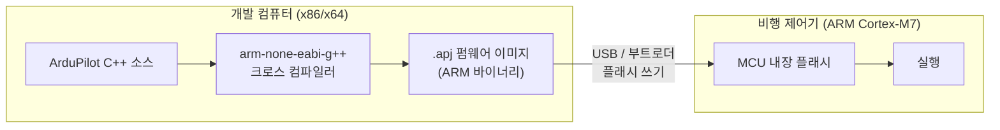
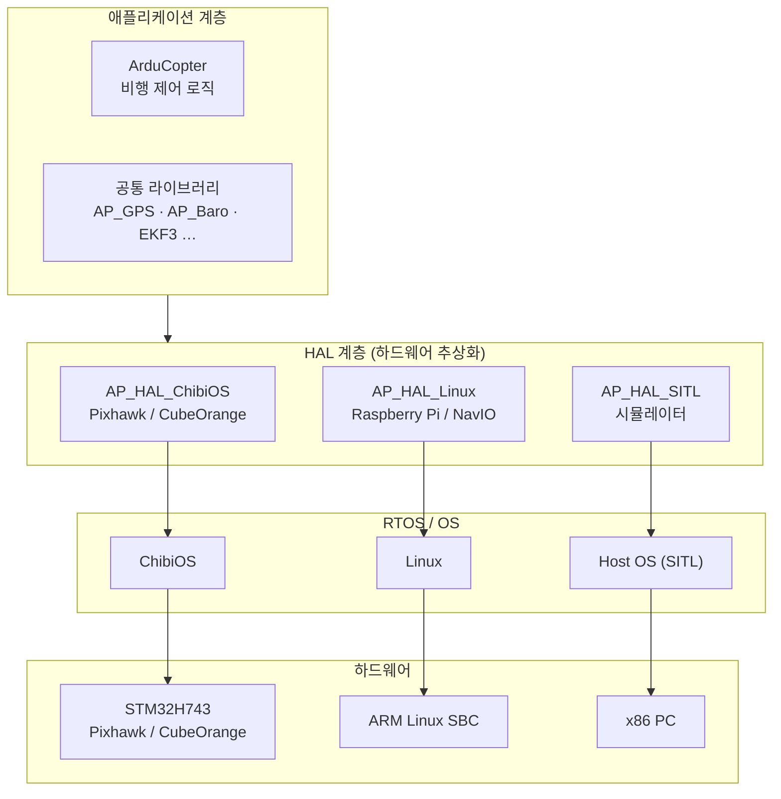

# 임베디드 시스템 기초

::: info 학습 목표
- 임베디드 시스템을 일반 PC와 구분 짓는 핵심 특성(전용성, 자원 제약, 실시간성)을 설명할 수 있다.
- MCU(마이크로컨트롤러)와 일반 CPU의 차이를 클럭·메모리·OS 유무 관점에서 비교할 수 있다.
- 크로스 컴파일이 무엇인지, arm-none-eabi 툴체인이 어디에 선언되는지 코드 근거를 제시할 수 있다.
- hard/soft real-time의 차이와 멀티콥터 제어가 hard real-time인 이유를 설명할 수 있다.
- ArduPilot이 사용하는 ChibiOS의 역할(스레드·인터럽트·타이머)을 이해한다.
:::

## 1. 임베디드 시스템이란

<strong>임베디드 시스템(embedded system)</strong>이란 특정 기능을 수행하기 위해 하드웨어에 고정적으로 내장된 컴퓨터 시스템이다. 범용 PC는 워드프로세서도 돌리고 게임도 돌리지만, 임베디드 시스템은 처음부터 "이 일"만 하도록 설계된다. 드론 비행 제어기, 전자레인지 컨트롤러, 자동차 ABS 모듈이 모두 임베디드 시스템이다.

임베디드 시스템의 세 가지 핵심 특성은 다음과 같다.

1. <strong>전용성(dedicated)</strong> — 하나의 특정 기능 또는 좁은 기능 집합만 수행한다.
2. <strong>자원 제약(resource-constrained)</strong> — RAM이 수 KB~수 MB, 플래시 수백 KB~수 MB, 클럭 수 MHz~수백 MHz 수준이다.
3. <strong>실시간성(real-time)</strong> — 정해진 시간 안에 반드시 응답해야 한다. 늦은 응답이 단순 불편이 아닌 물리적 결과(추락, 파손)를 낳는다.

### MCU vs 일반 PC 비교

| 항목 | MCU (예: STM32H743) | 일반 PC CPU (예: Intel Core i7) |
|------|---------------------|--------------------------------|
| 클럭 속도 | 480 MHz | 3~5 GHz |
| RAM | 1 MB (SRAM) | 16~64 GB (DRAM) |
| 플래시/스토리지 | 2 MB (내장 플래시) | NVMe SSD 수백 GB~수 TB |
| 운영체제 | RTOS(ChibiOS) 또는 Bare-metal | Linux, Windows, macOS |
| 가격 | 수천~수만 원 | 수십만~수백만 원 |
| 소비 전력 | 수십~수백 mW | 수십~수백 W |
| 특이 사항 | 주변장치(SPI/I2C/UART/CAN) 내장 | 외부 칩셋으로 주변장치 처리 |

MCU는 CPU·RAM·플래시·주변장치 인터페이스를 하나의 칩에 통합한다. 덕분에 크기가 작고 전력 소모가 적지만, 절대 성능은 PC에 비할 바가 없다.

::: details MCU 내부 구조 한 줄 설명
ARM Cortex-M 코어(ALU + 레지스터 + FPU) + 내장 SRAM + 내장 플래시 + GPIO + SPI/I2C/UART/CAN 컨트롤러가 하나의 다이(die)에 집적된다. ArduPilot이 지원하는 STM32 시리즈도 이 구조다.
:::

## 2. 펌웨어와 크로스 컴파일

### 2.1 펌웨어(Firmware)

PC 프로그램은 운영체제가 실행 파일을 로드해 메모리에 올린다. 임베디드 시스템은 다르다. 전원이 켜지면 MCU는 플래시 메모리의 첫 번째 주소에서 코드를 직접 실행한다. OS 없이 하드웨어 위에서 곧바로 도는 이 소프트웨어를 <strong>펌웨어(firmware)</strong>라 부른다.

펌웨어는 하드웨어에 굳게(firm) 붙어 있다는 의미다. 변경하려면 플래시를 다시 써야 한다. ArduPilot에서 펌웨어 업데이트란 새로 빌드한 `.apj`(ArduPilot JSON) 이미지를 비행 제어기 플래시에 다시 굽는 과정이다.

### 2.2 크로스 컴파일(Cross-compile)

일반 프로그램은 "돌릴 컴퓨터에서 컴파일"하면 된다. 임베디드 개발은 다르다. MCU는 ARM 아키텍처이고 개발 컴퓨터는 x86이므로, <strong>x86 컴퓨터에서 ARM용 코드를 만드는 크로스 컴파일</strong>이 필요하다.

ArduPilot에서 ChibiOS 타겟(Pixhawk, CubeOrange 등)은 `arm-none-eabi` 툴체인을 사용한다. 이는 `Tools/ardupilotwaf/boards.py`의 `chibios` 보드 클래스에 명시돼 있다.

```python
# Tools/ardupilotwaf/boards.py:1151
class chibios(Board):
    abstract = True
    toolchain = 'arm-none-eabi'
```

`arm-none-eabi`는 세 단어의 조합이다.

- `arm` — 타겟 아키텍처가 ARM이다.
- `none` — 특정 OS(Linux, Windows 등) 없이 bare-metal 또는 RTOS 위에서 동작한다.
- `eabi` — Embedded Application Binary Interface. ARM 임베디드 표준 ABI.

실제로 빌드할 때 `arm-none-eabi-gcc`, `arm-none-eabi-objcopy` 같은 도구가 사용된다(`Tools/ardupilotwaf/chibios.py:539`에서 `arm-none-eabi-objcopy`를 명시적으로 탐색).



## 3. 실시간성 — 왜 비행 제어는 시간을 지켜야 하는가

### 3.1 실시간(Real-time)의 정의

<strong>실시간 시스템(real-time system)</strong>이란 "빠른" 시스템이 아니다. "정해진 시간(deadline) 안에 반드시 결과를 내놓는" 시스템이다. 아무리 정확한 계산이라도 데드라인을 넘기면 틀린 것과 같다.

실시간은 두 종류로 나뉜다.

| 종류 | 데드라인 위반 결과 | 예시 |
|------|------------------|------|

```mermaid
gantt
    title 400 Hz 루프 — 2.5 ms 데드라인
    dateFormat  x
    axisFormat %L ms

    section 루프 주기
    IMU 읽기           :active, 0, 200
    EKF 상태 업데이트  :active, 200, 500
    자세 제어 PID      :active, 500, 900
    모터 출력          :active, 900, 1100
    유휴 시간          :done,   1100, 2500

    section 데드라인
    다음 루프 시작     :crit, 2500, 2500
```

| <strong>Hard real-time</strong> | 시스템 실패(물리적 결과) | 자동차 에어백, 드론 자세 제어 |
| <strong>Soft real-time</strong> | 성능 저하(사용자 불편) | 동영상 스트리밍 버퍼링 |

멀티콥터 자세 제어는 <strong>hard real-time</strong>이다. 01장에서 설명했듯 멀티콥터는 본질적으로 불안정하다. 400 Hz 루프에서 한 틱(2.5 ms)을 놓쳐 제어 명령이 지연되면 기체가 틀어지기 시작한다. 여러 틱을 연속으로 놓치면 추락한다.



### 3.2 왜 일반 OS로는 부족한가

Linux나 Windows 같은 범용 OS는 여러 프로세스의 CPU 시간을 공평하게 나누는 데 최적화돼 있다. 한 태스크가 CPU를 잠깐 더 쓰는 것을 막지 않는다. 실시간 보장이 없다.

임베디드 비행 제어기에서 이런 OS를 쓰면 제어 루프가 예측 불가능하게 지연될 수 있다. 그래서 <strong>RTOS(Real-Time Operating System)</strong>를 사용한다.

## 4. RTOS — ChibiOS

### 4.1 RTOS의 핵심 기능

RTOS는 세 가지 핵심 기능으로 실시간성을 보장한다.

1. <strong>우선순위 기반 선점 스케줄링</strong> — 높은 우선순위 태스크가 준비되면 낮은 우선순위 태스크를 즉시 선점한다. 비행 제어 루프를 가장 높은 우선순위로 두면 다른 작업이 방해할 수 없다.
2. <strong>결정론적 인터럽트 지연(ISR latency)</strong> — 인터럽트 서비스 루틴이 수 마이크로초 이내에 실행을 시작한다.
3. <strong>타이머 정밀도</strong> — 마이크로초 단위의 정밀 타이머로 태스크를 정확히 깨울 수 있다.

### 4.2 ArduPilot과 ChibiOS

ArduPilot은 Pixhawk 계열 하드웨어에서 <strong>ChibiOS</strong>를 RTOS로 사용한다. `libraries/AP_HAL_ChibiOS/` 디렉토리가 그 증거다.

ChibiOS는 STM32 MCU를 위한 소형 RTOS로, 스레드 생성·뮤텍스·세마포어·타이머 같은 기본 동기화 도구를 제공한다. ArduPilot의 HAL(Hardware Abstraction Layer) ChibiOS 구현은 이 위에 SPI·I2C·UART 드라이버, 스케줄러, 스토리지 등을 구현한다.

`libraries/AP_HAL_ChibiOS/HAL_ChibiOS_Class.cpp`에는 스케줄러, GPIO, I2C, SPI 등 ChibiOS 기반 드라이버 인스턴스가 생성된다.

```cpp
// libraries/AP_HAL_ChibiOS/HAL_ChibiOS_Class.cpp:108
static ChibiOS::Scheduler schedulerInstance;
```

리눅스 SBC(Raspberry Pi 등) 위에서 돌 때는 `AP_HAL_Linux/`, SITL 시뮬레이터는 `AP_HAL_SITL/`을 사용한다. 같은 비행 코드가 RTOS와 Linux 위 모두에서 동작하는 것은 HAL(하드웨어 추상화 계층) 덕분이다. HAL은 04장에서 자세히 다룬다.



### 4.3 스레드와 우선순위

ChibiOS에서 ArduPilot은 여러 스레드를 사용한다. HAL ChibiOS 클래스에는 메인 스레드 핸들이 있다.

```cpp
// libraries/AP_HAL_ChibiOS/HAL_ChibiOS_Class.cpp:184
static thread_t* daemon_task;
```

메인 루프 스레드는 가장 높은 우선순위를 갖고, UART 수신 스레드·CAN 버스 스레드 등은 낮은 우선순위로 동작한다. 우선순위 체계 덕분에 비행 제어 루프가 통신 처리보다 항상 먼저 실행된다.

## 5. ArduPilot이 동작하는 하드웨어 — CubeOrange / STM32H743

ArduPilot의 레퍼런스 하드웨어는 <strong>CubeOrange</strong>다. 핵심 MCU는 <strong>STM32H743</strong>으로, `libraries/AP_HAL_ChibiOS/hwdef/CubeOrange/hwdef.dat`의 첫 몇 줄에 명시돼 있다.

```text
# libraries/AP_HAL_ChibiOS/hwdef/CubeOrange/hwdef.dat:3
MCU STM32H7xx STM32H743xx
```

STM32H743의 주요 사양이다.

| 항목 | 값 |
|------|----|
| 아키텍처 | ARM Cortex-M7 |
| 최대 클럭 | 480 MHz |
| SRAM | 1 MB |
| 내장 플래시 | 2 MB |
| FPU | 배정밀도(double) FPU 내장 |
| 주변장치 | SPI·I2C·UART·CAN·ADC·DAC·USB 등 |

배정밀도 FPU가 중요하다. EKF3 같은 상태추정 알고리즘은 부동소수점 연산이 많다. FPU 없이 소프트웨어로 계산하면 수십~수백 배 느려진다.

ArduPilot은 STM32F4 / STM32F7 / STM32H7 계열을 두루 지원한다. 성능 순으로 H7 > F7 > F4다. `libraries/AP_HAL/board/chibios.h`에는 STM32 계열별 컴파일 분기가 정의돼 있다.

```c
// libraries/AP_HAL/board/chibios.h:161
#if defined(STM32H7) || defined(STM32F7) || (defined(STM32F4) ...)
#define HAL_INS_RATE_LOOP 1
```

::: tip 핵심 정리
- 임베디드 시스템은 전용성·자원 제약·실시간성이 특징이다. MCU는 CPU·메모리·주변장치를 하나의 칩에 통합한다.
- ArduPilot ChibiOS 빌드는 `arm-none-eabi` 크로스 컴파일러를 사용한다(`Tools/ardupilotwaf/boards.py:1152`).
- 멀티콥터 제어는 hard real-time이다. 400 Hz 루프의 2.5 ms 데드라인을 놓치면 물리적 결과(추락)가 발생한다.
- ArduPilot은 STM32 MCU 위에서 ChibiOS RTOS를 사용한다. RTOS는 우선순위 선점 스케줄링으로 실시간성을 보장한다.
- CubeOrange의 핵심 MCU는 STM32H743xx(480 MHz, 1 MB SRAM, 배정밀도 FPU)다(`hwdef/CubeOrange/hwdef.dat:4`).
:::

## 다음 챕터

[03. ArduPilot 프로젝트 개관](/study/ardupilot/03-ardupilot-overview) — 레포지토리 구조, 빌드 시스템, 차량별 진입점을 코드 레벨로 살펴본다.
