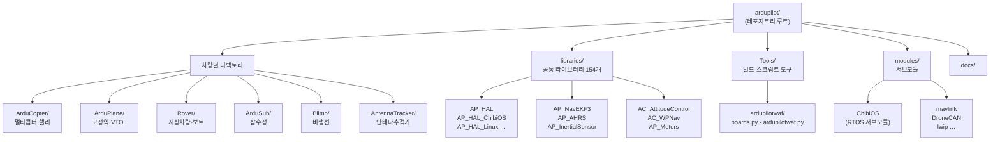
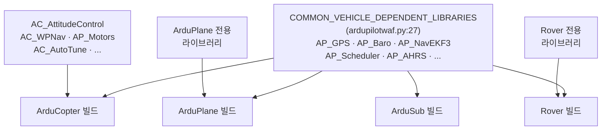
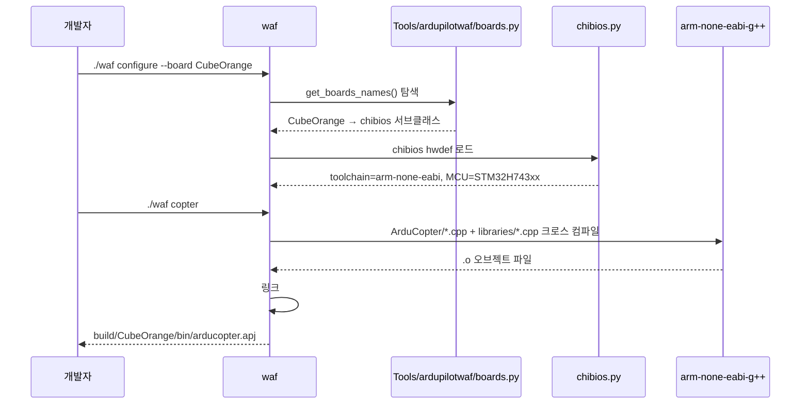
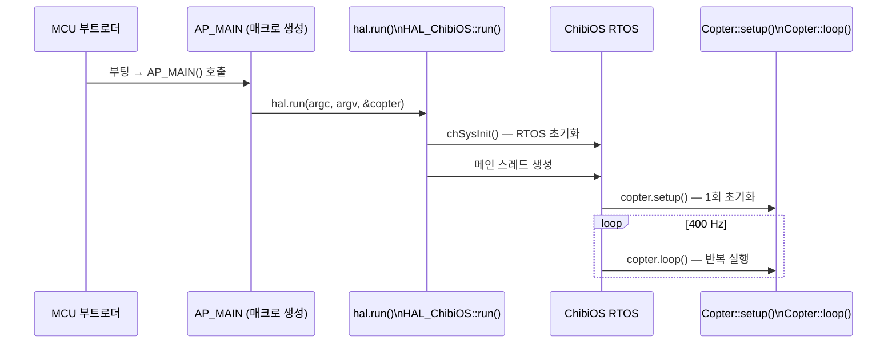

# ArduPilot 프로젝트 개관

::: info 학습 목표
- ArduPilot의 역사, 규모, 라이선스를 설명할 수 있다.
- 레포지토리 디렉토리 구조(차량 6종 + libraries/ + Tools/ + modules/)를 그릴 수 있다.
- `COMMON_VEHICLE_DEPENDENT_LIBRARIES`가 무엇이며 어디에 선언되는지 코드 근거를 제시할 수 있다.
- `AC_*`(멀티콥터 전용)와 `AP_*`(공통) 네이밍 규칙을 구분할 수 있다.
- `./waf configure --board CubeOrange && ./waf copter` 명령의 흐름을 설명할 수 있다.
- `AP_HAL_MAIN_CALLBACKS(&copter)` 한 줄이 실제로 무엇을 하는지 매크로 레벨로 설명할 수 있다.
:::

## 1. ArduPilot의 역사와 라이선스

ArduPilot은 2010년부터 개발이 시작됐다. `README.md`는 이를 다음과 같이 밝힌다.

> "It has been under development since 2010 by a diverse team of professional engineers, computer scientists, and community contributors."

초창기에는 Arduino 기반의 소형 오토파일럿 보드에서 시작했다. 이름에 'Ardu'가 붙은 이유다. 이후 STM32 기반 Pixhawk 하드웨어로 이전하면서 전문 항공·임베디드 엔지니어 커뮤니티가 합류해 현재의 대규모 오픈소스 프로젝트가 됐다.

라이선스는 <strong>GNU General Public License v3(GPLv3)</strong>다(`README.md:79`). 소스를 사용하거나 수정·배포할 경우 동일한 GPLv3 조건으로 공개해야 한다.

## 2. 코드베이스 규모

ArduPilot은 C++로 작성된 대형 임베디드 프로젝트다.

- C++ 소스 파일(`.cpp`): 약 1,642개
- 라이브러리 디렉토리(`libraries/` 하위): 154개

이 규모의 임베디드 오픈소스 프로젝트는 드물다. 일반적인 MCU 프로젝트는 수십~수백 개 파일이 전부다. ArduPilot이 이렇게 커진 이유는 센서 드라이버·상태추정·제어·통신·로깅 등 비행제어에 필요한 거의 모든 기능을 내부에 포함하기 때문이다.

## 3. 디렉토리 구조



### 차량 디렉토리

각 차량 디렉토리에는 그 차량의 메인 `.cpp`와 `.h` 파일, 그리고 차량 전용 로직이 들어 있다. 예를 들어 `ArduCopter/Copter.cpp`에는 멀티콥터 전용 스케줄 태스크 목록과 `AP_HAL_MAIN_CALLBACKS(&copter)` 진입점이 있다.

### libraries/ 디렉토리

모든 차량이 공유하는 라이브러리가 모여 있다. `AP_GPS/`, `AP_Baro/`, `AP_NavEKF3/`, `AP_Scheduler/` 등이 여기에 있다. 차량 타입에 관계없이 동일한 GPS 드라이버, 동일한 EKF3를 사용한다.

### modules/ 디렉토리 (서브모듈)

외부 의존성을 git 서브모듈로 관리한다. 주요 서브모듈은 다음과 같다.

| 서브모듈 | 역할 |
|---------|------|
| `modules/ChibiOS/` | RTOS 소스 |
| `modules/mavlink/` | MAVLink 프로토콜 메시지 정의 |
| `modules/DroneCAN/` | DroneCAN(구 UAVCAN) 스택 |
| `modules/lwip/` | 경량 TCP/IP 스택 |

## 4. 공통 라이브러리 공유 구조

ArduPilot의 핵심 설계 원칙은 "차량마다 따로 만들지 말고 공통 코드를 최대한 공유한다"이다.

### 4.1 COMMON_VEHICLE_DEPENDENT_LIBRARIES

모든 차량이 공통으로 사용하는 라이브러리 목록이 `Tools/ardupilotwaf/ardupilotwaf.py:27`에 정의돼 있다.

```python
# Tools/ardupilotwaf/ardupilotwaf.py:27
COMMON_VEHICLE_DEPENDENT_LIBRARIES = [
    'AP_AccelCal',
    'AP_AHRS',
    'AP_Baro',
    'AP_BattMonitor',
    'AP_GPS',
    'AP_InertialSensor',
    'AP_Math',
    'AP_NavEKF',
    'AP_NavEKF2',
    'AP_NavEKF3',
    'AP_Scheduler',
    'GCS_MAVLink',
    # ... (총 수십 개)
]
```

차량 `wscript`의 빌드 함수는 `bld.ap_common_vehicle_libraries()`를 호출해 이 목록을 가져온 뒤, 차량별 추가 라이브러리를 덧붙인다.

### 4.2 차량별 추가 라이브러리 — ArduCopter 예시

`ArduCopter/wscript`를 보면 공통 라이브러리에 더해 멀티콥터 전용 라이브러리가 추가된다.

```python
# ArduCopter/wscript:7
bld.ap_stlib(
    name=vehicle + '_libs',
    ap_vehicle=vehicle,
    ap_libraries=bld.ap_common_vehicle_libraries() + [
        'AC_AttitudeControl',
        'AC_WPNav',
        'AC_PrecLand',
        'AP_Motors',
        'AC_AutoTune',
        # ...
    ],
)
```

`AC_AttitudeControl`, `AC_WPNav` — `AC_`로 시작하는 라이브러리는 <strong>ArduCopter(멀티콥터) 전용</strong>이다. 반면 `AP_`로 시작하는 라이브러리는 여러 차량이 공유하는 공통 라이브러리다.

| 접두사 | 의미 | 예시 |
|--------|------|------|
| `AP_` | ArduPilot 공통 | `AP_GPS`, `AP_Baro`, `AP_NavEKF3`, `AP_Scheduler` |
| `AC_` | ArduCopter 전용 | `AC_AttitudeControl`, `AC_WPNav`, `AC_PID` |



## 5. waf 빌드 시스템

ArduPilot은 `waf`(WAF build system)를 빌드 도구로 사용한다. `Makefile`은 내부적으로 `waf`를 호출하는 래퍼다.

### 5.1 기본 빌드 흐름

CubeOrange 보드에서 멀티콥터 펌웨어를 빌드하는 기본 명령이다.

```bash
./waf configure --board CubeOrange
./waf copter
```



### 5.2 boards.py에서 보드 클래스 탐색

`--board CubeOrange`가 지정되면 `Tools/ardupilotwaf/boards.py`에서 해당 보드 클래스를 동적으로 찾는다. ChibiOS 계열 보드는 `chibios` 추상 클래스를 상속한다.

```python
# Tools/ardupilotwaf/boards.py:1151
class chibios(Board):
    abstract = True
    toolchain = 'arm-none-eabi'
```

CubeOrange는 `libraries/AP_HAL_ChibiOS/hwdef/CubeOrange/hwdef.dat`의 `MCU` 라인을 읽어 동적으로 보드 클래스가 생성된다(`boards.py:680`에서 `add_dynamic_boards_chibios()` 호출).

### 5.3 빌드 결과물

ChibiOS 타겟의 빌드 결과물은 `.apj` 포맷이다. APJ는 ArduPilot JSON의 약자로, 펌웨어 바이너리와 메타데이터를 JSON으로 감싼 형태다. 지상국(Mission Planner, QGroundControl)이나 `uploader.py`가 이 파일을 비행 제어기에 플래시한다.

```
build/CubeOrange/bin/arducopter.apj
```

## 6. 진입점 — AP_HAL_MAIN_CALLBACKS

ArduPilot 각 차량의 진입점은 단 한 줄로 선언된다. `ArduCopter/Copter.cpp:1005`의 마지막 줄이다.

```cpp
// ArduCopter/Copter.cpp:1003
Copter copter;
AP_Vehicle& vehicle = copter;

AP_HAL_MAIN_CALLBACKS(&copter);
```

`AP_HAL_MAIN_CALLBACKS`는 매크로로, `libraries/AP_HAL/AP_HAL_Main.h:35`에 정의돼 있다.

```cpp
// libraries/AP_HAL/AP_HAL_Main.h:35
#define AP_HAL_MAIN_CALLBACKS(CALLBACKS) extern "C" { \
    int AP_MAIN(int argc, char* const argv[]); \
    int AP_MAIN(int argc, char* const argv[]) { \
        hal.run(argc, argv, CALLBACKS); \
        return 0; \
    } \
    }
```

이 매크로는 `AP_MAIN` 함수(= MCU에서 실제 호출되는 `main()` 역할)를 정의하고, `hal.run()`을 호출한다. `hal`은 HAL 싱글턴 인스턴스다. ChibiOS 타겟에서 `hal.run()`은 `HAL_ChibiOS::run()`으로 디스패치되며(`libraries/AP_HAL_ChibiOS/HAL_ChibiOS_Class.cpp:352`), RTOS를 초기화하고 Copter 객체의 콜백(`setup()`, `loop()`)을 호출하는 메인 스레드를 시작한다.



`AP_HAL_MAIN_CALLBACKS`를 통해 ArduCopter·ArduPlane·Rover·ArduSub 모두 동일한 패턴을 쓴다. 차량별로 다른 `Copter`, `Plane`, `Rover` 객체를 넘길 뿐이다. HAL이 이 차이를 완전히 흡수하는 덕분에 차량 코드는 하드웨어를 전혀 신경 쓰지 않는다. HAL의 역할은 04장에서 자세히 다룬다.

::: tip 핵심 정리
- ArduPilot은 2010년부터 GPLv3 오픈소스로 개발됐다. C++ 약 1,642개 파일, 154개 라이브러리 규모다(`README.md`).
- 레포지토리 루트에 6종 차량 디렉토리 + `libraries/` + `Tools/` + `modules/`(서브모듈)가 있다.
- 모든 차량이 공유하는 라이브러리는 `COMMON_VEHICLE_DEPENDENT_LIBRARIES`(`ardupilotwaf.py:27`)에 정의된다. 차량별 추가는 각 `wscript`에서 붙인다.
- `AC_*`는 ArduCopter 전용 라이브러리, `AP_*`는 범차량 공통 라이브러리 네이밍 규칙이다.
- 빌드는 `./waf configure --board CubeOrange` → `./waf copter`로 이루어진다. `boards.py:1152`의 `chibios` 클래스가 `arm-none-eabi` 툴체인을 지정하고, 결과물은 `arducopter.apj`다.
- 진입점 `AP_HAL_MAIN_CALLBACKS(&copter)`(`Copter.cpp:1005`)는 `AP_HAL_Main.h:35`의 매크로가 `hal.run()`을 호출하는 `main()` 함수로 전개된다.
:::

## 다음 챕터

[04. HAL이란](/study/ardupilot/04-hal) — `AP_HAL` 설계 원칙과 인터페이스 클래스 구조를 파고든다. `hal.run()`이 어떻게 ChibiOS·Linux·SITL에서 동일하게 동작하는지 살펴본다.
