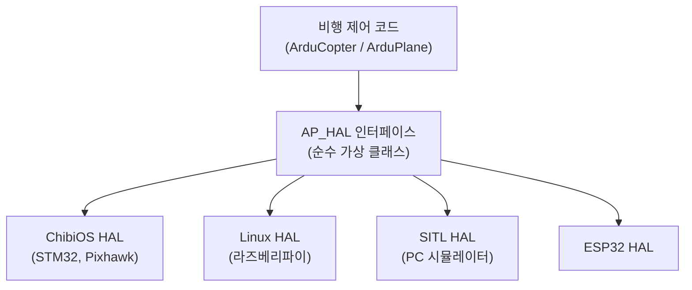
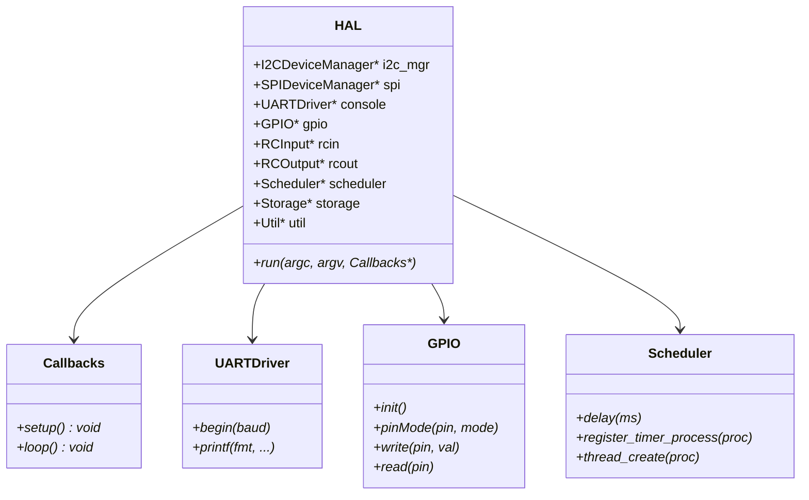
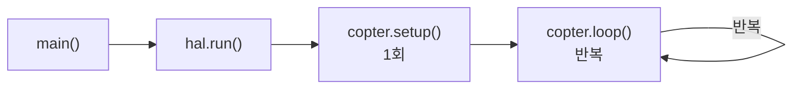

# HAL이란

::: info 학습 목표
- 하드웨어 추상화 계층(HAL)이 왜 필요한지 직관적으로 이해한다
- `AP_HAL` 네임스페이스의 전방 선언 구조와 `get_HAL()` 팩토리 패턴을 파악한다
- `AP_HAL::HAL` 중앙 객체가 담는 드라이버 포인터 목록과 Callbacks 구조를 읽는다
- `hal` 전역 객체와 `AP_HAL_MAIN_CALLBACKS` 매크로가 프로그램 진입점을 어떻게 연결하는지 이해한다
:::

## 왜 하드웨어 추상화가 필요한가

PC에서 파일을 읽을 때 프로그래머는 어떤 저장 장치를 쓰는지 신경 쓰지 않는다. SSD든 HDD든 `fopen`으로 열면 된다. 운영체제가 드라이버 차이를 숨겨주기 때문이다. 임베디드 세계에서는 운영체제가 없거나 얇아서 그 역할을 직접 설계해야 한다.

구체적인 예를 들면 "GPIO 핀을 HIGH로 만들어라"는 동일한 동작이 MCU마다 완전히 다르게 구현된다.

**STM32(레지스터 직접 조작)**
```c
// STM32F4에서 GPIOB 4번 핀을 HIGH로
GPIOB->BSRR = (1 << 4);   // 하드웨어 레지스터에 직접 비트 셋
```

**Linux(파일 시스템 경유)**
```c
// Linux에서 gpio4 핀을 HIGH로
int fd = open("/sys/class/gpio/gpio4/value", O_WRONLY);
write(fd, "1", 1);         // 가상 파일에 문자 쓰기
```

같은 "핀 HIGH" 동작이지만 코드 구조가 완전히 다르다. ArduPilot은 STM32 기반 Pixhawk, 라즈베리파이(Linux), 소프트웨어 시뮬레이터(SITL), ESP32까지 동일한 비행 제어 코드로 동작해야 한다. 이 차이를 상위 코드에서 완전히 숨기는 것이 **HAL(Hardware Abstraction Layer)**의 역할이다.



상위 코드는 오직 `AP_HAL` 인터페이스만 보고, 실제 구현은 빌드 시 선택된 백엔드가 제공한다.

## AP_HAL 네임스페이스와 전방 선언

`AP_HAL_Namespace.h`는 AP_HAL 네임스페이스 안에 있는 모든 클래스를 전방 선언만 해두는 헤더다. 실제 구현 없이 이름만 공개해 순환 의존을 막는 C++ 관용구다.

```cpp
// libraries/AP_HAL/AP_HAL_Namespace.h:6-71
namespace AP_HAL {
    class HAL;
    class UARTDriver;
    class I2CDevice;
    class I2CDeviceManager;
    class Device;
    class SPIDevice;
    class SPIDeviceManager;
    class AnalogSource;
    class AnalogIn;
    class Storage;
    class GPIO;
    class RCInput;
    class RCOutput;
    class Scheduler;
    class Util;
    class Flash;
    // ...

    // 팩토리: 플랫폼별 구체 HAL 객체를 돌려준다
    const HAL& get_HAL();        // (AP_HAL_Namespace.h:70)
    HAL& get_HAL_mutable();      // (AP_HAL_Namespace.h:71)
}
```

`get_HAL()`은 각 백엔드가 구현하는 팩토리 함수다. ChibiOS 백엔드는 ChibiOS HAL 싱글턴을, Linux 백엔드는 Linux HAL 싱글턴을 반환한다. 상위 코드는 `get_HAL()`로 받은 참조만 사용하므로 플랫폼에 독립적이다.

## AP_HAL::HAL 중앙 객체

`HAL.h`에 정의된 `AP_HAL::HAL` 클래스는 모든 드라이버 인터페이스 포인터를 한 곳에 모아두는 **집중 관리자**다.

```cpp
// libraries/AP_HAL/HAL.h:122-135
public:
    AP_HAL::I2CDeviceManager* i2c_mgr;    // I2C 버스 매니저
    AP_HAL::SPIDeviceManager* spi;        // SPI 버스 매니저
    AP_HAL::WSPIDeviceManager* wspi;      // Wide SPI(QSPI) 매니저
    AP_HAL::AnalogIn*   analogin;         // ADC 아날로그 입력
    AP_HAL::Storage*    storage;          // 비휘발성 저장(EEPROM)
    AP_HAL::UARTDriver* console;          // 디버그 콘솔
    AP_HAL::GPIO*       gpio;             // 범용 IO 핀
    AP_HAL::RCInput*    rcin;             // RC 수신기 입력
    AP_HAL::RCOutput*   rcout;            // ESC/서보 PWM 출력
    AP_HAL::Scheduler*  scheduler;        // 타이머·스레드 스케줄러
    AP_HAL::Util        *util;            // 유틸리티(재부팅, 랜덤 등)
    AP_HAL::OpticalFlow *opticalflow;     // 광류 센서
    AP_HAL::Flash       *flash;           // 외부 플래시 메모리
```

시리얼 포트는 최대 10개(`serial0`~`serial9`)를 배열로 관리한다.

```cpp
// libraries/AP_HAL/HAL.h:23-30  (생성자 파라미터)
HAL(AP_HAL::UARTDriver* _serial0, // console
    AP_HAL::UARTDriver* _serial1, // telem1
    AP_HAL::UARTDriver* _serial2, // telem2
    AP_HAL::UARTDriver* _serial3, // 1st GPS
    AP_HAL::UARTDriver* _serial4, // 2nd GPS
    ...
```

### Callbacks 구조체

`HAL.h`에는 프로그램 진입점을 추상화하는 `Callbacks` 구조체도 있다.

```cpp
// libraries/AP_HAL/HAL.h:104-118
struct Callbacks {
    virtual void setup() = 0;   // 초기화 — 1회 호출
    virtual void loop() = 0;    // 메인 루프 — 반복 호출
};

struct FunCallbacks : public Callbacks {
    FunCallbacks(void (*setup_fun)(void), void (*loop_fun)(void));
    void setup() override { _setup(); }
    void loop()  override { _loop(); }
    // ...
};
```

`run()` 가상 함수가 이 콜백을 받아 실행한다.

```cpp
// libraries/AP_HAL/HAL.h:120
virtual void run(int argc, char * const argv[], Callbacks* callbacks) const = 0;
```

백엔드가 `run()`을 구현할 때 내부적으로 `callbacks->setup()`을 1회 호출한 뒤 `callbacks->loop()`을 무한 반복한다. Arduino 스타일과 동일한 구조다.

## HAL 인터페이스 일람

각 순수 가상 클래스는 백엔드가 반드시 구현해야 하는 계약이다.

| 인터페이스 | 헤더 | 역할 |
|---|---|---|
| `UARTDriver` | `UARTDriver.h` | 시리얼 통신 — GPS, 텔레메트리, USB 콘솔 |
| `GPIO` | `GPIO.h` | 디지털 핀 입출력, 인터럽트 등록 |
| `I2CDevice / I2CDeviceManager` | `I2CDevice.h` | I2C 센서 버스 액세스 |
| `SPIDevice / SPIDeviceManager` | `SPIDevice.h` | SPI 센서 버스 액세스 (IMU, 기압계 등) |
| `Scheduler` | `Scheduler.h` | 타이머 콜백, 지연, 스레드 생성 |
| `Storage` | `Storage.h` | 파라미터·캘리브레이션 EEPROM 읽기/쓰기 |
| `Util` | `Util.h` | 재부팅, 난수, 시스템 정보 |
| `RCInput` | `RCInput.h` | RC 수신기 채널값 읽기 |
| `RCOutput` | `RCOutput.h` | ESC/서보 PWM 출력 |
| `AnalogIn` | `AnalogIn.h` | 배터리 전압·전류 ADC 읽기 |

모든 메서드가 `= 0`(순수 가상)이므로 백엔드가 하나라도 빠뜨리면 컴파일이 실패한다. 이것이 인터페이스 계약을 강제하는 C++의 방식이다.



## hal 전역 객체와 AP_HAL_MAIN 매크로

상위 코드가 HAL에 접근할 때는 `hal` 전역 참조를 사용한다.

```cpp
extern const AP_HAL::HAL& hal;
```

이 선언은 어디서나 `hal.gpio->write(4, 1)` 처럼 사용하게 해준다. 실제 `hal` 인스턴스는 각 백엔드가 정의한다.

프로그램 진입점 연결은 `AP_HAL_MAIN_CALLBACKS` 매크로가 담당한다.

```cpp
// libraries/AP_HAL/AP_HAL_Main.h:35-41
#define AP_HAL_MAIN_CALLBACKS(CALLBACKS) extern "C" { \
    int AP_MAIN(int argc, char* const argv[]);        \
    int AP_MAIN(int argc, char* const argv[]) {       \
        hal.run(argc, argv, CALLBACKS);               \
        return 0;                                     \
    } }
```

ArduCopter는 이 매크로를 Copter 클래스 인스턴스와 함께 호출한다.

```cpp
// ArduCopter/Copter.cpp:1005
AP_HAL_MAIN_CALLBACKS(&copter);
```

`copter`는 `AP_HAL::HAL::Callbacks`를 상속받은 객체다. `hal.run()`이 `copter.setup()`을 1회 실행한 뒤 `copter.loop()`를 무한 반복하는 구조다.



## 실제 사용 예

`hal` 객체를 통해 드라이버에 접근하는 코드는 단순하다.

```cpp
// 콘솔에 디버그 출력
hal.console->printf("altitude: %.2f m\n", altitude);

// RC 출력 채널 1에 PWM 1500us 출력 (중립)
hal.rcout->write(1, 1500);

// 100us 지연
hal.scheduler->delay_microseconds(100);

// GPIO 핀 HIGH 출력
hal.gpio->write(HAL_GPIO_PIN_LED, 1);
```

백엔드가 STM32이든 Linux이든 이 코드는 동일하다. 백엔드만 바꾸면 같은 비행 코드가 다른 하드웨어에서 동작한다.

::: tip 핵심 정리
- HAL은 상위 비행 코드와 하드웨어 사이의 **순수 가상 인터페이스 계층**이다. 백엔드(ChibiOS/Linux/SITL/ESP32)가 실제 구현을 제공한다.
- `AP_HAL_Namespace.h`는 전방 선언만으로 모든 드라이버 타입을 공개한다. 팩토리 `get_HAL()`이 플랫폼별 구체 객체를 반환한다.
- `AP_HAL::HAL` 클래스는 `i2c_mgr`, `spi`, `gpio`, `rcin`, `rcout`, `scheduler` 등 모든 드라이버 포인터를 한 곳에 모은다 (`HAL.h:122-135`).
- `Callbacks` 구조체의 `setup()` + `loop()` 패턴이 진입점이다. `hal.run()`이 이를 호출한다.
- `AP_HAL_MAIN_CALLBACKS(&copter)` 매크로가 `main()`을 자동 생성해 `hal.run()`으로 연결한다 (`AP_HAL_Main.h:35-41`).
- 상위 코드는 `extern const AP_HAL::HAL& hal;` 한 줄로 모든 드라이버에 접근한다.
:::

## 다음 챕터

[CH05. 보드와 RTOS](/study/ardupilot/05-board-rtos)에서는 HAL 인터페이스의 실제 구현체인 ChibiOS 백엔드를 다룬다. hwdef.dat 파일로 핀맵을 선언하는 방법, ChibiOS RTOS의 스레드 우선순위 구조, 그리고 다양한 HAL 백엔드(Linux, SITL, ESP32)의 차이를 살펴본다.
