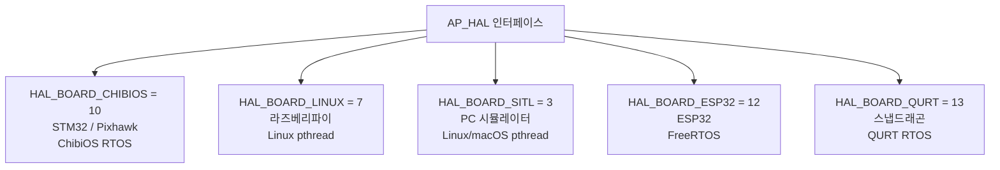
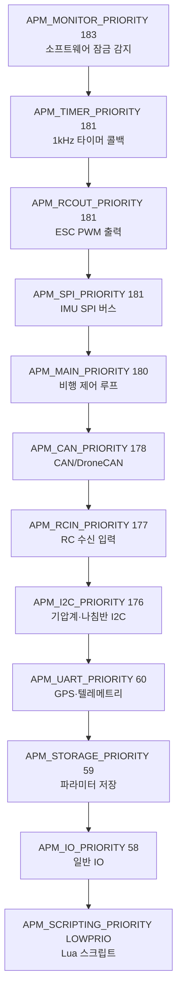

# 보드와 RTOS

::: info 학습 목표
- `hwdef.dat` 텍스트 파일로 핀맵을 선언하는 방법과 빌드 시 헤더로 변환되는 흐름을 이해한다
- ChibiOS RTOS의 스레드 우선순위 체계와 `chThdCreateStatic` 고정 스택 스레드 생성을 파악한다
- ChibiOS / Linux / SITL / ESP32 / QURT 백엔드의 차이와 `AP_HAL_Boards.h` 상수를 확인한다
:::

## 보드 지원이란

ArduPilot은 수백 종의 비행 컨트롤러를 지원한다. Pixhawk 4, Cube Orange, Kakute F7, Matek H743 등 각 보드는 MCU 종류, 핀 배치, 연결된 센서가 모두 다르다. 이 차이를 코드 레벨에서 관리하는 것이 **hwdef 시스템**이다.

핵심 아이디어는 단순하다. 각 보드마다 `hwdef.dat`라는 텍스트 파일에 핀맵과 드라이버 바인딩을 선언하면, 파이썬 스크립트가 이를 읽어 C++ 헤더(`hwdef.h`)를 자동 생성한다.


모든 `hwdef.dat` 파일은 `libraries/AP_HAL_ChibiOS/hwdef/` 아래 보드별 디렉토리에 있다.

## hwdef.dat 문법 해부

fmuv3(Pixhawk1·Cube 등이 상속하는 기반 보드)의 `hwdef.dat`를 분석한다.

### MCU와 기본 설정

```
# libraries/AP_HAL_ChibiOS/hwdef/fmuv3/hwdef.dat
MCU STM32F4xx STM32F427xx   # ChibiOS MCU 클래스, 정확한 칩 종류
FLASH_SIZE_KB 2048           # 플래시 메모리 2MB
OSCILLATOR_HZ 24000000       # 24MHz 외부 클록
```

`MCU` 라인은 두 토큰을 받는다. 첫 번째는 ChibiOS HAL 클래스(`STM32F4xx`), 두 번째는 `hwdef/script/` 디렉토리의 파이썬 칩 테이블 파일명(`STM32F427xx.py`)이다. 이 테이블에서 대체 기능(Alternate Function)과 DMA 채널 정보를 읽어 핀 검증에 사용한다.

### 시리얼 순서 선언

```
# libraries/AP_HAL_ChibiOS/hwdef/fmuv3/hwdef.dat
SERIAL_ORDER OTG1 USART2 USART3 UART4 UART8 UART7
```

`SERIAL_ORDER`는 ArduPilot의 SERIAL0~5가 어느 하드웨어 UART에 대응되는지 순서대로 선언한다. 여기서 SERIAL0=OTG1(USB), SERIAL1=USART2(텔레메트리1), SERIAL3=UART4(GPS1)가 된다.

### 핀 정의

```
# libraries/AP_HAL_ChibiOS/hwdef/fmuv3/hwdef.dat
PA0 UART4_TX UART4    # PA0 핀 → UART4 TX 기능
PA1 UART4_RX UART4    # PA1 핀 → UART4 RX 기능
PA5 SPI1_SCK SPI1     # PA5 → SPI1 클록
PA6 SPI1_MISO SPI1    # PA6 → SPI1 MISO
PA7 SPI1_MOSI SPI1    # PA7 → SPI1 MOSI
PB8 I2C1_SCL I2C1     # PB8 → I2C1 SCL
PB9 I2C1_SDA I2C1     # PB9 → I2C1 SDA
PC2 MPU_CS CS         # PC2 → MPU(IMU) Chip Select
```

형식은 `핀이름 기능이름 주변장치` 순이다. `CS`는 SPI Chip Select 핀을 의미한다.

### 드라이버 바인딩

`IMU`, `BARO`, `COMPASS` 라인은 어느 드라이버를 어느 버스 장치에 연결할지 선언한다.

```
# libraries/AP_HAL_ChibiOS/hwdef/Pixhawk1/hwdef.dat
IMU Invensense SPI:mpu6000 ROTATION_ROLL_180
IMU LSM9DS0 SPI:lsm9ds0_g SPI:lsm9ds0_am ROTATION_ROLL_180 ROTATION_ROLL_180_YAW_270 ROTATION_PITCH_180
BARO MS5611 SPI:ms5611
COMPASS HMC5843 SPI:hmc5843 false ROTATION_PITCH_180
```

`SPI:mpu6000`은 앞서 선언한 SPIDEV 테이블의 디바이스 이름이다. `ROTATION_*`은 보드가 기체에 장착될 때의 회전 보정값이다. 빌드 시스템이 이 정보를 읽어 `AP_InertialSensor`, `AP_Baro`, `AP_Compass`의 프로브(probe) 함수에 올바른 인수를 자동으로 생성한다.

### 보드 상속

```
# libraries/AP_HAL_ChibiOS/hwdef/Pixhawk1/hwdef.dat (1번째 줄)
include ../fmuv3/hwdef.dat
```

Pixhawk1은 fmuv3의 모든 핀 정의를 상속한 뒤 IMU·나침반 선언만 추가한다. 공통 하드웨어를 공유하는 여러 보드 변형을 최소한의 차이로 표현할 수 있다.

## HAL 백엔드 비교

`AP_HAL_Boards.h`에 각 백엔드의 식별 상수가 정의된다.

```cpp
// libraries/AP_HAL/AP_HAL_Boards.h:10-18
#define HAL_BOARD_SITL     3   // PC 소프트웨어 시뮬레이터
#define HAL_BOARD_LINUX    7   // 라즈베리파이 등 Linux SBC
#define HAL_BOARD_CHIBIOS  10  // STM32 기반 실기체 (Pixhawk 등)
#define HAL_BOARD_ESP32    12  // ESP32 (FreeRTOS)
#define HAL_BOARD_QURT     13  // 퀄컴 스냅드래곤 (QURT RTOS)
```

빌드 시 `CONFIG_HAL_BOARD` 값으로 백엔드를 선택한다. 해당 보드 헤더(`AP_HAL/board/chibios.h` 등)를 통해 하드웨어 특정 설정이 전달된다.

| 백엔드 | 값 | 대상 하드웨어 | RTOS / OS | 스레드 생성 방식 |
|---|---|---|---|---|
| ChibiOS | 10 | STM32 Pixhawk 계열 | ChibiOS/RT | `chThdCreateStatic` (고정 스택) |
| Linux | 7 | 라즈베리파이, Navio2 | Linux 커널 | `pthread_create` |
| SITL | 3 | PC (x86/ARM) | 호스트 OS | `pthread_create` |
| ESP32 | 12 | ESP32 Wi-Fi 컨트롤러 | FreeRTOS | `xTaskCreate` |
| QURT | 13 | 스냅드래곤 비행 SoC | QURT | QURT API |



## ChibiOS RTOS — 스레드 우선순위

ChibiOS는 **선점형(preemptive) 우선순위 기반 RTOS**다. 우선순위 숫자가 클수록 높은 우선순위다. `Scheduler.h`에 각 스레드의 우선순위가 상수로 정의되어 있다.

```cpp
// libraries/AP_HAL_ChibiOS/Scheduler.h:25-36
#define APM_MONITOR_PRIORITY    183   // 감시 스레드 (최고)
#define APM_MAIN_PRIORITY       180   // 메인 비행 루프
#define APM_TIMER_PRIORITY      181   // 1kHz 타이머
#define APM_RCOUT_PRIORITY      181   // RC 출력 (ESC 신호)
#define APM_SPI_PRIORITY        181   // SPI 센서 버스
#define APM_RCIN_PRIORITY       177   // RC 수신기 입력
#define APM_CAN_PRIORITY        178   // CAN 버스
#define APM_I2C_PRIORITY        176   // I2C 센서 버스
#define APM_UART_PRIORITY        60   // 시리얼(GPS, 텔레메트리)
#define APM_STORAGE_PRIORITY     59   // EEPROM 저장
#define APM_IO_PRIORITY          58   // 일반 IO
#define APM_LED_PRIORITY         60   // LED 표시
#define APM_SCRIPTING_PRIORITY  LOWPRIO  // Lua 스크립팅 (최저)
```

비행 안전에 직결되는 스레드(RCOUT, SPI/IMU, TIMER)가 메인 루프보다 높거나 같은 우선순위를 가진다. GPS나 로그 쓰기 같은 덜 긴급한 작업은 낮은 우선순위로 처리된다.



## chThdCreateStatic — 고정 스택 스레드

ChibiOS에서 스레드는 `chThdCreateStatic`으로 생성한다. 스택 메모리를 컴파일 타임에 정적 배열로 할당하는 것이 특징이다. 임베디드 시스템에서는 힙 단편화를 피하기 위해 이 방식을 선호한다.

`Scheduler::init()`에서 각 스레드를 생성하는 코드를 보면:

```cpp
// libraries/AP_HAL_ChibiOS/Scheduler.cpp:114-154
// 타이머 스레드 — 1kHz 콜백 담당
_timer_thread_ctx = chThdCreateStatic(_timer_thread_wa,
                 sizeof(_timer_thread_wa),
                 APM_TIMER_PRIORITY,        // 우선순위
                 _timer_thread,             // 스레드 함수
                 this);                     // 인수

// RC 출력 스레드 — ESC 신호 생성
_rcout_thread_ctx = chThdCreateStatic(_rcout_thread_wa,
                 sizeof(_rcout_thread_wa),
                 APM_RCOUT_PRIORITY,
                 _rcout_thread,
                 this);

// IO 스레드 — 저우선순위 작업
_io_thread_ctx = chThdCreateStatic(_io_thread_wa,
                 sizeof(_io_thread_wa),
                 APM_IO_PRIORITY,
                 _io_thread,
                 this);

// 저장 스레드 — EEPROM 쓰기
_storage_thread_ctx = chThdCreateStatic(_storage_thread_wa,
                 sizeof(_storage_thread_wa),
                 APM_STORAGE_PRIORITY,
                 _storage_thread,
                 this);
```

`_timer_thread_wa`, `_rcout_thread_wa` 등은 `Scheduler.h`에 정의된 정적 배열이다. 예를 들어 `TIMER_THD_WA_SIZE = 1536`, `IO_THD_WA_SIZE = 2048` 바이트가 각 스레드 스택으로 예약된다 (`Scheduler.h:63-84`).

동적으로 크기를 조절해야 하는 경우(Lua 스크립팅, 사용자 스레드 등)에는 `thread_create_alloc`을 사용한다.

```cpp
// libraries/AP_HAL_ChibiOS/Scheduler.cpp:723
thread_t *thread_ctx = thread_create_alloc(THD_WORKING_AREA_SIZE(stack_size),
                                           name, prio,
                                           thread_create_trampoline, ctx);
```

이 경우 힙에서 스택을 할당하므로 단편화 위험이 있어 부팅 직후에만 사용한다.

::: tip 핵심 정리
- `hwdef.dat`는 MCU 선언, SERIAL_ORDER, 핀 기능, 드라이버 바인딩을 텍스트로 표현한다. `chibios_hwdef.py`가 이를 `hwdef.h`로 변환한다.
- Pixhawk1의 `hwdef.dat`는 `include ../fmuv3/hwdef.dat`로 공통 핀맵을 상속하고 IMU/BARO/COMPASS 선언만 추가한다.
- `AP_HAL_Boards.h`에 백엔드 식별 상수가 있다: ChibiOS=10, Linux=7, SITL=3, ESP32=12, QURT=13 (`AP_HAL_Boards.h:10-18`).
- ChibiOS 스레드 우선순위는 MONITOR(183) > TIMER/RCOUT/SPI(181) > MAIN(180) > CAN(178) > RCIN(177) > I2C(176) > UART(60) 순이다 (`Scheduler.h:25-36`).
- `chThdCreateStatic`은 컴파일 타임 정적 배열을 스택으로 쓰는 ChibiOS 스레드 생성 방식이다 (`Scheduler.cpp:114-154`).
- Linux/SITL 백엔드는 `pthread_create`, ESP32는 `xTaskCreate`를 사용한다. 스레드 생성 API는 달라도 상위 `Scheduler` 인터페이스는 동일하다.
:::

## 다음 챕터

[CH06. 통신 버스](/study/ardupilot/06-comm-bus)에서는 센서와 MCU가 데이터를 주고받는 물리 버스(UART, I2C, SPI, CAN)와 ArduPilot의 `Device` 추상화 계층을 다룬다. 주기 콜백 등록으로 버스를 비블로킹으로 사용하는 패턴도 함께 살펴본다.
