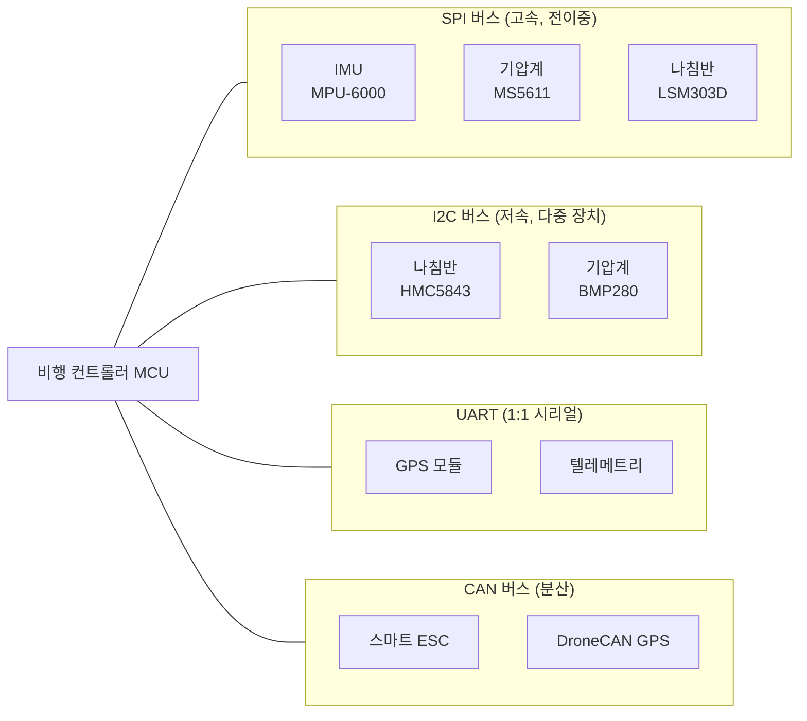
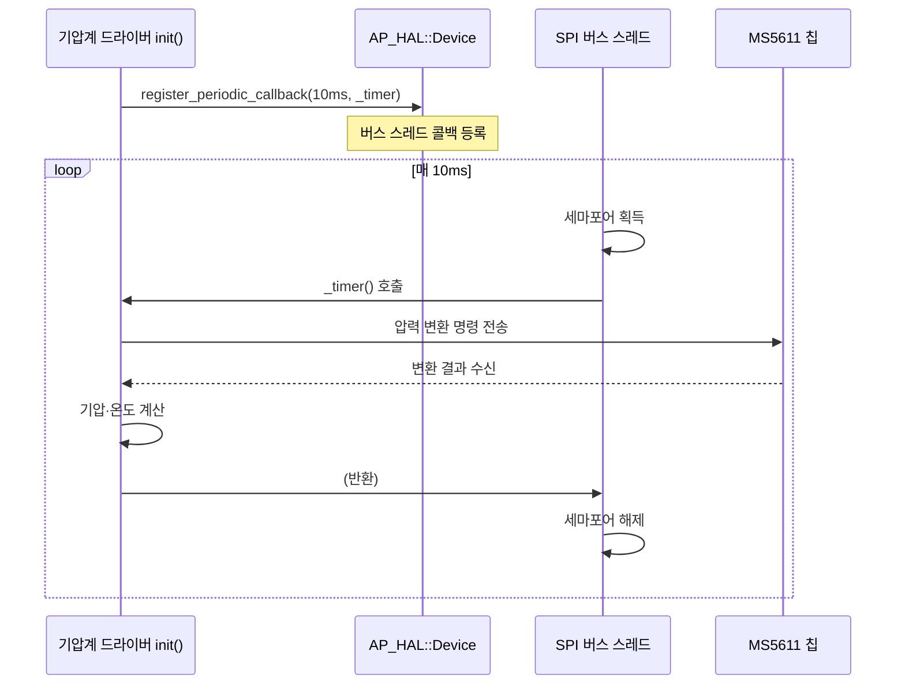

# 통신 버스

::: info 학습 목표
- UART / I2C / SPI / CAN 네 가지 버스의 특성과 드론에서의 사용처를 이해한다
- `AP_HAL::Device` 추상화 계층의 `BusType`, `read_registers`, `write_register`, 검증 레지스터 패턴을 파악한다
- `register_periodic_callback`으로 버스 전용 스레드에서 센서를 주기 실행하는 구조를 이해한다
- `SPIDevice::transfer_fullduplex`와 `I2CDevice::set_split_transfers`의 차이를 안다
:::

## 드론에는 왜 다양한 버스가 있는가

드론 비행 컨트롤러에는 수십 개의 센서와 주변장치가 연결된다. IMU(자이로·가속도), 기압계, 나침반, GPS, ESC, RC 수신기, 텔레메트리 모듈…. 이들은 각자 다른 데이터 속도, 거리, 동시 연결 수 요구사항을 가진다. 단 하나의 버스로 모두를 처리할 수 없기 때문에 용도에 맞는 여러 버스 표준이 공존한다.

## 네 가지 버스 개관

### UART (시리얼)

UART는 가장 단순한 2선 통신이다. TX(송신)와 RX(수신) 두 줄이면 충분하고 프로토콜 오버헤드가 거의 없다. 속도는 느리지만 장거리 통신에 적합하다.

드론에서 UART를 쓰는 곳:
- **GPS** — NMEA나 UBX 프로토콜로 위치·속도 데이터 전송
- **텔레메트리** — MAVLink 패킷을 지상국으로 전송
- **USB 콘솔** — 개발·디버그 출력
- **ESC** — DSHOT 텔레메트리 수신

fmuv3 보드는 SERIAL_ORDER를 통해 SERIAL0=USB, SERIAL1=텔레메트리1, SERIAL3=GPS1로 배정한다.

### I2C

I2C는 SCL(클록)과 SDA(데이터) 2선으로 **여러 장치를 하나의 버스에 연결**할 수 있다. 각 장치는 7비트 주소로 구분된다. 배선이 간단하고 장치 추가가 쉽지만 속도는 400kHz~1MHz 수준으로 SPI보다 느리다. 반이중(half-duplex) 방식이라 동시에 송수신할 수 없다.

드론에서 I2C를 쓰는 곳:
- **기압계** (MS5611, BMP280)
- **나침반** (HMC5843, IST8310)
- **레인지파인더** (일부 모델)

### SPI

SPI는 MOSI, MISO, SCK, CS 최소 4선을 사용하는 고속 버스다. 클록 속도는 수십 MHz까지 가능하고 전이중(full-duplex)이라 송수신을 동시에 수행한다. 장치별로 별도의 CS(Chip Select) 핀이 필요해 배선이 많아지지만 속도가 중요한 곳에 쓴다.

드론에서 SPI를 쓰는 곳:
- **IMU** (MPU-6000, ICM-20689) — 1kHz 이상의 고속 샘플링 필요
- **기압계** (MS5611 SPI 버전)
- **나침반** (LSM303D)
- **SD 카드** — 비행 로그 저장

### CAN

CAN은 최대 수십 미터 길이의 배선으로 여러 노드를 연결하는 차량용 버스 표준이다. 잡음 내성이 강하고 멀티마스터(multi-master) 구조라 분산 시스템에 적합하다. 드론에서는 스마트 ESC, GPS+나침반 모듈, 배터리 관리 시스템(BMS) 같은 지능형 주변장치와 통신한다. CAN 버스는 28챕터에서 DroneCAN과 함께 자세히 다룬다.



## I2C vs SPI 상세 비교

| 항목 | I2C | SPI |
|---|---|---|
| 신호선 수 | 2선 (SCL, SDA) | 4선 이상 (MOSI, MISO, SCK, CS×N) |
| 최대 속도 | 400kHz (표준), 1MHz (고속) | 수십 MHz (칩 의존) |
| 전이중 여부 | 반이중 (송수신 교대) | 전이중 (동시 송수신) |
| 다중 장치 | 주소로 공유 (배선 불변) | CS 핀 추가 필요 |
| 주요 사용 | 기압계, 나침반 | IMU, SD카드 |
| 프로토콜 복잡도 | 주소 ACK 등 오버헤드 있음 | 단순 클록 동기 |

개발자 관점에서 I2C의 핵심 불편함은 **버스 공유 시 충돌**이다. 한 장치가 버스를 잡으면 다른 장치는 기다려야 한다. 1kHz 이상으로 샘플링해야 하는 IMU에는 부적합한 이유다.

## AP_HAL::Device — 버스 추상화

`Device.h`는 I2C와 SPI(그리고 UAVCAN) 장치를 모두 추상화하는 기반 클래스다. 버스 타입을 enum으로 정의한다.

```cpp
// libraries/AP_HAL/Device.h:35-44
enum BusType {
    BUS_TYPE_UNKNOWN = 0,
    BUS_TYPE_I2C     = 1,
    BUS_TYPE_SPI     = 2,
    BUS_TYPE_UAVCAN  = 3,
    BUS_TYPE_SITL    = 4,
    BUS_TYPE_MSP     = 5,
    BUS_TYPE_SERIAL  = 6,
    BUS_TYPE_WSPI    = 7,   // Wide SPI (Quad/Octo SPI)
};
```

핵심 전송 메서드는 두 가지다.

```cpp
// libraries/AP_HAL/Device.h:125-139
// 반이중 전송: send_len 바이트 송신 후 recv_len 바이트 수신
virtual bool transfer(const uint8_t *send, uint32_t send_len,
                      uint8_t *recv, uint32_t recv_len) = 0;

// 전이중 전송: SPI 전용 — 송수신 동시
virtual bool transfer_fullduplex(uint8_t *send_recv, uint32_t len) {
    return transfer(send_recv, len, send_recv, len);
}
```

래퍼 함수들이 `transfer`를 편리하게 감싼다.

```cpp
// libraries/AP_HAL/Device.h:163-171
// 레지스터 읽기: 첫 번째 레지스터 주소를 보내고 recv_len 바이트 수신
bool read_registers(uint8_t first_reg, uint8_t *recv, uint32_t recv_len);

// 레지스터 쓰기: reg와 val 두 바이트 송신
bool write_register(uint8_t reg, uint8_t val, bool checked=false);
```

`checked=true`로 쓰면 레지스터 검증 목록에 등록된다. 이후 `check_next_register()`가 주기적으로 해당 레지스터를 다시 읽어 기대값과 일치하는지 검사한다. 센서 설정 레지스터가 노이즈나 전원 문제로 변경되었을 때 자동으로 감지하는 방어 코드다.

```cpp
// libraries/AP_HAL/Device.h:221-227
// 검증 레지스터 설정
bool setup_checked_registers(uint8_t num_regs, uint8_t frequency=10);
// 다음 검증 레지스터 체크 (매 frequency번째 호출마다 실제 검사)
bool check_next_register(void);
```

## I2CDevice와 SPIDevice의 차이

`I2CDevice`는 `Device`를 상속하며 I2C 전용 메서드 하나를 추가한다.

```cpp
// libraries/AP_HAL/I2CDevice.h:68
// 전송을 send/receive로 분리 (중간에 STOP 조건 삽입)
virtual void set_split_transfers(bool set) {};
```

일부 오래된 I2C 센서는 주소 쓰기와 데이터 읽기 사이에 STOP → START를 요구한다. `set_split_transfers(true)`를 호출하면 `transfer`가 그 방식으로 분할된다.

`SPIDevice`는 전이중 전송에 특화된 시그니처를 추가한다.

```cpp
// libraries/AP_HAL/SPIDevice.h:45-46
// 명시적 전이중: send와 recv가 별도 버퍼
virtual bool transfer_fullduplex(const uint8_t *send, uint8_t *recv,
                                 uint32_t len) = 0;
```

기반 클래스의 `transfer_fullduplex(uint8_t *send_recv, len)`와 달리 send/recv 버퍼가 분리되어 있어 DMA 전송에 더 효율적이다.

DMA 비블로킹 전송은 `register_completion_callback`으로 완료 통지를 받는다.

```cpp
// libraries/AP_HAL/Device.h:312-313
virtual void register_completion_callback(AP_HAL::MemberProc proc) {}
virtual void register_completion_callback(AP_HAL::Proc proc) {}
```

이 콜백을 등록하면 `transfer` 호출이 즉시 반환되고, DMA 전송이 완료되면 콜백이 호출된다. 전송 중 CPU가 다른 작업을 할 수 있다.

## register_periodic_callback — 버스 전용 스레드 주기 실행

ArduPilot 센서 드라이버에서 가장 중요한 패턴이다.

```cpp
// libraries/AP_HAL/Device.h:273
virtual PeriodicHandle register_periodic_callback(uint32_t period_usec, PeriodicCb) = 0;
```

이 함수를 호출하면 **버스 전용 스레드**가 `period_usec`마다 콜백을 실행한다. 같은 버스에 등록된 모든 콜백은 같은 스레드에서 버스 세마포어를 잡은 채 순서대로 실행된다. 메인 루프와 별도 스레드이므로 블로킹이 없다.

MS5611 기압계 드라이버에서 실제 사용 예를 확인할 수 있다.

```cpp
// libraries/AP_Baro/AP_Baro_MS5611.cpp:178-181
/* Request 100Hz update */
_dev->register_periodic_callback(10 * AP_USEC_PER_MSEC,
                                 FUNCTOR_BIND_MEMBER(&AP_Baro_MS56XX::_timer, void));
```

`10 * AP_USEC_PER_MSEC = 10,000 us = 10ms` 주기, 즉 100Hz로 `_timer` 멤버 함수를 버스 스레드에서 호출하도록 등록한다. `_timer` 내부에서 기압·온도 변환 명령을 보내고 결과를 읽어 `AP_Baro`에 업데이트한다. 메인 루프를 전혀 방해하지 않는다.



콜백이 `false`를 반환하면 자동으로 등록이 취소된다. 주기를 변경하려면 `adjust_periodic_callback`을 호출한다.

```cpp
// libraries/AP_HAL/Device.h:282
virtual bool adjust_periodic_callback(PeriodicHandle h, uint32_t period_usec) = 0;
```

## CAN 예고

CAN 버스는 `BUS_TYPE_UAVCAN = 3` (`Device.h:39`)으로 정의되어 있지만, CAN 드라이버는 `AP_HAL::CANIface`로 별도 추상화된다. 분산 시스템 특성상 노드 주소, 데이터프레임, 펌웨어 업데이트 프로토콜 등 복잡한 DroneCAN 레이어가 위에 얹힌다. 이 내용은 [CH28. DroneCAN](/study/ardupilot/28-dronecan)에서 자세히 다룬다.

::: tip 핵심 정리
- **UART**는 GPS·텔레메트리에, **SPI**는 고속 IMU에, **I2C**는 기압계·나침반에, **CAN**은 스마트 ESC 등 분산 장치에 사용한다.
- `AP_HAL::Device`의 `BusType` enum이 I2C(1), SPI(2), UAVCAN(3) 등을 추상화한다 (`Device.h:35-44`).
- `read_registers` / `write_register`는 `transfer`를 감싸는 편의 래퍼다. `checked=true`로 쓰면 레지스터 검증 목록에 등록되어 오염 감지에 활용된다 (`Device.h:163-227`).
- `register_periodic_callback(period_usec, cb)`는 버스 전용 스레드에서 콜백을 주기 실행한다. 같은 버스의 콜백은 같은 스레드+세마포어 컨텍스트에서 직렬 실행된다 (`Device.h:273`).
- MS5611 기압계는 `10ms(100Hz)` 주기 콜백으로 메인 루프와 독립적으로 샘플링한다 (`AP_Baro_MS5611.cpp:178-181`).
- `SPIDevice::transfer_fullduplex`는 전이중 전송, `I2CDevice::set_split_transfers`는 STOP/START 분리 전송을 지원한다 (`SPIDevice.h:45-46`, `I2CDevice.h:68`).
- `register_completion_callback`으로 DMA 전송 완료 통지를 받아 블로킹 없이 버스를 사용할 수 있다 (`Device.h:312-313`).
:::

## 다음 챕터

[CH07. 메인 루프와 스케줄러](/study/ardupilot/07-scheduler)에서는 버스 스레드와 별개로, 비행 제어 로직 자체를 어떻게 일정 주기로 실행하는지 다룬다. `AP_Scheduler`가 fast loop와 slow loop를 분리하고 태스크 오버런을 처리하는 방식을 살펴본다.
