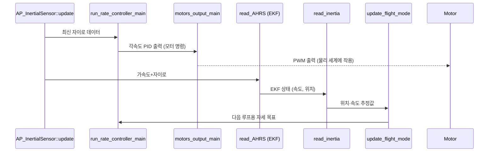
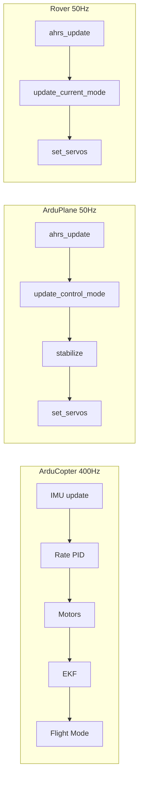
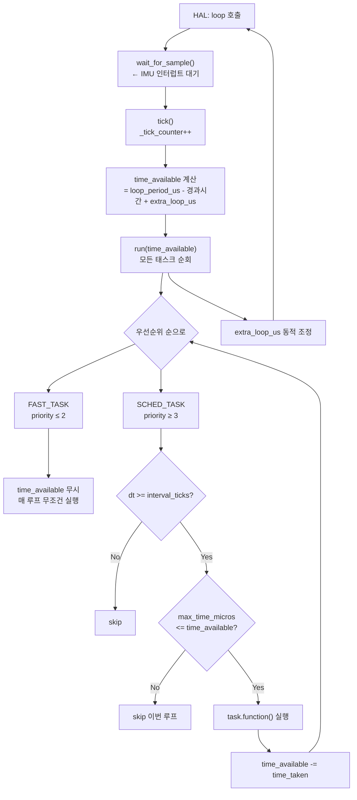

# CH7. 메인 루프와 스케줄러

::: info 학습 목표
- ArduPilot의 메인 루프가 어떤 경로로 진입하고 반복되는지 설명할 수 있다.
- AP_Scheduler의 Task 구조체와 SCHED_TASK / FAST_TASK 매크로의 의미를 이해한다.
- scheduler_tasks[] 테이블에 나열된 태스크들의 실행 주파수와 우선순위를 설명할 수 있다.
- FAST_TASK의 실행 순서가 왜 그렇게 설계됐는지 근거를 댈 수 있다.
- 차량 종류(Copter/Plane/Rover)에 따라 루프 주파수가 어떻게 달라지는지 설명할 수 있다.
:::

## 1. 메인 루프의 진입점

### AP_HAL_MAIN_CALLBACKS

`ArduCopter/Copter.cpp` 마지막 줄에는 딱 한 줄이 있다.

```cpp
AP_HAL_MAIN_CALLBACKS(&copter);  // ArduCopter/Copter.cpp:1005
```

이 매크로는 HAL(하드웨어 추상화 계층)이 `copter` 객체를 메인 콜백으로 등록하도록 지시한다. 플랫폼이 부팅을 완료하면 HAL은 `copter.setup()`을 단 한 번 호출하고, 그 뒤 `copter.loop()`를 무한 반복한다.

`Copter`는 `AP_Vehicle`을 상속한다. `loop()`는 `AP_Vehicle`에 구현되어 있으며 다음과 같이 단 두 줄이다.

```cpp
void AP_Vehicle::loop()
{
    scheduler.loop();         // libraries/AP_Vehicle/AP_Vehicle.cpp:561
    G_Dt = scheduler.get_loop_period_s();
}
```

`scheduler.loop()`가 모든 일을 한다. `G_Dt`는 루프 주기를 초 단위로 저장한 전역 변수로, PID 제어기 등 시간 미분 계산에 사용된다.

### AP_Scheduler::loop() 내부

`AP_Scheduler::loop()`는 매 루프마다 다음 순서를 따른다.

1. `AP::ins().wait_for_sample()` — IMU가 새 샘플을 내놓을 때까지 블로킹 대기
2. `_last_loop_time_s` 갱신 — 실제 루프 시간 측정
3. `tick()` 호출 — `_tick_counter` 증가
4. `time_available` 계산 — 루프 주기에서 이미 소비한 시간을 뺀 남은 시간
5. `run(time_available)` 호출 — 태스크 실행
6. `extra_loop_us` 동적 조정 — CPU 과부하 감지 시 예산 추가

```cpp
void AP_Scheduler::loop()
{
    _rsem.give();
    AP::ins().wait_for_sample();          // libraries/AP_Scheduler/AP_Scheduler.cpp:353
    _rsem.take_blocking();
    // ...
    tick();
    // ...
    run(time_available);
}
```

`_rsem`은 스케줄러 세마포어다. `wait_for_sample()` 동안 잠금을 풀어 다른 스레드가 접근할 수 있도록 한다.

## 2. AP_Scheduler Task 구조체

### Task 구조체

```cpp
struct Task {
    task_fn_t function;       // 실행할 함수 포인터
    const char *name;         // 디버그용 이름
    float rate_hz;            // 실행 주파수 (Hz)
    uint16_t max_time_micros; // 허용 최대 실행 시간 (μs)
    uint8_t priority;         // 우선순위 (낮을수록 높음)
};
```

`(libraries/AP_Scheduler/AP_Scheduler.h:88)`

`priority = 0`이 가장 높다. `FAST_TASK`는 항상 `FAST_TASK_PRI0 = 0`을 사용한다. 일반 SCHED_TASK의 우선순위는 3 이상이다.

```cpp
enum FastTaskPriorities {
    FAST_TASK_PRI0 = 0,
    FAST_TASK_PRI1 = 1,
    FAST_TASK_PRI2 = 2,
    MAX_FAST_TASK_PRIORITIES = 3
};  // AP_Scheduler.h:100
```

### SCHED_TASK / FAST_TASK 매크로

`ArduCopter/Copter.cpp` 86~87번 줄에 로컬 편의 매크로를 정의한다.

```cpp
#define SCHED_TASK(func, rate_hz, _max_time_micros, _prio) \
    SCHED_TASK_CLASS(Copter, &copter, func, rate_hz, _max_time_micros, _prio)
#define FAST_TASK(func) \
    FAST_TASK_CLASS(Copter, &copter, func)
```

`(ArduCopter/Copter.cpp:86-87)`

`FAST_TASK_CLASS`는 `AP_Scheduler.h`에 정의되어 있으며 `rate_hz=0`, `max_time_micros=0`, `priority=FAST_TASK_PRI0`을 고정한다.

```cpp
#define FAST_TASK_CLASS(classname, classptr, func) { \
    .function = FUNCTOR_BIND(classptr, &classname::func, void), \
    .rate_hz = 0,                                \
    .max_time_micros = 0,                        \
    .priority = AP_Scheduler::FAST_TASK_PRI0     \
}  // AP_Scheduler.h:57
```

`rate_hz=0`은 "루프마다 실행"을 의미한다. `max_time_micros=0`은 시간 예산을 체크하지 않겠다는 의미다. FAST_TASK는 루프 주기 전체를 자신의 예산으로 간주한다.

## 3. scheduler_tasks[] 테이블 분석

### FAST_TASK 실행 순서

`ArduCopter/Copter.cpp:113~265` 테이블 앞부분에 FAST_TASK 목록이 있다. 이것들은 400Hz로, 즉 2.5ms마다 **매 루프** 실행된다.

| 순서 | 태스크 | 클래스 / 함수 | 의미 |
|------|--------|--------------|------|
| 1 | AP_InertialSensor::update | `FAST_TASK_CLASS(AP_InertialSensor, &copter.ins, update)` | IMU(자이로·가속도) 최신 샘플 읽기 |
| 2 | run_rate_controller_main | `FAST_TASK(run_rate_controller_main)` | 각속도 PID (Rate Controller) 실행 |
| 3 | motors_output_main | `FAST_TASK(motors_output_main)` | 모터 PWM 출력 |
| 4 | read_AHRS | `FAST_TASK(read_AHRS)` | EKF 상태 추정 업데이트 |
| 5 | read_inertia | `FAST_TASK(read_inertia)` | 가속도 적분 → 속도/위치 추정 |
| 6 | check_ekf_reset | `FAST_TASK(check_ekf_reset)` | EKF 리셋 감지 |
| 7 | update_flight_mode | `FAST_TASK(update_flight_mode)` | 자세·위치 제어 루프 실행 |
| 8 | update_home_from_EKF | `FAST_TASK(update_home_from_EKF)` | 홈 위치 EKF 보정 |
| ... | (랜딩·지형 등) | - | 부가 FAST_TASK |

`(ArduCopter/Copter.cpp:114-149)`

### 주기 태스크(SCHED_TASK) 주요 항목

| 태스크 | rate_hz | max_time_μs | priority | 역할 |
|--------|---------|-------------|----------|------|
| rc_loop | 250 | 130 | 3 | RC 입력 읽기 |
| throttle_loop | 50 | 75 | 6 | 스로틀·지면효과 처리 |
| AP_GPS::update | 50 | 200 | 9 | GPS 파싱 |
| update_batt_compass | 10 | 120 | 15 | 배터리·나침반 갱신 |
| three_hz_loop | 3 | 75 | 57 | GCS 페일세이프 체크 |
| one_hz_loop | 1 | 100 | 81 | 파라미터·로깅 등 저속 작업 |
| GCS::update_receive | 400 | 180 | 102 | MAVLink 수신 처리 |
| GCS::update_send | 400 | 550 | 105 | MAVLink 전송 처리 |
| AP_Scheduler::update_logging | 0.1 | 75 | 126 | 성능 로그(10초마다) |

`(ArduCopter/Copter.cpp:151-265)`

GCS 업무가 400Hz로 등록된 것이 눈에 띈다. 이것은 "루프마다 실행을 시도하되 할당 시간(180μs/550μs) 안에 처리 가능한 만큼만 처리"한다는 의미다. MAVLink 패킷이 없으면 함수가 즉시 반환하므로 실제 부하는 훨씬 작다.

## 4. 루프 주파수 400Hz의 의미

### SCHEDULER_DEFAULT_LOOP_RATE

```cpp
#if APM_BUILD_COPTER_OR_HELI || APM_BUILD_TYPE(APM_BUILD_ArduSub)
#define SCHEDULER_DEFAULT_LOOP_RATE 400
#else
#define SCHEDULER_DEFAULT_LOOP_RATE  50
#endif
```

`(libraries/AP_Scheduler/AP_Scheduler.cpp:43-47)`

Copter와 Sub는 400Hz(2.5ms), 나머지는 50Hz(20ms)가 기본값이다. 파라미터 `SCHED_LOOP_RATE`로 변경 가능하지만 재부팅이 필요하다.

루프 주기는 init()에서 계산된다.

```cpp
_loop_period_us = 1000000UL / _loop_rate_hz;   // 400Hz → 2500μs
```

`(libraries/AP_Scheduler/AP_Scheduler.cpp:119)`

### IMU 동기

`AP::ins().wait_for_sample()`이 루프의 심장박동이다. IMU는 MPU6000 같은 센서에서 하드웨어 인터럽트 또는 SPI DMA로 400Hz 샘플을 제공한다. 스케줄러는 새 샘플이 도착할 때까지 블로킹 대기한다. 이 덕분에 루프는 외부 타이머 없이도 정확히 IMU 샘플 주기에 동기화된다.

```cpp
AP::ins().wait_for_sample();   // AP_Scheduler.cpp:353
```

센서 샘플이 없으면 CPU를 낭비하지 않고 대기하며, 샘플이 도착하는 즉시 루프가 깨어나 최신 IMU 데이터를 사용한다.

## 5. FAST_TASK 순서의 설계 의도

FAST_TASK 순서는 임의가 아니다. 각 단계는 이전 단계의 출력에 의존한다.



- **IMU → Rate Controller → 모터 출력**: 가장 시간이 촉박한 경로다. IMU 샘플을 읽자마자 즉시 모터 명령을 갱신해야 진동에 의한 불안정을 최소화한다. 이 세 단계가 FAST_TASK의 앞 세 자리를 차지하는 이유다.
- **EKF (read_AHRS)**: 연산이 비싸다. IMU 및 모터 출력 이후에 배치해 레이턴시 임팩트를 낮춘다.
- **update_flight_mode**: 자세·위치 루프는 EKF 결과를 사용하므로 EKF 뒤에 온다. 여기서 계산한 각속도 목표(rate setpoint)가 다음 루프의 rate controller에 전달된다.

## 6. 차량별 루프 주파수 비교



| 차량 | 루프 주파수 | FAST_TASK 특징 | 이유 |
|------|------------|---------------|------|
| ArduCopter | 400Hz | IMU → Rate PID → 모터 순서 중요 | 멀티콥터는 본질적으로 불안정 → 고속 피드백 필수 |
| ArduPlane | 50Hz | ahrs → stabilize → servos | 고정익은 공력으로 자연 안정 → 저속 루프로 충분 |
| Rover | 50Hz | FAST_TASK 없음, ahrs_update 400Hz SCHED_TASK | 지상이동체는 자세 불안정 없음 |

ArduPlane의 FAST_TASK는 `ahrs_update → update_control_mode → stabilize → set_servos` 4단계다 `(ArduPlane/Plane.cpp:64-67)`. 고정익은 날개와 꼬리날개의 공력이 자세를 자연스럽게 잡아주므로 멀티콥터처럼 400Hz 각속도 제어가 필요하지 않다.

Rover는 FAST_TASK가 없다. `ahrs_update`가 400Hz SCHED_TASK로 등록되어 있어 빠르게 실행되지만, 모터 출력(`set_servos`)은 400Hz SCHED_TASK로 따로 등록된다 `(Rover/Rover.cpp:79-80)`.

## 7. 루프 한 틱의 전체 흐름



`run()`의 핵심 로직은 우선순위 순으로 두 테이블(vehicle_tasks + common_tasks)을 병합해 순회한다. 우선순위가 같으면 vehicle_tasks가 우선한다 `(AP_Scheduler.cpp:207-209)`.

::: tip 핵심 정리
- ArduPilot 메인 루프는 `AP_HAL_MAIN_CALLBACKS` → `AP_Vehicle::loop()` → `AP_Scheduler::loop()`로 진입한다.
- `AP_Scheduler::loop()`는 IMU 샘플을 기다렸다가(`wait_for_sample`) tick을 올리고 `run()`을 호출한다.
- Task 구조체는 function / name / rate_hz / max_time_micros / priority 5개 필드를 가진다.
- FAST_TASK는 priority=0, rate_hz=0, max_time_micros=0으로, 루프마다 시간 예산 체크 없이 무조건 실행된다.
- Copter의 FAST_TASK 순서는 IMU → Rate PID → 모터 출력 → EKF → 위치추정 → 비행모드 순이며, 각 단계가 다음 단계의 입력을 생산한다.
- Copter/Sub는 400Hz, Plane/Rover는 50Hz가 기본이며, `SCHED_LOOP_RATE` 파라미터로 조정 가능하다.
:::

## 다음 챕터

[CH8. 협조적 스케줄링과 실시간성](/study/ardupilot/08-realtime-scheduling) — `run()` 내부의 태스크 건너뛰기 로직, 오버런·슬립 감지, `extra_loop_us` 동적 조정을 코드 레벨에서 분석한다.
