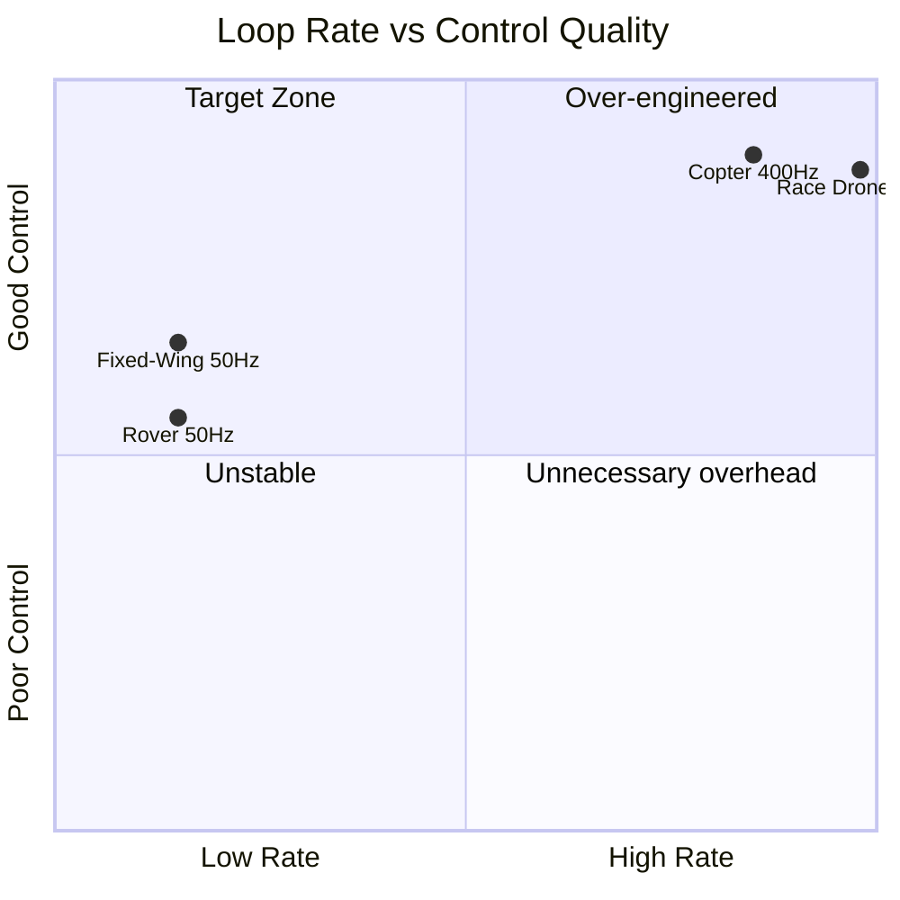
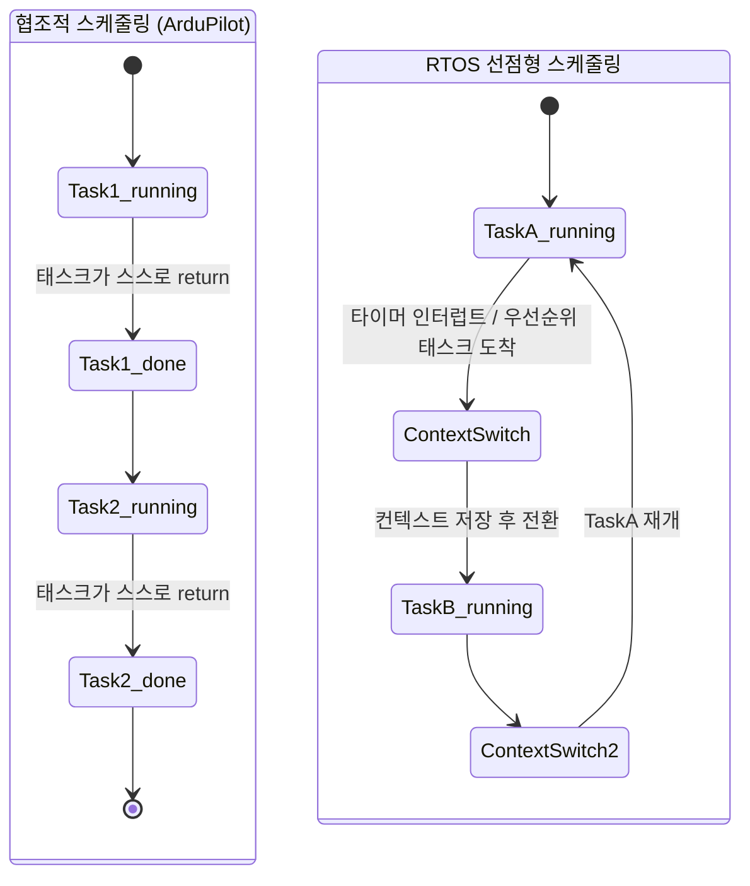
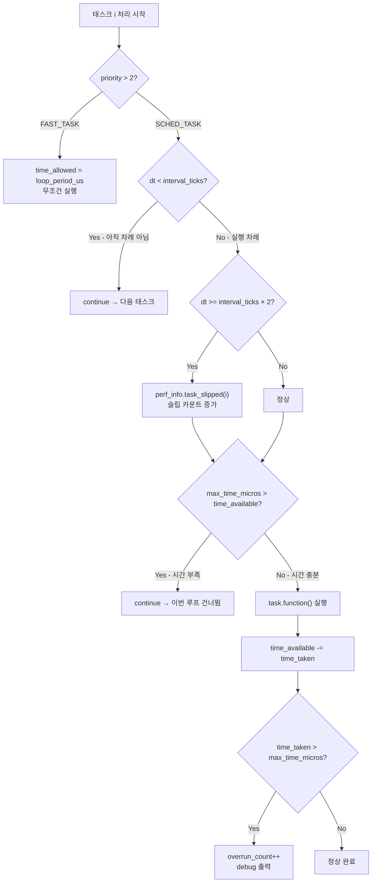

# CH8. 협조적 스케줄링과 실시간성

::: info 학습 목표
- 드론이 왜 400Hz(2.5ms) 루프를 필요로 하는지 나이퀴스트 직관으로 설명할 수 있다.
- 협조적 스케줄링과 RTOS 선점형 스케줄링의 차이를 설명할 수 있다.
- `run()` 내부에서 태스크를 건너뛰는 두 가지 조건(interval 미충족 / 시간 부족)을 코드로 확인할 수 있다.
- FAST_TASK가 시간 예산을 무시하고 무조건 실행되는 이유를 설명할 수 있다.
- `extra_loop_us`의 동적 조정 메커니즘을 설명할 수 있다.
- PerfInfo의 TaskInfo 구조체로 오버런·슬립 카운트를 추적하는 방법을 이해한다.
:::

## 1. 왜 드론은 400Hz 제어를 해야 하나

### 멀티콥터는 불안정한 플랫폼

고정익 항공기는 날개와 꼬리의 공력이 자세를 자연스럽게 복원한다. 외란이 와도 어느 정도 스스로 버틴다. 반면 멀티콥터(쿼드콥터 등)는 설계상 불안정하다. 4개의 프로펠러가 만드는 힘의 합이 중력 중심 위에서 균형을 맞춰야 하는데, 이 균형은 적극적인 제어 없이는 유지되지 않는다. 손을 놓으면 즉시 추락한다.

이 불안정성을 억제하려면 외란(돌풍, 프레임 진동, 모터 편차)이 발생한 뒤 최대한 빨리 보정력을 가해야 한다.

### 나이퀴스트 직관

나이퀴스트 정리에 따르면, 어떤 신호를 정확하게 샘플링·제어하려면 그 신호의 최고 주파수의 2배 이상으로 샘플링해야 한다.

드론 프레임의 구조적 공진은 보통 50~150Hz 범위에서 발생한다. 이것을 "보정한다"는 것은 공진 주파수 이상의 속도로 자이로 데이터를 읽고 모터 출력을 업데이트해야 한다는 뜻이다. 150Hz 진동을 제어하려면 300Hz 이상의 루프가 필요하다. 400Hz는 이 마진을 여유 있게 확보한다.



### PID D항의 정확성

PID의 D항(미분항)은 오차의 변화율을 본다.

```
D = Kd × (error_now - error_prev) / dt
```

`dt`가 클수록(루프가 느릴수록) 미분 계산이 부정확해진다. 빠른 외란을 놓치거나, 큰 `dt` 안에서 여러 번 발생한 움직임이 뭉개져서 하나의 숫자로 압축된다. 400Hz에서 `dt = 2.5ms`이므로 진동을 상당히 정밀하게 추적할 수 있다.

## 2. 협조적 스케줄링 vs RTOS 선점형 스케줄링

### 두 방식의 근본적 차이



| 항목 | 협조적 (ArduPilot) | 선점형 (RTOS) |
|------|-------------------|--------------|
| CPU 독점 | 태스크가 return할 때까지 | 타이머/우선순위 도착 시 강제 중단 |
| 컨텍스트 스위칭 | 없음 | 있음 (스택 저장·복원 오버헤드) |
| 뮤텍스 필요성 | 단일 실행 흐름이므로 불필요 | 공유 자원마다 락 필요 |
| 태스크 오래 걸리면 | 뒤 태스크 지연 | 선점되어 다른 태스크 실행 |
| 구현 복잡도 | 단순 | 복잡 |
| 결정론적 실행 | 루프 순서 보장 | 우선순위 역전 가능성 |

ArduPilot은 처음부터 RTOS를 사용하지 않는 설계를 선택했다. 단일 실행 흐름이 모든 태스크를 순서대로 호출하므로, 같은 변수를 두 태스크가 동시에 접근할 걱정이 없다. 컨텍스트 스위칭 오버헤드도 제로다.

단점은 하나의 태스크가 오래 걸리면 뒤따르는 태스크가 실행되지 못한다는 것이다. ArduPilot은 이 문제를 `max_time_micros`와 `time_available` 검사로 완화한다.

## 3. run()의 태스크 실행 로직

`AP_Scheduler::run()`은 vehicle_tasks와 common_tasks 두 배열을 우선순위 순서로 병합하면서 순회한다.

```cpp
void AP_Scheduler::run(uint32_t time_available)
{
    // ...
    for (uint8_t i=0; i<_num_tasks; i++) {
        // 두 테이블을 우선순위 기준으로 병합 선택
        // ...
        if (task.priority > MAX_FAST_TASK_PRIORITIES) {
            // ---- 일반 SCHED_TASK 처리 ----
            const uint16_t dt = _tick_counter - _last_run[i];
            uint32_t interval_ticks = _loop_rate_hz / task.rate_hz;
            if (dt < interval_ticks) {
                continue;  // 아직 실행 차례 아님
            }
            _task_time_allowed = task.max_time_micros;
            if (dt >= interval_ticks*2) {
                perf_info.task_slipped(i);   // 슬립 기록
            }
            if (_task_time_allowed > time_available) {
                continue;  // 시간 부족 → 건너뜀
            }
        } else {
            // ---- FAST_TASK 처리 ----
            _task_time_allowed = get_loop_period_us();  // 시간 예산 = 전체 루프 주기
        }
        // 실행
        task.function();
        // ...
        time_available -= time_taken;
    }
}
```

`(libraries/AP_Scheduler/AP_Scheduler.cpp:191-317)`

### interval_ticks 계산

400Hz 루프에서 50Hz 태스크의 interval_ticks는 다음과 같다.

```
interval_ticks = _loop_rate_hz / task.rate_hz = 400 / 50 = 8
```

즉 8 tick(= 8 루프 = 20ms)마다 한 번 실행된다. `dt = _tick_counter - _last_run[i]`가 8보다 작으면 `continue`로 건너뛴다.

10Hz 태스크라면 `400 / 10 = 40 tick`마다 실행된다. 이 계산 방식 덕분에 소수 주파수도 근사값으로 처리된다.

### 태스크 건너뛰기 두 가지 조건



`(AP_Scheduler.cpp:231-306)`

조건 1 — **interval 미충족**: `dt < interval_ticks`이면 아직 실행 차례가 아니다. `continue`로 넘어간다.

조건 2 — **시간 부족**: `max_time_micros > time_available`이면 이번 루프에서 실행할 시간이 없다. `continue`로 넘어간다. 이 경우 해당 태스크가 처리되지 않았으므로 다음 루프에서 `dt`가 더 커지고, 결국 `dt >= interval_ticks*2`가 되면 슬립으로 기록된다.

**FAST_TASK**는 이 두 조건 모두 적용받지 않는다. `priority <= MAX_FAST_TASK_PRIORITIES(=2)`인 경우 분기의 `else` 블록으로 진입하며, `time_available` 검사 없이 항상 실행된다 `(AP_Scheduler.cpp:260-262)`.

## 4. 오버런·슬립 감지와 PerfInfo

### PerfInfo::TaskInfo 구조체

```cpp
struct TaskInfo {
    uint16_t min_time_us;      // 최소 실행 시간
    uint16_t max_time_us;      // 최대 실행 시간
    uint32_t elapsed_time_us;  // 누적 실행 시간
    uint32_t tick_count;       // 실행 횟수
    uint16_t slip_count;       // 슬립 횟수 (interval*2 이상 지연)
    uint16_t overrun_count;    // 오버런 횟수 (max_time 초과)
};  // libraries/AP_Scheduler/PerfInfo.h:17
```

`run()`에서 태스크 실행 후 다음을 호출한다.

```cpp
uint32_t time_taken = now - _task_time_started;
bool overrun = false;
if (time_taken > _task_time_allowed) {
    overrun = true;
    // debug 메시지 출력
}
perf_info.update_task_info(i, time_taken, overrun);
```

`(AP_Scheduler.cpp:279-291)`

오버런은 `time_taken > _task_time_allowed`일 때 발생한다. 태스크가 약속한 시간을 넘겨 실행됐다는 뜻이다. 뒤따르는 태스크의 `time_available`이 줄어든다.

슬립은 `dt >= interval_ticks * 2`일 때 발생한다. 태스크가 제때 실행되지 못해 원래 주기의 2배 이상 지연됐다는 뜻이다 `(AP_Scheduler.cpp:245-246)`.

### PERF 메시지

`PerfInfo::update_logging()`은 GCS로 PERF 메시지를 전송한다.

```cpp
GCS_SEND_TEXT(MAV_SEVERITY_INFO,
    "PERF: %u/%u [%lu:%lu] F=%uHz sd=%lu Ex=%lu",
    get_num_long_running(),   // 느린 루프 횟수
    get_num_loops(),          // 총 루프 횟수
    get_max_time(),           // 최대 루프 시간(μs)
    get_min_time(),           // 최소 루프 시간(μs)
    get_filtered_loop_rate_hz(), // 실측 루프 주파수
    get_stddev_time(),        // 루프 시간 표준편차
    AP::scheduler().get_extra_loop_us()  // 현재 추가 예산
);
```

`(libraries/AP_Scheduler/PerfInfo.cpp:216-224)`

Mission Planner나 MAVProxy의 메시지 창에 `PERF: 0/400 [2500:2498] F=400Hz sd=1 Ex=0` 같은 줄이 보이면 400Hz에서 안정적으로 동작 중임을 의미한다.

## 5. extra_loop_us 동적 조정

CPU 과부하 상태에서 태스크가 반복적으로 건너뛰이면, ArduPilot은 루프마다 추가 시간 예산을 부여해 상황을 완화한다. 이것이 `extra_loop_us`다.

```cpp
// loop() 마지막 부분
if (task_not_achieved > 0) {
    // 태스크 하나 이상이 max_task_slowdown(=4) 이상 지연됨
    extra_loop_us = MIN(extra_loop_us + 100U, 5000U);  // 최대 5ms까지 100μs씩 증가
    task_not_achieved = 0;
    task_all_achieved = 0;
} else if (extra_loop_us > 0) {
    task_all_achieved++;
    if (task_all_achieved > 50) {
        // 50루프 연속으로 모든 태스크 정상 완료
        task_all_achieved = 0;
        extra_loop_us = MAX(0U, extra_loop_us - 50U);  // 50μs씩 감소
    }
}
```

`(libraries/AP_Scheduler/AP_Scheduler.cpp:406-421)`

`task_not_achieved`는 `run()` 내부에서 `dt >= interval_ticks * max_task_slowdown(=4)`인 태스크가 생길 때 증가한다. 즉 태스크가 원래 주기의 4배 이상 지연되면 CPU 과부하로 판단한다.

`extra_loop_us`는 `time_available`에 더해진다.

```cpp
time_available += extra_loop_us;
run(time_available);
```

`(AP_Scheduler.cpp:396-399)`

이 메커니즘은 루프 주파수를 낮추는 것이 아니라, 주어진 루프 안에서 더 많은 태스크가 실행되도록 예산을 늘려준다. 최대 5ms까지 추가 가능하므로, 2.5ms 루프에서는 최대 7.5ms 예산이 된다. 이 경우 실측 루프 속도(filtered_loop_rate_hz)가 400Hz 이하로 내려갈 수 있다.

## 6. 오버런 타임라인 시나리오

실제로 EKF 계산이 예상보다 오래 걸렸을 때 어떤 일이 일어나는지 시각화한다.

```mermaid
gantt
    title 400Hz 루프 1틱 (2500μs) - EKF 오버런 시나리오
    dateFormat x
    axisFormat %L μs
    section FAST_TASK
        IMU update (80μs)          : 0, 80
        Rate PID (120μs)           : 80, 200
        Motors output (50μs)       : 200, 250
        EKF (read_AHRS) 오버런     : crit, 250, 800
        read_inertia (60μs)        : 800, 860
        update_flight_mode (150μs) : 860, 1010
    section SCHED_TASK (time_available=1490μs)
        rc_loop 250Hz (130μs)      : 1010, 1140
        throttle_loop 50Hz (75μs)  : 1140, 1215
        GPS update 50Hz (200μs)    : 1215, 1415
        GCS receive (180μs)        : 1415, 1595
    section 남은 시간
        spare (905μs)              : done, 1595, 2500
```



EKF가 정상 예상(~400μs)보다 많이 걸려 550μs를 소비했다고 가정하면, `read_inertia` 이후 SCHED_TASK에게 남은 `time_available`이 줄어든다. 시간이 부족한 SCHED_TASK는 건너뛰어지고, 다음 루프에서 `slip_count`가 증가한다.

FAST_TASK인 EKF(`read_AHRS`)는 오버런 통계는 기록되지만 건너뛰이지는 않는다. FAST_TASK는 항상 실행된다.

::: tip 핵심 정리
- 멀티콥터는 본질적으로 불안정하며, 150Hz급 진동을 제어하려면 나이퀴스트 정리에 따라 300Hz 이상 루프가 필요하다. 400Hz는 이 마진을 여유 있게 확보한다.
- ArduPilot은 RTOS 없이 협조적 스케줄링을 사용한다. 각 태스크가 return할 때까지 CPU를 독점하며, 컨텍스트 스위칭 오버헤드와 공유 자원 락이 없다.
- `run()` 내부에서 SCHED_TASK는 두 조건(interval 미충족, 시간 부족)이 각각 독립적으로 건너뛰기를 결정한다.
- FAST_TASK(priority ≤ 2)는 두 조건 모두 적용받지 않고 루프마다 무조건 실행된다.
- PerfInfo::TaskInfo는 min/max/elapsed 실행 시간, slip_count, overrun_count를 태스크별로 추적한다. PERF 메시지로 GCS에 전송된다.
- CPU 과부하 시 `extra_loop_us`가 100μs씩 최대 5ms까지 증가해 태스크 실행 예산을 늘린다. 부하가 완화되면 50μs씩 감소한다.
:::

## 다음 챕터

[CH9. 센서 아키텍처](/study/ardupilot/09-sensor-architecture) — IMU·GPS·기압계·나침반 드라이버의 구조를 분석하고, 각 센서가 스케줄러와 어떻게 연계되는지 살펴본다.
