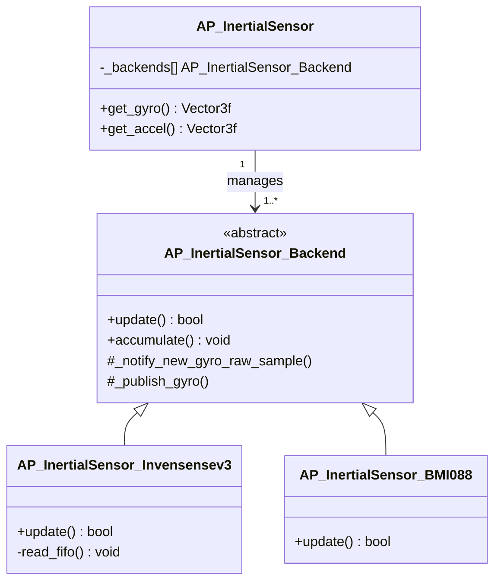
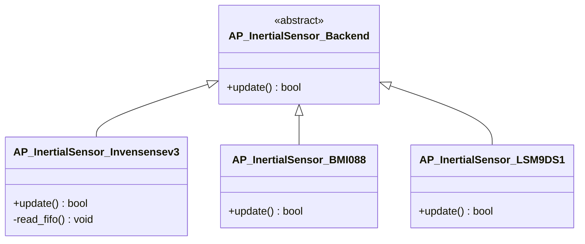

# CH9. 센서 드라이버 아키텍처

::: info 학습 목표
- 센서 드라이버를 Frontend/Backend로 나누는 이유를 설명할 수 있다.
- Frontend `AP_InertialSensor`가 싱글턴으로 상위 코드에 단일 API를 제공하는 구조를 이해한다.
- Backend의 순수 가상함수 계약(`update()`, `accumulate()`)을 코드로 확인할 수 있다.
- 칩별 드라이버가 Backend를 상속받아 `update()`를 구현하는 계층을 이해한다.
- 백엔드가 수집한 원시 샘플이 `_notify_new_*_raw_sample` → `_publish_*` 경로로 프론트엔드에 전달되는 흐름을 따라갈 수 있다.
- Baro·GPS도 동일한 Frontend/Backend 패턴을 따른다는 사실을 안다.
:::

## 1. 왜 Frontend/Backend로 나누나

### 상위 코드가 알아야 하는 것

비행 제어기(Copter, Plane 등)의 자세 추정 코드가 매 루프마다 필요로 하는 건 단 하나다. "지금 기체가 얼마나 빠르게 회전하고 있는가" — 즉 자이로 값이다. 이 코드는 자이로 값을 얻기 위해 다음 한 줄만 알면 된다.

```cpp
Vector3f gyro = ins.get_gyro();
```

상위 코드는 그 자이로 값이 InvenSense의 칩에서 왔는지, Bosch의 칩에서 왔는지, SPI로 읽었는지 I2C로 읽었는지 전혀 알 필요가 없다. 이렇게 "무엇을 제공하는가(인터페이스)"와 "어떻게 만드는가(구현)"를 분리하는 것이 Frontend/Backend 설계의 핵심이다.

- **Frontend**: 상위 코드가 보는 단일 창구. 칩 종류와 무관한 추상 API를 제공한다.
- **Backend**: 실제 칩과 대화하는 계층. 레지스터를 읽고 버스를 다룬다.

### 새 칩 추가가 쉬워진다

새로운 IMU 칩을 지원해야 한다고 하자. Frontend/Backend가 분리돼 있으면 새 칩을 위한 Backend 클래스 하나만 추가하면 된다. 상위 비행 제어 코드는 한 줄도 바뀌지 않는다. 칩의 차이는 전부 Backend 안에 캡슐화돼 있기 때문이다.

### 멀티 인스턴스를 투명하게 관리한다

상용 드론은 신뢰성을 위해 IMU를 2~3개 탑재한다. 하나가 진동으로 망가져도 다른 IMU로 비행을 유지하기 위해서다. Frontend는 이 여러 개의 백엔드를 내부 배열로 관리하고, 상위 코드에는 마치 하나의 센서처럼 보이게 한다. 상위 코드는 "주(primary) 자이로 값"만 요청하면 되고, 어느 물리 칩이 주로 선택됐는지는 Frontend가 알아서 결정한다.



## 2. Frontend: AP_InertialSensor

Frontend 클래스는 `AP_InertialSensor`다.

```cpp
class AP_InertialSensor : AP_AccelCal_Client
```
(libraries/AP_InertialSensor/AP_InertialSensor.h:50)

이 객체는 싱글턴이다. 시스템 전체에 IMU Frontend는 단 하나만 존재하고, 상위 코드는 항상 이 객체를 통해서만 관성 센서에 접근한다. 자세 추정·제어 어디서든 동일한 `ins` 객체를 호출하므로, 센서 접근 지점이 한 곳으로 모인다.

### get_gyro() / get_accel()

상위 코드가 쓰는 두 가지 핵심 API다.

```cpp
const Vector3f &get_gyro(void) const
```
(libraries/AP_InertialSensor/AP_InertialSensor.h:111)

```cpp
const Vector3f &get_accel(void) const
```
(libraries/AP_InertialSensor/AP_InertialSensor.h:134)

두 함수 모두 `Vector3f`(x, y, z 3축 벡터)를 반환한다. `get_gyro()`는 각속도(rad/s), `get_accel()`은 가속도(m/s²)다. 반환형이 `const &`인 점에 주목하자. 매 호출마다 값을 새로 계산하는 게 아니라, Frontend 내부에 이미 확정돼 저장된 값을 참조로 돌려준다. 즉 이 함수는 "센서를 읽는" 함수가 아니라 "이미 읽혀서 가공된 값을 꺼내는" 함수다. 실제 칩 읽기는 Backend가 별도로 수행한다.

### 내부에 백엔드 배열을 보유한다

Frontend는 내부에 `_backends[]` 배열을 들고 있다. 부팅 시점에 보드에 연결된 IMU 칩들을 탐지하고, 각 칩에 맞는 Backend 객체를 생성해 이 배열에 등록한다. 이후 Frontend의 `update()`가 호출될 때마다, 배열의 모든 백엔드를 순회하며 각 백엔드의 `update()`를 호출한다. 이렇게 멀티 인스턴스가 하나의 Frontend 뒤로 숨는다.

## 3. Backend 가상함수 계약

Backend의 기반 클래스는 `AP_InertialSensor_Backend`다.

```cpp
class AP_InertialSensor_Backend
```
(libraries/AP_InertialSensor/AP_InertialSensor_Backend.h:39)

이 클래스는 모든 IMU 칩 드라이버가 따라야 하는 **계약(contract)**을 순수 가상함수로 정의한다. 계약이란 "이 함수들을 반드시 구현하라"는 약속이다. Frontend는 구체적인 칩이 뭔지 몰라도, 이 계약만 믿고 백엔드를 호출할 수 있다.

### update() — 순수 가상함수

```cpp
virtual bool update() = 0; /* front end */
```
(libraries/AP_InertialSensor/AP_InertialSensor_Backend.h:54)

`= 0`이 붙은 순수 가상함수다. 기반 클래스에는 구현이 없고, 상속받는 칩 드라이버가 **반드시** 구현해야 한다. 구현하지 않으면 그 클래스는 인스턴스화조차 되지 않는다. 주석의 `/* front end */`는 이 함수가 Frontend 컨텍스트(메인 루프)에서 호출된다는 뜻이다. `update()`는 그동안 백엔드가 모아둔 데이터를 Frontend의 출력 버퍼로 확정(publish)하는 역할을 한다.

### accumulate() — 빈 기본 구현 가상함수

```cpp
virtual void accumulate() {}
```
(libraries/AP_InertialSensor/AP_InertialSensor_Backend.h:68)

이쪽은 `= 0`이 없는 일반 가상함수이고, 기본 구현이 빈 본문 `{}`이다. 즉 구현이 **선택**이다. 필요한 칩만 오버라이드하면 되고, 필요 없는 칩은 무시해도 컴파일된다. `accumulate()`는 보통 메인 루프와 별개로 센서 샘플을 누적할 때 쓰인다.

여기서 순수 가상함수와 기본 구현 가상함수의 설계 의도 차이가 드러난다. `update()`처럼 모든 칩이 반드시 해야 하는 일은 순수 가상함수로 강제하고, `accumulate()`처럼 칩에 따라 선택적인 일은 빈 기본 구현으로 둔다.

### 같은 패턴: Baro와 GPS

이 가상함수 계약 패턴은 IMU만의 것이 아니다. 다른 센서 백엔드도 똑같다.

```cpp
class AP_Baro_Backend
// ...
virtual void update() = 0;
```
(libraries/AP_Baro/AP_Baro_Backend.h:5, libraries/AP_Baro/AP_Baro_Backend.h:13)

```cpp
class AP_GPS_Backend
// ...
virtual bool read() = 0;
```
(libraries/AP_GPS/GPS_Backend.h:49, libraries/AP_GPS/GPS_Backend.h:61)

기압계(Baro)는 `update()`, GPS는 `read()`라는 이름으로 순수 가상함수 계약을 둔다. 함수 이름만 센서 특성에 맞게 다를 뿐, "기반 클래스가 계약을 선언하고 칩 드라이버가 구현한다"는 구조는 완전히 동일하다.

## 4. 칩별 드라이버 계층

`AP_InertialSensor_Backend`는 추상 기반 클래스다. 실제로 칩과 대화하는 코드는 이걸 상속받은 칩별 드라이버에 들어간다.



예를 들어 InvenSense의 ICM-42688 계열 칩은 `AP_InertialSensor_Invensensev3` 드라이버가 담당하고, Bosch의 BMI088 칩은 `AP_InertialSensor_BMI088` 드라이버가 담당한다. 각 드라이버는 다음을 안다.

- 칩 고유의 레지스터 주소와 초기화 시퀀스
- 통신 버스(SPI vs I2C)와 클럭 설정
- FIFO(센서 내부 버퍼) 구조와 데이터 포맷

그리고 각 드라이버는 `update()`를 자기 칩에 맞게 구현한다. InvenSensev3 드라이버라면 FIFO에서 샘플을 읽어들이는 `read_fifo()` 같은 내부 함수를 호출하고, 거기서 얻은 원시 데이터를 다음 절의 경로로 Frontend에 넘긴다. 이 모든 칩 의존적 디테일이 드라이버 안에 갇혀 있기 때문에, Frontend와 상위 코드는 깨끗하게 유지된다.

## 5. 백엔드 → 프론트엔드 데이터 전달

이제 핵심 질문이다. 백엔드가 칩에서 읽은 숫자가 어떻게 `get_gyro()`로 나오는가. 두 단계로 나뉜다. **(1) 원시 샘플 통지**와 **(2) 확정(publish)**이다.

### (1) 원시 샘플 통지

칩 드라이버가 FIFO에서 새 샘플을 읽으면, 기반 클래스가 제공하는 헬퍼 함수로 그 샘플을 Frontend 쪽에 통지한다.

```cpp
void _notify_new_gyro_raw_sample(uint8_t instance,
                                 const Vector3f &accel,
                                 uint64_t sample_us=0)
```
(libraries/AP_InertialSensor/AP_InertialSensor_Backend.h:212)

```cpp
void _notify_new_accel_raw_sample(uint8_t instance,
                                  const Vector3f &accel,
                                  uint64_t sample_us=0,
                                  bool fsync_set=false)
```
(libraries/AP_InertialSensor/AP_InertialSensor_Backend.h:226)

`instance`는 몇 번째 IMU인지(0, 1, 2…), `sample_us`는 샘플이 찍힌 시각이다. 이 함수들은 보통 **타이머 인터럽트(또는 고속 백그라운드 스레드)** 안에서 호출된다. 칩의 샘플 주파수(수 kHz)는 메인 루프 주파수(수백 Hz)보다 훨씬 높기 때문에, 메인 루프를 기다리지 않고 인터럽트가 부지런히 샘플을 받아 누적한다.

### 필터 적용

원시 샘플은 그대로 쓰지 않는다. 모터·프레임 진동이 섞인 노이즈를 걸러내야 한다. 그래서 통지 경로 중간에 필터가 적용된다.

```cpp
void apply_gyro_filters(const uint8_t instance, const Vector3f &gyro)
```
(libraries/AP_InertialSensor/AP_InertialSensor_Backend.h:203)

여기서 로우패스 필터, 노치 필터 등이 적용돼 진동 성분이 제거된 깨끗한 자이로 값이 만들어진다.

### (2) 확정(publish)

인터럽트가 누적·필터링한 값은 아직 Frontend의 공개 버퍼에 들어가지 않은 "중간 상태"다. 이 값을 상위 코드가 읽을 수 있는 최종 값으로 확정하는 단계가 publish다.

```cpp
void _publish_gyro(uint8_t instance, const Vector3f &gyro)
```
(libraries/AP_InertialSensor/AP_InertialSensor_Backend.h:200)

```cpp
void _publish_accel(uint8_t instance, const Vector3f &accel)
```
(libraries/AP_InertialSensor/AP_InertialSensor_Backend.h:218)

`_publish_gyro`/`_publish_accel`는 칩 드라이버의 `update()` 안에서(즉 메인 루프 컨텍스트에서) 호출된다. 이 함수가 호출되고 나서야 `get_gyro()`/`get_accel()`이 반환하는 값이 갱신된다. 이렇게 "인터럽트는 모으고, 메인 루프가 확정한다"는 분리 덕분에, 상위 코드는 루프 한 사이클 동안 일관된 센서 값을 본다. 값이 읽는 도중에 바뀌어 찢어지는(tearing) 일을 막는다.

```mermaid
flowchart LR
    A["IMU 칩 하드웨어<br>(ICM-42688 등)"] -->|SPI / I2C| B["Backend 드라이버<br>read_fifo()"]
    B --> C["_notify_new_gyro<br>_raw_sample()"]
    C --> D["apply_gyro_filters()<br>(노이즈 제거)"]
    D --> E["인터럽트 누적 버퍼"]
    E -->|메인 루프 update()| F["_publish_gyro()"]
    F --> G["Frontend 출력 버퍼"]
    G -->|get_gyro()| H["비행 제어<br>(자세 추정·PID)"]
```

이 흐름을 한 문장으로 요약하면 이렇다. **칩이 SPI/I2C로 원시 샘플을 내보내면, 백엔드가 인터럽트에서 받아 필터링해 누적하고, 메인 루프의 `update()`가 그것을 publish해 Frontend 버퍼에 확정하며, 상위 코드는 `get_gyro()`로 그 확정값을 꺼내 비행 제어에 쓴다.**

## 6. GPS와 Baro도 같은 패턴

3절에서 봤듯이 Baro·GPS 백엔드도 순수 가상함수 계약을 갖는다. 데이터 흐름의 큰 그림도 IMU와 같다.

- **Baro**: `AP_Baro`(Frontend) ← `AP_Baro_Backend`(추상) ← 칩별 드라이버(MS5611 등). 칩 드라이버가 `update()`로 기압·온도를 읽어 Frontend에 넘기고, 상위 고도 추정 코드는 Frontend API만 호출한다.
- **GPS**: `AP_GPS`(Frontend) ← `AP_GPS_Backend`(추상) ← 프로토콜별 드라이버(u-blox, NMEA 등). 드라이버가 `read()`로 위성 메시지를 파싱해 위치를 채운다.

세 센서 모두 "Frontend 싱글턴 + Backend 추상 계약 + 칩별 구현"이라는 같은 골격을 공유한다. 이 일관성 덕분에 ArduPilot은 수십 종의 센서 칩을 지원하면서도 상위 코드를 깨끗하게 유지한다. 한 패턴을 이해하면 나머지 센서 코드도 같은 눈으로 읽을 수 있다.

::: tip 핵심 정리
- 센서 드라이버는 **Frontend(추상 API)**와 **Backend(칩 구현)**로 분리된다. 상위 코드는 Frontend만 호출하고 칩 종류를 모른다.
- `AP_InertialSensor`는 싱글턴 Frontend로, `get_gyro()`/`get_accel()`로 확정된 센서 값을 참조 반환한다. 내부에 `_backends[]` 배열로 멀티 인스턴스를 관리한다.
- `AP_InertialSensor_Backend`는 `update()`(순수 가상, 필수)와 `accumulate()`(빈 기본 구현, 선택)로 칩 드라이버 계약을 정의한다.
- 칩별 드라이버(`AP_InertialSensor_Invensensev3`, `AP_InertialSensor_BMI088` 등)가 이 백엔드를 상속해 `update()`를 구현한다.
- 데이터는 `_notify_new_*_raw_sample`(인터럽트에서 통지·필터링) → `_publish_*`(메인 루프에서 확정) 두 단계로 Frontend에 전달된다.
- Baro(`update()`), GPS(`read()`)도 동일한 Frontend/Backend 패턴을 따른다.
:::

## 다음 챕터

다음 챕터에서는 IMU 자체를 더 깊이 파고든다. 가속도계와 자이로스코프가 물리적으로 어떻게 동작하는지, 그리고 ArduPilot이 이 두 센서를 어떻게 캘리브레이션하고 융합하는지 살펴본다.

→ [CH10. IMU: 가속도계와 자이로스코프](/study/ardupilot/10-imu)
