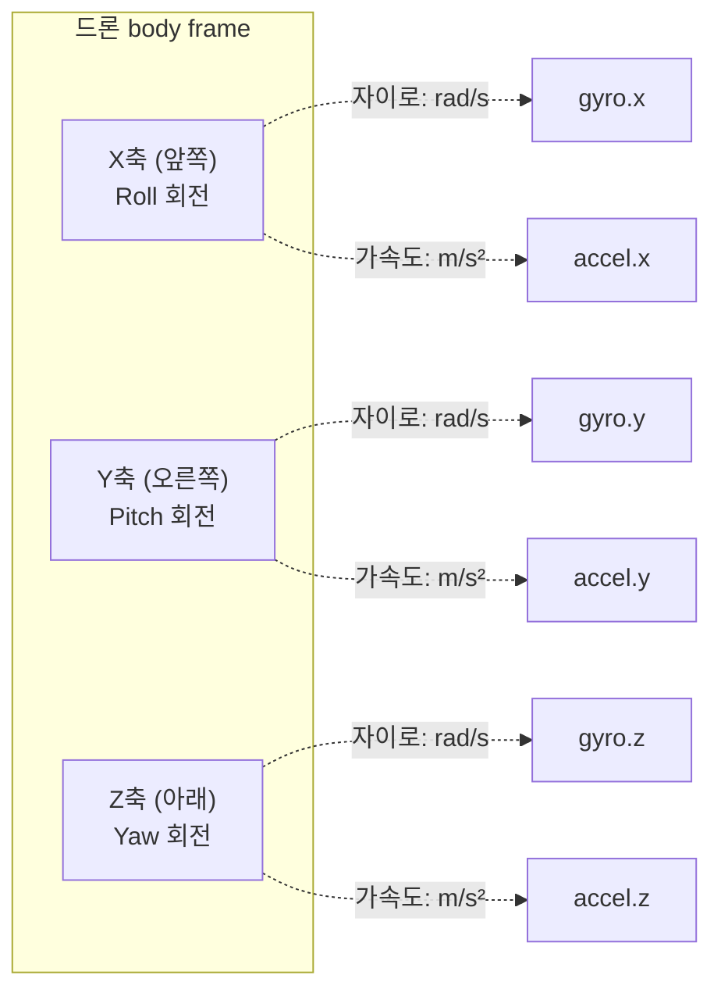
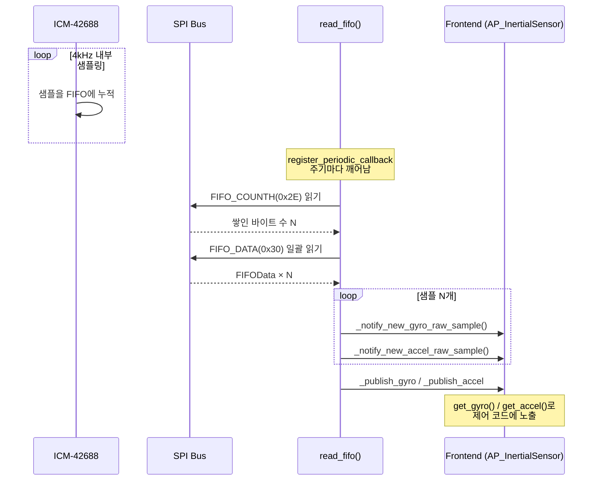
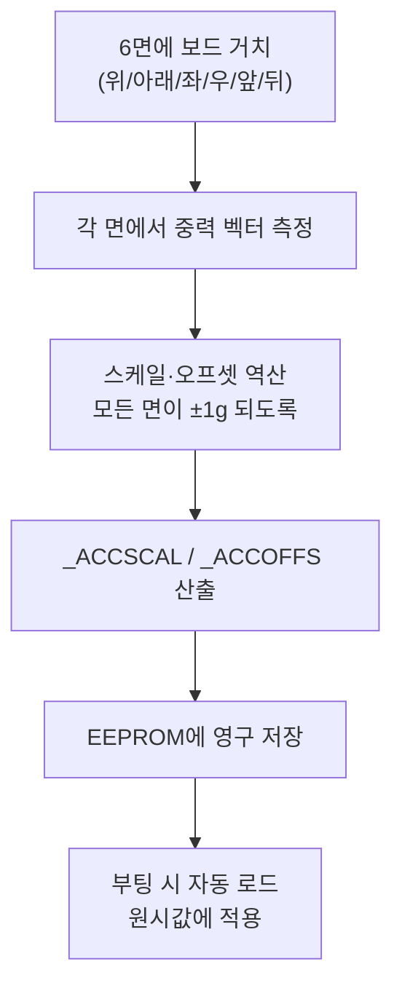

# CH10. IMU 기초

::: info 학습 목표
- 자이로스코프와 가속도계가 각각 무엇을 측정하고, 왜 둘 다 필요한지 직관적으로 이해한다.
- ArduPilot 프론트엔드가 노출하는 `get_gyro()` / `get_accel()` API와 `Vector3f` 반환 구조를 코드로 확인한다.
- ArduPilot이 지원하는 IMU 칩을 `DevTypes` enum 기준으로 구분한다.
- FIFO 배치 샘플링이 CPU 부담을 어떻게 줄이는지, `read_fifo()`가 SPI로 데이터를 일괄 수집하는 흐름을 따라간다.
- 가속도계 6면 캘리브레이션과 `_ACCSCAL`·`_ACCOFFS` 파라미터의 의미를 안다.
:::

## IMU란 무엇인가

IMU(Inertial Measurement Unit, 관성 측정 장치)는 드론이 "지금 내가 어떤 자세로, 얼마나 빠르게 돌고 있는가"를 스스로 아는 감각 기관이다. 사람으로 치면 눈을 감고도 몸이 기울었는지, 빙글 도는지 느끼는 평형 감각(전정 기관)에 해당한다. IMU는 두 가지 센서로 구성된다.

**자이로스코프(gyroscope)** 는 각속도를 측정한다. 단위는 rad/s(라디안/초)다. 몸체가 어느 축을 기준으로 얼마나 빠르게 회전하고 있는지를 알려준다. 가만히 있으면 0에 가깝고, 빠르게 돌면 큰 값이 나온다. 자이로는 "회전 속도"를 직접 재기 때문에 짧은 시간 동안의 자세 변화는 매우 정확하다. 다만 이 값을 시간에 대해 적분해서 각도를 얻으려 하면, 작은 오차가 계속 누적되는 드리프트(drift)가 생긴다. 1초 뒤엔 거의 안 보이지만 1분 뒤엔 몇 도씩 틀어진다.

**가속도계(accelerometer)** 는 가속도를 측정한다. 단위는 m/s²다. 핵심은 가속도계가 항상 중력(약 9.81 m/s²)을 함께 잰다는 점이다. 드론이 가만히 있을 때 가속도계는 "아래쪽으로 1g"을 가리킨다. 이 중력 벡터의 방향을 보면 기체가 얼마나 기울었는지(roll, pitch)를 절대 기준으로 알 수 있다. 즉 가속도계는 장기적으로 흔들리지 않는 참조점을 준다. 단점은 드론이 가속하거나 모터가 진동하면 그 가속도까지 섞여 들어와, 순간적으로는 신뢰하기 어렵다는 것이다.

::: tip 두 센서는 상보적이다
- 자이로: 단기적으로 정확하지만 시간이 지나면 드리프트한다.
- 가속도계: 장기적으로 중력 기준을 주지만 진동·가속에 취약하다.
- 그래서 둘을 융합한다. 자이로로 빠른 변화를 따라가고, 가속도계로 천천히 보정한다. 이 융합은 뒤 챕터의 EKF/AHRS가 담당한다.
:::

GPS는 "어디에 있는가(위치)"만 알려준다. 그것도 1~10Hz 정도로 느리고, 실내나 신호 음영에서는 끊긴다. 반면 IMU는 외부 기준 없이 초당 수백~수천 회 자세를 측정한다. 멀티콥터처럼 본질적으로 불안정한 기체는 이 빠른 자세 정보 없이는 1초도 떠 있을 수 없다. IMU가 드론 비행 제어의 가장 안쪽 루프를 떠받치는 이유다.

자이로와 가속도계는 모두 기체에 고정된 좌표계(body frame)의 X·Y·Z 세 축을 기준으로 값을 낸다.



ArduPilot은 NED 계열 body frame을 쓴다. X는 기체 앞쪽, Y는 오른쪽, Z는 아래쪽을 향한다. 각 축 둘레의 회전이 각각 roll(X), pitch(Y), yaw(Z)다.

## 프론트엔드 API

상위 비행 제어 코드는 어떤 칩이 달렸는지 신경 쓰지 않는다. `AP_InertialSensor` 싱글턴이 노출하는 단순한 게터만 호출한다. 가장 많이 쓰이는 두 함수가 자이로와 가속도 값을 읽는다.

```cpp
// libraries/AP_InertialSensor/AP_InertialSensor.h:110
const Vector3f &get_gyro(uint8_t i) const { return _gyro[i]; }
const Vector3f &get_gyro(void) const { return get_gyro(_first_usable_gyro); }
// :133
const Vector3f &get_accel(uint8_t i) const { return _accel[i]; }
const Vector3f &get_accel(void) const { return get_accel(_first_usable_accel); }
```

인자 없는 버전은 `_first_usable_gyro` / `_first_usable_accel`, 즉 현재 사용 중인 기본 IMU 인스턴스의 값을 돌려준다. 대부분의 제어 코드는 이 인자 없는 버전을 쓴다. 반환 타입은 `Vector3f`로, X·Y·Z 세 축을 담은 32비트 float 3개짜리 벡터다. `get_gyro()`는 rad/s, `get_accel()`은 m/s² 단위다.

샘플레이트가 필요하면 다음을 쓴다. 이 값은 노치 필터 설계나 로그 분석에서 실제로 센서가 몇 Hz로 도는지 확인할 때 중요하다.

```cpp
// libraries/AP_InertialSensor/AP_InertialSensor.h:156
uint16_t get_gyro_rate_hz(uint8_t instance) const {
    return uint16_t(_gyro_raw_sample_rates[instance] * _gyro_over_sampling[instance]);
}
```

원시 샘플레이트에 오버샘플링 배수를 곱한 값이다. 칩이 내부적으로 더 빠르게 샘플링하고 여러 개를 평균 내는 경우, 실제 유효 레이트가 이 값으로 계산된다.

대부분의 비행 컨트롤러 보드는 IMU를 2~3개 탑재한다. 하나가 고장 나거나 진동으로 오염돼도 다른 IMU로 넘어가기 위해서다. 인스턴스 개수는 다음으로 확인한다.

```cpp
// libraries/AP_InertialSensor/AP_InertialSensor.h:141
uint8_t get_gyro_count(void) const { return MIN(INS_MAX_INSTANCES, _gyro_count); }
```

`INS_MAX_INSTANCES`로 상한을 두어, 감지된 개수가 그보다 많아도 안전하게 잘라낸다. 멀티 IMU의 융합·페일오버 로직은 별도 챕터에서 다룬다. 여기서는 "프론트엔드가 인덱스로 여러 IMU를 균일하게 노출한다"는 점만 짚는다.

## 지원 칩 목록

ArduPilot은 수십 종의 IMU 칩을 지원한다. 각 칩은 백엔드 드라이버가 자신의 종류를 식별하기 위한 고유한 `DevType` 값을 가진다. 이 값은 로그와 파라미터에 기록되어, 나중에 "이 비행에서 어떤 센서가 쓰였는가"를 추적할 수 있게 한다.

```cpp
// libraries/AP_InertialSensor/AP_InertialSensor_Backend.h:142
DEVTYPE_ACC_MPU6000 = 0x13,
DEVTYPE_GYR_MPU6000 = 0x21,
DEVTYPE_INS_BMI088  = 0x2B,
DEVTYPE_INS_ICM42688 = 0x34,
DEVTYPE_BMI270      = 0x38,
```

흥미로운 점은 구형 MPU-6000은 가속도계(`0x13`)와 자이로(`0x21`)에 별도 DevType이 있다는 것이다. 초창기 칩은 두 센서를 논리적으로 따로 다뤘기 때문이다. 반면 최신 칩은 `DEVTYPE_INS_*` 하나로 통합되어 있다. 아래는 대표적인 칩들이다.

| 칩 이름 | 제조사 | DevType 값 | 비고 |
|--------|--------|-----------|------|
| MPU-6000 | Invensense | 0x13(가속도)/0x21(자이로) | 구형, 널리 사용 |
| ICM-42688 | Invensense | 0x34 | 고성능, 최신 |
| ICM-42605 | Invensense | 0x35 | |
| ICM-42670 | Invensense | 0x3A | |
| ICM-45686 | Invensense | 0x3B | 고해상도 |
| IIM-42652 | Invensense | 0x37 | 산업용 |
| ICM-20948 | Invensense | 0x2C | 9축(자력계 포함) |
| BMI088 | Bosch | 0x2B | 진동에 강인 |
| BMI270 | Bosch | 0x38 | |
| LSM6DSV | ST Micro | 0x3E | |
| ASM330 | ST Micro | 0x3F | |
| ADIS16607 | Analog | 0x40 | 고정밀 |

제조사별로 성격이 다르다. Invensense(현 TDK) 계열은 가성비와 성능 균형이 좋아 가장 널리 쓰이고, Bosch의 BMI088은 진동 환경에서 강인해 산업용·대형기에 자주 채택된다. Analog Devices의 ADIS 계열은 고가지만 정밀도가 뛰어나 측량·매핑용 기체에 들어간다. 핵심은 이 모든 칩이 같은 백엔드 인터페이스를 구현하므로, 프론트엔드와 제어 코드는 차이를 전혀 몰라도 된다는 점이다.

## FIFO 배치 샘플링

여기서부터가 임베디드 구현의 묘미다. 최신 IMU는 4kHz 이상으로 샘플링한다. 만약 칩이 샘플 하나 만들 때마다 MCU에 인터럽트를 걸어 한 번씩 SPI로 읽어가게 한다면, MCU는 초당 수천 번 인터럽트 처리로 마비될 것이다. 컨텍스트 스위칭과 SPI 트랜잭션 오버헤드만으로 CPU가 녹는다.

해결책이 **FIFO(First In First Out) 버퍼** 다. 칩이 내부 메모리에 샘플을 차곡차곡 쌓아두고, MCU는 한가할 때 주기적으로 와서 쌓인 것을 한꺼번에 퍼간다. 인터럽트 횟수가 수천 분의 1로 줄고, 한 번의 SPI 트랜잭션으로 수십 개 샘플을 가져오니 버스 효율도 크게 오른다.

ArduPilot은 이 "주기적으로 와서 퍼가기"를 디바이스 버스 스레드의 콜백으로 등록한다.

```cpp
// libraries/AP_InertialSensor/AP_InertialSensor_Invensensev3.cpp:432
periodic_handle = dev->register_periodic_callback(backend_period_us,
    FUNCTOR_BIND_MEMBER(&AP_InertialSensor_Invensensev3::read_fifo, void));
```

`backend_period_us` 주기마다 `read_fifo()`가 자동 호출된다. 이 콜백은 비행 제어 메인 루프가 아니라 별도의 버스 스레드에서 돌기 때문에, FIFO를 읽느라 제어 루프가 멈추는 일이 없다.

SPI로 칩의 레지스터를 읽을 때는 약속된 규칙이 있다. 주소의 최상위 비트(MSB)가 1이면 읽기, 0이면 쓰기다.

```cpp
// libraries/AP_InertialSensor/AP_InertialSensor_Invensensev3.cpp:43
#define BIT_READ_FLAG 0x80
...
// FIFO를 읽기 직전, 레지스터 주소에 읽기 플래그를 OR
tfr_buffer[0] = reg_data | BIT_READ_FLAG;
```

`0x80`은 이진수로 `1000_0000`이다. 레지스터 주소에 이 값을 OR하면 MSB가 1로 세팅되어 칩이 "이건 읽기 요청"으로 해석한다. `read_fifo()`는 먼저 `FIFO_COUNTH`(0x2E) 레지스터를 읽어 지금 FIFO에 몇 바이트가 쌓여 있는지 확인하고, 그만큼을 `FIFO_DATA`(0x30)에서 일괄로 읽어온다.

```cpp
// libraries/AP_InertialSensor/AP_InertialSensor_Invensensev3.cpp:59
#define INV3REG_FIFO_COUNTH  0x2e
#define INV3REG_FIFO_DATA    0x30
```

읽어온 바이트 스트림은 고정된 레이아웃의 샘플 구조체가 연달아 붙어 있는 형태다. 한 샘플의 구조는 다음과 같다.

```cpp
// libraries/AP_InertialSensor/AP_InertialSensor_Invensensev3.cpp:153
struct PACKED FIFOData {
    uint8_t header;
    int16_t accel[3];
    int16_t gyro[3];
    int8_t temperature;
    uint16_t timestamp;
};
```

`PACKED` 속성이 중요하다. 컴파일러가 정렬용 패딩을 넣지 않게 해서, 구조체의 메모리 배치가 칩이 보낸 바이트 순서와 정확히 일치하게 만든다. 덕분에 읽어온 버퍼를 `FIFOData*`로 캐스팅하기만 하면 가속도 3축·자이로 3축·온도·타임스탬프가 바로 필드로 풀린다. 별도 파싱 코드가 거의 필요 없다.

전체 흐름을 시퀀스로 보면 이렇다.



백엔드는 FIFO에서 꺼낸 샘플 하나하나를 `_notify_new_gyro_raw_sample()` 같은 함수로 프론트엔드에 밀어 넣는다. 이 단계에서 노치 필터·다운샘플링이 적용된다(다음 챕터 주제). 마지막으로 `_publish_gyro` / `_publish_accel`이 최종 값을 `_gyro[]` / `_accel[]` 배열에 반영하면, 비로소 제어 코드가 `get_gyro()`로 읽을 수 있게 된다.

## 가속도계 캘리브레이션

공장에서 막 나온 MEMS 가속도계는 완벽하지 않다. 똑같이 1g을 받아도 X축은 9.79, Y축은 9.84처럼 축마다 미세하게 다른 값을 낸다(스케일 오차). 또 아무 가속도가 없어도 0이 아닌 값이 깔려 있기도 하다(오프셋 오차). 보정하지 않으면 드론은 평평한 바닥에서도 자기가 살짝 기울었다고 착각해 한쪽으로 흐른다.

ArduPilot은 두 종류의 보정값을 축별로 저장한다. 측정된 원시값에 `보정값 = (원시값 - 오프셋) × 스케일` 형태의 변환을 적용한다.

```cpp
// libraries/AP_InertialSensor/AP_InertialSensor.cpp:211
AP_GROUPINFO("_ACCSCAL", 12, AP_InertialSensor, _accel_scale_old_param[0], 1.0),
// :236
AP_GROUPINFO("_ACCOFFS", 13, AP_InertialSensor, _accel_offset_old_param[0], 0),
```

`_ACCSCAL`은 스케일 팩터로 기본값이 1.0(보정 없음)이고, `_ACCOFFS`는 오프셋으로 기본값이 0이다. 두 값 모두 `Vector3f`라서 X·Y·Z 각 축에 대해 따로 저장된다.

이 값들은 어떻게 구하는가? **6면 캘리브레이션** 으로 구한다. 사용자가 드론(또는 보드)을 정확히 6개 방향—윗면, 아랫면, 좌·우 옆면, 앞·뒤 면—으로 차례차례 평평하게 놓는다. 각 자세에서는 중력이 특정 한 축에만 +1g 또는 -1g로 걸려야 한다. ArduPilot은 6면에서 측정된 실제 값들을 모아, 어떤 스케일과 오프셋을 적용해야 모든 면에서 정확히 ±9.81이 나오는지를 역산한다.



`AP_GROUPINFO` 매크로로 등록된 파라미터는 단순한 변수가 아니다. 이 매크로가 파라미터를 비휘발성 저장소(EEPROM/플래시)에 매핑하므로, 한 번 캘리브레이션하면 전원을 꺼도 값이 유지된다. 다음 부팅 때 자동으로 로드되어 모든 가속도 읽기에 적용된다. 사용자가 매번 다시 캘리브레이션할 필요가 없는 이유다.

::: warning 진동과 온도는 별개 문제
6면 캘리브레이션은 정적인 스케일·오프셋 오차만 잡는다. 모터가 만드는 고주파 진동이 가속도계를 오염시키는 문제, 그리고 칩 온도가 변하면 바이어스가 흐르는 문제는 이것으로 해결되지 않는다. 진동을 걸러내는 노치 필터와 온도 보정은 다음 챕터에서 다룬다.
:::

::: tip 핵심 정리
- IMU는 자이로스코프(각속도, rad/s)와 가속도계(가속도, m/s²)로 구성된다. 자이로는 단기 정확·장기 드리프트, 가속도계는 중력 기준 제공·진동 취약으로 서로 상보적이다.
- 프론트엔드 `AP_InertialSensor`는 `get_gyro()` / `get_accel()`로 `Vector3f`(X·Y·Z) 값을, `get_gyro_rate_hz()`로 실제 샘플레이트를, `get_gyro_count()`로 멀티 IMU 인스턴스 수를 노출한다.
- 각 IMU 칩은 고유한 `DevType` 값으로 식별된다. 구형 MPU-6000은 가속도(0x13)·자이로(0x21)가 분리, 최신 칩은 `DEVTYPE_INS_*` 하나로 통합된다.
- FIFO 배치 샘플링은 칩이 샘플을 내부에 쌓고 MCU가 일괄로 읽어가는 방식으로 인터럽트 부담을 줄인다. `register_periodic_callback`이 `read_fifo()`를 주기 호출하고, `BIT_READ_FLAG(0x80)`로 SPI 읽기를 표시한 뒤 `PACKED FIFOData` 구조체로 파싱한다.
- 가속도계는 6면 캘리브레이션으로 `_ACCSCAL`(스케일, 기본 1.0)·`_ACCOFFS`(오프셋, 기본 0)를 축별로 구해 EEPROM에 영구 저장한다.
:::

## 다음 챕터

[CH11. 진동 필터링](/study/ardupilot/11-vibration-filtering) — 모터 진동이 IMU를 오염시키는 문제를 다룬다. 노치 필터로 특정 주파수를 제거하고, 온도 변화에 따른 바이어스를 보정하는 ArduPilot의 신호 처리 파이프라인을 분석한다.
