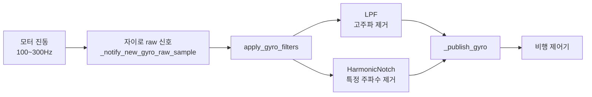
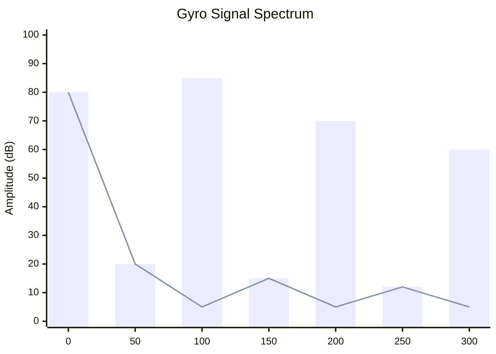
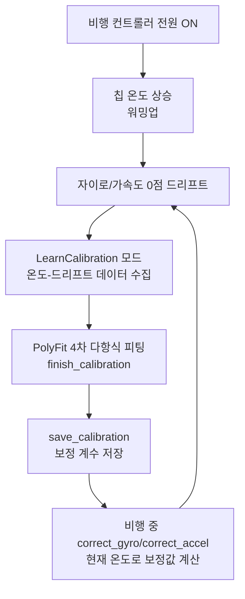

::: info 학습 목표
- 모터·프로펠러 진동이 왜 IMU 신호를 망치고, 그게 비행 제어를 어떻게 무너뜨리는지 직관으로 이해한다.
- 저역통과필터(LPF)의 원리와 한계를 알고, 왜 노치필터가 필요한지 설명할 수 있다.
- ArduPilot의 하모닉 노치필터 구조(`HarmonicNotch`)와 동적 주파수 추적(스로틀·FFT)을 코드 레벨에서 따라간다.
- 온도 드리프트 보정(TCal)이 4차 다항식으로 어떻게 작동하는지 안다.
- 진동 심각도가 EKF 추정에 미치는 영향을 개념적으로 연결한다.
:::

## 1. 문제: 진동이 IMU를 망친다

드론은 모터 네 개(혹은 그 이상)가 초당 수천 번씩 회전하는 기계다. 모터가 돌고 프로펠러가 공기를 가르면, 그 진동은 프레임을 타고 비행 컨트롤러 보드까지 전달된다. 보드 위에는 자이로(각속도)와 가속도계를 담은 IMU 칩이 붙어 있다. 즉 IMU는 드론의 움직임뿐 아니라 **모터가 만들어내는 떨림까지 같이 측정**한다.

진동의 주파수는 모터 RPM에 비례한다. 예를 들어 프로펠러가 초당 100번 회전하면 100Hz짜리 진동이 생긴다. 일반적인 멀티콥터에서 이 주파수는 대략 100Hz~300Hz 범위에 들어온다. 문제는 자이로가 측정하려는 "진짜 기체의 움직임"은 보통 수십 Hz 이하의 느린 신호인데, 그 위에 100Hz 넘는 진동이 두껍게 겹쳐 들어온다는 점이다.

여기서 제어 루프의 악순환이 시작된다. 자이로가 "기체가 떨린다"고 보고하면, PID 제어기는 이를 자세 오차로 받아들이고 반대 방향으로 모터 출력을 조정한다. 그런데 그 떨림은 실제 자세 변화가 아니라 모터 진동이었다. 결국 제어기는 존재하지 않는 흔들림을 잡으려고 모터를 흔들고, 그 모터 움직임이 다시 새로운 진동을 만든다. 드론이 **"흔들린다고 착각"해서 반대로 모터를 차는 바람에 실제로 더 흔들리는** 자기 강화 진동(oscillation)이 발생한다.

가속도계도 안전하지 않다. 진동이 심하면 가속도계 값이 사방으로 튀고, 뒤에서 다룰 EKF(확장 칼만 필터)가 가속도계를 신뢰하지 못하게 된다. 그러면 속도·위치 추정 품질이 무너진다(섹션 5에서 다시 다룬다).



정리하면, IMU 신호에서 진동 성분을 걸러내는 것은 단순한 신호 품질 문제가 아니라 **비행 안정성의 전제 조건**이다. ArduPilot은 이를 위해 두 단계의 필터를 둔다. 넓게 자르는 저역통과필터와, 정밀하게 콕 집어내는 하모닉 노치필터다.

## 2. 저역통과필터(LPF) 기본 개념

가장 직관적인 대응은 "높은 주파수를 그냥 잘라버리자"다. 이것이 저역통과필터(Low-Pass Filter, LPF)다. 이름 그대로 **낮은 주파수는 통과시키고 높은 주파수는 차단**한다. 진동이 100Hz 이상에 몰려 있다면, 예를 들어 80Hz 위쪽을 깎아내면 떨림이 상당히 줄어든다.

LPF는 구현이 간단하고 비용도 싸다. 그래서 ArduPilot도 자이로·가속도 신호에 기본적으로 LPF를 건다. 하지만 LPF에는 두 가지 본질적 한계가 있다.

첫째, **원하는 신호까지 같이 잘린다.** 공격적인 곡예 비행이나 빠른 자세 변화는 그 자체로 비교적 높은 주파수 성분을 가진다. LPF의 차단 주파수를 너무 낮게 잡으면, 진동과 함께 진짜 비행 기동 신호도 깎여 제어 반응이 둔해진다.

둘째, **레이턴시(지연)가 늘어난다.** 필터는 본질적으로 과거 샘플들을 섞어 현재 값을 매끄럽게 만드는 연산이라, 필터를 강하게 걸수록 신호가 시간적으로 뒤로 밀린다. 제어 루프에서 지연은 곧 불안정성이다. 지연된 정보로 모터를 제어하면 또 다른 진동을 부른다.

그래서 LPF만으로는 부족하다. 진동은 특정 주파수(모터 RPM)에 집중돼 있는데, LPF는 그 주파수 위쪽 전체를 뭉텅이로 자른다. **필요한 건 그 좁은 진동 봉우리만 정확히 도려내는 도구**다. 그것이 노치필터다.

## 3. 하모닉 노치필터

노치필터(Notch Filter)는 "노치(notch, 홈)"라는 이름처럼 **특정 주파수 한 점만 깊게 파내는** 필터다. LPF가 칼로 위쪽을 통째로 베어내는 거라면, 노치필터는 핀셋으로 진동 봉우리만 집어 제거한다. 주변 주파수는 거의 손대지 않으므로 진짜 비행 신호와 레이턴시를 지킬 수 있다.

여기에 "하모닉(harmonic, 고조파)"이 붙는 이유가 있다. 모터 진동은 기본 주파수(1배)에서만 나타나지 않는다. 100Hz가 기본 주파수라면 200Hz(2배음), 300Hz(3배음)에도 진동 에너지가 실린다. 이 정수배 성분들이 고조파다. **하모닉 노치필터는 기본 주파수 하나만 받아서 그 배수들을 한꺼번에 제거**한다.



위 그림에서 막대(bar)는 노치 적용 전 스펙트럼이고, 선(line)은 적용 후다. 100Hz·200Hz·300Hz의 진동 봉우리만 골라 바닥까지 눌렀고, 0Hz 근처의 진짜 신호와 봉우리 사이의 다른 주파수는 그대로 남았다. 이것이 LPF와의 결정적 차이다.

ArduPilot에서 이 기능은 `HarmonicNotch`라는 내부 클래스로 구현된다.

```cpp
class HarmonicNotch {
public:
    HarmonicNotchFilterParams params;
    HarmonicNotchFilterVector3f filter[INS_MAX_INSTANCES];

    // 실시간으로 계산된 노치 주파수들
    float calculated_notch_freq_hz[INS_MAX_NOTCHES];
    uint8_t num_calculated_notch_frequencies;
};
```
(libraries/AP_InertialSensor/AP_InertialSensor.h:456)

구조를 하나씩 보자.

- `params` — 노치필터 설정(중심 주파수, 대역폭, 감쇠량, 고조파 개수 등)을 담는 파라미터 객체다(libraries/AP_InertialSensor/AP_InertialSensor.h:458).
- `filter[INS_MAX_INSTANCES]` — IMU 인스턴스마다 별도의 필터를 둔다(libraries/AP_InertialSensor/AP_InertialSensor.h:459). 보드에는 보통 IMU가 두세 개 달리므로, 각 자이로 신호를 독립적으로 거른다. `Vector3f`는 x·y·z 세 축을 한꺼번에 처리한다는 뜻이다.
- `calculated_notch_freq_hz[]` — **고정값이 아니라 실시간으로 계산되는** 노치 중심 주파수 배열이다(libraries/AP_InertialSensor/AP_InertialSensor.h:464). 진동 주파수는 RPM에 따라 시시각각 변하므로, 노치도 따라 움직여야 한다.
- `num_calculated_notch_frequencies` — 현재 활성화된 노치 개수다(libraries/AP_InertialSensor/AP_InertialSensor.h:465). 고조파 설정과 모터 수에 따라 동시에 여러 노치가 돌아간다.

그리고 시스템은 이런 하모닉 노치를 여러 벌 둘 수 있다.

```cpp
HarmonicNotch harmonic_notches[HAL_INS_NUM_HARMONIC_NOTCH_FILTERS];
```
(libraries/AP_InertialSensor/AP_InertialSensor.h:489)

하나는 스로틀 기반, 하나는 FFT 기반처럼 서로 다른 추적 방식을 병행할 수 있다는 의미다. 이제 그 "주파수를 어떻게 따라가느냐"를 보자.

### 3-1. 스로틀 기반 동적 추적

가장 단순하고 견고한 추적 방식은 스로틀 값을 단서로 쓰는 것이다. 스로틀이 올라가면 모터 RPM이 올라가고, RPM이 올라가면 진동 주파수도 올라간다. 그러니 스로틀로부터 현재 진동 주파수를 추정해 노치 위치를 옮기면 된다.

```cpp
bool setup_throttle_gyro_harmonic_notch(float center_freq_hz,
                                        float lower_freq_hz,
                                        float ref,
                                        uint8_t harmonics);
```
(libraries/AP_InertialSensor/AP_InertialSensor.h:247)

파라미터의 의미는 이렇다.

- `center_freq_hz` — 기준 스로틀에서의 중심 진동 주파수. 출발점이 되는 노치 위치다.
- `lower_freq_hz` — 노치가 내려갈 수 있는 최저 주파수. 스로틀이 아주 낮을 때도 노치가 무의미한 영역까지 내려가지 않게 막는 하한선이다.
- `ref` — 기준 스로틀 값. 이 스로틀에서 `center_freq_hz`가 나온다고 보고, 현재 스로틀과의 비율로 주파수를 스케일한다.
- `harmonics` — 처리할 고조파를 비트마스크로 지정한다. 기본 주파수 외에 2배음·3배음·4배음을 동시에 잡을지 정한다.

스로틀 기반의 장점은 **계산이 거의 공짜**라는 점이다. 스로틀은 이미 알고 있는 값이라 추가 측정이 필요 없다. 단점은 스로틀과 실제 RPM의 관계가 배터리 전압·기체 무게·바람에 따라 어긋날 수 있어, 노치가 진짜 진동 봉우리에서 살짝 빗나갈 수 있다는 점이다.

### 3-2. FFT 기반 동적 추적

더 정확한 방법은 진동 주파수를 **추정하지 말고 직접 측정**하는 것이다. 자이로 신호 자체를 실시간으로 주파수 분석(FFT, 고속 푸리에 변환)해서, 지금 이 순간 가장 강한 진동 봉우리가 몇 Hz에 있는지 찾아낸다. ArduPilot에서는 `AP_GyroFFT` 모듈이 이 일을 맡고, IMU 쪽은 FFT 분석에 쓸 원시 자이로 데이터를 넘겨준다.

```cpp
const Vector3f& get_gyro_for_fft(void) const;
bool has_fft_notch() const;
```
(libraries/AP_InertialSensor/AP_InertialSensor.h:164)

- `get_gyro_for_fft()` — FFT 분석 전용 자이로 샘플을 반환한다(libraries/AP_InertialSensor/AP_InertialSensor.h:164). FFT는 신호의 원래 주파수 성분이 살아 있어야 분석할 수 있으므로, 노치로 깎기 전 단계의 데이터를 쓴다.
- `has_fft_notch()` — FFT 기반 노치가 설정돼 있는지 알려준다(libraries/AP_InertialSensor/AP_InertialSensor.h:168). 이 값에 따라 어떤 자이로 스트림을 FFT로 보낼지 같은 흐름이 갈린다.

FFT 방식은 스로틀-RPM 관계가 어긋나도 실제 봉우리를 직접 짚으므로 정확하다. 대신 FFT 연산 자체가 무겁다. 실시간 임베디드 환경에서 매 주기마다 주파수 변환을 돌리는 것은 CPU에 부담이라, 보드 성능과 설정에 따라 스로틀 방식과 저울질해 선택한다.

### 3-3. apply_gyro_filters 호출 흐름

그럼 이 필터들은 실제로 언제 적용될까. 핵심은 **모든 필터링이 자이로 샘플 단위로, 백엔드에서 일어난다**는 점이다. 센서 드라이버(백엔드)가 새 자이로 원시 샘플을 받으면 다음 흐름을 탄다.

```cpp
void apply_gyro_filters(const uint8_t instance, const Vector3f &gyro);
void _notify_new_gyro_raw_sample(uint8_t instance,
                                 const Vector3f &accel,
                                 uint64_t sample_us=0);
```
(libraries/AP_InertialSensor/AP_InertialSensor_Backend.h:203)

흐름을 정리하면 이렇다.

1. 센서에서 새 자이로 원시 샘플이 들어오면 `_notify_new_gyro_raw_sample`이 불린다(libraries/AP_InertialSensor/AP_InertialSensor_Backend.h:212).
2. 그 안에서 `apply_gyro_filters`가 호출돼(libraries/AP_InertialSensor/AP_InertialSensor_Backend.h:203) LPF와 하모닉 노치를 차례로 통과시킨다.
3. 필터를 거친 깨끗한 값이 `_publish_gyro`를 통해 프론트엔드(제어 루프가 읽는 쪽)로 전달된다.

즉 제어기는 항상 **필터링이 끝난 자이로**만 본다. 진동에 오염된 원시 신호는 FFT 분석처럼 특수한 목적이 아니면 제어 루프로 새어 나가지 않는다. 이 구조 덕분에 위쪽 비행 제어 코드는 진동을 의식할 필요 없이 깨끗한 신호를 가정하고 동작할 수 있다.

## 4. 온도 보정 (TCal)

진동만이 IMU를 속이는 건 아니다. 또 하나의 조용한 적은 **온도**다. MEMS 자이로·가속도계는 칩 온도에 따라 출력값이 미세하게 변한다. 전원을 켜고 비행 컨트롤러가 동작하기 시작하면 칩에서 열이 나면서 온도가 서서히 올라가는데, 이 워밍업 과정에서 센서의 0점(bias)이 슬금슬금 이동한다. 이것을 온도 드리프트라 부른다.

문제는 이 드리프트가 일정하지 않다는 점이다. 온도가 1도 오를 때마다 똑같이 변하면 단순 비례 보정으로 끝나겠지만, 실제 온도-드리프트 관계는 곡선을 그린다. ArduPilot은 이 비선형 관계를 다항식으로 근사해 보정한다. 이 기능이 `AP_InertialSensor_TCal`(Temperature Calibration)이다.



핵심 동작을 코드로 보자.

```cpp
void correct_accel(float temperature, float cal_temp, Vector3f &accel) const;
void correct_gyro(float temperature, float cal_temp, Vector3f &accel) const;
```
(libraries/AP_InertialSensor/AP_InertialSensor_tempcal.h:12)

`correct_accel`·`correct_gyro`는 **현재 온도(`temperature`)와 보정 기준 온도(`cal_temp`)를 받아 측정값을 제자리로 끌어당기는** 함수다(libraries/AP_InertialSensor/AP_InertialSensor_tempcal.h:12). 자이로·가속도 양쪽에 같은 방식의 보정이 들어간다.

이 보정값을 만들어내는 심장은 4차 다항식 피팅이다.

```cpp
PolyFit<4, double, Vector3f> pfit;
```
(libraries/AP_InertialSensor/AP_InertialSensor_tempcal.h:44)

`PolyFit<4>`는 수집한 (온도, 드리프트) 데이터 점들을 가장 잘 지나는 4차 다항식의 계수를 찾는다(libraries/AP_InertialSensor/AP_InertialSensor_tempcal.h:44). 4차까지 쓰는 이유는, 온도-드리프트 곡선이 단순 직선이나 2차로는 표현되지 않는 굴곡을 갖기 때문이다. 차수가 높을수록 곡선의 휘어짐을 더 충실히 따라간다.

그럼 이 곡선은 언제 학습할까. 핵심은 사용자가 따로 캘리브레이션을 돌리지 않아도 **비행 중 자동으로 데이터를 모은다**는 점이다.

```cpp
enum { ..., LearnCalibration = 2, ... };

void update_accel_learning(const Vector3f &gyro, float temperature);
void update_gyro_learning(const Vector3f &accel, float temperature);
```
(libraries/AP_InertialSensor/AP_InertialSensor_tempcal.h:23)

`LearnCalibration` 모드(libraries/AP_InertialSensor/AP_InertialSensor_tempcal.h:23)가 켜지면, `update_*_learning`이 비행 내내 (온도, 센서값) 쌍을 누적한다(libraries/AP_InertialSensor/AP_InertialSensor_tempcal.h:27). 온도가 충분한 범위를 훑고 데이터가 쌓이면 피팅을 마무리한다.

```cpp
void finish_calibration(float temperature);
bool save_calibration(float temperature);
```
(libraries/AP_InertialSensor/AP_InertialSensor_tempcal.h:48)

`finish_calibration`이 모인 데이터로 다항식 계수를 확정하고(libraries/AP_InertialSensor/AP_InertialSensor_tempcal.h:48), `save_calibration`이 그 계수를 영구 저장한다(libraries/AP_InertialSensor/AP_InertialSensor_tempcal.h:49). 다음 부팅부터는 이 계수를 그대로 쓴다.

실제 보정 순간의 계산은 다항식 평가다.

```cpp
void correct_sensor(float temperature, float cal_temp,
                    const AP_Vector3f coeff[3], Vector3f &v) const;
Vector3f polynomial_eval(float temperature, const AP_Vector3f coeff[3]) const;
```
(libraries/AP_InertialSensor/AP_InertialSensor_tempcal.h:76)

`polynomial_eval`이 저장된 계수와 현재 온도를 넣어 다항식 값을 계산하고(libraries/AP_InertialSensor/AP_InertialSensor_tempcal.h:77), `correct_sensor`가 기준 온도와의 차이를 반영해 그만큼을 센서값에서 덜어낸다(libraries/AP_InertialSensor/AP_InertialSensor_tempcal.h:76). 결과적으로 칩이 차갑든 뜨겁든, 출력은 온도와 무관한 일관된 값으로 보정된다.

진동 필터링이 "주파수 영역의 오염"을 다룬다면, TCal은 "온도 영역의 느린 편향"을 다룬다. 둘 다 IMU 원시 신호를 제어기가 믿을 수 있는 값으로 정제하는 같은 목표를 향한다.

## 5. 진동 심각도와 EKF 연계

마지막으로 진동이 결국 어디까지 영향을 미치는지 짚자. 자이로 진동은 노치필터로 상당 부분 잡지만, 가속도계 진동은 더 까다롭다. 진동이 심하면 가속도계 값이 크게 출렁이고, 이는 위치·속도를 추정하는 EKF(확장 칼만 필터)로 흘러 들어간다.

EKF는 여러 센서를 융합할 때 각 센서를 "얼마나 믿을지" 가중치를 둔다. 가속도계 측정과 EKF의 예측이 어긋나는 정도를 이노베이션(innovation)이라 하는데, **진동이 심하면 가속도계 이노베이션이 커지고**, EKF는 가속도계 신뢰를 낮춘다. 신뢰가 떨어진 가속도계는 위치 추정에 거의 기여하지 못하고, 그만큼 위치·속도 추정 품질이 나빠진다. 심하면 위치 유지(Loiter)나 자동 비행이 흔들리거나 실패한다.


그래서 진동 관리와 필터링은 단지 자이로 한 채널의 문제가 아니라, 위쪽의 자세 제어부터 EKF의 위치 추정까지 전체 추정·제어 스택의 토대가 된다. EKF의 융합 메커니즘 자체는 섹션 5(향후 챕터)에서 본격적으로 다룬다. 여기서는 "진동을 잡아야 EKF가 가속도계를 믿고, 그래야 위치를 안다"는 인과 사슬만 기억하면 된다.

::: tip 핵심 정리
- 모터·프로펠러 진동(100~300Hz)은 IMU에 섞여 들어와, 제어기가 가짜 흔들림을 잡으려다 진짜 진동을 키우는 악순환을 만든다.
- LPF는 고주파를 통째로 자르므로 간단하지만, 진짜 비행 신호를 깎고 레이턴시를 늘리는 한계가 있다.
- 하모닉 노치필터(`HarmonicNotch`)는 진동 봉우리와 그 고조파만 정밀하게 도려낸다. `calculated_notch_freq_hz[]`는 실시간으로 갱신되는 노치 주파수다.
- 노치 주파수는 스로틀 기반(`setup_throttle_gyro_harmonic_notch`, 싸지만 부정확) 또는 FFT 기반(`get_gyro_for_fft`, 정확하지만 무거움)으로 동적 추적한다.
- 모든 필터는 `_notify_new_gyro_raw_sample` → `apply_gyro_filters` → `_publish_gyro` 흐름에서 샘플마다 적용되어, 제어기는 깨끗한 자이로만 본다.
- 온도 드리프트는 TCal이 `PolyFit<4>` 4차 다항식으로 학습·보정한다. `LearnCalibration` 모드가 비행 중 데이터를 모으고, `finish/save_calibration`이 계수를 확정·저장한다.
- 진동이 심하면 EKF의 가속도계 이노베이션이 커져 위치 추정이 무너진다 — 필터링은 전체 추정 스택의 토대다.
:::

## 다음 챕터

다음 챕터에서는 드론이 자신의 절대 위치를 아는 수단, [CH12. GPS](/study/ardupilot/12-gps)를 다룬다. 진동·온도로 정제한 IMU 신호가 EKF 안에서 GPS와 어떻게 융합되어 위치가 되는지, 그 한 축을 먼저 들여다본다.
