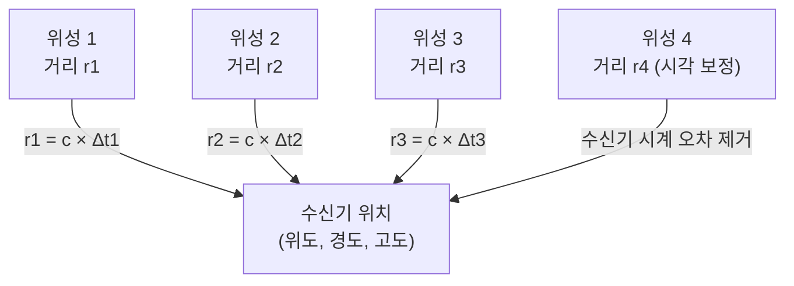
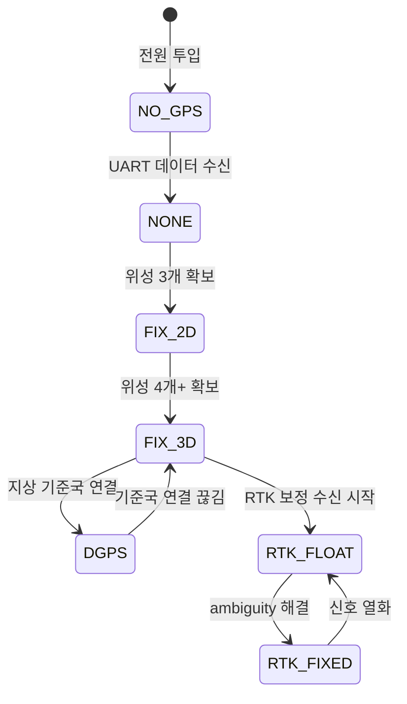
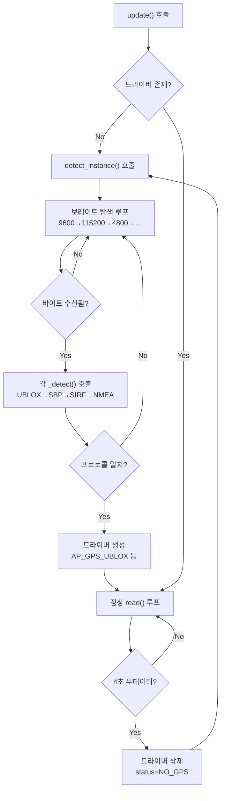
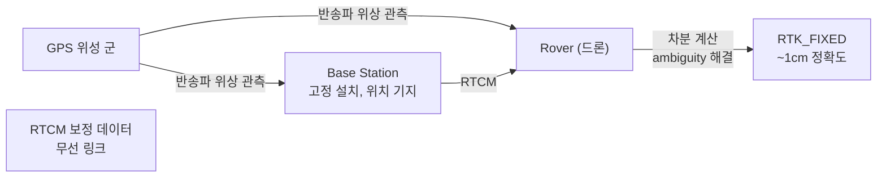

# CH12. GPS — 측위 원리와 드라이버 구조

::: info 학습 목표
- 위성 신호 도달 시간 차이로 위치를 계산하는 삼변측위 원리를 설명할 수 있다.
- GPS의 세 가지 약점(느린 갱신 속도, 실내 불가, 멀티패스)과 센서 융합 필요성을 연결할 수 있다.
- `GPS_Type` enum에서 프로토콜별 값(UBLOX/NMEA/SBF/NOVA)을 찾을 수 있다.
- `AP_GPS_FixType` 계층을 NO_GPS부터 RTK_FIXED까지 정확도와 함께 설명할 수 있다.
- `GPS_State` 구조체의 핵심 필드(location, velocity, num_sats, hdop, horizontal_accuracy)를 설명할 수 있다.
- `_detect_instance()`가 보레이트를 자동 탐지하고 4초 무데이터 시 재탐지하는 흐름을 설명할 수 있다.
- RTK의 동작 원리(base + rover, 반송파 위상 차분, RTCM 보정)를 설명할 수 있다.
:::

## 1. GPS는 어떻게 위치를 아는가

### 위성에서 신호가 도달하는 시간

GPS 위성은 지구 상공 약 20,200km에서 지속적으로 전파를 발사한다. 각 위성은 자신이 언제 신호를 보냈는지 정밀한 시각 정보를 신호에 담는다. GPS 수신기는 이 신호를 받는 순간의 시각과 신호 안에 담긴 발신 시각을 비교해서 "빛의 속도 × 경과 시간"으로 위성까지의 **거리(의사 거리, pseudorange)**를 계산한다.

하나의 위성은 거리 하나만 알려 준다. 수신기가 그 거리에 있는 구 위에 있다는 사실을 알 뿐이다. 위성이 두 개면 두 구의 교선(원)으로 범위가 좁혀진다. 세 개면 교점 두 개 중 하나로 좁혀진다. 여기서 하나의 교점은 지구 바깥 우주에 있으므로 지표면의 위치 한 점이 결정된다. 이것이 **삼변측위(trilateration)**다.

실제로는 수신기 내부 시계가 완벽하지 않기 때문에 시각 오차를 모르는 변수로 추가 처리해야 한다. 이 시각 오차를 해결하려면 위성이 한 개 더 필요하다. 따라서 3차원 측위에는 최소 4개의 위성이 필요하고, 정밀도를 높이려면 6개 이상을 사용한다.



### GPS의 약점 — 센서 융합이 필요한 이유

GPS는 절대 위치를 알려 준다는 점에서 강력하지만 세 가지 본질적인 약점이 있다.

**첫째, 갱신 속도가 느리다.** 일반 GPS 모듈은 5~10Hz로 위치를 갱신한다. 드론 자세 제어는 400Hz로 돌아간다. GPS 데이터만으로는 루프 사이 80~80회 갱신 사이 동안 위치 정보가 없다. 이 간격을 IMU(관성 센서)로 채워야 한다.

**둘째, 실내·터널에서 작동하지 않는다.** 위성 전파는 건물 내부까지 도달하지 못하거나 심하게 감쇠된다. 창고 배송 드론, 지하 매설관 점검 드론은 GPS 없이 비행해야 한다.

**셋째, 멀티패스(multipath) 오차가 생긴다.** 도심 빌딩이 위성 신호를 반사하면 수신기가 직접 도달 신호와 반사 신호를 합쳐 받아 거리 계산이 틀어진다. 수십 센티미터에서 수 미터의 오차가 발생한다.

이런 이유로 ArduPilot은 GPS를 단독으로 사용하지 않고 기압계·나침반·IMU와 함께 EKF(Extended Kalman Filter)로 융합한다. 13장과 14장에서 그 구체적인 구조를 다룬다.

## 2. GPS_Type — 프로토콜 종류

ArduPilot은 한 기체에 최대 두 개의 GPS를 달 수 있고 각각 독립적으로 드라이버를 동작시킨다. 어떤 GPS를 쓰는지는 `GPS_Type` enum으로 구분한다.

```cpp
// libraries/AP_GPS/AP_GPS.h:86
enum GPS_Type {
    GPS_TYPE_NONE  = 0,
    GPS_TYPE_AUTO  = 1,
    GPS_TYPE_UBLOX = 2,   // u-blox 독자 UBX 프로토콜
    GPS_TYPE_NMEA  = 5,   // 표준 NMEA-0183 문장
    GPS_TYPE_SBF   = 10,  // Septentrio Binary Format
    GPS_TYPE_NOVA  = 15,  // NovAtel OEM 프로토콜
    GPS_TYPE_UBLOX_RTK_BASE  = 17,
    GPS_TYPE_UBLOX_RTK_ROVER = 18,
    ...
};
```

`(libraries/AP_GPS/AP_GPS.h:86)`

`GPS_TYPE_AUTO(1)`로 설정하면 소프트웨어가 UART 스트림을 읽어 프로토콜을 자동 판별한다. 대부분의 상용 드론 키트는 이 값을 쓴다.

프로토콜에 따라 백엔드 드라이버 클래스가 다르다.

| GPS_Type 값 | 드라이버 파일 | 프로토콜 특징 |
|---|---|---|
| 2 (UBLOX) | `AP_GPS_UBLOX.cpp` | u-blox UBX 바이너리. 설정 자동 전송 가능 |
| 5 (NMEA) | `AP_GPS_NMEA.cpp` | ASCII 문장(`$GPGGA`, `$GPRMC` 등). 범용 |
| 10 (SBF) | `AP_GPS_SBF.cpp` | Septentrio 고정밀 측량급. RTK 지원 |
| 15 (NOVA) | `AP_GPS_NOVA.cpp` | NovAtel OEM 바이너리. 정밀 항공용 |
| 17/18 | `AP_GPS_UBLOX.cpp` | RTK base/rover 역할 구분 |

ArduPilot GPS 아키텍처는 **frontend / backend** 구조다. `AP_GPS` 클래스(frontend)가 공통 인터페이스를 제공하고 `GPS_Backend`에서 파생된 각 드라이버(backend)가 실제 파싱을 맡는다.

## 3. AP_GPS_FixType — Fix 타입 계층

GPS가 얼마나 좋은 위치 정보를 제공하는지는 `AP_GPS_FixType` enum으로 표현된다.

```cpp
// libraries/AP_GPS/AP_GPS_FixType.h:9
enum class AP_GPS_FixType : uint8_t {
    NO_GPS    = 0,  // GPS 연결 없음
    NONE      = 1,  // 신호 수신 중이나 잠금 없음
    FIX_2D    = 2,  // 위경도만 (고도 없음)
    FIX_3D    = 3,  // 위경도 + 고도
    DGPS      = 4,  // 차분 GPS (지상국 보정)
    RTK_FLOAT = 5,  // RTK 부동 해
    RTK_FIXED = 6,  // RTK 고정 해
    STATIC    = 7,  // 기준국 고정 모드
    PPP       = 8,  // 정밀 포인트 측위
};
```

`(libraries/AP_GPS/AP_GPS_FixType.h:9)`

각 Fix 타입의 수평 정확도를 정리하면 다음과 같다.

| Fix 타입 | 수평 정확도 | 요구 위성 수 | 비고 |
|---|---|---|---|
| NO_GPS (0) | — | 0 | GPS 연결 없음 |
| NONE (1) | — | 0~3 | 신호 수신 중, 잠금 실패 |
| FIX_2D (2) | 수십 m | 3 | 고도 정보 없음 |
| FIX_3D (3) | 2~5m | 4+ | 일반 비행에 최소 필요 |
| DGPS (4) | 0.5~1m | 4+ | 지상 기준국 보정 필요 |
| RTK_FLOAT (5) | 0.1~0.5m | 6+ | 반송파 위상 추정 미완 |
| RTK_FIXED (6) | ~1cm | 6+ | 반송파 정수 ambiguity 해결 |
| PPP (8) | 수 cm | 6+ | 정밀 위성 보정 데이터 필요 |

ArduPilot은 `FIX_3D` 이상을 **healthy GPS**로 판정한다. EKF가 GPS를 신뢰하는 기준이 여기서 시작된다.



## 4. GPS_State — 드라이버가 채우는 상태 구조체

백엔드 드라이버는 GPS 메시지를 파싱할 때마다 `GPS_State` 구조체에 결과를 기록한다. frontend는 이 구조체를 읽어 외부에 제공한다.

```cpp
// libraries/AP_GPS/AP_GPS.h:189
struct GPS_State {
    AP_GPS_FixType status;          // Fix 타입
    Location location;              // 위경도·고도
    float    ground_speed;          // 지표면 속력 (m/s)
    uint16_t hdop;                  // 수평 정밀도 지수 ×100
    uint8_t  num_sats;              // 수신 위성 수
    Vector3f velocity;              // NED 3D 속도 (m/s)
    float    horizontal_accuracy;   // 수평 RMS 오차 (m)
    float    vertical_accuracy;     // 수직 RMS 오차 (m)
    // RTK 전용 필드
    int32_t  rtk_baseline_x_mm;     // 기준국 대비 X 오프셋 (mm)
    int32_t  rtk_baseline_y_mm;     // 기준국 대비 Y 오프셋 (mm)
    int32_t  rtk_baseline_z_mm;     // 기준국 대비 Z 오프셋 (mm)
    ...
};
```

`(libraries/AP_GPS/AP_GPS.h:189)`

주요 필드 설명이다.

- **`location`**: `Location` 타입으로 위도·경도(1e-7 degree 단위 정수)와 고도(cm 단위)를 담는다.
- **`velocity`**: NED(North-East-Down) 좌표계의 3D 속도 벡터. `velocity.x`가 북향, `.y`가 동향, `.z`가 하향이다.
- **`hdop`**: Horizontal Dilution of Precision. 1.0이 최적이며 100배 스케일로 저장된다(155 → HDOP 1.55). 위성 배치가 나쁠수록 커진다.
- **`num_sats`**: 잠긴 위성 수. 최소 4개 이상이어야 3D fix가 유지된다.
- **`horizontal_accuracy`**: GPS 모듈이 자체 추정한 수평 오차(m). 이 값이 작을수록 EKF 융합 시 GPS 가중치가 커진다.

## 5. _detect_instance — 드라이버 자동 검출 흐름

ArduPilot은 GPS가 어떤 프로토콜을 쓰는지 모르는 상태에서 시작해 자동으로 판별한다. 이 로직이 `_detect_instance()`다.

### 보레이트 자동 탐지

```cpp
// libraries/AP_GPS/AP_GPS.cpp:79
const uint32_t AP_GPS::_baudrates[] = {
    9600U, 115200U, 4800U, 19200U, 38400U, 57600U, 230400U, 460800U
};
```

`(libraries/AP_GPS/AP_GPS.cpp:79)`

8가지 보레이트를 순서대로 시도한다. 한 보레이트에서 데이터가 들어오면 그 속도로 UART를 열고 바이트 스트림을 각 프로토콜 `_detect()` 함수에 넘겨 서명(signature)을 확인한다.

```cpp
// libraries/AP_GPS/AP_GPS.cpp:632
AP_GPS_Backend *AP_GPS::_detect_instance(const uint8_t instance)
{
    ...
    // 자동 탐지: 보레이트를 순환하며 프로토콜 판별
    dstate->auto_detected_baud = true;

    // 다음 순서로 판별 시도
    // UBLOX → SBP2 → SBP → SIRF → ERB → NMEA
    if (AP_GPS_UBLOX::_detect(dstate->ublox_detect_state, data)) {
        return new AP_GPS_UBLOX(...);
    }
    ...
    if (AP_GPS_NMEA::_detect(dstate->nmea_detect_state, data)) {
        return new AP_GPS_NMEA(...);
    }
}
```

`(libraries/AP_GPS/AP_GPS.cpp:632)`

### 4초 무데이터 시 재탐지

```cpp
// libraries/AP_GPS/AP_GPS.cpp:74
#define GPS_TIMEOUT_MS 4000u
```

`(libraries/AP_GPS/AP_GPS.cpp:74)`

드라이버 인스턴스가 살아 있는 상태에서 4000ms 동안 새 메시지가 없으면 드라이버를 삭제하고 `NO_GPS`로 상태를 리셋한 뒤 다음 루프에서 `detect_instance()`를 다시 호출한다.

```cpp
// libraries/AP_GPS/AP_GPS.cpp:887
if (tnow - timing[instance].last_message_time_ms > GPS_TIMEOUT_MS) {
    delete drivers[instance];
    drivers[instance] = nullptr;
    state[instance].status = AP_GPS_FixType::NO_GPS;
}
```

`(libraries/AP_GPS/AP_GPS.cpp:887)`

이 구조 덕분에 GPS 케이블이 잠깐 빠졌다 다시 꽂혀도 자동으로 재초기화된다.



## 6. RTK — 센티미터급 정확도의 원리

### 의사 거리 측위의 한계

일반 GPS는 위성 신호의 **코드 위상(code phase)**을 이용한다. GPS 신호 안에 담긴 의사 랜덤 코드(PRN code)를 수신기 내부 복제본과 비교해 지연 시간을 계산한다. 이 방식의 정확도는 코드 칩 하나의 길이(C/A 코드 기준 약 300m)에 제한을 받아, 아무리 잘 해도 수 미터 오차가 남는다.

### 반송파 위상 차분

RTK(Real-Time Kinematic)는 훨씬 짧은 주기를 가진 **반송파(carrier wave)** 위상을 측정한다. GPS L1 반송파 파장은 약 19cm다. 이 파장 단위로 위상을 측정하면 이론적으로 mm급 분해능이 된다.

문제는 몇 번째 파장인지 모른다는 것(integer ambiguity)이다. 기준국(base station)을 지상에 고정 설치하고 로버(rover, 드론)와 동일한 위성을 동시에 관측하면, 두 수신기에 공통으로 들어오는 오차(대기 지연, 위성 시계 오차)가 빠진다. 이 차분 관측으로 ambiguity를 정수로 해결(fix)하면 `RTK_FIXED` 1cm급 정확도가 달성된다.



### RTCM 보정 데이터

기준국이 관측한 데이터를 드론에 무선으로 전송하는 포맷이 **RTCM3**다. ArduPilot은 RTCM3 파서를 내장하고 있다.

```
libraries/AP_GPS/RTCM3_Parser.cpp
```

기준국으로부터 RTCM 패킷이 들어오면 파서가 이를 해석해 RTK 보정을 적용한다. 기준국-드론 사이 거리가 멀어질수록(baseline이 길수록) 대기 조건이 달라져 `RTK_FLOAT`에 머물거나 정확도가 떨어진다. 통상 10~20km 이내에서 `RTK_FIXED`가 유지된다.

::: tip 핵심 정리
- GPS는 4개 이상 위성의 신호 도달 시간으로 삼변측위를 한다. 수신기 시계 오차를 없애려면 최소 4개가 필요하다.
- 약점은 5~10Hz 갱신 속도, 실내·터널 불가, 멀티패스 오차다. 이것이 센서 융합(EKF)이 필요한 이유다.
- `GPS_Type` enum(AP_GPS.h:86)이 프로토콜을 구분한다. `GPS_TYPE_AUTO(1)`로 설정하면 `_detect_instance()`가 보레이트와 프로토콜을 자동 탐지한다.
- Fix 타입은 `AP_GPS_FixType`(AP_GPS_FixType.h:9)의 8단계로 표현된다. `FIX_3D`가 최소 실비행 기준이고 `RTK_FIXED`는 ~1cm 정확도다.
- `GPS_State` 구조체(AP_GPS.h:189)에 location(위경고), velocity(NED), num_sats, hdop, horizontal_accuracy가 담긴다.
- 4초(`GPS_TIMEOUT_MS`) 무데이터 시 드라이버가 삭제되고 재탐지가 시작된다.
- RTK는 기준국과 로버가 반송파 위상을 차분해 integer ambiguity를 해결함으로써 cm급 정확도를 달성한다.
:::

## 다음 챕터

[CH13. 기압계·나침반·거리센서](/study/ardupilot/13-baro-compass-rangefinder) — 고도 측정(기압계), yaw 기준(나침반), 지면 거리(거리센서)의 동작 원리와 ArduPilot 드라이버 구조를 코드로 따라간다.
