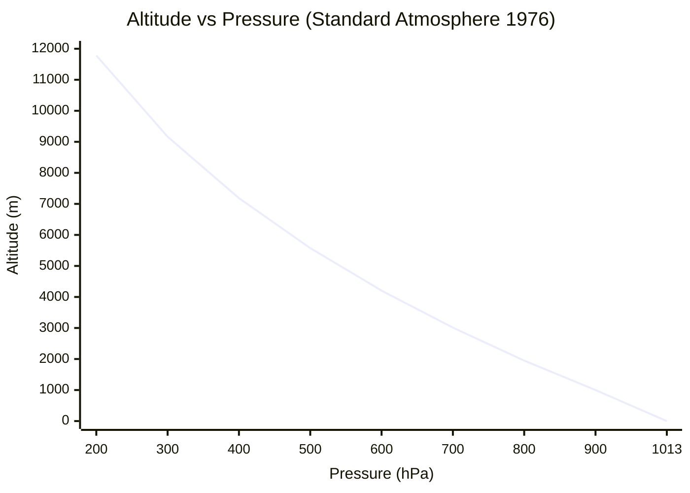
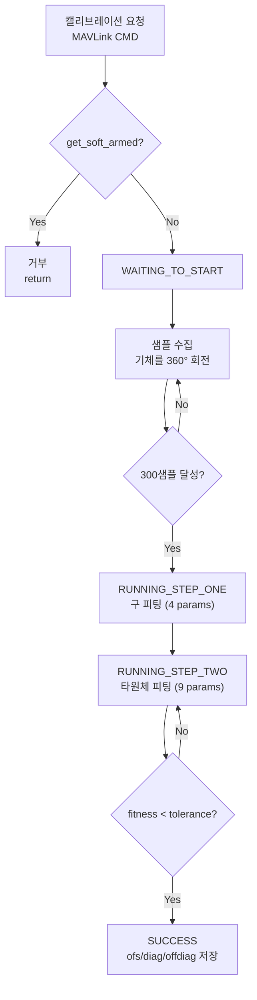
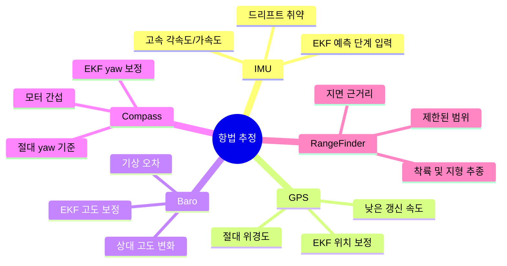

# CH13. 기압계·나침반·거리센서

::: info 학습 목표
- 대기압에서 고도를 계산하는 표준 대기 모델을 설명하고 `get_altitude_from_pressure()` 코드를 따라갈 수 있다.
- MS5611 드라이버가 100Hz 주기 콜백에서 PROM 보정 계수 C1~C6으로 온도 보상하는 과정을 설명할 수 있다.
- 나침반이 자이로 yaw 드리프트를 보정하는 이유와 모터 전류 간섭 문제를 설명할 수 있다.
- `CompassCalibrator`의 구 피팅→타원체 피팅 두 단계와 300샘플 기준을 설명할 수 있다.
- armed 상태에서 나침반 캘리브레이션이 불가능한 이유를 코드로 확인할 수 있다.
- 거리센서의 세 가지 용도(착륙 플레어, 지형 추종, 장애물 회피)를 설명할 수 있다.
- IMU·GPS·기압계·나침반·거리센서 각각의 강점과 약점을 종합해 센서 융합의 필요성을 설명할 수 있다.
:::

## 1. 기압계 — 대기압으로 고도를 잰다

### 대기압과 고도의 관계

지구 대기는 높이 올라갈수록 공기가 희박해져 압력이 낮아진다. 해수면에서 약 101,325 Pa이고, 1000m 상승하면 약 89,875 Pa, 2000m에서는 약 79,501 Pa이다. 이 관계를 이용하면 압력 측정으로 고도를 역산할 수 있다.

ArduPilot은 미국 표준대기 1976(US Standard Atmosphere 1976) 모델을 사용한다. 고도 구간별로 온도 체감률(lapse rate)이 다르기 때문에 단순 1차 함수가 아니라 구간별 다른 공식을 적용한다.

```cpp
// libraries/AP_Baro/AP_Baro_atmosphere.cpp:82
static const struct {
    float amsl_m;       // 해발 고도 (m)
    float temp_K;       // 기온 (K)
    float pressure_Pa;  // 기압 (Pa)
    float temp_lapse;   // 온도 체감률 (K/m)
} atmospheric_1976_consts[] = {
    { -5000, 320.650, 177687,   -6.5E-3 },
    { 11000,  216.650,  22632.1,  0      },  // 성층권 하부(등온층)
    { 20000,  216.650,   5474.89, 1E-3   },
    ...
};
```

`(libraries/AP_Baro/AP_Baro_atmosphere.cpp:82)`

온도 체감률이 0인 구간(등온층)과 0이 아닌 구간(경사층)에 대해 각각 다른 공식을 쓴다.

```cpp
// libraries/AP_Baro/AP_Baro_atmosphere.cpp:160
float AP_Baro::get_altitude_from_pressure(float pressure) const
{
    const uint8_t idx = find_atmosphere_layer_by_pressure(pressure);
    const float pressure_ratio = pressure / atmospheric_1976_consts[idx].pressure_Pa;

    float alt;
    const float temp_slope = atmospheric_1976_consts[idx].temp_lapse;
    if (is_zero(temp_slope)) {   // 등온층
        const float fac = -(atmospheric_1976_consts[idx].temp_K * R_specific) / GRAVITY_MSS;
        alt = atmospheric_1976_consts[idx].amsl_m + fac * logf(pressure_ratio);
    } else {                     // 경사층
        const float fac = -(temp_slope * R_specific) / GRAVITY_MSS;
        alt = atmospheric_1976_consts[idx].amsl_m
            + (atmospheric_1976_consts[idx].temp_K / temp_slope)
            * (powf(pressure_ratio, fac) - 1);
    }
    return geopotential_alt_to_geometric(alt);
}
```

`(libraries/AP_Baro/AP_Baro_atmosphere.cpp:160)`

고도 증가에 따른 기압 변화를 직관적으로 보면 아래와 같다.



### MS5611 — 드라이버 내부 동작

MS5611은 ArduPilot 기본 비행 컨트롤러(Pixhawk 계열)에 탑재된 고정밀 기압 센서다. PROM에 6개의 보정 계수(C1~C6)가 저장돼 있고, 이를 이용해 온도 보상한 압력을 계산한다.

```cpp
// libraries/AP_Baro/AP_Baro_MS5611.cpp:178
/* Request 100Hz update */
_dev->register_periodic_callback(10 * AP_USEC_PER_MSEC,
                                 FUNCTOR_BIND_MEMBER(&AP_Baro_MS56XX::_timer, void));
```

`(libraries/AP_Baro/AP_Baro_MS5611.cpp:178)`

10ms마다 `_timer()`가 호출된다. 온도 샘플 1회, 기압 샘플 4회를 번갈아 가며 읽어 평균을 낸다.

온도 보상 계산은 다음과 같다.

```cpp
// libraries/AP_Baro/AP_Baro_MS5611.cpp:366
void AP_Baro_MS5611::_calculate()
{
    float dT   = _D2 - (((uint32_t)_cal_reg.c5) << 8);
    float TEMP = (dT * _cal_reg.c6) / 8388608;        // 온도 (×100 degC)
    float OFF  = _cal_reg.c2 * 65536.0f + (_cal_reg.c4 * dT) / 128;
    float SENS = _cal_reg.c1 * 32768.0f + (_cal_reg.c3 * dT) / 256;
    ...
    float pressure    = (_D1 * SENS / 2097152 - OFF) / 32768;
    float temperature = TEMP * 0.01f;
    _copy_to_frontend(_instance, pressure, temperature);
}
```

`(libraries/AP_Baro/AP_Baro_MS5611.cpp:366)`

- `_D1`: 원시 기압 ADC 값
- `_D2`: 원시 온도 ADC 값
- `C1~C6`: PROM에서 읽은 팩토리 보정 계수
- 20°C 미만에서는 2차 온도 보상을 추가로 적용한다

지원 백엔드 칩들은 `AP_Baro_Backend.h`의 `DevTypes` enum에 정의돼 있다.

```cpp
// libraries/AP_Baro/AP_Baro_Backend.h:35
enum DevTypes {
    DEVTYPE_BARO_MS5611 = 0x0B,
    DEVTYPE_BARO_BMP280 = 0x03,
    DEVTYPE_BARO_BMP388 = 0x04,
    DEVTYPE_BARO_DPS310 = 0x06,
    ...
};
```

`(libraries/AP_Baro/AP_Baro_Backend.h:35)`

### 기압계의 약점

| 약점 | 원인 | 영향 |
|---|---|---|
| 온도 민감 | 공기 밀도는 온도에 따라 변함 | 이륙 후 지표 온도가 다르면 고도 드리프트 |
| 바람·다운워시 | 프로펠러 기류가 정압 포트에 영향 | 실내 호버링 시 고도 흔들림 |
| 절대 위치 없음 | 기압은 기상 조건으로 수 hPa 변동 | 같은 고도라도 날씨에 따라 다른 압력 |
| 실내 오차 | 건물 내 환기로 압력 변동 | 매우 정확한 실내 고도 측정 어려움 |

기압계는 상대 고도 변화는 잘 잡지만 절대 해발 고도 기준은 GPS나 지형 데이터가 필요하다.

## 2. 나침반 — 자력계로 yaw를 잡는다

### 왜 나침반이 필요한가

자이로스코프는 각속도를 적분해 자세를 추적한다. roll(옆 기울기)과 pitch(앞뒤 기울기)는 중력 벡터를 가속도계로 보정할 수 있다. 하지만 **yaw(수평면 회전)**는 중력이 수직이어서 구분이 안 된다. 자이로 yaw는 시간이 지날수록 적분 오차가 쌓여 드리프트한다. 나침반(자력계)이 지구 자기장 방향으로 절대 yaw 기준을 제공해 이 드리프트를 보정한다.

지원 백엔드 칩들은 다음과 같다.

```cpp
// libraries/AP_Compass/AP_Compass_Backend.h:57
enum DevTypes {
    DEVTYPE_HMC5883     = 0x07,  // 구형 표준
    DEVTYPE_LIS3MDL     = 0x08,
    DEVTYPE_AK09916     = 0x09,  // ICM-42688-P 내장
    DEVTYPE_IST8310     = 0x0A,
    DEVTYPE_RM3100      = 0x11,  // 고정밀 flux-gate 방식
    ...
};
```

`(libraries/AP_Compass/AP_Compass_Backend.h:57)`

### 나침반의 약점 — 모터 전류 간섭

드론 모터는 큰 전류를 흘리면서 주변에 강한 자기장을 발생시킨다. 나침반이 이 인공 자기장을 지구 자기장과 함께 측정하면 yaw 오차가 생긴다. 이 문제를 **hard iron / soft iron 왜곡**이라 하며, 두 단계로 보정한다.

**Hard iron 보정**: 드론에 고정된 영구적 자기 오프셋 제거 (캘리브레이션으로 측정).

**Soft iron 보정**: 모터 전류가 변할 때 실시간 변화하는 왜곡 제거 (비행 중 throttle 또는 전류에 비례 보정).

```cpp
// libraries/AP_Compass/AP_Compass.h:21
#define AP_COMPASS_MOT_COMP_DISABLED 0x00
#define AP_COMPASS_MOT_COMP_THROTTLE 0x01   // 스로틀 비례 보정
#define AP_COMPASS_MOT_COMP_CURRENT  0x02   // 전류 비례 보정
#define AP_COMPASS_MOT_COMP_PER_MOTOR 0x03  // 모터별 개별 보정
```

`(libraries/AP_Compass/AP_Compass.h:21)`

### CompassCalibrator — 구 피팅으로 오프셋을 찾는다

3축 자력계의 이상적인 출력은 드론을 어느 방향으로 돌려도 반경 R인 구면 위에 점이 찍혀야 한다. 하지만 hard iron 왜곡이 있으면 구의 중심이 원점에서 벗어나고, soft iron 왜곡이 있으면 구가 타원체(ellipsoid)가 된다.

캘리브레이션 절차는 두 단계다.

**STEP 1 (구 피팅, sphere fit)**: 300개 샘플을 수집하고 구의 중심(offset)과 반경을 최소자승법으로 추정한다.

**STEP 2 (타원체 피팅, ellipsoid fit)**: STEP 1 결과를 초기값으로 타원체 파라미터(대각 스케일 diag, 비대각 offdiag)를 추가 추정한다.

```cpp
// libraries/AP_Compass/CompassCalibrator.h:9
#define COMPASS_CAL_NUM_SPHERE_PARAMS    4    // center(x,y,z) + radius
#define COMPASS_CAL_NUM_ELLIPSOID_PARAMS 9    // 4 + diag(3) + offdiag(2)
#define COMPASS_CAL_NUM_SAMPLES          300  // 피팅 시작 최소 샘플 수
```

`(libraries/AP_Compass/CompassCalibrator.h:9)`

결과는 `Report` 구조체에 담긴다.

```cpp
// libraries/AP_Compass/CompassCalibrator.h:62
struct Report {
    float    fitness;    // 잔차 RMS (낮을수록 좋은 피팅)
    Vector3f ofs;        // 오프셋 (hard iron 보정값)
    Vector3f diag;       // 대각 스케일 (soft iron)
    Vector3f offdiag;    // 비대각 스케일 (soft iron)
};
```

`(libraries/AP_Compass/CompassCalibrator.h:62)`

### armed 중에는 캘리브레이션 불가

안전을 위해 모터가 동작(armed) 중일 때는 캘리브레이션 시작이 차단된다.

```cpp
// libraries/AP_Compass/AP_Compass_Calibration.cpp:16
void Compass::cal_update()
{
    if (hal.util->get_soft_armed()) {
        return;  // armed 상태면 즉시 리턴
    }
    ...
}
```

`(libraries/AP_Compass/AP_Compass_Calibration.cpp:16)`

이는 두 가지 이유에서다. 첫째, armed 중에는 모터 전류로 자기장이 교란돼 샘플이 오염된다. 둘째, 캘리브레이션 중 기체를 마구 돌리는 동작이 비행 안전을 위협한다.



## 3. 거리센서 — 지면까지의 거리를 실시간으로 잰다

### 용도

거리센서(RangeFinder)는 음파나 레이저를 아래(또는 앞)로 쏘아 반사 시간으로 거리를 측정한다. ArduPilot에서 세 가지 용도로 쓰인다.

- **착륙 플레어(landing flare)**: 지면 0.5~1m에서 하강 속도를 급격히 줄여 부드럽게 착지.
- **지형 추종(terrain following)**: 산악 지형 위를 일정 고도로 유지하며 비행.
- **장애물 회피(obstacle avoidance)**: 전방/측면에 장착해 충돌 방지.

### 드라이버 구조

ArduPilot은 최대 10개의 거리센서 인스턴스를 동시에 지원한다.

```cpp
// libraries/AP_RangeFinder/AP_RangeFinder.h:30
#ifndef RANGEFINDER_MAX_INSTANCES
  #define RANGEFINDER_MAX_INSTANCES 10
#endif
```

`(libraries/AP_RangeFinder/AP_RangeFinder.h:30)`

연결 방식에 따라 전용 백엔드 클래스가 있다.

| 연결 방식 | 백엔드 클래스 | 예시 모듈 |
|---|---|---|
| Analog | `AP_RangeFinder_analog` | HC-SR04 아날로그 초음파 |
| I2C | `AP_RangeFinder_Backend_I2C` | LightWareI2C, MaxSonarI2CXL |
| Serial (UART) | `AP_RangeFinder_Backend_Serial` | Benewake TFmini, LightWare SF |
| CAN (DroneCAN) | `AP_RangeFinder_Backend_CAN` | Benewake CAN, USD1 CAN |

`Type` enum에 지원 모듈이 열거된다.

```cpp
// libraries/AP_RangeFinder/AP_RangeFinder.h:60
enum class Type {
    ANALOG  = 1,
    MBI2C   = 2,   // MaxSonar I2C
    PLI2C   = 3,   // PulsedLight LIDAR-Lite I2C
    LWI2C   = 7,   // LightWare I2C
    ...
    Benewake_CAN = 34,
    ...
};
```

`(libraries/AP_RangeFinder/AP_RangeFinder.h:60)`

### 대표 지원 모듈

| 모듈 | 측정 방식 | 최대 거리 | 특징 |
|---|---|---|---|
| Benewake TFmini | 적외선 ToF | 12m | Serial. 소형·경량 |
| LightWare LW SF | 레이저 | 100m+ | I2C/Serial. 고정밀 |
| LIDAR-Lite (PulsedLight) | 레이저 ToF | 40m | I2C/PWM |
| MaxSonar MB1200 | 초음파 | 5m | I2C. 실내 착륙 |

## 4. 센서 약점 종합 — 센서 융합의 동기

이 챕터까지 배운 5개 센서의 강점과 약점을 한 표로 정리한다. 이것이 14장의 센서 융합(EKF) 설계가 필요한 이유다.

| 센서 | 측정 대상 | 강점 | 약점 |
|---|---|---|---|
| IMU (가속도계+자이로) | 선가속도, 각속도 | 고속(400Hz+), 자체 오차 없음 | 적분 드리프트. 절대 기준 없음 |
| GPS | 절대 위경도, 속도 | 절대 위치. 드리프트 없음 | 5~10Hz 느림. 실내 불가. 멀티패스 |
| 기압계 | 기압→상대 고도 | 연속 고도 변화 감지 | 기상·다운워시 민감. 절대 고도 없음 |
| 나침반 | 자기장→yaw 절대 기준 | yaw 드리프트 보정 | 모터 전류 간섭. 근처 철재 왜곡 |
| 거리센서 | 지면/장애물 거리 | 정밀 근거리 고도 | 짧은 측정 범위. 틸트 민감 |

어떤 센서도 단독으로 완전한 항법 정보를 제공하지 못한다. IMU는 빠르지만 드리프트하고, GPS는 절대 위치를 알지만 느리고 실내에서 안 된다. 기압계는 고도를 잡지만 바람에 흔들린다. 나침반은 yaw를 잡지만 모터에 교란된다. 거리센서는 지면을 잘 보지만 범위가 좁다.

**EKF는 이 다섯 센서의 측정값을 확률적으로 융합해 각각의 약점을 서로 보완하게 만든다.** 구체적인 융합 구조는 14장에서 다룬다.



::: tip 핵심 정리
- 기압계는 US 표준대기 1976 모델(`atmospheric_1976_consts`, AP_Baro_atmosphere.cpp:82)로 압력→고도를 역산한다. 등온층과 경사층을 구분해 `get_altitude_from_pressure()`(AP_Baro_atmosphere.cpp:160)에서 계산한다.
- MS5611은 100Hz 주기 콜백(AP_Baro_MS5611.cpp:178)으로 ADC를 읽고, PROM 보정 계수 C1~C6으로 온도 보상한 압력을 계산한다(AP_Baro_MS5611.cpp:366).
- 나침반은 자이로 yaw 드리프트를 보정하는 절대 기준이다. 모터 전류 자기장 간섭이 주요 약점이며 `AP_COMPASS_MOT_COMP_THROTTLE/CURRENT`로 보정한다(AP_Compass.h:21).
- `CompassCalibrator`는 300샘플(CompassCalibrator.h:9)로 구 피팅(STEP1, 4 파라미터)→타원체 피팅(STEP2, 9 파라미터)을 수행해 `ofs/diag/offdiag`를 산출한다.
- armed 상태에서는 `get_soft_armed()` 체크로 캘리브레이션이 즉시 차단된다(AP_Compass_Calibration.cpp:16).
- 거리센서는 최대 10 인스턴스(AP_RangeFinder.h:30)를 지원하며 Analog/I2C/Serial/CAN 버스별 백엔드를 가진다.
- IMU(고속/드리프트)·GPS(절대위치/느림)·기압계(고도/기상오차)·나침반(yaw/모터간섭)·거리센서(근거리/범위제한)의 약점은 서로 보완 관계여서 EKF 센서 융합이 필요하다.
:::

## 다음 챕터

[CH14. 센서 융합 입문](/study/ardupilot/14-sensor-fusion-intro) — EKF(Extended Kalman Filter)가 IMU·GPS·기압계·나침반 데이터를 확률적으로 융합해 항법 상태를 추정하는 원리와 ArduPilot AP_NavEKF3 코드 구조를 다룬다.
