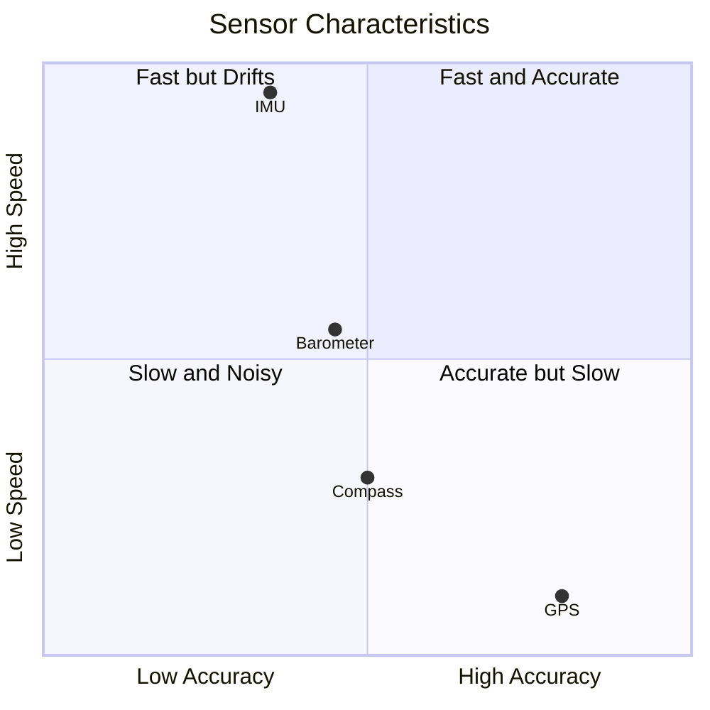
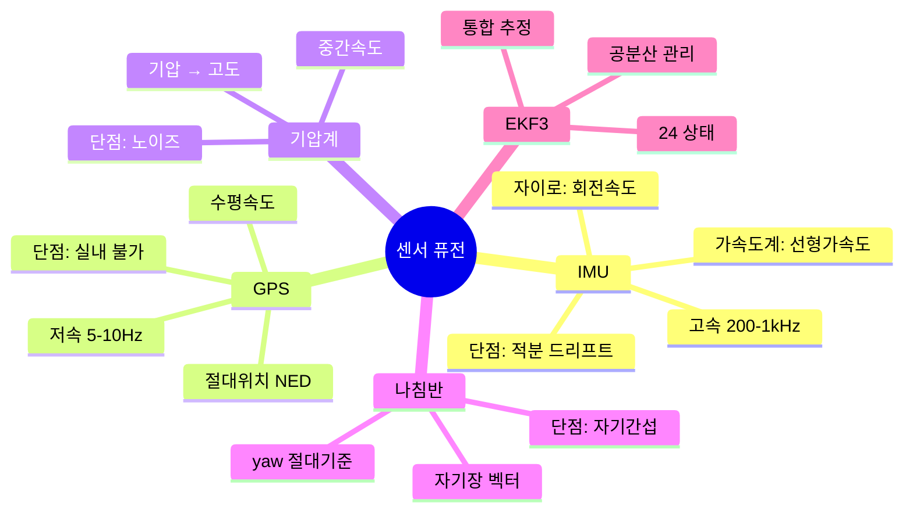
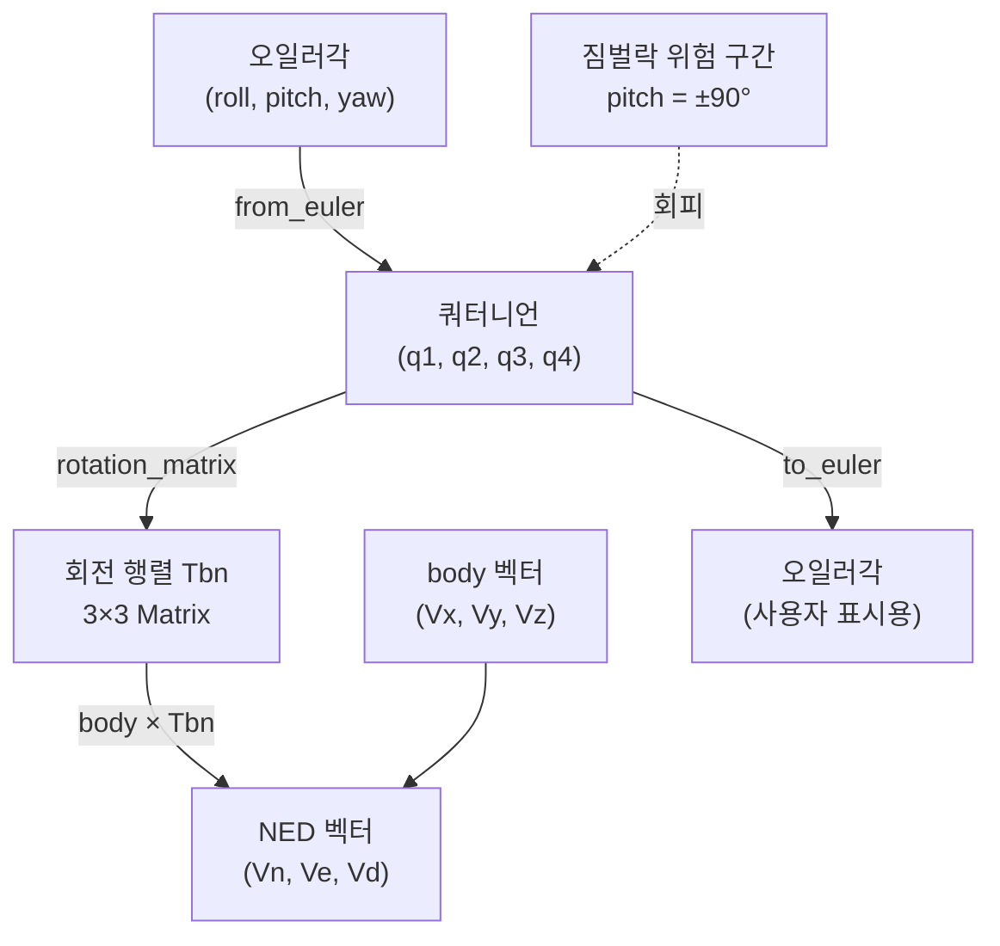
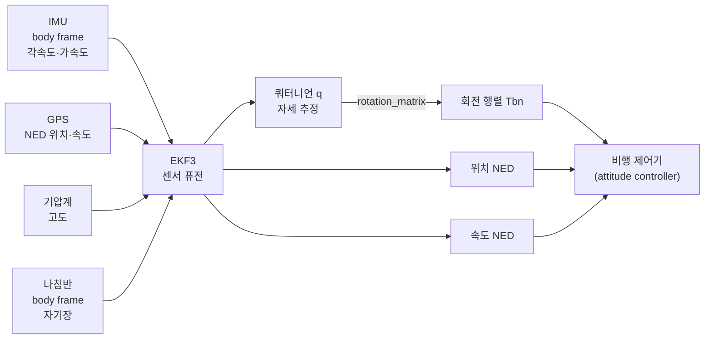

# CH14. 센서 퓨전 입문

::: info 학습 목표
- 상태 추정(state estimation)이 왜 필요한지 직관적으로 설명할 수 있다.
- IMU, GPS, 기압계, 나침반 각각의 강점과 약점을 표로 정리할 수 있다.
- NED 좌표계와 body 좌표계의 차이, 두 좌표계 간 변환이 왜 필요한지 설명할 수 있다.
- 오일러각의 짐벌락 문제를 이해하고, 쿼터니언이 이를 어떻게 해결하는지 설명할 수 있다.
- ArduPilot의 `from_euler`, `rotation_matrix` 함수가 실제로 무엇을 하는지 코드로 확인할 수 있다.
:::

## 1. 상태 추정이란

### 비유: 눈 감고 걷기

눈을 감고 방 안을 걷는다고 상상해보자. 발의 걸음 수로 얼마나 이동했는지 추측할 수 있다(IMU 적분과 비슷). 그런데 조금씩 오차가 쌓여서 결국 실제 위치와 달라진다. 가끔 눈을 떠서 창문이나 가구를 보면 위치를 수정할 수 있다(GPS 보정과 비슷). 문제는 창문이 항상 보이지 않고, 어두우면 보이지 않으며, 보이더라도 정확히 몇 미터 거리인지 즉각 알기 어렵다.

드론의 상황도 똑같다. IMU(가속도계 + 자이로)는 매우 빠르게 운동을 감지하지만 오차가 누적된다. GPS는 절대 위치를 알려주지만 느리고 신호가 없으면 쓸 수 없다. 기압계는 고도를 알려주지만 기압 변화 노이즈가 크다. 나침반은 북쪽 방향(yaw)을 알려주지만 근처 금속이나 모터 전류에 쉽게 간섭받는다.

**상태 추정(state estimation)**이란 이처럼 불완전한 여러 센서의 정보를 조합해 드론의 "진짜 상태"(자세·속도·위치)를 최대한 정확히 추측하는 것이다.

### 상태(state)란 무엇인가

드론의 상태는 보통 다음으로 정의된다.

| 종류 | 변수 | 단위 |
|------|------|------|
| 자세 | roll, pitch, yaw | rad |
| 위치 | N, E, D | m |
| 속도 | Vn, Ve, Vd | m/s |
| 자이로 바이어스 | bx, by, bz | rad/s |
| 가속도계 바이어스 | bax, bay, baz | m/s² |
| 지자기 벡터 | mn, me, md | gauss |

EKF3는 이 24개 이상의 상태를 동시에 추정한다(17장에서 자세히).

## 2. 각 센서의 강점과 약점



| 센서 | 강점 | 약점 | 사용 목적 |
|------|------|------|----------|
| **IMU** (가속도계 + 자이로) | 200~1000Hz, 응답 빠름, 세 축 전부 | 적분 누적 드리프트, 온도·진동 바이어스 | 짧은 시간 자세·속도 변화 추적 |
| **GPS** | 절대 위치 제공, 장기 오차 없음 | 5~10Hz로 느림, 실내·터널 불가, 초기 수신 시간 | 위치·수평 속도 장기 보정 |
| **기압계** | 저렴, 지속 사용 가능, 중간 속도 | 온도·바람·기압 변화 노이즈, 엔진 진동 취약 | 수직 위치(고도) 보정 |
| **나침반** | yaw(방위각) 절대 기준 | 모터 전류·금속·PCB 간섭 심각 | yaw 드리프트 보정 |

::: tip 센서 보완 원리
IMU는 빠르지만 장기 오차가 있고, GPS/기압계/나침반은 느리지만 절대 기준을 제공한다. 이 두 특성을 합치면 빠르고 정확한 추정이 가능하다. 이것이 센서 퓨전의 핵심이다.
:::



## 3. 좌표계: NED와 body frame

드론의 운동을 기술하려면 기준 좌표계가 필요하다. ArduPilot은 두 가지 좌표계를 핵심으로 사용한다.

### NED 좌표계 (지구 고정)

NED는 **N**orth-**E**ast-**D**own의 약자다.

- **X축**: 북쪽(North) 방향, 양의 방향이 북
- **Y축**: 동쪽(East) 방향, 양의 방향이 동
- **Z축**: 아래(Down) 방향, 양의 방향이 지하

Z축이 아래를 향하는 것이 처음에는 이상하게 느껴진다. 항공·해양 분야에서는 고도를 음수 Z로 표현하는 관례가 있어서 고도가 높으면 Z값이 작아(더 음수)진다. 기압계 고도가 증가하면 NED에서 D(down) 성분이 줄어든다.

ArduPilot에서 GPS 속도, EKF 출력, 위치 추정 모두 NED 기준으로 제공된다.

```cpp
// AP_AHRS.h:280 - NED 기준 속도 반환
bool get_velocity_NED(Vector3f &vec) const WARN_IF_UNUSED;
```

### body frame (기체 고정)

body frame은 기체에 고정된 좌표계다.

- **X축**: 기체 전방(nose) 방향
- **Y축**: 기체 우측(starboard) 방향  
- **Z축**: 기체 아래(belly) 방향

IMU 센서는 항상 body frame으로 측정값을 출력한다. 자이로가 "X축 30°/s"를 출력한다는 것은 기체 전방 축 기준으로 30°/s 회전하고 있다는 의미다.


### 왜 좌표계 변환이 필요한가

자이로가 body frame에서 측정한 각속도를 NED에서의 자세 변화율로 바꾸려면 회전 변환이 필요하다. 예를 들어, 기체가 45도 yaw(수평 회전)된 상태에서 pitch(앞뒤 기울임)를 한다면, body frame의 X 가속도는 NED에서 북쪽과 동쪽 성분으로 나뉘어 들어간다.

이 변환을 담당하는 것이 **회전 행렬(rotation matrix)** 또는 **쿼터니언**이다. ArduPilot에서는 `get_rotation_body_to_ned()`로 현재의 변환 행렬을 얻는다.

```cpp
// AP_AHRS.h:665 - body frame → NED 회전 행렬 반환
const Matrix3f &get_rotation_body_to_ned(void) const { return state.dcm_matrix; }
```

## 4. 자세 표현: 오일러각과 쿼터니언

### 오일러각(Euler Angles)

오일러각은 roll(X축 회전), pitch(Y축 회전), yaw(Z축 회전) 세 값으로 자세를 표현한다. 직관적이다. roll=0, pitch=10°, yaw=270°처럼 읽기 쉽다.

문제는 **짐벌락(gimbal lock)**이다.

짐벌락은 pitch가 ±90°에 근접했을 때 발생한다. pitch가 90°가 되면 roll 회전과 yaw 회전이 수학적으로 같은 축을 가리키게 되어, 두 자유도가 하나로 겹친다. 즉 원래 3자유도인 자세 표현이 2자유도로 줄어들어, 특정 방향으로의 회전이 표현 불가능해진다.

기체를 수직으로 세워 90° 위를 향할 때(straight-up hover-to-vertical 기동) 이 문제가 실제로 나타난다. 수치 불안정으로 자세 추정이 발산할 수 있다.

### 쿼터니언(Quaternion)

쿼터니언은 4개의 수(q1, q2, q3, q4)로 회전을 표현한다.

```
q = q1 + q2·i + q3·j + q4·k
```

수학적으로 단위 쿼터니언은 3D 회전을 짐벌락 없이 표현할 수 있다. 모든 방향으로 부드럽게 보간(interpolation)할 수 있고, 연속 회전의 수치 안정성이 좋다.

ArduPilot은 내부적으로 쿼터니언을 사용하고, 사용자에게는 편의를 위해 오일러각 API도 함께 제공한다.

### ArduPilot 쿼터니언 구현

```cpp
// libraries/AP_Math/quaternion.cpp:421
void QuaternionT<T>::from_euler(T roll, T pitch, T yaw)
{
    const T cr2 = cosF(roll*0.5);
    const T cp2 = cosF(pitch*0.5);
    const T cy2 = cosF(yaw*0.5);
    const T sr2 = sinF(roll*0.5);
    const T sp2 = sinF(pitch*0.5);
    const T sy2 = sinF(yaw*0.5);

    q1 = cr2*cp2*cy2 + sr2*sp2*sy2;
    q2 = sr2*cp2*cy2 - cr2*sp2*sy2;
    q3 = cr2*sp2*cy2 + sr2*cp2*sy2;
    q4 = cr2*cp2*sy2 - sr2*sp2*cy2;
}
```

`from_euler`는 오일러각을 받아 쿼터니언을 계산한다. 각도를 절반으로 나눈 뒤 cos/sin을 조합하는 것이 핵심이다. 짐벌락 문제가 있는 오일러각을 안전한 쿼터니언으로 변환하는 입구 역할을 한다 `(libraries/AP_Math/quaternion.cpp:421)`.

쿼터니언에서 회전 행렬로의 변환은 `rotation_matrix`가 담당한다.

```cpp
// libraries/AP_Math/quaternion.cpp:34
void QuaternionT<T>::rotation_matrix(Matrix3d &m) const
{
    const T q3q3 = q3 * q3;
    const T q3q4 = q3 * q4;
    // ...
    m.a.x = 1.0f-2.0f*(q3q3 + q4q4);
    m.a.y = 2.0f*(q2q3 - q1q4);
    m.a.z = 2.0f*(q2q4 + q1q3);
    // ...
}
```

쿼터니언 성분들의 곱으로 9개의 회전 행렬 원소를 만들어낸다 `(libraries/AP_Math/quaternion.cpp:34)`. 이 행렬이 바로 body frame과 NED frame 간의 변환 행렬 Tbn이다.

::: tip 쿼터니언을 쓰는 이유 요약
1. 짐벌락 없음: ±90° pitch에서도 표현 가능
2. 수치 안정성: 적분 오차가 오일러각보다 느리게 누적
3. 구면 보간(SLERP) 가능: 두 자세 사이를 자연스럽게 보간
4. 벡터 회전이 빠름: 행렬 곱보다 연산량 적음
:::



## 5. 회전 흐름 전체 그림

센서 퓨전 전체 흐름을 정리하면 다음과 같다.



각 센서는 서로 다른 좌표계에서 서로 다른 주기로 데이터를 제공한다. EKF3는 이것들을 하나의 통합된 상태 벡터로 합친다. 이 상태 벡터에서 자세는 쿼터니언으로 표현되고, 필요하면 오일러각이나 회전 행렬로 변환해서 제어기에 넘긴다.

다음 챕터에서는 이 "합치는" 과정의 핵심 알고리즘인 칼만 필터를 직관적으로 살펴본다.

::: tip 핵심 정리
- 상태 추정: 불완전한 센서들을 조합해 자세·속도·위치를 추측하는 것
- IMU는 빠르지만 드리프트, GPS/Baro/Compass는 느리지만 절대 기준 제공
- NED: X→북, Y→동, Z→아래. body: X→전방, Y→우, Z→아래
- 두 좌표계 변환에 회전 행렬(Tbn) 또는 쿼터니언 사용
- 오일러각의 짐벌락 문제 → 쿼터니언으로 해결
- `from_euler` → 쿼터니언 변환, `rotation_matrix` → 3×3 행렬 생성
:::

## 다음 챕터

[CH15. 칼만 필터 직관](/study/ardupilot/15-kalman-filter) — 여러 센서를 "어떻게" 합치는지, 예측과 보정 두 단계의 수학적 직관을 1상태 toy 예제로 이해한다.
