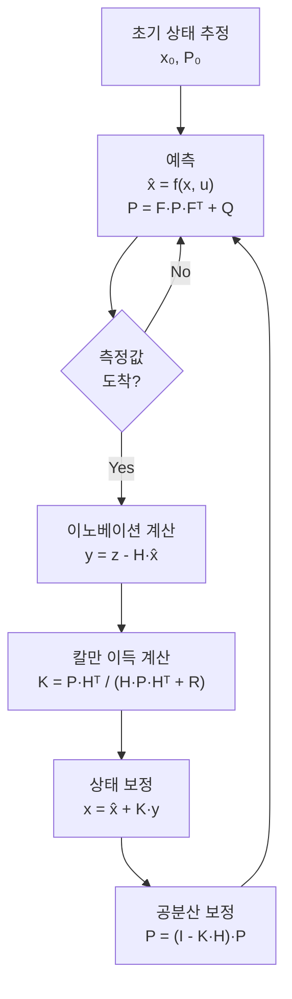

# CH15. 칼만 필터 직관

::: info 학습 목표
- 칼만 필터의 예측(predict)과 보정(update) 두 단계를 직관적으로 설명할 수 있다.
- 공분산 P가 무엇을 의미하는지, 시간에 따라 왜 커지는지 설명할 수 있다.
- 칼만 이득 K = P/(P+R)의 의미를 가중평균으로 해석할 수 있다.
- 1상태 고도 추정 예제를 숫자로 따라갈 수 있다.
- 선형 칼만 필터와 EKF의 차이, 자코비안이 무엇인지 설명할 수 있다.
- ArduPilot이 EKF3를 선택한 이유를 설명할 수 있다.
:::

## 1. 왜 칼만 필터가 필요한가

14장에서 보았듯이 각 센서는 저마다 약점이 있다. IMU는 빠르지만 드리프트한다. GPS는 정확하지만 느리고 끊길 수 있다.

가장 단순한 합치기 방법은 "최신 GPS 값을 그냥 쓴다"는 것이다. 그러면 GPS가 끊기는 순간 위치 추정이 멈춘다.

또 다른 방법은 "GPS와 IMU 적분값을 반반씩 더한다"는 것이다. 그런데 IMU는 100Hz, GPS는 5Hz로 속도가 달라서 반반이 의미 없다. 게다가 GPS 노이즈가 크면 IMU 적분값이 훨씬 정확할 수 있고, 반대로 오래 날면 IMU 드리프트가 커져서 GPS가 더 믿을 만하다.

**칼만 필터**는 이 "얼마나 믿을지"를 상황에 따라 자동으로 계산해주는 알고리즘이다.

## 2. 칼만 필터의 두 단계

칼만 필터는 두 단계를 끝없이 반복한다.


### 예측 단계 (Predict)

IMU에서 가속도·각속도가 들어온다. 이를 적분해서 "dt 뒤에 드론이 어디 있을지" 추측한다.

이 추측에는 불확실성이 있다. IMU에 노이즈가 있고, 적분 오차가 있기 때문이다. 이 불확실성을 **공분산(covariance) P**로 수치화한다.

예측만 계속 하면 P가 점점 커진다. IMU 적분을 오래 할수록 위치 추정이 불확실해진다는 뜻이다.

### 보정 단계 (Update)

GPS나 기압계 측정값이 들어온다. 예측값과 측정값을 비교해서 추정값을 수정한다.

예측값과 측정값의 차이를 **이노베이션(innovation)** 이라 한다.

```
innovation = 측정값 - 예측값
```

이노베이션이 크다 = 예측이 크게 빗나갔다 = 측정을 더 많이 신뢰해야 한다.

보정 후에는 P가 줄어든다. 측정으로 불확실성이 해소되었기 때문이다.



## 3. 칼만 이득: 얼마나 측정을 믿을까

보정 단계의 핵심은 **칼만 이득 K**다.

1상태(스칼라) 경우를 보면 이해하기 쉽다.

```
K = P / (P + R)
```

- **P**: 예측의 불확실성 (내가 얼마나 모르는지)
- **R**: 측정의 노이즈 (센서가 얼마나 믿을 만한지)
- **K**: 0~1 사이의 이득

직관으로 해석하면:

| 상황 | P 값 | R 값 | K 값 | 동작 |
|------|------|------|------|------|
| IMU 드리프트 오래됨 | 크다 | 작다 | ≈1 | 측정(GPS)을 거의 그대로 씀 |
| 방금 IMU 초기화 | 작다 | 크다 | ≈0 | 예측값 유지, 측정 거의 무시 |
| 균형 상태 | 중간 | 중간 | 0.5 | 예측과 측정을 반반 |

보정 공식:

```
x_new = x̂ + K × (측정값 - x̂)
      = x̂ × (1 - K) + 측정값 × K
```

이것은 예측값과 측정값의 **가중평균**이다. K가 1이면 측정값, K가 0이면 예측값을 그대로 쓴다.

## 4. 1상태 toy 예제: 고도 추정

숫자를 직접 따라가보자. 기압계로 고도를 추정하는 단순한 1상태 예제다.

### 초기 조건

```
x₀ = 100m       (초기 고도 추정)
P₀ = 4.0        (초기 불확실성, 분산: ±2m 정도)
Q  = 0.1        (프로세스 노이즈: IMU 적분 불확실성)
R  = 9.0        (측정 노이즈: 기압계 분산, ±3m 정도)
```

### 첫 번째 시간 스텝 (측정값 = 102m)

**예측 단계:**
```
x̂ = x₀ = 100m          (IMU 적분으로 고도 변화 없다고 가정)
P = P₀ + Q = 4.0 + 0.1 = 4.1   (불확실성 증가)
```

**보정 단계:**
```
innovation = 102 - 100 = 2m
K = 4.1 / (4.1 + 9.0) = 4.1 / 13.1 ≈ 0.313

x_new = 100 + 0.313 × 2 ≈ 100.63m
P_new = (1 - 0.313) × 4.1 ≈ 2.82    (불확실성 감소)
```

측정값(102m)과 예측값(100m) 사이, 측정보다 예측에 더 가까운 곳으로 이동했다. 기압계 노이즈(R=9)가 크기 때문에 측정을 31%만 신뢰한 것이다.

### 두 번째 시간 스텝 (측정값 없음)

**예측만:**
```
P = 2.82 + 0.1 = 2.92   (측정 없으므로 불확실성 증가)
x̂ = 100.63m             (IMU 적분으로 추측)
```

### 세 번째 시간 스텝 (측정값 = 105m)

```
K = 2.92 / (2.92 + 9.0) = 2.92 / 11.92 ≈ 0.245
x_new = 100.63 + 0.245 × (105 - 100.63) ≈ 101.70m
P_new = (1 - 0.245) × 2.92 ≈ 2.20
```

::: tip P의 수렴
P값은 시간이 지나면서 일정값에 수렴한다. 예측으로 증가하고 보정으로 감소하는 것을 반복하다 보면 `Q`와 `R`의 비율에 의해 결정되는 정상 상태(steady state)에 도달한다. 이 상태에서 K는 거의 상수가 된다.
:::

## 5. EKF: Extended Kalman Filter

위 예제는 완벽히 **선형**이었다. 다음 위치 = 현재 위치 + 속도 × dt. 이것은 직선이다.

드론의 실제 운동은 **비선형**이다. 자세가 바뀌면 body frame의 가속도를 NED로 변환하는 공식에 sin, cos이 등장한다. 비선형 함수가 들어가면 기본 칼만 필터가 제대로 동작하지 않는다.

**EKF(Extended Kalman Filter)**의 핵심 아이디어는 이렇다.

> 매 순간 현재 상태 근처에서 비선형 함수를 선형으로 근사한다.

이 선형 근사가 **자코비안(Jacobian)** 행렬이다. 비선형 함수 f(x)를 현재 x 근처에서 미분해 기울기 행렬 F = ∂f/∂x를 구한다. 그 기울기를 "선형 시스템처럼" 칼만 필터 공식에 대입한다.

```
일반 칼만: P_pred = F × P × Fᵀ + Q
EKF:       F = 자코비안 ∂f/∂x (매 스텝 재계산)
```

비선형성이 강하지 않으면 이 근사가 꽤 잘 동작한다. 드론의 자세 변화는 대부분 작은 각도 범위에서 일어나므로 EKF가 충분히 정확하다.

::: tip EKF의 한계
자코비안 계산은 추가 CPU를 요구한다. 비선형성이 극단적으로 강하면 근사 오차가 커져서 발산할 수 있다. 이를 극복하는 방법이 UKF(Unscented KF)나 파티클 필터지만, 드론 임베디드에서는 대부분 EKF로 충분하다.
:::

## 6. 의사코드: 예측-보정 한 사이클

```python
# 1상태 스칼라 EKF 의사코드

def predict(x, P, u, Q):
    # u: 제어 입력(IMU 적분값)
    # F: 상태 전이 자코비안 (1상태에서는 스칼라 1)
    x_pred = f(x, u)        # 비선형 상태 전이 함수
    F = jacobian_f(x, u)    # 자코비안 (선형화)
    P_pred = F * P * F + Q  # 공분산 전파
    return x_pred, P_pred

def update(x_pred, P_pred, z, R):
    # z: 측정값
    # H: 측정 모델 자코비안 (1상태에서는 1)
    H = jacobian_h(x_pred)
    y = z - h(x_pred)                    # innovation
    S = H * P_pred * H + R               # innovation 공분산
    K = P_pred * H / S                   # 칼만 이득
    x_new = x_pred + K * y               # 상태 보정
    P_new = (1 - K * H) * P_pred        # 공분산 보정
    return x_new, P_new

# 메인 루프
x, P = init()
while flying:
    u = read_imu()
    x, P = predict(x, P, u, Q)
    
    if gps_available():
        z = read_gps()
        x, P = update(x, P, z, R_gps)
    
    if baro_available():
        z = read_baro()
        x, P = update(x, P, z, R_baro)
```

ArduPilot의 실제 EKF3는 24개 이상의 상태를 다루므로 모든 변수가 벡터·행렬로 바뀌지만, 구조는 동일하다. 17장에서 실제 코드를 본다.

::: tip 핵심 정리
- 칼만 필터 = 예측(IMU) + 보정(GPS·Baro·Compass) 반복
- P(공분산): 예측의 불확실성. 예측으로 증가, 보정으로 감소
- 칼만 이득 K = P/(P+R): 예측 신뢰도 vs 측정 신뢰도의 가중치
- K=1이면 측정 전적 신뢰, K=0이면 예측 유지
- EKF: 비선형 함수를 자코비안으로 매 순간 선형화해 기본 칼만 공식 적용
- ArduPilot은 EKF3를 기본 백엔드로 사용
:::

## 다음 챕터

[CH16. AHRS와 DCM](/study/ardupilot/16-ahrs-dcm) — ArduPilot의 AHRS 프론트엔드 구조, 백엔드 선택·폴백 메커니즘, EKF 이전의 DCM 상보필터를 소스 코드와 함께 분석한다.
