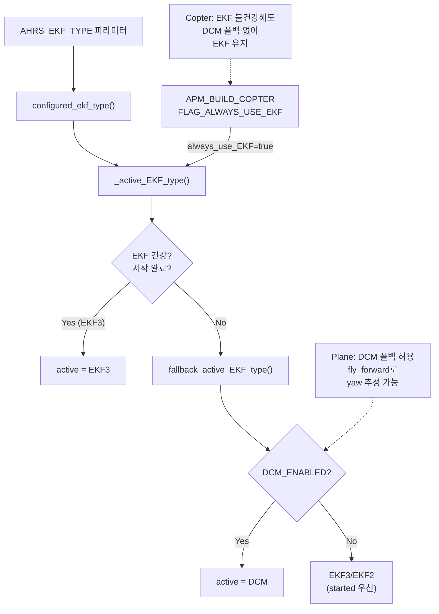
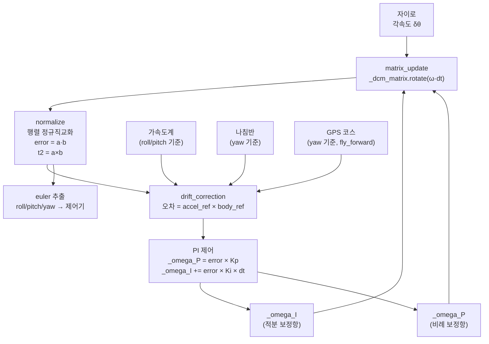
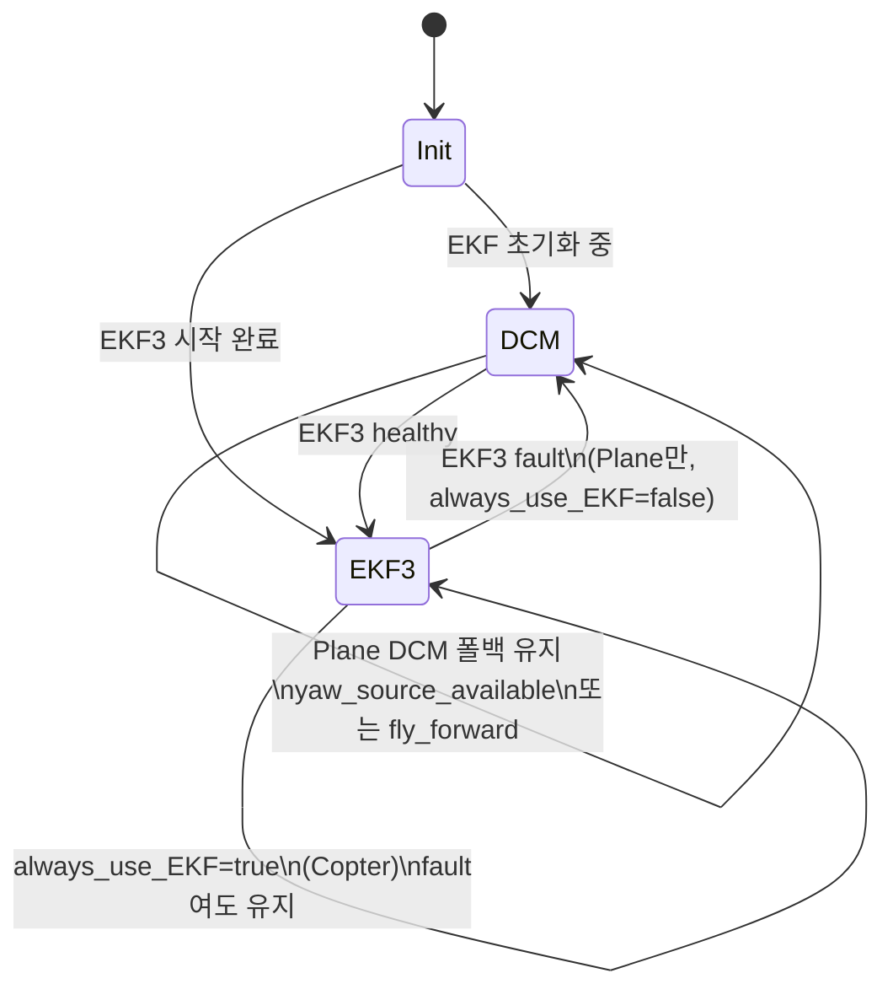

# CH16. AHRS와 DCM

::: info 학습 목표
- AHRS가 무엇이고, 왜 프론트엔드 인터페이스가 필요한지 설명할 수 있다.
- `EKFType` enum과 `AHRS_EKF_TYPE` 파라미터의 관계를 설명할 수 있다.
- `_active_EKF_type()` 함수가 건강 상태에 따라 동적으로 백엔드를 전환하는 로직을 설명할 수 있다.
- Copter는 EKF 필수, Plane은 DCM 폴백이 가능한 이유를 코드로 확인할 수 있다.
- DCM 업데이트 사이클의 세 단계(matrix_update, normalize, drift_correction)를 설명할 수 있다.
- DCM의 한계와 EKF3로 전환된 이유를 설명할 수 있다.
:::

## 1. AHRS란

**AHRS(Attitude and Heading Reference System)**는 드론의 자세(Attitude), 방위(Heading), 그리고 위치·속도 추정 결과를 통합해서 제공하는 시스템이다.

ArduPilot에서 AHRS는 두 가지 역할을 한다.

1. **프론트엔드 인터페이스**: 비행 제어기(ArduCopter, ArduPlane 등)가 자세를 물어볼 때 `get_roll()`, `get_pitch()` 같은 단일 API를 제공한다. 내부적으로 EKF3를 쓰든 DCM을 쓰든 호출 코드는 바뀌지 않는다.
2. **백엔드 관리자**: 여러 추정 백엔드(DCM, EKF2, EKF3, External) 중 현재 가장 신뢰할 수 있는 것을 선택하고, 문제가 생기면 폴백(fallback)한다.

```cpp
// libraries/AP_AHRS/AP_AHRS.h:665
const Matrix3f &get_rotation_body_to_ned(void) const { return state.dcm_matrix; }

// libraries/AP_AHRS/AP_AHRS.h:622-630
float get_roll()  const { return roll; }
float get_pitch() const { return pitch; }
float get_yaw()   const { return yaw; }

// libraries/AP_AHRS/AP_AHRS.h:213
bool get_quaternion(Quaternion &quat) const WARN_IF_UNUSED;

// libraries/AP_AHRS/AP_AHRS.h:280
bool get_velocity_NED(Vector3f &vec) const WARN_IF_UNUSED;

// libraries/AP_AHRS/AP_AHRS.h:106
bool get_location(Location &loc) const WARN_IF_UNUSED;
```

비행 제어기는 `AP::ahrs().get_roll()`처럼 호출하면 된다. 현재 활성 백엔드가 무엇인지 알 필요가 없다.

## 2. 백엔드 선택: EKFType enum

### EKFType 정의

```cpp
// libraries/AP_AHRS/AP_AHRS.h:504
enum class EKFType : uint8_t {
#if AP_AHRS_DCM_ENABLED
    DCM = 0,
#endif
#if AP_AHRS_NAVEKF3_ENABLED
    THREE = 3,
#endif
#if AP_AHRS_NAVEKF2_ENABLED
    TWO = 2,
#endif
#if AP_AHRS_SIM_ENABLED
    SIM = 10,
#endif
#if AP_AHRS_EXTERNAL_ENABLED
    EXTERNAL = 11,
#endif
};
```

숫자가 파라미터 `AHRS_EKF_TYPE`에 그대로 매핑된다. 사용자가 GCS에서 `AHRS_EKF_TYPE=3`으로 설정하면 EKF3를 사용하도록 요청하는 것이다 `(libraries/AP_AHRS/AP_AHRS.h:504)`.

### 동적 백엔드 전환

설정한 EKF 타입이 항상 활성화되는 것은 아니다. EKF가 초기화 중이거나 오류가 감지되면 자동으로 폴백한다.

```cpp
// libraries/AP_AHRS/AP_AHRS.cpp:1630
AP_AHRS::EKFType AP_AHRS::_active_EKF_type(void) const
{
    EKFType ret = fallback_active_EKF_type();

    switch (configured_ekf_type()) {
    case EKFType::THREE: {
        // EKF3가 아직 시작 안 됐으면 폴백
        if (!ekf3.started) {
            return fallback_active_EKF_type();
        }
        if (always_use_EKF()) {
            // Copter/Sub: 오류 0인 경우만 EKF3 사용
            uint16_t ekf3_faults;
            ekf3.EKF3.getFilterFaults(ekf3_faults);
            if (ekf3_faults == 0) {
                ret = EKFType::THREE;
            }
        } else if (ekf3_estimates.healthy) {
            ret = EKFType::THREE;
        }
        break;
    }
    // ...
    }
    // ...
    return ret;
}
```

매 업데이트 사이클마다 `update_active_EKF_type()`이 호출되어 `active_backend` 포인터를 갱신한다 `(libraries/AP_AHRS/AP_AHRS.cpp:312)`.

### 폴백 우선순위

```cpp
// libraries/AP_AHRS/AP_AHRS.cpp:1798
AP_AHRS::EKFType AP_AHRS::fallback_active_EKF_type(void) const
{
#if AP_AHRS_DCM_ENABLED
    return EKFType::DCM;   // DCM이 최후 보루
#endif

#if HAL_NAVEKF3_AVAILABLE
    if (ekf3.started) {
        return EKFType::THREE;
    }
#endif
    // ...
}
```

DCM이 활성화된 빌드에서는 DCM이 항상 최후 폴백이다. DCM은 자이로와 가속도계만 있으면 작동하기 때문이다 `(libraries/AP_AHRS/AP_AHRS.cpp:1798)`.

## 3. Copter vs Plane: 폴백 정책 차이

Copter와 Sub는 생성자에서 `FLAG_ALWAYS_USE_EKF` 플래그를 설정한다.

```cpp
// libraries/AP_AHRS/AP_AHRS.cpp:256
#if APM_BUILD_COPTER_OR_HELI || APM_BUILD_TYPE(APM_BUILD_ArduSub)
    // Copter and Sub force the use of EKF
    _ekf_flags |= AP_AHRS::FLAG_ALWAYS_USE_EKF;
#endif
```

이 플래그가 켜지면 `always_use_EKF()` 가 true를 반환하고, EKF가 오류 상태인 경우 DCM으로 폴백하는 대신 EKF 오류 상태 그대로 사용한다. 즉 DCM으로 조용히 넘어가지 않는다 `(libraries/AP_AHRS/AP_AHRS.cpp:256)`.

Copter는 고도 제어를 기압계로 하고, 위치 제어를 GPS로 한다. EKF 없이는 이 두 가지가 불가능하므로, DCM 폴백은 의미가 없다. 차라리 EKF가 불건강하다는 것을 알리고 비행을 중단시키는 것이 안전하다.

반면 Plane은 `FIXED_WING` 클래스 판별로 DCM 폴백을 허용한다.

```cpp
// libraries/AP_AHRS/AP_AHRS.cpp:1692
if (_vehicle_class == VehicleClass::FIXED_WING ||
    _vehicle_class == VehicleClass::GROUND) {
    // Handle fallback for the case where DCM or EKF is unable to provide...
    const bool can_use_dcm = dcm.yaw_source_available() || fly_forward;
    // ...
}
```

고정익은 앞으로 날아가는 것만으로도 GPS 코스로 yaw를 추정할 수 있어서(`fly_forward`), EKF 없이도 기본 자세를 유지할 수 있기 때문이다.



## 4. DCM: 칼만 이전의 상보필터

**DCM(Direction Cosine Matrix)**은 EKF3가 등장하기 전 ArduPilot이 사용하던 자세 추정 알고리즘이다. 현재도 EKF 폴백 및 일부 고정익에서 사용된다.

DCM의 핵심 아이디어는 간단하다.

> 자이로 적분으로 빠른 회전을 추적하되, 가속도계·나침반·GPS로 드리프트를 PI 피드백으로 보정한다.

`_dcm_matrix`는 3×3 회전 행렬로, body frame → NED 변환 행렬이다.

### 업데이트 사이클 개요

```cpp
// libraries/AP_AHRS/AP_AHRS_DCM.cpp:78-84
matrix_update();    // 1단계: 자이로로 행렬 갱신
normalize();        // 2단계: 수치 오차 정규직교화
drift_correction(delta_t); // 3단계: 가속도계·나침반·GPS로 드리프트 보정
```

세 단계가 매 스케줄러 사이클마다 순서대로 실행된다 `(libraries/AP_AHRS/AP_AHRS_DCM.cpp:78)`.

### 1단계: matrix_update — 자이로 적분

```cpp
// libraries/AP_AHRS/AP_AHRS_DCM.cpp:255
void AP_AHRS_DCM::matrix_update(void)
{
    Vector3f delta_angle;
    float dangle_dt;
    if (_ins.get_delta_angle(delta_angle, dangle_dt) && dangle_dt > 0) {
        _omega = delta_angle / dangle_dt;
        _omega += _omega_I;
        _dcm_matrix.rotate((_omega + _omega_P + _omega_yaw_P) * dangle_dt);
    }
    _omega = _ins.get_gyro() + _omega_I;
}
```

- `delta_angle / dangle_dt`: 순수 자이로 각속도
- `+ _omega_I`: 장기 드리프트 보정 적분항 더하기
- `+ _omega_P + _omega_yaw_P`: 단기 비례 보정항 더하기
- `_dcm_matrix.rotate(...)`: 현재 DCM 행렬에 회전 적용

자이로가 측정한 각속도(에 보정항을 더한 것)로 DCM 행렬을 회전시킨다 `(libraries/AP_AHRS/AP_AHRS_DCM.cpp:265)`.

### 2단계: normalize — 수치 오차 정규직교화

부동소수점 적분을 반복하면 DCM 행렬이 수학적으로 완벽한 회전 행렬에서 벗어난다. 행벡터 a, b가 서로 수직이어야 하는데 미세한 오차가 생긴다.

```cpp
// libraries/AP_AHRS/AP_AHRS_DCM.cpp:437
void AP_AHRS_DCM::normalize(void)
{
    const float error = _dcm_matrix.a * _dcm_matrix.b;  // eq.18: 직교 오차

    const Vector3f t0 = _dcm_matrix.a - (_dcm_matrix.b * (0.5f * error));  // eq.19
    const Vector3f t1 = _dcm_matrix.b - (_dcm_matrix.a * (0.5f * error));  // eq.19
    const Vector3f t2 = t0 % t1;  // c = a × b  eq.20: 외적으로 세 번째 행 복원

    if (!renorm(t0, _dcm_matrix.a) ||
            !renorm(t1, _dcm_matrix.b) ||
            !renorm(t2, _dcm_matrix.c)) {
        AP_AHRS_DCM::reset(true);  // 복구 불가면 초기화
    }
}
```

오차를 반반씩 나누어 두 행벡터에서 제거하고, 세 번째 행은 외적으로 복원한다. 마지막으로 각 행을 단위 벡터로 정규화(renorm)한다. 이로써 DCM은 매 스텝 올바른 회전 행렬의 성질을 유지한다 `(libraries/AP_AHRS/AP_AHRS_DCM.cpp:437)`.

### 3단계: drift_correction — PI 드리프트 보정

자이로는 바이어스(일정한 오프셋)가 있어서 적분하면 방향이 서서히 틀어진다. 이를 보정하기 위해 가속도계(roll/pitch 기준), 나침반 또는 GPS(yaw 기준)와 비교한다.

```cpp
// libraries/AP_AHRS/AP_AHRS_DCM.cpp:1018
_omega_P = error[besti] * _P_gain(spin_rate) * _kp;

// libraries/AP_AHRS/AP_AHRS_DCM.cpp:1035
if (spin_rate < radians(SPIN_RATE_LIMIT)) {
    _omega_I_sum += error[besti] * _ki * _ra_deltat;
    // ...
}
// ...
_omega_I += _omega_I_sum;
```

- `_omega_P`: **비례항**. 오차에 즉각 반응해 빠르게 끌어당긴다.
- `_omega_I`: **적분항**. 오차를 누적해 장기 드리프트를 천천히 제거한다.

이 두 항이 `matrix_update`에서 자이로값에 더해져서 다음 스텝에 반영된다. 전형적인 PI 상보필터 구조다 `(libraries/AP_AHRS/AP_AHRS_DCM.cpp:1018)`.

yaw 드리프트 보정은 `drift_correction_yaw()`가 별도로 담당한다. 나침반이 있으면 나침반으로, 없으면 GPS 코스로 yaw 오차를 계산한다 `(libraries/AP_AHRS/AP_AHRS_DCM.cpp:585)`.



### DCM 결과 출력

```cpp
// libraries/AP_AHRS/AP_AHRS_DCM.cpp:93-94
_body_dcm_matrix = _dcm_matrix * AP::ahrs().get_rotation_vehicle_body_to_autopilot_body();
_body_dcm_matrix.to_euler(&roll, &pitch, &yaw);
```

trim(기체 장착 오차 보정)을 반영한 뒤 오일러각으로 변환해서 `roll`, `pitch`, `yaw`에 저장한다.

`get_results()`에서 쿼터니언도 DCM 행렬로부터 역산해 제공한다.

```cpp
// libraries/AP_AHRS/AP_AHRS_DCM.cpp:177
results.quaternion.from_rotation_matrix(_dcm_matrix);
```

DCM이 가속도계 바이어스를 추정하지 않는다는 것도 확인할 수 있다.

```cpp
// libraries/AP_AHRS/AP_AHRS_DCM.cpp:188
// results.accel_bias = {} - DCM does not estimate accel bias
```

`(libraries/AP_AHRS/AP_AHRS_DCM.cpp:188)`

## 5. DCM의 한계와 EKF3로의 전환

DCM은 구조가 단순하고 CPU 부담이 작다. 하지만 다음 한계가 있다.

| 항목 | DCM | EKF3 |
|------|-----|------|
| 가속도계 바이어스 추정 | 없음 | 3축 상태로 추정 |
| 자이로 바이어스 추정 | 암묵적 (적분항) | 3축 상태로 추정 |
| 지자기 오염 보정 | 없음 | 3×2 상태로 추정 |
| 바람 추정 | 별도 없음 | 2축 상태 |
| 불확실성 정량화 | 없음 | 공분산 행렬 P |
| 비선형 모델 | 단순 근사 | 자코비안 선형화 |
| 상태 수 | 사실상 9 (DCM 행렬) | 24+ |

DCM은 "지금 오차가 얼마나 큰지"를 수치로 표현하는 공분산이 없다. 이 때문에 센서 가중치를 상황에 맞게 조절하기 어렵고, 고속 기동·진동·강한 자기 간섭 환경에서 자세 추정 품질이 저하된다.

EKF3는 24개 이상의 상태를 공분산과 함께 동시에 추정한다. 가속도계 바이어스, 자이로 바이어스, 지자기 왜곡, 바람까지 상태에 포함하므로 훨씬 강인하다. 그 대신 계산량이 DCM보다 수십 배 이상 크다. 17장에서 EKF3의 내부 구조를 자세히 다룬다.



## 6. AHRS 상위 API 요약

비행 제어기가 실제로 사용하는 주요 API를 정리한다.

```cpp
// 자세 (오일러각, 라디안)
float get_roll()  const;   // AP_AHRS.h:622
float get_pitch() const;   // AP_AHRS.h:623
float get_yaw()   const;   // AP_AHRS.h:624

// 자세 (쿼터니언)
bool get_quaternion(Quaternion &quat) const;  // AP_AHRS.h:213

// 위치
bool get_location(Location &loc) const;       // AP_AHRS.h:106

// NED 속도
bool get_velocity_NED(Vector3f &vec) const;   // AP_AHRS.h:280

// body→NED 회전 행렬
const Matrix3f &get_rotation_body_to_ned(void) const;  // AP_AHRS.h:665
```

반환값이 `bool`인 API는 추정값이 유효하지 않을 수 있다는 의미다. EKF가 수렴하지 않았거나 GPS 없이 위치를 구할 수 없을 때 false가 반환된다. 비행 제어기는 이 반환값을 반드시 확인해야 안전한 동작이 보장된다.

::: tip 핵심 정리
- AHRS = 프론트엔드 인터페이스 + 백엔드(EKF3/EKF2/DCM) 관리자
- EKFType: DCM=0, TWO=2, THREE=3, EXTERNAL=11 (AP_AHRS.h:504)
- `_active_EKF_type()`: EKF 건강·시작 여부 확인 후 실제 활성 백엔드 결정
- Copter: FLAG_ALWAYS_USE_EKF → DCM 폴백 없음, EKF 필수
- Plane: fixed_wing 판별 → DCM 폴백 허용 (fly_forward로 yaw 추정 가능)
- DCM 3단계: matrix_update(자이로 적분) → normalize(정규직교화) → drift_correction(PI 보정)
- `_omega_P` = 비례항(빠른 보정), `_omega_I` = 적분항(장기 드리프트 제거)
- DCM 한계: accel_bias 추정 없음, 공분산 없음 → EKF3로 전환
:::

## 다음 챕터

[CH17. EKF3 구조](/study/ardupilot/17-ekf3-structure) — ArduPilot EKF3의 24상태 벡터, 예측 행렬, 다중 코어 구조를 소스 코드와 함께 상세히 분석한다.
