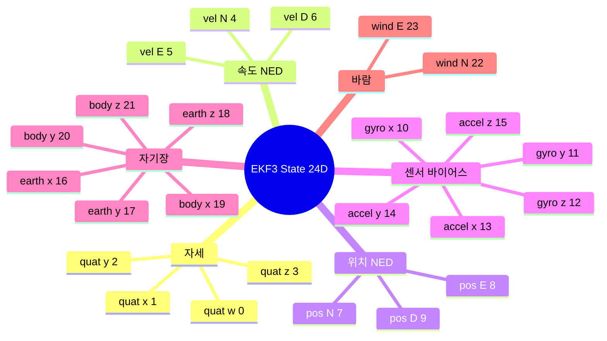
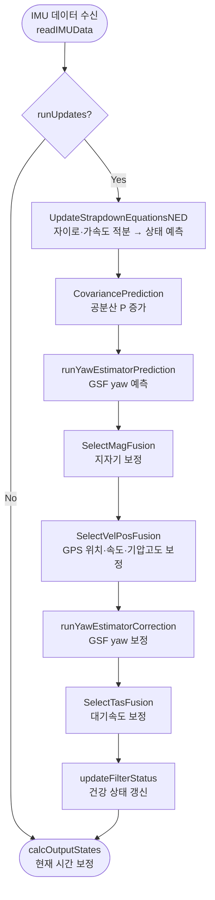
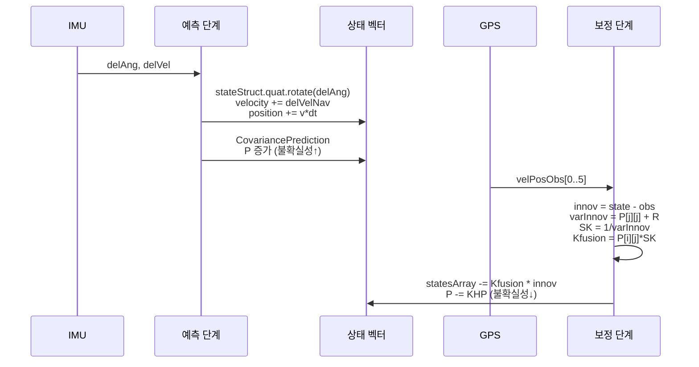

# CH17. EKF3 구조 — 24차원 상태 벡터와 칼만 보정

::: info 학습 목표
- EKF3가 추정하는 24개 상태의 물리적 의미와 인덱스 범위를 설명할 수 있다.
- 공분산 행렬 P의 의미와 초기값 설정 코드를 읽을 수 있다.
- UpdateFilter() 메인 사이클의 실행 순서와 각 단계의 역할을 설명할 수 있다.
- 스트랩다운 적분(UpdateStrapdownEquationsNED)이 자이로·가속도계 데이터를 NED 위치/속도로 변환하는 과정을 이해한다.
- 칼만 이득 계산과 상태·공분산 업데이트 코드를 15장 수식과 연결할 수 있다.
:::

## 1. EKF3란 무엇인가

15장에서 칼만 필터의 직관을 다뤘다. 예측 단계에서는 IMU로 상태를 전파하고 불확실성이 커지며, 보정 단계에서는 외부 측정(GPS, 지자기, 기압)으로 불확실성을 줄인다. EKF3는 이 원리를 ArduPilot에 구현한 확장 칼만 필터다.

EKF3는 ArduPilot의 기본 자세·위치 추정기다. 이전에 사용하던 EKF2를 대체하며, 더 강건한 레인 스위칭, GSF yaw 추정기, 더 많은 센서 소스를 지원한다. 비행 컨트롤러가 "지금 나는 어디 있고 어떤 자세인가"를 판단하는 핵심 엔진이다.

## 2. 24차원 상태 벡터

### state_elements 구조체

EKF3가 추정하는 상태는 `state_elements` 구조체에 담긴다. 소스를 보면:

```cpp
struct state_elements {
    QuaternionF quat;           // 0..3
    Vector3F    velocity;       // 4..6
    Vector3F    position;       // 7..9
    Vector3F    gyro_bias;      // 10..12
    Vector3F    accel_bias;     // 13..15
    Vector3F    earth_magfield; // 16..18
    Vector3F    body_magfield;  // 19..21
    Vector2F    wind_vel;       // 22..23
};
```
`(libraries/AP_NavEKF3/AP_NavEKF3_core.h:577)`

이 구조체와 `Vector24 statesArray`는 **같은 메모리를 공유하는 union**으로 선언돼 있다 `(AP_NavEKF3_core.h:588)`. 덕분에 `statesArray[4]`와 `stateStruct.velocity.x`는 동일한 값을 가리킨다.

### 각 상태의 물리적 의미

| 인덱스 | 필드 | 타입 | 의미 |
|--------|------|------|------|
| 0..3 | `quat` | QuaternionF (w,x,y,z) | NED→바디 프레임 회전. 자세(롤·피치·요)를 표현 |
| 4..6 | `velocity` | Vector3F (N,E,D) | NED 기준 IMU 속도 (m/s) |
| 7..9 | `position` | Vector3F (N,E,D) | NED 기준 IMU 위치 (m). 로컬 원점 기준 상대값 |
| 10..12 | `gyro_bias` | Vector3F | 자이로 바이어스 적분량 (rad). 온도·노화로 발생하는 드리프트 보정용 |
| 13..15 | `accel_bias` | Vector3F | 가속도계 바이어스 (m/s). 중력 보정 후 남는 오차 |
| 16..18 | `earth_magfield` | Vector3F | 지구 기준 자기장 벡터 (Gauss). 지자기 보정에 사용 |
| 19..21 | `body_magfield` | Vector3F | 바디 기준 잔류 자기장 (Gauss). 기체 자체 자성 보상 |
| 22..23 | `wind_vel` | Vector2F (N,E) | 수평 바람 속도 (m/s). 고정익 대기속도 보정에 활용 |

::: tip 왜 쿼터니언을 쓰나
오일러각(롤·피치·요)은 직관적이지만 짐벌락(gimbal lock) 문제가 있다. 쿼터니언은 4개 숫자로 짐벌락 없이 임의 회전을 표현한다. 노름(norm)을 1로 유지해야 하므로 스트랩다운 적분 후 항상 `normalize()`를 호출한다.
:::



## 3. 공분산 행렬 P — 불확실성의 수치화

### P의 의미

공분산 행렬 P는 24×24 행렬이다. `P[i][i]`는 i번째 상태의 분산(불확실성의 제곱), `P[i][j]`는 i와 j 상태 사이의 상관관계를 나타낸다. P가 크면 해당 상태를 잘 모른다는 뜻이고, P가 작으면 자신 있다는 뜻이다.

15장 직관: 예측 단계에서 P는 증가하고(더 불확실해짐), 보정 단계에서 P는 감소한다(측정으로 학습).

### 초기화 코드

초기화 시 P를 대각 행렬로 설정한다. 각 상태에 물리적으로 의미 있는 초기 불확실성을 부여한다:

```cpp
P[4][4]   = sq(frontend->_gpsHorizVelNoise);  // 수평 속도 분산
P[7][7]   = sq(frontend->_gpsHorizPosNoise);  // 수평 위치 분산
P[9][9]   = sq(frontend->_baroAltNoise);      // 기압 고도 분산
P[10][10] = sq(radians(InitialGyroBiasUncertainty() * dtEkfAvg)); // 자이로 바이어스
P[16][16] = sq(frontend->_magNoise);          // 지구 자기장
P[22][22] = 0.0f;                             // 바람(초기엔 모름)
```
`(libraries/AP_NavEKF3/AP_NavEKF3_core.cpp:604)`

바람 상태의 초기 분산이 0인 것이 흥미롭다. 비행 중 대기속도 데이터가 들어오기 전까지는 바람을 추정하지 않겠다는 의미다.

## 4. UpdateFilter() — 메인 사이클

### 전체 실행 흐름

`UpdateFilter()`는 IMU 데이터가 들어올 때마다 호출되는 핵심 루프다. 소스를 보면:

```cpp
void NavEKF3_core::UpdateFilter(bool predict)
{
    if (!statesInitialised) { return; }

    readIMUData(predict);

    if (runUpdates) {
        UpdateStrapdownEquationsNED();   // 예측: IMU로 상태 전파
        CovariancePrediction(nullptr);   // 예측: 공분산 증가
        runYawEstimatorPrediction();     // GSF yaw 예측
        SelectMagFusion();               // 보정: 지자기
        SelectVelPosFusion();            // 보정: GPS/기압
        runYawEstimatorCorrection();     // GSF yaw 보정
        SelectTasFusion();               // 보정: 대기속도
        SelectBetaDragFusion();          // 보정: 사이드슬립/드래그
        updateFilterStatus();
    }
    calcOutputStates();  // 융합 시간 → 현재 시간으로 외삽
}
```
`(libraries/AP_NavEKF3/AP_NavEKF3_core.cpp:643)`

예측과 보정이 하나의 루프 안에서 순서대로 실행된다. `calcOutputStates()`는 EKF가 약간 지연된 시간 지평(delayed time horizon)에서 동작하기 때문에 결과를 현재 시간으로 보정하는 보완 필터다.



### 융합 함수 목록

| 함수 | 소스 파일 | 사용 센서 |
|------|-----------|-----------|
| `FuseVelPosNED()` | AP_NavEKF3_PosVelFusion.cpp | GPS 위치/속도, 기압 고도 |
| `FuseMagnetometer()` | AP_NavEKF3_MagFusion.cpp | 3축 지자기 |
| `fuseEulerYaw()` | AP_NavEKF3_MagFusion.cpp | 외부 yaw 센서, GSF 결과 |
| `FuseAirspeed()` | AP_NavEKF3_AirDataFusion.cpp | 피토관 대기속도 |
| `FuseSideslip()` | AP_NavEKF3_AirDataFusion.cpp | 사이드슬립 제약(고정익) |

## 5. UpdateStrapdownEquationsNED() — 스트랩다운 적분

스트랩다운(strapdown)은 관성 센서가 기체에 고정돼(strap) 있다는 뜻이다. 센서값을 지구 좌표로 변환해 적분하는 방식이다.

### 쿼터니언 회전

```cpp
stateStruct.quat.rotate(
    delAngCorrected - prevTnb * earthRateNED * imuDataDelayed.delAngDT
);
stateStruct.quat.normalize();
```
`(libraries/AP_NavEKF3/AP_NavEKF3_core.cpp:767)`

`delAngCorrected`는 자이로 바이어스를 뺀 순수 회전각이다. `prevTnb * earthRateNED * dt`는 지구 자전 보정이다. 고고도 정밀 비행에서는 지구 자전(15°/h)도 무시할 수 없다.

### NED 가속도 변환과 중력 보정

```cpp
Vector3F delVelNav;
delVelNav = prevTnb.mul_transpose(delVelCorrected);  // body → NED 변환
delVelNav.z += GRAVITY_MSS * imuDataDelayed.delVelDT; // 중력 보정
```
`(libraries/AP_NavEKF3/AP_NavEKF3_core.cpp:776)`

가속도계는 중력과 운동가속도를 합쳐서 측정한다. 정지 상태에서도 9.8 m/s²를 읽는다. NED 좌표에서 D(아래) 방향으로 중력을 더해 보정한다.

### 속도·위치 적분

```cpp
Vector3F lastVelocity = stateStruct.velocity;
stateStruct.velocity += delVelNav;
stateStruct.position += (stateStruct.velocity + lastVelocity) * (imuDataDelayed.delVelDT * 0.5f);
```
`(libraries/AP_NavEKF3/AP_NavEKF3_core.cpp:802)`

위치 적분에 현재·이전 속도의 평균을 사용하는 사다리꼴 적분이다. 단순 직사각형 적분보다 정밀도가 높다.

## 6. 칼만 보정 — FuseVelPosNED 코드 해부

15장에서 칼만 보정 수식을 배웠다. 이제 실제 코드와 연결해보자.

### 이노베이션(Innovation) — 예측과 측정의 차이

```cpp
innovVelPos[3] = stateStruct.position.x - velPosObs[3];  // N 위치 이노베이션
innovVelPos[4] = stateStruct.position.y - velPosObs[4];  // E 위치 이노베이션
```
`(libraries/AP_NavEKF3/AP_NavEKF3_PosVelFusion.cpp:909)`

이노베이션 = 예측값 - 측정값. 이 값이 크면 "예측이 틀렸거나 GPS가 튀었다"는 신호다.

### 이노베이션 분산과 칼만 이득

```cpp
varInnovVelPos[obsIndex] = P[stateIndex][stateIndex] + R_OBS[obsIndex];
SK = 1.0f / varInnovVelPos[obsIndex];

for (auto i = 0; i < 24; i++) {
    Kfusion[i] = P[i][stateIndex] * SK;
}
```
`(libraries/AP_NavEKF3/AP_NavEKF3_PosVelFusion.cpp:1136)`

- `varInnov = P[j][j] + R`: 상태 불확실성 + 측정 노이즈
- `SK = 1/varInnov`: 나중에 나눗셈 대신 곱셈으로 계산(성능 최적화)
- `Kfusion[i] = P[i][j] * SK`: i번째 상태가 j번째 측정으로부터 얼마나 보정받는지

15장 수식 `K = P·Hᵀ·(H·P·Hᵀ + R)⁻¹`에서 H가 단위행렬의 한 행(해당 상태만 1)이므로 `H·P·Hᵀ = P[j][j]`, `P·Hᵀ = P[:,j]`가 된다. 코드가 수식과 정확히 일치한다.

### 상태 업데이트와 공분산 업데이트

`FinishFusion()`에서 실제 업데이트가 이뤄진다:

```cpp
// 상태 보정: x_new = x - K * innov
for (auto s = 0; s <= stateIndexLim; s++) {
    statesArray[s] -= Kfusion[s] * innov;
}
stateStruct.quat.normalize();

// 공분산 보정: P = P - KHP
for (auto r = 0; r <= stateIndexLim; r++) {
    for (auto c = 0; c <= r; c++) {
        const ftype lower = P[r][c] - KHP[r][c];
        const ftype upper = P[c][r] - KHP[c][r];
        P[r][c] = P[c][r] = 0.5f * (lower + upper);
    }
}
```
`(libraries/AP_NavEKF3/AP_NavEKF3_core.cpp:2009)`

- 상태 업데이트: `statesArray[s] -= Kfusion[s] * innov` → 15장의 `x = x̂ + K·(z - H·x̂)`
- 공분산 업데이트: `P = P - KHP` → 15장의 `P = (I - K·H)·P`
- 수치 안정성을 위해 상·하 삼각을 평균내 P의 대칭성을 강제한다



## 7. 전체 구조 요약

EKF3는 24개 상태를 관리한다. 자이로·가속도계가 상태를 예측하고 공분산을 키우며, GPS·지자기·기압계가 이노베이션을 통해 상태를 보정하고 공분산을 줄인다. 이 예측-보정 사이클이 400Hz로 반복되면서 드론은 자신의 위치·자세를 지속적으로 파악한다.

::: tip 핵심 정리
- EKF3의 상태 벡터는 `state_elements` 구조체(24개)와 `statesArray[24]`가 union으로 공유된다 `(AP_NavEKF3_core.h:577)`.
- 공분산 P의 대각 원소가 크면 불확실, 작으면 자신 있다는 뜻이다. GPS 노이즈 파라미터로 초기화된다.
- UpdateFilter의 실행 순서: IMU 읽기 → 스트랩다운 예측 → 공분산 예측 → 지자기/GPS/기압 보정.
- 스트랩다운 적분에서 `delVelNav.z += GRAVITY_MSS*dt`로 중력을 보정하고, 사다리꼴 적분으로 위치를 계산한다.
- 칼만 이득 `Kfusion[i] = P[i][j] * SK`로 상태를 보정하고, `P -= KHP`로 공분산을 줄인다. 15장 수식과 1:1 대응된다.
:::

## 다음 챕터

[CH18. EKF3 운영 — 멀티코어 레인 스위칭과 GSF yaw 복구](/study/ardupilot/18-ekf3-operation)에서는 IMU 고장 시 코어를 전환하는 lane switching, GPS 속도만으로 yaw를 추정하는 EKFGSF, 이노베이션 게이트 방어 메커니즘을 다룬다.
