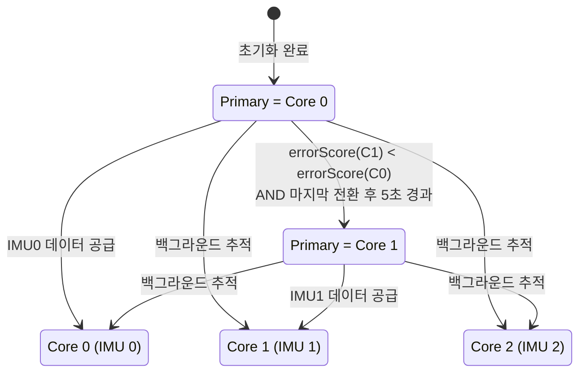
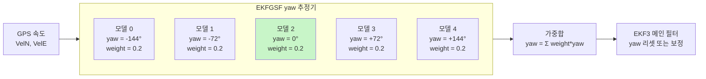
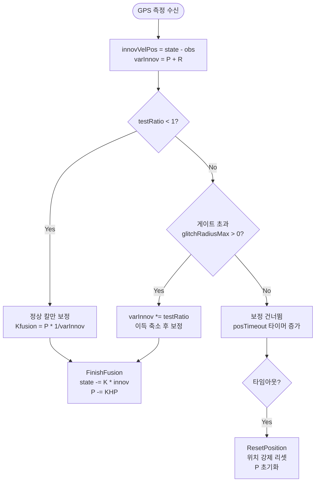

# CH18. EKF3 운영 — 멀티코어 레인 스위칭과 GSF yaw 복구

::: info 학습 목표
- EKF3가 IMU 수만큼 독립 코어를 생성하는 이유와 방법을 설명할 수 있다.
- errorScore 계산식과 lane switching 조건(5초 제한 포함)을 코드로 확인할 수 있다.
- EKFGSF가 5개 가우시안 모델로 나침반 없이 yaw를 추정하는 원리를 설명할 수 있다.
- 이노베이션 게이트가 GPS glitch를 막는 방식을 이해한다.
- healthy() 판단 기준과 timeout 플래그의 역할을 설명할 수 있다.
:::

## 1. 왜 멀티코어가 필요한가

### 단일 IMU의 취약성

IMU(자이로+가속도계)는 EKF3의 유일한 예측 소스다. GPS는 5Hz, 지자기는 10Hz로 드물게 들어오지만 IMU는 400Hz로 끊임없이 들어온다. 이 IMU가 진동이나 충격으로 오염되면 EKF3 전체가 오염된다.

상용 비행 컨트롤러(Cube Orange, Pixhawk 6 등)는 IMU를 2~3개 탑재한다. 각 IMU는 물리적 위치와 격리 방법이 달라 같은 진동을 다르게 받는다. 한 IMU가 오염되면 다른 IMU로 전환할 수 있으면 좋다.

### EKF3의 해법: 코어 1개 = IMU 1개

EKF3는 활성화된 IMU마다 독립 코어(NavEKF3_core 인스턴스)를 생성한다:

```cpp
for (uint8_t i = 0; i < INS_MAX_INSTANCES; i++) {
    if (_imuMask & (1U << i)) {
        coreSetupRequired[num_cores] = true;
        coreImuIndex[num_cores] = i;
        num_cores++;
    }
}
core = (NavEKF3_core*)dal.malloc_type(
    sizeof(NavEKF3_core) * num_cores, AP_DAL::MemoryType::FAST
);
```
`(libraries/AP_NavEKF3/AP_NavEKF3.cpp:831)`

각 코어는 서로 다른 IMU를 사용해 **완전 독립적으로** 상태를 추정한다. GPS·지자기 같은 외부 센서는 모든 코어가 공유한다. 어느 한 코어가 나빠지면 다른 코어로 전환(lane switch)한다.



## 2. errorScore와 lane switching

### errorScore — 코어의 건강 점수

각 코어는 `errorScore()`로 자신의 건강 상태를 수치화한다:

```cpp
float NavEKF3_core::errorScore() const
{
    float score = 0.0f;
    if (tiltAlignComplete && yawAlignComplete) {
        score = MAX(score, 0.5f * (velTestRatio + posTestRatio));
        score = MAX(score, hgtTestRatio);
        if (assume_zero_sideslip()) {
            // 대기속도 센서 2개 이상 있을 때만 고려
            score = MAX(score, 0.3f * tasTestRatio);
        }
        if (frontend->_affinity & EKF_AFFINITY_MAG) {
            score = MAX(score, 0.3f * (magTestRatio.x + magTestRatio.y + magTestRatio.z));
        }
    }
    return score;
}
```
`(libraries/AP_NavEKF3/AP_NavEKF3_Outputs.cpp:62)`

- `velTestRatio`, `posTestRatio`, `hgtTestRatio`는 이노베이션 테스트 비율이다(다음 절에서 설명).
- 값이 1.0보다 크면 측정과 예측이 많이 어긋났다는 의미.
- 0에 가까울수록 건강한 코어다.

### lane switching 조건

```cpp
float primaryErrorScore = core[primary].errorScore();
float lowestErrorScore = primaryErrorScore;
uint8_t newPrimaryIndex = primary;

for (uint8_t coreIndex = 0; coreIndex < num_cores; coreIndex++) {
    if (coreIndex != primary) {
        bool altCoreAvailable =
            newCore.healthy() &&
            newCore.have_aligned_yaw() &&
            newCore.have_aligned_tilt();
        float altErrorScore = newCore.errorScore();
        if (altCoreAvailable && altErrorScore < lowestErrorScore && altErrorScore < 0.9) {
            newPrimaryIndex = coreIndex;
            lowestErrorScore = altErrorScore;
        }
    }
}
switchLane(newPrimaryIndex);
```
`(libraries/AP_NavEKF3/AP_NavEKF3.cpp:1069)`

전환 조건:
1. 대안 코어가 `healthy()` 상태여야 한다.
2. yaw·tilt 정렬이 완료돼야 한다.
3. 대안 코어의 errorScore가 현재 primary보다 낮아야 한다.
4. 대안 코어의 errorScore가 0.9 미만이어야 한다(나쁜 코어로 전환 방지).
5. 마지막 전환 후 **5초**가 지나야 한다(oscillation 방지):

```cpp
if (lastLaneSwitch_ms != 0 && now - lastLaneSwitch_ms < 5000) {
    return;  // 5초 이내엔 재전환 불가
}
```
`(libraries/AP_NavEKF3/AP_NavEKF3.cpp:1064)`

전환 시 `GCS_SEND_TEXT(MAV_SEVERITY_CRITICAL, "EKF3 lane switch %u", primary)`로 GCS에 알린다.

## 3. EKFGSF yaw 추정기 — 나침반 없는 yaw

### 나침반의 취약성

지자기(나침반)는 yaw(방위각) 추정의 주 소스다. 그런데 도시 비행, 금속 구조물 근처, 모터·배선 간섭으로 오염되기 쉽다. 나침반이 완전히 고장 나면 yaw를 잃고 드론은 방향을 모르게 된다.

### EKFGSF의 아이디어

GPS 속도(N, E 성분)를 보면 드론이 어느 방향으로 날고 있는지 알 수 있다. 속도 벡터 방향이 곧 헤딩이다. EKFGSF(Extended Kalman Filter Gaussian Sum Filter)는 이 아이디어를 형식화했다.

단, "드론이 어느 방향을 향하고 있는지" 초기에 완전히 모른다. 그래서 **5개의 yaw 가설**을 동시에 유지한다.

### 5개 모델 구조

```cpp
// AP_NavEKF/AP_Nav_Common.h:109
#define N_MODELS_EKFGSF 5U

struct EKF_struct {
    ftype X[3];     // [VelN(m/s), VelE(m/s), yaw(rad)]
    ftype P[3][3];  // 3x3 공분산 행렬
    ftype S[2][2];  // N,E 속도 이노베이션 분산
    ftype innov[2]; // 속도 N,E 이노베이션
};
EKF_struct EKF[N_MODELS_EKFGSF];

struct GSF_struct {
    ftype yaw;
    ftype yaw_variance;
    ftype weights[N_MODELS_EKFGSF];  // 합 = 1.0
};
GSF_struct GSF;
```
`(libraries/AP_NavEKF/EKFGSF_yaw.h:105)`

초기화 시 5개 모델에 -180°~+180° 범위의 yaw를 균등하게 배정한다. 각 모델은 GPS 속도를 수신할 때마다 이노베이션을 계산하고, 이노베이션이 작은 모델(예측이 잘 맞는 모델)의 가중치가 올라간다.

최종 yaw = 가중평균:

```
yaw_GSF = Σ(weight[i] * yaw[i])    (i = 0..4, Σweight = 1.0)
```

GPS 속도가 몇 번 들어오면 실제 방향과 맞는 모델의 가중치가 압도적으로 높아지고, 나머지 모델들은 0에 수렴한다.



### 메인 필터 연동

나침반이 타임아웃되거나 `EKFGSF_requestYawReset()`이 호출되면 GSF yaw로 메인 필터의 yaw를 리셋한다:

```cpp
void NavEKF3_core::runYawEstimatorCorrection()
{
    if (EKFGSF_run_filterbank) {
        if (gpsDataToFuse) {
            yawEstimator->fuseVelData(gpsVelNE, gpsVelAcc);
            if (EKFGSF_getYaw(gsfYaw, gsfYawVariance)) {
                if (EKFGSF_yaw_valid_count < GSF_YAW_VALID_HISTORY_THRESHOLD) {
                    EKFGSF_yaw_valid_count++;
                }
            }
        }
        if (EKFGSF_yaw_reset_request_ms > 0 &&
            imuSampleTime_ms - EKFGSF_yaw_reset_request_ms < YAW_RESET_TO_GSF_TIMEOUT_MS) {
            EKFGSF_resetMainFilterYaw(true);
        }
    }
}
```
`(libraries/AP_NavEKF3/AP_NavEKF3_Control.cpp:832)`

## 4. 이노베이션 게이트 — GPS glitch 방어

### testRatio의 의미

GPS가 갑자기 수십 미터 튀는 glitch가 발생하면 EKF3가 그 값을 그대로 받아들여 위치가 급변한다. 이노베이션 게이트는 이를 막는다.

높이(기압) 이노베이션 게이트 계산 예:

```cpp
hgtTestRatio = sq(innovVelPos[5]) /
    (sq(MAX(0.01 * (ftype)frontend->_hgtInnovGate, 1.0)) * varInnovVelPos[5]);
```
`(libraries/AP_NavEKF3/AP_NavEKF3_PosVelFusion.cpp:1037)`

- 분자: 이노베이션의 제곱 `innov²`
- 분모: `gate² × varInnov`
- testRatio = 1이면 게이트 경계. 1 초과면 이상값.

### 게이트 초과 시 처리 — 즉시 거부하지 않는다

게이트를 넘었다고 측정을 바로 버리면 GPS가 일시 오염될 때마다 보정이 끊긴다. 대신 **이노베이션 분산을 늘려 영향을 줄이는** 전략을 쓴다:

```cpp
// 위치 게이트 초과 시
varInnovVelPos[3] *= posTestRatio;
varInnovVelPos[4] *= posTestRatio;
posCheckPassed = true;  // 융합은 계속하되
```
`(libraries/AP_NavEKF3/AP_NavEKF3_PosVelFusion.cpp:930)`

`varInnov`이 커지면 칼만 이득 `SK = 1/varInnov`이 작아진다. 결과적으로 상태 업데이트 폭이 줄어든다. GPS glitch가 크면 클수록 이득이 작아져 자동으로 완충된다.

::: tip 왜 분산을 키우나
`Kfusion = P[i][j] * SK = P[i][j] / varInnov`. 분산이 커지면 이득이 작아진다. testRatio가 10배면 이득이 10배 줄어 glitch가 상태에 미치는 영향이 1/10이 된다.
:::

그래도 장시간 게이트를 초과하면 타임아웃이 설정된다 — `posTimeout = true`. 타임아웃 상태에서 새 GPS가 들어오면 위치를 통째로 리셋한다(`ResetPosition()`).



## 5. healthy() — 최종 건강 판단

### 판단 기준

```cpp
bool NavEKF3_core::healthy(void) const
{
    uint16_t faultInt;
    getFilterFaults(faultInt);
    if (faultInt > 0) { return false; }

    // 세 지표가 모두 1 초과면 극도로 불건강
    if (velTestRatio > 1 && posTestRatio > 1 && hgtTestRatio > 1) {
        return false;
    }

    // 시작 1초 내는 무조건 비건강
    if ((imuSampleTime_ms - ekfStartTime_ms) < 1000) {
        return false;
    }

    // 지상 정지 상태에서 수평 에러 1m², 기압 에러 1m 초과 시 비건강
    float horizErrSq = sq(innovVelPos[3]) + sq(innovVelPos[4]);
    if (onGround && (PV_AidingMode == AID_NONE) &&
        ((horizErrSq > 1.0f) || (fabsF(hgtInnovFiltState) > 1.0f))) {
        return false;
    }

    return true;
}
```
`(libraries/AP_NavEKF3/AP_NavEKF3_Outputs.cpp:9)`

세 가지 testRatio가 **모두** 1을 초과해야 비건강으로 판단한다. 하나만 초과해도 나머지 두 센서가 괜찮으면 살아있는 것으로 본다.

### timeout 플래그들

| 플래그 | 위치 | 의미 |
|--------|------|------|
| `velTimeout` | AP_NavEKF3_core.h:1081 | GPS 속도 이노베이션이 오랫동안 게이트 초과 |
| `posTimeout` | AP_NavEKF3_core.h:1082 | GPS 위치 이노베이션이 오랫동안 게이트 초과 |
| `hgtTimeout` | AP_NavEKF3_core.h:1083 | 기압 고도 이노베이션이 오랫동안 게이트 초과 |
| `magTimeout` | AP_NavEKF3_core.h:1084 | 지자기가 오랫동안 게이트 초과 또는 데이터 없음 |

타임아웃 시 해당 소스에 대해 상태 리셋을 수행한다. `magTimeout` 발생 시 GSF yaw로 전환하는 계기가 된다.

## 6. 실전 시나리오

### 시나리오 1: IMU 진동 고장

1. 프로펠러 불균형으로 IMU 0에 강한 진동 발생.
2. Core 0의 `velTestRatio`, `posTestRatio` 급증 → `errorScore` 상승.
3. Core 1(IMU 1, 진동 격리 마운트)은 정상 → `errorScore` 낮음.
4. 마지막 lane switch 후 5초 경과 → Core 1으로 자동 전환.
5. GCS에 `"EKF3 lane switch 1"` 메시지 출력.

### 시나리오 2: GPS glitch

1. 전파 간섭으로 GPS가 50m 튐.
2. `innovVelPos[3,4]` 폭증 → `posTestRatio >> 1`.
3. `varInnov *= posTestRatio` → 칼만 이득 축소 → 상태 변화 미미.
4. 다음 샘플에서 GPS 복구 → 정상 보정 재개.
5. 계속 튄다면 `posTimeout` 설정 → 위치 리셋.

### 시나리오 3: 나침반 간섭

1. 금속 구조물 근처에서 자기장 왜곡 → `magTestRatio` 급증.
2. 일정 시간 후 `magTimeout = true`.
3. `EKFGSF_requestYawReset()` 호출.
4. EKFGSF가 GPS 속도로 yaw를 추정해 메인 필터 yaw 리셋.
5. 나침반 없이도 비행 지속.

::: tip 핵심 정리
- EKF3는 IMU 수만큼 독립 코어를 생성한다. `_imuMask`로 활성 IMU를 선택하고 각 코어에 전담 IMU 인덱스를 부여한다 `(AP_NavEKF3.cpp:831)`.
- `errorScore()`는 `velTestRatio`, `posTestRatio`, `hgtTestRatio`의 최댓값으로 계산된다. 낮을수록 건강하다 `(AP_NavEKF3_Outputs.cpp:62)`.
- lane switching은 5초 제한 안에서 errorScore가 가장 낮고 0.9 미만인 코어로 자동 전환한다 `(AP_NavEKF3.cpp:1064)`.
- EKFGSF는 5개 yaw 모델을 병렬 운용해 GPS 속도만으로 yaw를 추정한다. `N_MODELS_EKFGSF = 5` `(AP_NavEKF/AP_Nav_Common.h:109)`.
- 이노베이션 게이트 초과 시 즉시 거부하지 않고 `varInnov *= testRatio`로 이득을 줄여 영향을 완충한다 `(AP_NavEKF3_PosVelFusion.cpp:930)`.
- `healthy()`는 세 testRatio가 모두 1 초과하거나 시작 1초 이내면 false를 반환한다 `(AP_NavEKF3_Outputs.cpp:9)`.
:::

## 다음 챕터

[CH19. PID 제어기 — 자세·속도·위치 루프](/study/ardupilot/19-pid)에서는 EKF3가 추정한 상태를 입력으로 받아 모터 출력을 계산하는 PID 제어 루프 구조를 다룬다.
