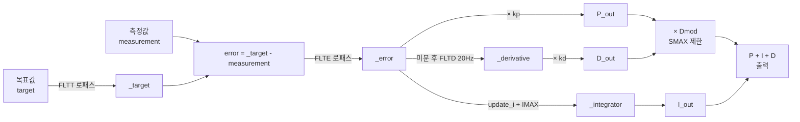
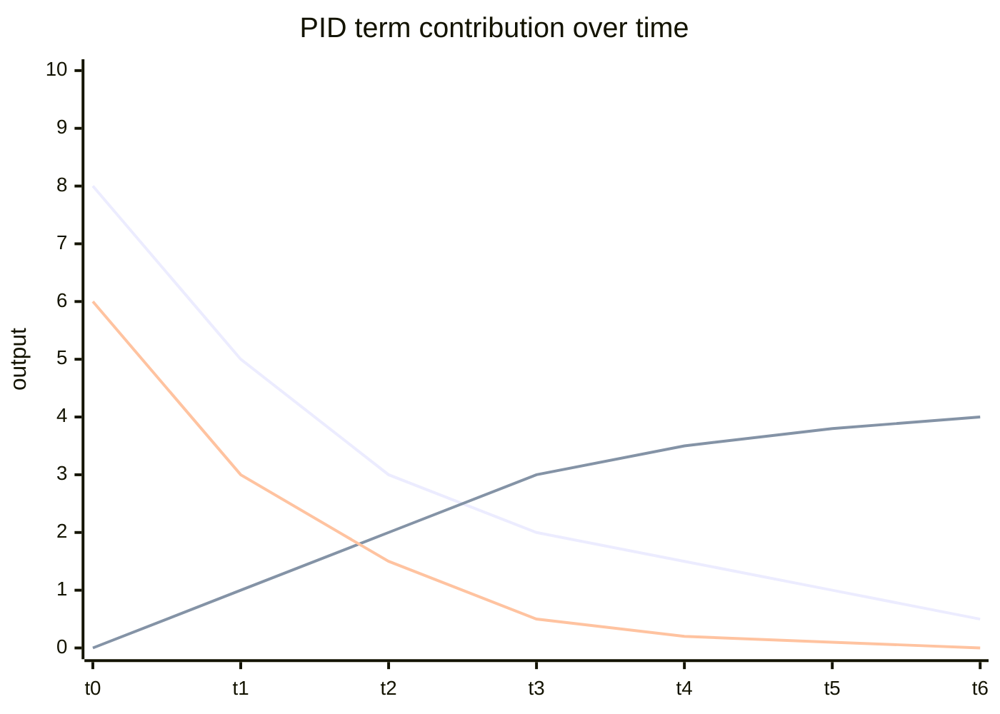
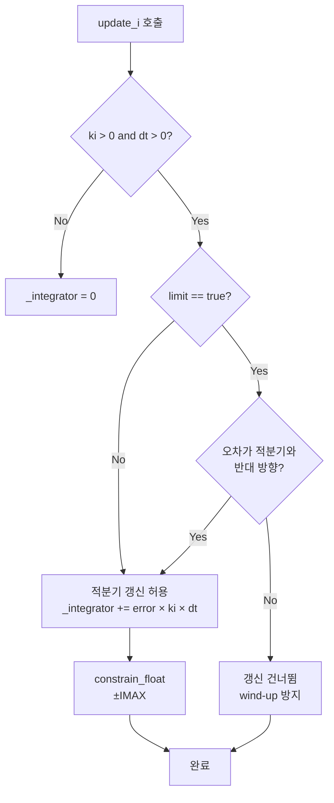
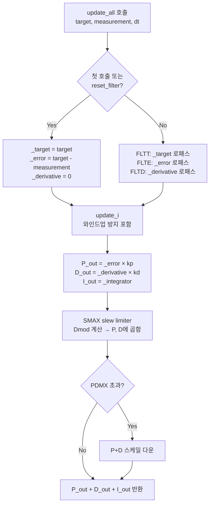

# CH19. PID 제어 — 오차를 힘으로 바꾸는 핵심 알고리즘

::: info 학습 목표
- P·I·D 각 항이 물리적으로 무엇을 하는지 직관적으로 설명할 수 있다.
- `AC_PID::update_all`에서 FLTT·FLTE·FLTD 필터가 적용되는 위치를 코드로 확인할 수 있다.
- `update_i`가 와인드업을 막는 조건(적분기 방향 검사 + IMAX 클리핑)을 코드로 읽을 수 있다.
- SMAX slew rate 제한이 P+D 출력에 어떻게 적용되는지 이해한다.
:::

## 1. PID 제어 직관

드론이 목표 자세를 유지하려면 매 순간 "지금 얼마나 틀렸고, 얼마나 오래 틀렸고, 얼마나 빠르게 틀려가는지"를 측정해 모터 출력으로 변환해야 한다. 이 세 가지를 각각 P·I·D 항이 담당한다.

**P항(비례)**은 현재 오차에 즉각 반응한다. 목표 롤각이 0°인데 현재 5°라면 P 출력 = 5 × kp. kp가 너무 크면 오버슈트 후 진동(oscillation)이 발생한다.

**I항(적분)**은 오차가 쌓인 시간을 반영한다. 측풍처럼 지속적인 외란이 있을 때 P만으로는 일정 오차가 항상 남는다. I는 그 잔여 오차를 천천히 없앤다. kI가 너무 크면 과적분(wind-up)으로 기체가 뒤집힌다.

**D항(미분)**은 오차가 변화하는 속도에 반응해 제동 역할을 한다. 기체가 목표를 향해 빠르게 회전하고 있으면 D가 제동력을 걸어 오버슈트를 줄인다. kD가 너무 크면 센서 노이즈를 증폭해 고주파 떨림이 생긴다.

```
출력 = kp × error + ki × ∫error dt + kd × d(error)/dt
```

## 2. AC_PID 클래스 구조

ArduPilot의 범용 PID는 `libraries/AC_PID/AC_PID.h`와 `AC_PID.cpp`에 구현되어 있다. 파라미터 이름과 기본값은 `var_info[]` 테이블에 등록되어 GCS에서 실시간 수정이 가능하다.

```cpp
// libraries/AC_PID/AC_PID.h:14-16
#define AC_PID_TFILT_HZ_DEFAULT  0.0f   // target filter (FLTT), 기본 비활성
#define AC_PID_EFILT_HZ_DEFAULT  0.0f   // error filter (FLTE), 기본 비활성
#define AC_PID_DFILT_HZ_DEFAULT  20.0f  // derivative filter (FLTD), 기본 20 Hz
```

D 항에만 기본적으로 20 Hz 로패스가 걸리는 이유는 미분이 노이즈를 크게 증폭하기 때문이다.

## 3. update_all — PID 계산의 핵심 루프

드론이 동작 중일 때 스케줄러가 매 루프마다 `update_all(target, measurement, dt)`를 호출한다. 내부 흐름은 다음과 같다.

```cpp
// libraries/AC_PID/AC_PID.cpp:196-311
float AC_PID::update_all(float target, float measurement, float dt, bool limit, ...)
{
    // 1. target 로패스 (FLTT)
    _target += get_filt_T_alpha(dt) * (target - _target);

    // 2. error = filtered_target - measurement, error 로패스 (FLTE)
    float error = _target - measurement;
    _error += get_filt_E_alpha(dt) * (error - _error);

    // 3. derivative 계산 후 로패스 (FLTD, 기본 20 Hz)
    float derivative = (_error - error_last) / dt;
    _derivative += get_filt_D_alpha(dt) * (derivative - _derivative);

    // 4. 적분 갱신 (와인드업 방지 포함)
    update_i(dt, limit, i_scale);

    float P_out = (_error * _kp);       // 비례항
    float D_out = (_derivative * _kd);  // 미분항
    float I_out = _integrator;          // 적분항

    // 5. SMAX slew rate 제한 — P+D에 Dmod 적용
    _pid_info.Dmod = _slew_limiter.modifier((_pid_info.P + _pid_info.D) * _slew_limit_scale, dt);
    P_out *= _pid_info.Dmod;
    D_out *= _pid_info.Dmod;

    return P_out + D_out + I_out;  // libraries/AC_PID/AC_PID.cpp:310
}
```

`(libraries/AC_PID/AC_PID.cpp:242)` — target 로패스:
```cpp
_target += get_filt_T_alpha(dt) * (target - _target);
```

`(libraries/AC_PID/AC_PID.cpp:254)` — error 로패스:
```cpp
_error += get_filt_E_alpha(dt) * (error - _error);
```

`(libraries/AC_PID/AC_PID.cpp:258-259)` — derivative 계산과 로패스:
```cpp
float derivative = (_error - error_last) / dt;
_derivative += get_filt_D_alpha(dt) * (derivative - _derivative);
```

`(libraries/AC_PID/AC_PID.cpp:269-271)` — 각 항 계산:
```cpp
float P_out = (_error * _kp);
float D_out = (_derivative * _kd);
float I_out = _integrator;
```

### PID 블록도



### P·I·D 각 항의 시간응답



위 그래프에서 첫 번째 선이 P항(즉각 반응 후 감소), 두 번째가 I항(천천히 증가하며 잔여 오차 상쇄), 세 번째가 D항(초기 제동력 강하고 이후 소멸)이다.

## 4. 적분 와인드업 방지

**와인드업 문제** — 강한 측풍을 맞고 있는 드론을 예로 들자. 기체는 목표 자세에서 계속 벗어나고 적분기가 매 루프 계속 성장한다. 그 상태에서 갑자기 바람이 멈추면 적분기에 과도하게 누적된 값이 기체를 반대 방향으로 크게 틀어버린다.

ArduPilot은 두 가지 방어 기제를 쓴다.

**① 적분기 방향 검사** — 액추에이터가 포화(limit=true)됐을 때, 오차가 적분기와 같은 방향이라면 더 이상 성장을 허용하지 않는다.

```cpp
// libraries/AC_PID/AC_PID.cpp:340-351
void AC_PID::update_i(float dt, bool limit, float i_scale)
{
    if (!is_zero(_ki) && is_positive(dt)) {
        // limit=true 시, 오차가 적분기와 반대 방향일 때만 갱신 허용
        if (!limit || ((is_positive(_integrator) && is_negative(_error))
                    || (is_negative(_integrator) && is_positive(_error)))) {
            _integrator += ((float)_error * _ki) * i_scale * dt;
            _integrator = constrain_float(_integrator, -_kimax, _kimax);
        }
    } else {
        _integrator = 0.0f;
    }
}
```

`(libraries/AC_PID/AC_PID.cpp:344)` 조건이 핵심이다. `limit && 같은 방향`이면 `_integrator` 갱신 자체를 건너뛴다. 단, 포화 중이라도 오차가 반대 방향(즉 모터 포화를 해소하는 방향)이면 적분기가 줄어들 수 있다.

**② IMAX 클리핑** — 어떤 경우에도 `_integrator`가 `±_kimax`를 벗어나지 못한다.

`(libraries/AC_PID/AC_PID.cpp:346)`:
```cpp
_integrator = constrain_float(_integrator, -_kimax, _kimax);
```

### 와인드업 방지 결정 흐름



## 5. Slew Rate 제한 (SMAX)

SMAX(`_slew_rate_max`)는 P+D 출력의 **변화율**을 제한한다. 게인이 너무 높아서 급격한 입력 변화가 생겼을 때, P+D 합산값이 순간적으로 매우 크게 바뀌면 기체가 격렬하게 반응한다. SMAX는 이 변화폭을 초당 최대치로 제한해 고주파 진동을 억제한다.

```cpp
// libraries/AC_PID/AC_PID.cpp:274-279
_pid_info.Dmod = _slew_limiter.modifier(
    (_pid_info.P + _pid_info.D) * _slew_limit_scale, dt);
_pid_info.slew_rate = _slew_limiter.get_slew_rate();

P_out *= _pid_info.Dmod;
D_out *= _pid_info.Dmod;
```

`Dmod`는 0.1~1.0 사이의 스케일러다. slew rate가 SMAX를 초과하면 Dmod가 1 미만으로 떨어져 P와 D 출력을 동시에 줄인다. SMAX=0이면 기능 비활성화다. 파라미터 주석 `(libraries/AC_PID/AC_PID.cpp:63-67)` 에 따르면, 설정값은 액추에이터 최대 slew rate의 25% 이하를 권장한다.

## 6. 정리: update_all 실행 순서



::: tip 핵심 정리
- P는 현재 오차에 즉각 비례, I는 누적 오차 상쇄, D는 오차 변화율 제동이다.
- `update_all`에서 target은 FLTT, error는 FLTE, derivative는 FLTD(기본 20 Hz) 로패스를 거친다. `(libraries/AC_PID/AC_PID.h:16)`
- `update_i`는 액추에이터 포화 시 오차와 적분기가 같은 방향이면 갱신을 차단해 와인드업을 막는다. `(libraries/AC_PID/AC_PID.cpp:344)`
- IMAX(`_kimax`)는 적분기의 절댓값 상한이다. `(libraries/AC_PID/AC_PID.cpp:346)`
- SMAX는 P+D 출력의 변화율 상한으로, Dmod 스케일러를 통해 두 항을 동시에 줄인다. `(libraries/AC_PID/AC_PID.cpp:274)`
:::

## 다음 챕터

[CH20. 캐스케이드 제어 구조](/study/ardupilot/20-cascade-control) — 위치 → 속도 → 자세각 → 각속도로 이어지는 중첩 루프 구조와 각 계층의 ArduPilot 클래스를 분석한다.
