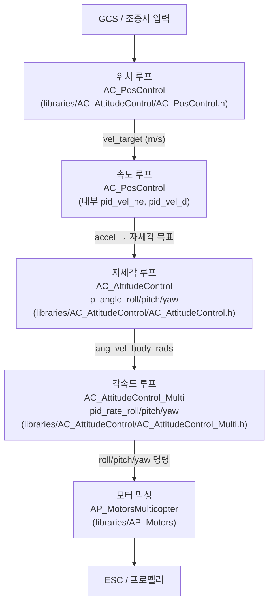
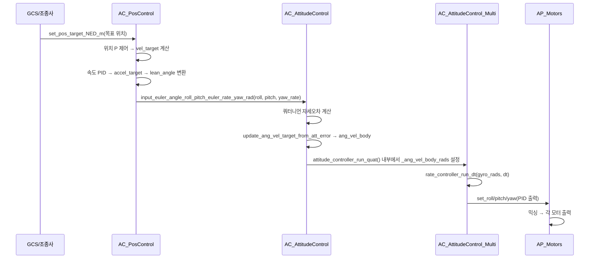
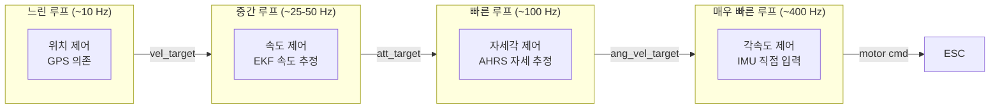

# CH20. 캐스케이드 제어 구조 — 중첩 루프로 드론을 안정화하는 방법

::: info 학습 목표
- 캐스케이드(중첩) 제어가 무엇이고, 왜 단일 루프보다 안정적인지 설명할 수 있다.
- 위치→속도→자세각→각속도→모터의 5단 계층을 각 ArduPilot 클래스와 연결할 수 있다.
- 각 루프의 실행 주파수가 다른 이유를 물리적 응답속도로 설명할 수 있다.
- Stabilize 모드와 Loiter 모드가 어느 계층부터 루프에 진입하는지 구별할 수 있다.
:::

## 1. 캐스케이드 제어란

**단일 루프 제어**로 드론의 위치를 잡으려면 하나의 PID가 "위치 오차 → 모터 출력"을 직접 계산해야 한다. 위치 오차가 1m라고 해서 모터를 바로 최대 출력으로 돌리면 기체는 진동하며 터진다. 위치·속도·자세·각속도는 물리적으로 응답 시간 척도(time scale)가 완전히 다르기 때문이다.

**캐스케이드(중첩) 제어**는 이 문제를 계층으로 분리해 해결한다. 바깥 루프(outer loop)가 느린 목표를 제어하고, 그 출력이 안쪽 루프(inner loop)의 목표값이 된다. 안쪽 루프는 훨씬 빠르게 실행하며 자신의 목표를 추적한다.

```
위치 루프 → 속도 목표 → 속도 루프 → 가속도 목표 → 자세각 루프
         → 각속도 목표 → 각속도 루프 → 모터 토크
```

바깥 루프의 출력이 안쪽 루프의 setpoint가 된다는 것이 캐스케이드의 핵심이다.

## 2. 왜 계층을 분리하는가 — 응답속도의 물리학

각 계층은 물리적 응답 시간이 근본적으로 다르다. 아래 표를 보자.

| 계층 | 물리량 | 대표 응답 시간 | 실행 주기 |
|------|--------|--------------|---------|
| 위치 | GPS 위치 (m) | 수 초 | ~10 Hz |
| 속도 | 속도 (m/s) | ~0.5 초 | ~25 Hz |
| 자세각 | 롤/피치/요 (deg) | ~0.1 초 | ~100 Hz |
| 각속도 | 자이로 (deg/s) | ~0.01 초 | ~400 Hz |
| 모터 | PWM / DSHOT | 수 ms | 400~2000 Hz |

위치는 GPS 갱신(5~10 Hz)에 묶여 천천히 변하는 반면, 각속도는 IMU(400 Hz)가 매 2.5 ms마다 새 데이터를 준다. 이 두 물리량을 하나의 루프에서 같은 게인으로 처리하면 느린 쪽은 과반응하고 빠른 쪽은 무반응이 된다.

**규칙**: 안쪽 루프는 바깥 루프보다 3~10배 빠르게 실행되어야 안정적으로 추적할 수 있다. 그래서 각속도 루프 > 자세각 루프 > 속도 루프 > 위치 루프 순서로 빠르다.

## 3. ArduPilot 5단 계층 구조



### 각 클래스의 역할 요약

| 계층 | ArduPilot 클래스 | 입력 | 출력 |
|------|----------------|------|------|
| 위치 | `AC_PosControl` | 목표 위치 (NED m) | 목표 속도 (m/s) |
| 속도 | `AC_PosControl` | 목표 속도 (m/s) | 목표 가속도 → 자세각 |
| 자세각 | `AC_AttitudeControl` | 목표 롤/피치/요각 (rad) | 목표 각속도 (rad/s) |
| 각속도 | `AC_AttitudeControl_Multi` | 목표 각속도 (rad/s) | 모터 토크 명령 |
| 모터 | `AP_MotorsMulticopter` | 롤/피치/요/스로틀 | PWM / DSHOT |

`AC_PosControl`은 위치와 속도 계층을 모두 담당하며, 내부에 `_pid_vel_ne_m`(XY 속도 PID), `_pid_vel_d_m`(Z 속도 PID), `_pid_accel_d_m`(Z 가속도 PID)를 포함한다 `(libraries/AC_AttitudeControl/AC_PosControl.h:725-727)`.

## 4. 목표값이 전달되는 흐름



## 5. 루프별 응답속도 계층도



## 6. 비행 모드별 진입 계층

비행 모드에 따라 파일럿이나 자율비행 알고리즘이 어느 계층부터 제어를 시작하는지가 달라진다.

| 비행 모드 | 최외곽 진입 계층 | 설명 |
|---------|----------------|------|
| Stabilize | 자세각 | 파일럿이 직접 롤/피치각 명령. 위치·속도 루프 없음 |
| AltHold | 자세각 + Z 속도 | 롤/피치는 Stabilize와 동일, 고도만 속도 루프로 제어 |
| Loiter | 위치 | 모든 5단 계층 활성화. GPS 위치 고정 |
| Auto | 위치 | 웨이포인트 기반 자율비행. Loiter와 동일한 계층 |
| Acro | 각속도 | 파일럿이 각속도를 직접 명령. 각도·위치 루프 없음 |

예를 들어 **Stabilize** 모드에서는 `AC_PosControl`이 전혀 개입하지 않는다. 파일럿의 스틱 입력이 곧 목표 롤/피치각이 되어 `AC_AttitudeControl::input_euler_angle_roll_pitch_euler_rate_yaw_rad`로 바로 들어간다. 비행 모드별 세부 구현은 25장에서 다룬다.

::: tip 핵심 정리
- 캐스케이드 제어는 바깥 루프 출력이 안쪽 루프의 목표값이 되는 중첩 구조다.
- 위치(수 초) → 속도(~0.5 초) → 자세각(~0.1 초) → 각속도(~0.01 초) 순으로 응답 시간이 다르기 때문에 계층 분리가 필수다.
- ArduPilot에서 위치/속도는 `AC_PosControl`, 자세각 P 제어와 각속도 PID는 `AC_AttitudeControl`/`AC_AttitudeControl_Multi`, 모터는 `AP_Motors`가 담당한다.
- Stabilize는 자세각 루프부터, Loiter는 위치 루프부터 진입한다.
:::

## 다음 챕터

[CH21. 자세 제어](/study/ardupilot/21-attitude-control) — `AC_AttitudeControl`이 목표 자세를 쿼터니언으로 관리하고, 오차를 각속도 명령으로 변환하는 내부 동작을 소스로 분석한다.
