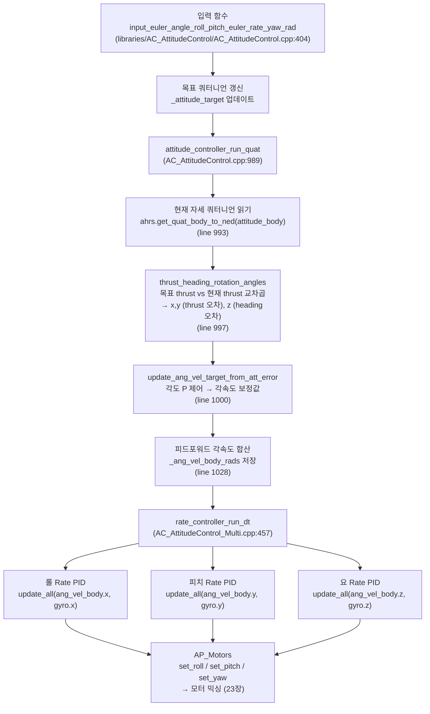
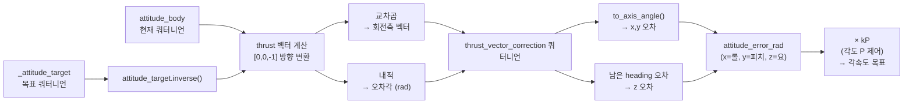

# CH21. 자세 제어 — 쿼터니언 오차에서 모터 토크까지

::: info 학습 목표
- `AC_AttitudeControl`의 베이스/멀티 구조와 각속도 Rate PID 3축 구성을 설명할 수 있다.
- `attitude_controller_run_quat`가 쿼터니언 오차를 계산하는 단계를 코드로 따라갈 수 있다.
- `thrust_heading_rotation_angles`가 자세오차를 thrust벡터와 heading으로 분리하는 이유를 이해한다.
- `update_ang_vel_target_from_att_error`가 각도 P 제어로 각속도 목표를 만드는 과정을 설명할 수 있다.
- `rate_controller_run_dt`가 IMU 자이로를 받아 Rate PID를 실행하고 모터에 명령을 내리는 흐름을 이해한다.
- 쿼터니언을 쓰는 이유(짐벌락 회피, 180° 불연속 방지)를 설명할 수 있다.
:::

## 1. 자세 제어 클래스 구조

ArduPilot은 자세 제어를 두 계층으로 나눈다.

**`AC_AttitudeControl`** — 베이스 클래스. 자세각(롤/피치/요) → 각속도 명령을 담당한다. 쿼터니언 목표 관리, thrust/heading 분리, 각도 P 제어가 여기 있다. `(libraries/AC_AttitudeControl/AC_AttitudeControl.h:47)`

**`AC_AttitudeControl_Multi`** — 멀티콥터 전용 파생 클래스. 각속도 Rate PID 3축(roll, pitch, yaw)과 `rate_controller_run_dt`를 포함한다. `(libraries/AC_AttitudeControl/AC_AttitudeControl_Multi.h:42)`

자세각 P 게인은 베이스 클래스의 생성자에서 초기화된다.

```cpp
// libraries/AC_AttitudeControl/AC_AttitudeControl.h:15
#define AC_ATTITUDE_CONTROL_ANGLE_P  4.5f  // 기본 각도 P 게인 (롤/피치/요)
```

```cpp
// libraries/AC_AttitudeControl/AC_AttitudeControl.h:49-53
AC_AttitudeControl(AP_AHRS_View &ahrs, AP_Motors& motors) :
    _p_angle_roll(AC_ATTITUDE_CONTROL_ANGLE_P),
    _p_angle_pitch(AC_ATTITUDE_CONTROL_ANGLE_P),
    _p_angle_yaw(AC_ATTITUDE_CONTROL_ANGLE_P),
    ...
```

### Rate PID 기본 게인 (멀티콥터)

`AC_AttitudeControl_Multi`의 헤더에서 기본값을 확인할 수 있다.

```cpp
// libraries/AC_AttitudeControl/AC_AttitudeControl_Multi.h:10-39
#define AC_ATC_MULTI_RATE_RP_P       0.135f   // 롤/피치 P
#define AC_ATC_MULTI_RATE_RP_I       0.135f   // 롤/피치 I
#define AC_ATC_MULTI_RATE_RP_D       0.0036f  // 롤/피치 D
#define AC_ATC_MULTI_RATE_RP_IMAX    0.5f     // 롤/피치 적분 상한
#define AC_ATC_MULTI_RATE_RPY_FILT_HZ  20.0f // 롤/피치/요 필터 주파수

#define AC_ATC_MULTI_RATE_YAW_P      0.180f   // 요 P
#define AC_ATC_MULTI_RATE_YAW_I      0.018f   // 요 I
#define AC_ATC_MULTI_RATE_YAW_D      0.0f     // 요 D (기본 비활성)
#define AC_ATC_MULTI_RATE_YAW_IMAX   0.5f
#define AC_ATC_MULTI_RATE_YAW_FILT_HZ  2.5f  // 요 필터 주파수 (느림)
```

요 축 D가 0인 이유는 드론의 요 응답이 프로펠러 반토크(reaction torque)에 의존하고, D의 노이즈 증폭 부작용이 요 제어에서 더 크기 때문이다.

## 2. 쿼터니언을 쓰는 이유

자세를 오일러 각(롤/피치/요)으로 표현하면 두 가지 문제가 생긴다.

**짐벌락(Gimbal Lock)** — 피치가 ±90°에 도달하면 롤과 요가 같은 평면을 표현하게 되어 자유도가 하나 사라진다. 이 상태에서 수치 연산이 특이점(singularity)에 빠진다.

**180° 불연속** — 오일러 각으로 "현재 -179°에서 목표 +179°"를 보간하면 358° 방향으로 돌아가는 긴 경로를 택한다. 쿼터니언은 항상 최단 호(arc)로 보간된다.

쿼터니언은 4원소 `(w, x, y, z)` 단위 벡터로 3D 회전을 표현하며, 두 문제를 모두 해결한다. `attitude_target.inverse() * attitude_body`로 두 자세 사이의 오차 쿼터니언을 계산하고, `to_axis_angle()`로 회전축-각도 벡터로 변환하면 연속적이고 특이점 없는 오차 표현을 얻는다.

## 3. 자세각 → 각속도 변환: attitude_controller_run_quat

대부분의 비행 모드에서 `input_euler_angle_roll_pitch_euler_rate_yaw_rad` 같은 입력 함수가 목표 쿼터니언을 갱신하고 마지막에 `attitude_controller_run_quat`를 호출한다. `(libraries/AC_AttitudeControl/AC_AttitudeControl.cpp:456)`

```cpp
// libraries/AC_AttitudeControl/AC_AttitudeControl.cpp:989-1029
void AC_AttitudeControl::attitude_controller_run_quat()
{
    // 1. 현재 자세 쿼터니언 읽기 (AHRS에서)
    Quaternion attitude_body;
    _ahrs.get_quat_body_to_ned(attitude_body);   // line 993

    // 2. thrust/heading 분리 방식으로 자세오차 계산
    Vector3f attitude_error;
    thrust_heading_rotation_angles(
        _attitude_target, attitude_body,
        attitude_error,           // 출력: x,y=thrust오차, z=heading오차
        _thrust_angle_rad,
        _thrust_error_angle_rad); // line 997

    // 3. 각도 P 제어 → 각속도 보정값 계산
    Vector3f ang_vel_body_rads =
        update_ang_vel_target_from_att_error(attitude_error); // line 1000

    // 4. 각속도 한계 적용
    ang_vel_limit(ang_vel_body_rads,
        radians(_ang_vel_roll_max_degs),
        radians(_ang_vel_pitch_max_degs),
        radians(_ang_vel_yaw_max_degs));         // line 1003

    // 5. 피드포워드 각속도 추가 (feedforward scalar로 보간)
    // thrust 오차가 크면 yaw 피드포워드 억제
    ang_vel_body_rads += ang_vel_body_feedforward; // line 1022

    // 6. 최종 각속도 목표 저장 → rate_controller_run_dt에서 사용
    _ang_vel_body_rads = ang_vel_body_rads;      // line 1028
}
```

### thrust_heading_rotation_angles — 자세오차를 두 단계로 분리

단순히 `attitude_target.inverse() * attitude_body`로 한 번에 오차를 구하면 큰 각도에서 수치적 불안정이 생긴다. ArduPilot은 오차를 **thrust 벡터 교정**과 **heading(요) 교정** 두 단계로 분리한다.

```cpp
// libraries/AC_AttitudeControl/AC_AttitudeControl.cpp:1033-1104
void AC_AttitudeControl::thrust_heading_rotation_angles(
    Quaternion& attitude_target, const Quaternion& attitude_body,
    Vector3f& attitude_error_rad, ...)
{
    // thrust 방향은 기체 좌표계에서 [0,0,-1] (아래→위)
    const Vector3f thrust_vector_up{0.0f, 0.0f, -1.0f};

    // 목표/현재 thrust 벡터를 관성 좌표계(NED)로 표현
    const Vector3f att_target_thrust_vec = attitude_target * thrust_vector_up;
    const Vector3f att_body_thrust_vec   = attitude_body   * thrust_vector_up;

    // 두 thrust 벡터의 교차곱 → 회전축, 내적 → 오차각
    Vector3f thrust_vec_cross = att_body_thrust_vec % att_target_thrust_vec;
    thrust_error_angle_rad = acosf(att_body_thrust_vec * att_target_thrust_vec);

    // thrust 보정 쿼터니언 → to_axis_angle → x,y 오차 추출
    thrust_vector_correction.from_axis_angle(thrust_vec_cross, thrust_error_angle_rad);
    thrust_vector_correction.to_axis_angle(rotation_rad);
    attitude_error_rad.x = rotation_rad.x;   // 롤 오차
    attitude_error_rad.y = rotation_rad.y;   // 피치 오차

    // thrust 보정 후 남은 heading 오차 → z 오차 추출
    heading_vec_correction_quat = thrust_vector_correction.inverse()
                                  * attitude_body.inverse() * attitude_target;
    heading_vec_correction_quat.to_axis_angle(rotation_rad);
    attitude_error_rad.z = rotation_rad.z;   // 요 오차
}
```

`(libraries/AC_AttitudeControl/AC_AttitudeControl.cpp:1064-1103)` — thrust를 먼저 맞추고 그 다음 heading을 맞추는 순서가 중요하다. 기체가 크게 기울어진 상태에서 요를 먼저 교정하면 물리적으로 틀린 방향으로 토크가 걸린다.

### update_ang_vel_target_from_att_error — 각도 P 제어

```cpp
// libraries/AC_AttitudeControl/AC_AttitudeControl.cpp:1345-1374
Vector3f AC_AttitudeControl::update_ang_vel_target_from_att_error(
    const Vector3f &attitude_error_rot_vec_rad)
{
    Vector3f rate_target_ang_vel;

    // 롤 각속도 목표 = 각도 P × 롤 오차
    const float angleP_roll = _p_angle_roll.kP() * _angle_P_scale.x;
    if (_use_sqrt_controller && ...) {
        rate_target_ang_vel.x = sqrt_controller(
            attitude_error_rot_vec_rad.x, angleP_roll, accel_limit, _dt_s);
    } else {
        rate_target_ang_vel.x = angleP_roll * attitude_error_rot_vec_rad.x;
    }
    // 피치, 요도 동일한 구조 ...
    return rate_target_ang_vel;
}
```

`(libraries/AC_AttitudeControl/AC_AttitudeControl.cpp:1350-1354)` — 기본적으로 `각속도 목표 = kP × 각도오차`다. `_use_sqrt_controller`가 활성화된 경우, 큰 오차에서 각속도가 선형이 아닌 sqrt 형태로 제한되어 목표에 급격히 접근하는 것을 방지한다.

## 4. 자세 제어의 주요 진입점

대부분의 안정화 모드는 아래 함수를 통해 자세 제어에 진입한다.

```cpp
// libraries/AC_AttitudeControl/AC_AttitudeControl.cpp:404-456
void AC_AttitudeControl::input_euler_angle_roll_pitch_euler_rate_yaw_rad(
    float euler_roll_angle_rad,
    float euler_pitch_angle_rad,
    float euler_yaw_rate_rads)
{
    // 1. 현재 attitude_target을 최신 자세로 갱신
    update_attitude_target();

    // 2. 현재 목표 자세를 오일러 각으로 표현
    _attitude_target.to_euler(_euler_angle_target_rad);

    if (_rate_bf_ff_enabled) {
        // 3. 오일러 각 오차 → 오일러 레이트 목표 (가속 한계 적용)
        attitude_command_model(
            wrap_PI(euler_roll_angle_rad - _euler_angle_target_rad.x), 0.0,
            _euler_rate_target_rads.x, ...);
        // 피치, 요도 동일 ...

        // 4. 오일러 레이트 → 바디 프레임 각속도로 변환
        euler_derivative_to_body(_attitude_target,
            _euler_rate_target_rads, _ang_vel_target_rads);
    } else {
        // FF 비활성: 직접 목표 각도 갱신 후 쿼터니언 생성
        _attitude_target.from_euler(
            _euler_angle_target_rad.x,
            _euler_angle_target_rad.y,
            _euler_angle_target_rad.z);
    }

    // 5. 쿼터니언 자세 제어 실행
    attitude_controller_run_quat();                  // line 456
}
```

## 5. rate_controller_run_dt — 각속도 PID → 모터 토크

`attitude_controller_run_quat`가 `_ang_vel_body_rads`를 설정하면, 다음 루프에서 `rate_controller_run_dt`가 IMU 자이로와 비교해 Rate PID를 실행한다.

```cpp
// libraries/AC_AttitudeControl/AC_AttitudeControl_Multi.cpp:457-485
void AC_AttitudeControl_Multi::rate_controller_run_dt(
    const Vector3f& gyro_rads, float dt)
{
    Vector3f ang_vel_body = _ang_vel_body_rads;  // 목표 각속도 (att 제어 출력)

    // 롤 Rate PID: 목표 - IMU 자이로 = 오차 → PID 출력 → 모터 롤 명령
    _motors.set_roll(
        get_rate_roll_pid().update_all(
            ang_vel_body.x, gyro_rads.x, dt,
            _motors.limit.roll, _pd_scale.x, _i_scale.x)
        + _actuator_sysid.x);                    // line 473

    _motors.set_pitch(
        get_rate_pitch_pid().update_all(
            ang_vel_body.y, gyro_rads.y, dt,
            _motors.limit.pitch, _pd_scale.y, _i_scale.y)
        + _actuator_sysid.y);                    // line 476

    _motors.set_yaw(
        get_rate_yaw_pid().update_all(
            ang_vel_body.z, gyro_rads.z, dt,
            _motors.limit.yaw, _pd_scale.z, _i_scale.z)
        + _actuator_sysid.z);                    // line 479
}
```

`(libraries/AC_AttitudeControl/AC_AttitudeControl_Multi.cpp:473)` — `update_all`의 첫 인수가 목표 각속도, 두 번째 인수가 IMU 자이로 측정값이다. 19장에서 분석한 `AC_PID::update_all`이 바로 여기서 호출된다. `_motors.limit.roll`이 true면 와인드업 방지 `limit` 플래그가 활성화된다.

모터 믹싱(set_roll/pitch/yaw → 각 모터 PWM 변환)은 23장에서 다룬다.

## 6. 전체 자세 제어 흐름



## 7. 쿼터니언 자세오차 계산 상세



::: tip 핵심 정리
- `AC_AttitudeControl`이 각도 P 제어를, `AC_AttitudeControl_Multi`가 각속도 Rate PID를 담당한다. 두 계층이 캐스케이드로 연결된다.
- `attitude_controller_run_quat`는 AHRS에서 현재 쿼터니언을 읽고, `thrust_heading_rotation_angles`로 오차를 thrust(x,y)와 heading(z)으로 분리해 계산한다. `(libraries/AC_AttitudeControl/AC_AttitudeControl.cpp:989)`
- `update_ang_vel_target_from_att_error`는 각도 오차에 kP를 곱해 각속도 목표를 만든다. `(libraries/AC_AttitudeControl/AC_AttitudeControl.cpp:1345)`
- `rate_controller_run_dt`는 IMU 자이로를 받아 3축 Rate PID를 실행하고, 결과를 `AP_Motors::set_roll/pitch/yaw`로 전달한다. `(libraries/AC_AttitudeControl/AC_AttitudeControl_Multi.cpp:457)`
- 쿼터니언은 짐벌락과 180° 불연속 문제를 모두 해결한다.
- 롤/피치 Rate 기본 게인: P=0.135, I=0.135, D=0.0036. 요 D는 기본 0이다. `(libraries/AC_AttitudeControl/AC_AttitudeControl_Multi.h:10-39)`
:::

## 다음 챕터

[CH22. 위치/내비게이션 제어](/study/ardupilot/22-position-nav) — `AC_PosControl`이 GPS 위치 목표를 속도 목표로 변환하고, EKF 추정값을 이용해 자율비행 궤적을 추적하는 과정을 분석한다.
