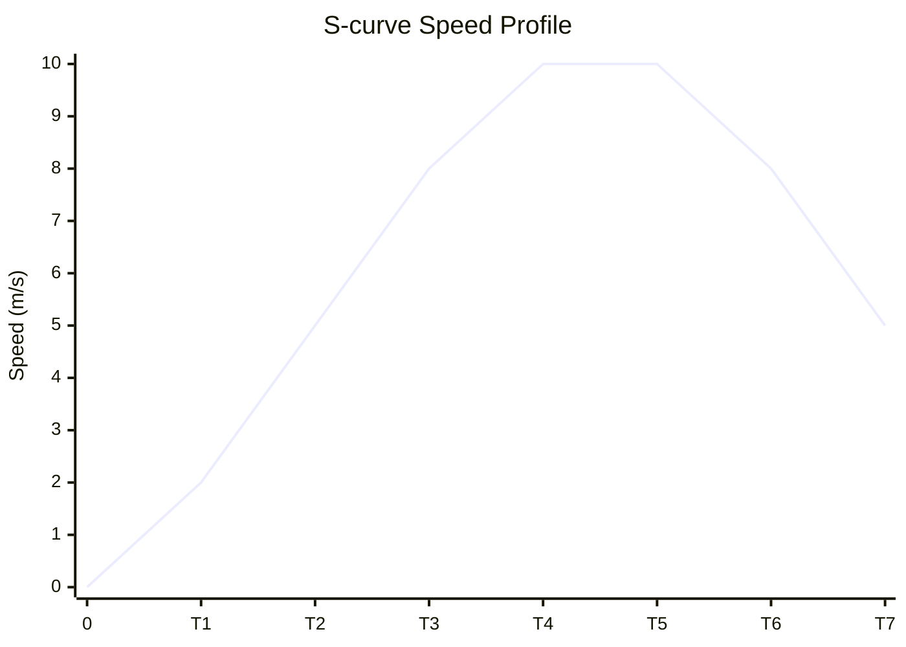
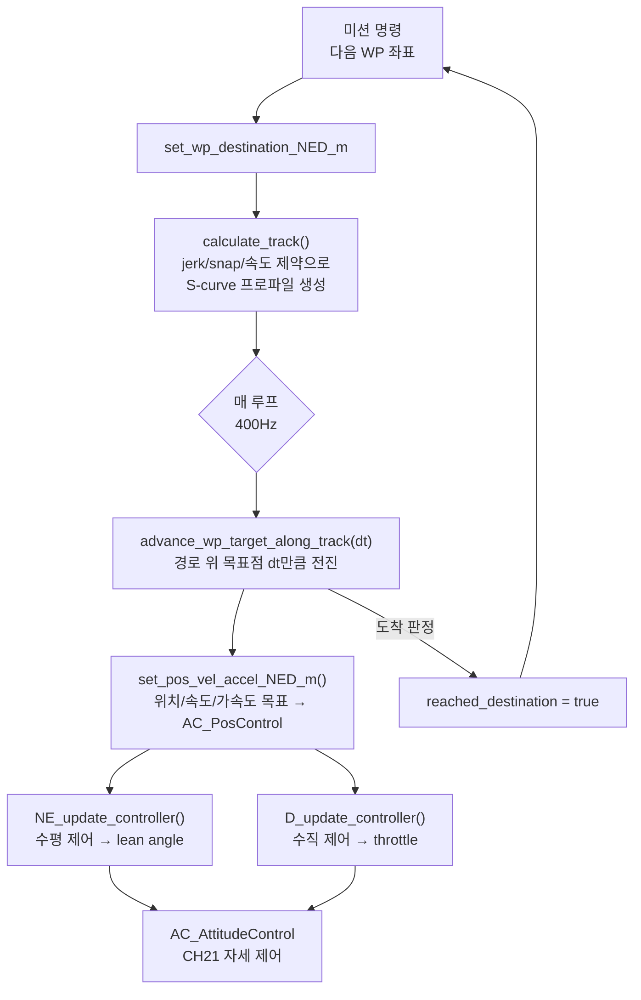

# CH22. 위치·경로 제어 — AC_PosControl과 AC_WPNav

::: info 학습 목표
- AC_PosControl이 수평(NE)과 수직(D) 축을 독립 루프로 처리하는 이유를 설명할 수 있다.
- 위치 P → 속도 PID → 가속도 → lean angle 변환 경로를 소스 코드에서 추적할 수 있다.
- `accel_NE_mss_to_lean_angles_rad`가 가속도를 roll/pitch 각도로 변환하는 수식을 이해한다.
- 수직 D 루프에서 가속도가 throttle 명령으로 이어지는 흐름을 설명할 수 있다.
- AC_WPNav의 S-curve가 jerk/snap 제약으로 부드러운 속도 프로파일을 만드는 원리를 이해한다.
- `set_wp_destination_NED_m`에서 `advance_target_along_track`까지의 웨이포인트 추종 흐름을 설명할 수 있다.
:::

## 1. 위치 제어란 무엇인가

드론이 "GPS 좌표 A에 머물러라" 또는 "GPS 좌표 B로 이동하라"는 명령을 받으면, 이것을 모터 출력으로 바꾸는 과정이 필요하다. 이 과정은 여러 층으로 나뉜다.

- **위치 제어**: GPS/EKF가 주는 현재 위치 오차 → 원하는 속도
- **속도 제어**: 속도 오차 → 원하는 가속도
- **자세 제어**: 원하는 가속도 → roll/pitch 각도 (21장)
- **모터 믹싱**: 자세 명령 → 각 모터 출력 (23장)

핵심 직관은 이것이다. 드론이 북쪽으로 1m 빗나갔다면, 기수를 북쪽으로 기울여야 한다. "얼마나 기울일지"가 바로 위치 제어가 자세 제어에 전달하는 **lean angle**이다.


ArduPilot에서 이 역할을 맡는 클래스가 `AC_PosControl`이다. 헤더를 열면 수평(NE)과 수직(D) 축을 명확히 분리해 설계했음을 알 수 있다.

## 2. AC_PosControl: NE/D 이중 루프 구조

### 2.1 수평 축(NE)과 수직 축(D)을 분리하는 이유

물리적으로 수평과 수직 제어는 독립적이다. 수평 이동은 기체를 기울여 수평 추력 성분을 만들고, 수직 이동은 throttle을 높낮이로 조절한다. 두 축을 하나의 루프로 묶으면 튜닝이 매우 어려워진다. ArduPilot은 이 두 축을 완전히 별도의 P/PID 컨트롤러로 처리한다.

```cpp
// AC_PosControl.h 헤더에 정의된 기본 제한값
#define POSCONTROL_SPEED_MS          5.0f    // 기본 수평 최대 속도 m/s
#define POSCONTROL_SPEED_DOWN_MS     1.5f    // 기본 하강 최대 속도 m/s
#define POSCONTROL_SPEED_UP_MS       2.5f    // 기본 상승 최대 속도 m/s
#define POSCONTROL_ACCEL_NE_MSS      1.0f    // 기본 수평 가속도 m/s²
#define POSCONTROL_ACCEL_D_MSS       2.5f    // 기본 수직 가속도 m/s²
```
`(libraries/AC_AttitudeControl/AC_PosControl.h:25~29)`

수평 속도 5m/s, 상승 2.5m/s, 하강 1.5m/s의 비대칭은 의도적이다. 상승에는 더 많은 추력이 필요하고 하강은 중력 보조를 받지만 과속 하강이 위험하기 때문에 안전 여유를 두고 제한한다.

### 2.2 NE 수평 루프 흐름

`NE_update_controller()`가 매 제어 주기마다 호출된다. 내부 흐름을 소스로 따라가면 세 단계가 명확하다.

**Step 1 — 위치 P 컨트롤러 → 속도 목표**

```cpp
// 위치 목표 = desired + offset
_pos_target_ned_m.xy() = _pos_desired_ned_m.xy() + _pos_offset_ned_m.xy();

// P 컨트롤러: 위치 오차 → 속도 보정
Vector2f vel_target_ne_ms = _p_pos_ne_m.update_all(_pos_target_ned_m.xy(), comb_pos_ne_m);

// 속도 목표 = P 보정 + 피드포워드 속도 + 오프셋
_vel_target_ned_ms.xy() = vel_target_ne_ms;
_vel_target_ned_ms.xy() += _vel_desired_ned_ms.xy() + _vel_offset_ned_ms.xy();
```
`(libraries/AC_AttitudeControl/AC_PosControl.cpp:720~740)`

P 컨트롤러가 위치 오차에 비례해 속도 보정값을 만들고, 여기에 미션이 요청한 피드포워드 속도를 더한다.

**Step 2 — 속도 PID 컨트롤러 → 가속도 목표**

```cpp
// 속도 PID: 속도 오차 → 가속도 보정
Vector2f accel_target_ne_mss = _pid_vel_ne_m.update_all(
    _vel_target_ned_ms.xy(), comb_vel_ne_ms, _dt_s, _limit_vector_ned.xy());

// 가속도 목표 = PID 보정 + 피드포워드 가속도 + 오프셋
_accel_target_ned_mss.xy() = accel_target_ne_mss;
_accel_target_ned_mss.xy() += _accel_desired_ned_mss.xy() + _accel_offset_ned_mss.xy();
```
`(libraries/AC_AttitudeControl/AC_PosControl.cpp:750~760)`

**Step 3 — 가속도 → lean angle 변환**

```cpp
// 가속도 목표를 roll/pitch 각도로 변환 → 자세 제어 입력
accel_NE_mss_to_lean_angles_rad(
    _accel_target_ned_mss.x, _accel_target_ned_mss.y,
    _roll_target_rad, _pitch_target_rad);
```
`(libraries/AC_AttitudeControl/AC_PosControl.cpp:773)`

이 `_roll_target_rad`, `_pitch_target_rad`가 21장의 자세 제어로 전달된다.

### 2.3 accel_NE_mss_to_lean_angles_rad: 물리적 원리

```cpp
void AC_PosControl::accel_NE_mss_to_lean_angles_rad(
    float accel_n_mss, float accel_e_mss,
    float& roll_target_rad, float& pitch_target_rad) const
{
    // NED 가속도를 기체 기수 방향(forward/right)으로 회전
    const float accel_forward_mss =  accel_n_mss * _ahrs.cos_yaw()
                                   + accel_e_mss * _ahrs.sin_yaw();
    const float accel_right_mss   = -accel_n_mss * _ahrs.sin_yaw()
                                   + accel_e_mss * _ahrs.cos_yaw();

    // 전진 가속도 → pitch (앞으로 기울이면 전진)
    pitch_target_rad = accel_mss_to_angle_rad(-accel_forward_mss);
    float cos_pitch_target = cosf(pitch_target_rad);
    // 우측 가속도 → roll (오른쪽으로 기울이면 우측 이동)
    roll_target_rad = accel_mss_to_angle_rad(accel_right_mss * cos_pitch_target);
}
```
`(libraries/AC_AttitudeControl/AC_PosControl.cpp:1608~1617)`

물리 원리: 호버링 중인 드론이 pitch θ로 기울면 수평 가속도는 `g·tan(θ)`가 된다. 역으로 원하는 수평 가속도 a가 있으면 `θ = atan(a/g)`를 기울여야 한다. `accel_mss_to_angle_rad`가 이 변환을 수행한다. cos_pitch_target 보정은 이미 pitch가 있을 때 roll의 수평 성분이 줄어드는 효과를 보정하기 위함이다.

NED 좌표계(북·동·아래)의 가속도가 기체 좌표계(전·우·아래)로 yaw 회전 변환되는 이유는, 자세 제어가 기체 기준 roll/pitch를 요구하기 때문이다.

### 2.4 수직 D 루프 흐름

`D_update_controller()`가 고도 제어를 담당한다.

```cpp
// Step 1: 위치 P → 속도 목표
_vel_target_ned_ms.z = _p_pos_d_m.update_all(
    _pos_target_ned_m.z, _pos_estimate_ned_m.z);
_vel_target_ned_ms.z += _vel_desired_ned_ms.z + _vel_offset_ned_ms.z + _vel_terrain_d_ms;

// Step 2: 속도 PID → 가속도 목표
_accel_target_ned_mss.z = _pid_vel_d_m.update_all(
    _vel_target_ned_ms.z, _vel_estimate_ned_ms.z,
    _dt_s, _motors.limit.throttle_lower, _motors.limit.throttle_upper);
_accel_target_ned_mss.z += _accel_desired_ned_mss.z + _accel_offset_ned_mss.z + _accel_terrain_d_mss;

// Step 3: 가속도 → throttle (PID + 호버 보정)
thrust_d_norm = _pid_accel_d_m.update_all(
    _accel_target_ned_mss.z, estimated_accel_d_mss,
    _dt_s, (_motors.limit.throttle_lower || _motors.limit.throttle_upper));
thrust_d_norm += _pid_accel_d_m.get_ff();
thrust_d_norm -= _motors.get_throttle_hover();

// Step 4: throttle 출력
_attitude_control.set_throttle_out(-thrust_d_norm, true, POSCONTROL_THROTTLE_CUTOFF_FREQ_HZ);
```
`(libraries/AC_AttitudeControl/AC_PosControl.cpp:1100~1135)`

수직 루프는 수평 루프와 구조가 같지만 최종 출력이 lean angle 대신 throttle이다. `get_throttle_hover()`를 빼는 이유는 중력 보상분을 피드포워드로 처리해 I-term 부담을 줄이기 위함이다.

```mermaid
flowchart TD
    subgraph NE["수평 NE 루프"]
        N1[위치 오차 NE] --> N2["_p_pos_ne_m.update_all()\n위치 P 컨트롤러"]
        N2 --> N3[속도 목표 vel_target_NE]
        N3 --> N4["_pid_vel_ne_m.update_all()\n속도 PID"]
        N4 --> N5[가속도 목표 accel_target_NE]
        N5 --> N6["accel_NE_mss_to_lean_angles_rad()"]
        N6 --> N7["roll_target, pitch_target\n→ CH21 자세 제어"]
    end
    subgraph D["수직 D 루프"]
        D1[고도 오차 D] --> D2["_p_pos_d_m.update_all()\n위치 P 컨트롤러"]
        D2 --> D3[속도 목표 vel_target_D]
        D3 --> D4["_pid_vel_d_m.update_all()\n속도 PID"]
        D4 --> D5[가속도 목표 accel_target_D]
        D5 --> D6["_pid_accel_d_m.update_all()\n가속도 PID"]
        D6 --> D7["set_throttle_out()\n→ throttle 출력"]
    end
```



## 3. AC_WPNav: S-curve 웨이포인트 항법

### 3.1 S-curve란 무엇인가

단순히 목표 웨이포인트로 직선 이동하면 어떤 일이 생기는가. 출발 순간 가속도가 계단 함수처럼 급변하고, 도착 직전에도 급감속이 일어난다. 기체 구조물에 충격이 가고, 카메라 영상이 흔들리고, 제어 시스템이 진동을 유발할 수 있다.

S-curve는 속도 프로파일을 **jerk**(가속도 변화율)와 **snap**(jerk 변화율)으로 제약해 부드러운 가감속을 보장한다. 이름 그대로 속도 그래프가 S자 모양을 그린다.



시작과 끝에서 속도가 S자를 그리며 부드럽게 변한다. 중간 구간은 최대 속도를 유지한다.

### 3.2 jerk/snap 제약 계산

`calc_scurve_jerk_and_snap()`이 자세 제어 능력에서 역산해 허용 가능한 jerk/snap을 계산한다.

```cpp
void AC_WPNav::calc_scurve_jerk_and_snap()
{
    // 롤/피치 최대 각속도 × 중력 = 최대 수평 jerk
    _scurve_jerk_max_msss = MIN(
        _attitude_control.get_ang_vel_roll_max_rads() * GRAVITY_MSS,
        _attitude_control.get_ang_vel_pitch_max_rads() * GRAVITY_MSS);
    if (is_zero(_scurve_jerk_max_msss)) {
        _scurve_jerk_max_msss = _wp_jerk_msss;
    } else {
        _scurve_jerk_max_msss = MIN(_scurve_jerk_max_msss, _wp_jerk_msss);
    }

    // snap = jerk × π / (2 × input_tc)
    _scurve_snap_max_mssss = (_scurve_jerk_max_msss * M_PI)
                           / (2.0 * MAX(_attitude_control.get_input_tc(), 0.1f));

    // 안전 여유: 50%로 감소
    _scurve_snap_max_mssss *= 0.5;
}
```
`(libraries/AC_WPNav/AC_WPNav.cpp:1017~1038)`

`_wp_jerk_msss` 파라미터(기본값 1.0 m/s³)가 미션에서 허용하는 최대 jerk다. 자세 제어가 실제로 따라올 수 있는 jerk(`각속도 × g`)와 비교해 작은 쪽을 사용한다. snap은 기체의 lean angle 응답 시상수(`input_tc`)로 결정된다.

```cpp
// WP_JERK 파라미터 정의 (기본값 1.0 m/s³)
AP_GROUPINFO("JERK", 11, AC_WPNav, _wp_jerk_msss, 1.0f),
```
`(libraries/AC_WPNav/AC_WPNav.cpp:37)`

### 3.3 set_wp_destination: 경로 계산

새 웨이포인트가 설정될 때 `set_wp_destination_NED_m()`이 호출된다.

```cpp
bool AC_WPNav::set_wp_destination_NED_m(
    const Vector3p& destination_ned_m, bool is_terrain_alt, float arc_rad)
{
    // 이전 목적지를 출발점으로 사용
    _origin_ned_m = _destination_ned_m;
    _destination_ned_m = destination_ned_m;

    // fast_waypoint이고 다음 레그가 준비되어 있으면 재사용
    if (_flags.fast_waypoint && !_this_leg_is_spline
        && !_next_leg_is_spline && !_scurve_next_leg.finished()) {
        _scurve_this_leg = _scurve_next_leg;
    } else {
        // 새로운 S-curve 세그먼트 생성
        _scurve_this_leg.calculate_track(
            _origin_ned_m, _destination_ned_m, arc_rad,
            _pos_control.NE_get_max_speed_ms(),
            _pos_control.get_max_speed_up_ms(),
            _pos_control.get_max_speed_down_ms(),
            get_wp_acceleration_mss(), get_accel_D_mss(),
            get_corner_acceleration_mss(),
            _scurve_snap_max_mssss, _scurve_jerk_max_msss);
    }
    _flags.reached_destination = false;
    return true;
}
```
`(libraries/AC_WPNav/AC_WPNav.cpp:382~456)`

`calculate_track()`이 출발-도착 간 전체 S-curve 프로파일을 미리 계산한다. 속도 제한, 가속도 제한, jerk, snap 모두 이 단계에서 경로에 녹아든다.

### 3.4 advance_target_along_track: 매 루프 경로 추종

제어 루프마다 `advance_wp_target_along_track(dt)`가 호출되어 경로 위의 목표 위치를 진행시킨다.

```cpp
bool AC_WPNav::advance_wp_target_along_track(float dt)
{
    // 실제 진행 속도에 맞게 경로 진행 속도 조절
    float track_dt_scalar = constrain_float(
        0.05f + (track_velocity - p_gain * track_error)
              / curr_target_vel.length(), 0.0f, 1.0f);

    // S-curve 경로에서 dt만큼 전진
    s_finished = _scurve_this_leg.advance_target_along_track(
        _scurve_prev_leg, _scurve_next_leg,
        _wp_radius_m, get_corner_acceleration_mss(),
        _flags.fast_waypoint,
        _track_dt_scalar * vel_dt_scalar * dt,
        target_pos_ned_m, target_vel_ned_ms, target_accel_ned_mss);

    // 목표 위치/속도/가속도를 위치 제어로 전달
    _pos_control.set_pos_vel_accel_NED_m(
        target_pos_ned_m + psc_pos_offset_ned_m,
        target_vel_ned_ms + vel_offset_ned_ms,
        target_accel_ned_mss);
    return true;
}
```
`(libraries/AC_WPNav/AC_WPNav.cpp:527~600 요약)`

`track_dt_scalar`는 기체가 실제로 경로를 따라가는 속도를 측정해 경로 진행 속도를 조절하는 스케일 팩터다. 기체가 뒤처지면 목표를 더 천천히 앞으로 이동시켜 기체가 따라올 시간을 준다.

### 3.5 웨이포인트 추종 전체 흐름



## 4. 속도·가속도 제한의 실제 의미

위치 제어 초기화 시 설정된 제한값들은 비행 특성에 직접 영향을 미친다.

| 파라미터 | 기본값 | 역할 |
|---|---|---|
| `POSCONTROL_SPEED_MS` | 5.0 m/s | Loiter 수평 최대 속도 |
| `POSCONTROL_SPEED_UP_MS` | 2.5 m/s | 최대 상승 속도 |
| `POSCONTROL_SPEED_DOWN_MS` | 1.5 m/s | 최대 하강 속도 |
| `POSCONTROL_ACCEL_NE_MSS` | 1.0 m/s² | 수평 기본 가속도 |
| `POSCONTROL_ACCEL_D_MSS` | 2.5 m/s² | 수직 기본 가속도 |
| `WP_JERK` | 1.0 m/s³ | 웨이포인트 미션 jerk |

수평 속도 5m/s와 가속도 1m/s²는 Loiter 모드의 조종 응답감을 결정한다. 웨이포인트 미션에서는 `WP_SPD`(기본 10m/s)와 `WP_JERK`(기본 1.0m/s³)가 별도로 적용된다.

::: tip 핵심 정리
- AC_PosControl은 수평(NE)과 수직(D)을 **독립 루프**로 처리한다. 수평은 P→PID→가속도→lean angle, 수직은 P→PID→가속도→throttle.
- `accel_NE_mss_to_lean_angles_rad`는 NED 가속도를 yaw 회전 후 기체 기준 roll/pitch로 변환한다(`(libraries/AC_AttitudeControl/AC_PosControl.cpp:1608)`).
- 수직 루프는 `get_throttle_hover()`를 피드포워드로 빼서 중력 보상을 처리한다(`(libraries/AC_AttitudeControl/AC_PosControl.cpp:1129)`).
- AC_WPNav의 S-curve는 jerk(기본 1.0 m/s³)와 snap으로 제약한 부드러운 속도 프로파일을 만들어 경로 추종 중 진동을 억제한다.
- `set_wp_destination_NED_m`에서 `calculate_track()`으로 경로를 미리 계산하고, 매 루프 `advance_target_along_track`으로 목표점을 진행시킨다.
:::

## 다음 챕터

[CH23. 모터 믹싱 — roll/pitch/yaw/throttle을 각 모터 PWM으로](/study/ardupilot/23-motor-mixing)

위치 제어가 출력한 lean angle과 throttle이 실제 모터 PWM으로 어떻게 변환되는지 Quad-X 프레임의 믹싱 행렬과 추력 선형화를 소스로 분석한다.
