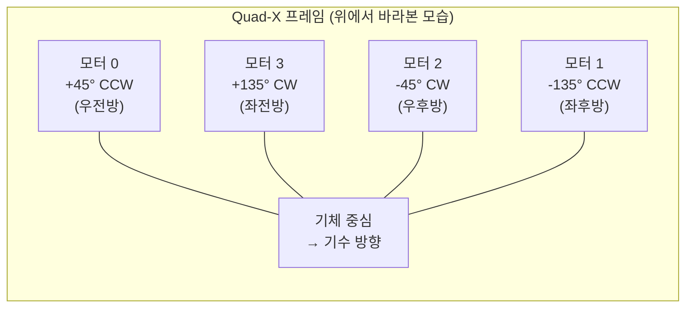
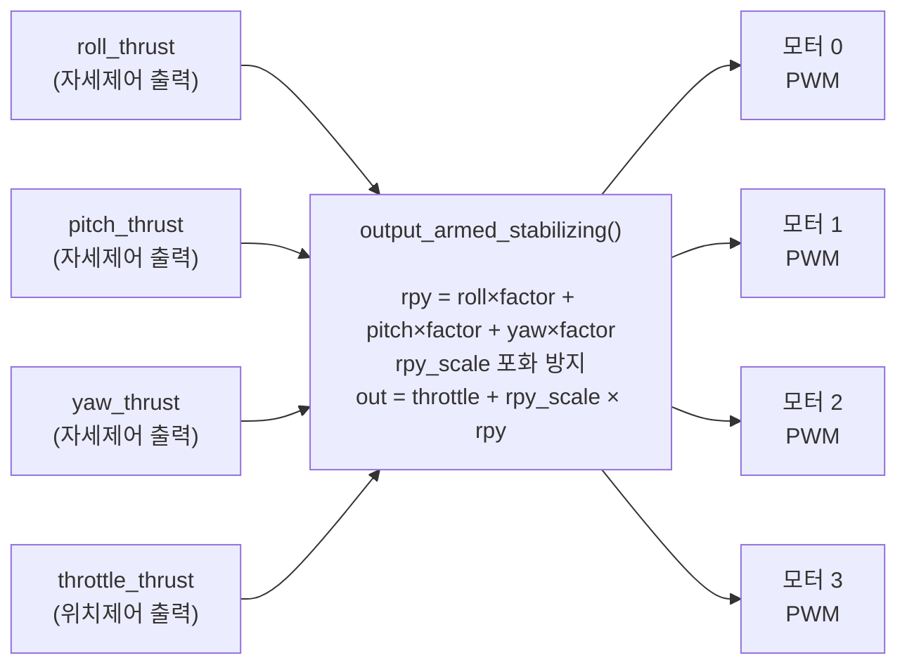
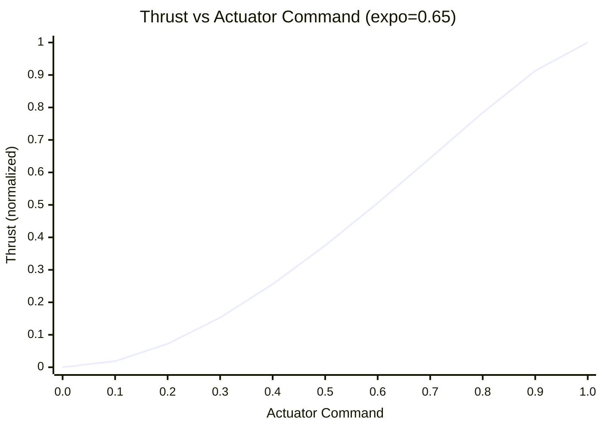
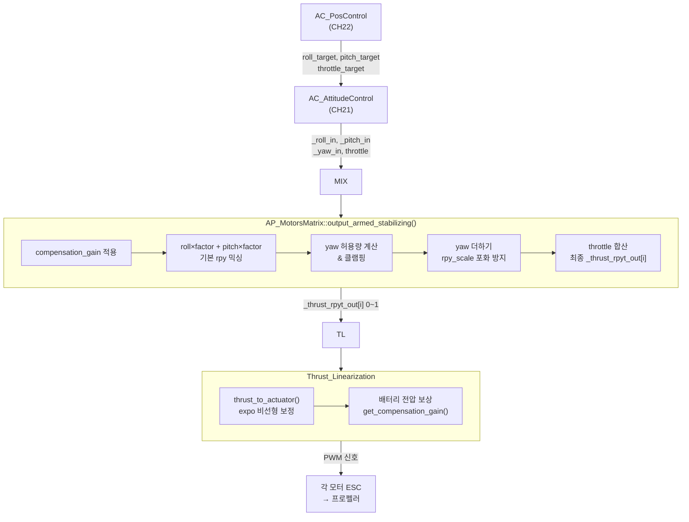

# CH23. 모터 믹싱 — roll/pitch/yaw/throttle을 각 모터 PWM으로

::: info 학습 목표
- 모터 믹싱이 필요한 이유와 Quad-X 프레임에서 4개 모터로 4자유도를 만드는 원리를 설명할 수 있다.
- `add_motor_raw`의 roll/pitch/yaw factor 공식(`cos(angle+90)`, `cos(angle)`)을 유도할 수 있다.
- `output_armed_stabilizing`의 믹싱 수식과 `rpy_scale` 포화 방지 로직을 소스로 설명할 수 있다.
- CW/CCW 프로펠러 교대 배치가 yaw 제어를 가능하게 하는 물리적 이유를 설명할 수 있다.
- `Thrust_Linearization`의 expo 보정과 배터리 전압 보상이 해결하는 문제를 이해한다.
:::

## 1. 모터 믹싱이란 무엇인가

22장에서 위치 제어가 출력한 것은 roll_target, pitch_target, yaw_target, throttle이다. 이것을 모터 1~4의 PWM 신호로 변환하는 것이 **모터 믹싱(motor mixing)**이다.

직관적으로 생각해보자. 드론이 오른쪽으로 롤해야 한다면, 왼쪽 모터를 더 세게 돌리고 오른쪽 모터를 더 약하게 돌리면 된다. yaw는 어떻게 만드는가? 이것이 훨씬 흥미롭다.

### 1.1 yaw를 만드는 방법: 반작용 토크

프로펠러가 회전하면 공기에 토크를 가한다. 뉴턴 제3법칙에 의해 공기는 프로펠러에 반대 방향 토크를 가한다. 이것이 **반작용 토크(reaction torque)**다.

- CCW(반시계)로 도는 모터: 기체를 CW(시계) 방향으로 밀어낸다
- CW(시계)로 도는 모터: 기체를 CCW(반시계) 방향으로 밀어낸다

Quad-X에서 대각선 모터쌍을 같은 방향으로 묶으면, 네 모터의 반작용 토크가 상쇄되어 기체가 yaw로 돌아가지 않는다. 그런데 한 대각선 쌍의 RPM을 높이고 다른 쌍을 낮추면? 반작용 토크 균형이 깨지면서 기체가 yaw로 회전한다.

이것이 **프로펠러 방향을 교대 배치하는 이유**다.

## 2. Quad-X 프레임 배치

### 2.1 모터 위치와 회전 방향

```cpp
// Quad-X 프레임 모터 배치
case MOTOR_FRAME_TYPE_X: {
    _frame_type_string = "X";
    static const AP_MotorsMatrix::MotorDef motors[] {
        {   45, AP_MOTORS_MATRIX_YAW_FACTOR_CCW,  1 },  // 모터 0: 우전방, CCW
        { -135, AP_MOTORS_MATRIX_YAW_FACTOR_CCW,  3 },  // 모터 1: 좌후방, CCW
        {  -45, AP_MOTORS_MATRIX_YAW_FACTOR_CW,   4 },  // 모터 2: 우후방, CW
        {  135, AP_MOTORS_MATRIX_YAW_FACTOR_CW,   2 },  // 모터 3: 좌전방, CW
    };
    add_motors(motors, ARRAY_SIZE(motors));
    break;
}
```
`(libraries/AP_Motors/AP_MotorsMatrix.cpp:592~599)`

```cpp
// yaw factor 상수
#define AP_MOTORS_MATRIX_YAW_FACTOR_CW   -1   // 시계방향 프로펠러
#define AP_MOTORS_MATRIX_YAW_FACTOR_CCW   1   // 반시계방향 프로펠러
```
`(libraries/AP_Motors/AP_MotorsMatrix.h:10~11)`

각도는 기수(북)를 0°로 했을 때의 모터 위치 방향이다. 45°는 우전방, -45°는 우후방이다.



대각선으로 CCW 쌍(모터 0, 1)과 CW 쌍(모터 2, 3)이 교대 배치된다. 네 모터가 같은 RPM이면 CCW 반작용 토크 합 = CW 반작용 토크 합 → yaw 균형.

### 2.2 상승/하강/롤/피치/yaw 정리

| 동작 | 모터 0 (우전방 CCW) | 모터 1 (좌후방 CCW) | 모터 2 (우후방 CW) | 모터 3 (좌전방 CW) |
|---|---|---|---|---|
| 상승 | ↑ | ↑ | ↑ | ↑ |
| 하강 | ↓ | ↓ | ↓ | ↓ |
| 롤 우 | ↑ | ↑ | ↓ | ↓ |
| 롤 좌 | ↓ | ↓ | ↑ | ↑ |
| 피치 앞 | ↓ | ↑ | ↑ | ↓ |
| 피치 뒤 | ↑ | ↓ | ↓ | ↑ |
| Yaw CW | ↓ (CCW) | ↓ (CCW) | ↑ (CW) | ↑ (CW) |
| Yaw CCW | ↑ (CCW) | ↑ (CCW) | ↓ (CW) | ↓ (CW) |

yaw CW: CW 프로펠러(모터 2, 3)를 올리면 시계 방향 반작용 토크가 증가 → 기체 CW 회전.

## 3. roll/pitch/yaw factor 계산

### 3.1 add_motor 수식

```cpp
void AP_MotorsMatrix::add_motor(
    int8_t motor_num,
    float roll_factor_in_degrees,
    float pitch_factor_in_degrees,
    float yaw_factor,
    uint8_t testing_order)
{
    add_motor_raw(
        motor_num,
        cosf(radians(roll_factor_in_degrees + 90)),  // roll factor
        cosf(radians(pitch_factor_in_degrees)),       // pitch factor
        yaw_factor,
        testing_order);
}
```
`(libraries/AP_Motors/AP_MotorsMatrix.cpp:537~543)`

각도 θ가 모터 위치 방향(기수=0°)일 때:

- **roll factor** = `cos(θ + 90°) = -sin(θ)`  
  모터가 오른쪽(θ=−45°)에 있으면 `−sin(−45°) = +0.707`. 오른쪽 모터가 빠르면 기체 오른쪽이 올라가고 왼쪽이 내려가므로 roll 우 기여가 양수인 것이 맞다.

- **pitch factor** = `cos(θ)`  
  모터가 앞(θ=45°, −45°)에 있으면 `cos(±45°) = +0.707`. 전방 모터가 빠르면 앞이 올라가므로 pitch 뒤 기여가 양수가 된다.

Quad-X 각 모터의 factor를 계산하면:

| 모터 | 위치(°) | roll factor | pitch factor | yaw factor |
|---|---|---|---|---|
| 0 | +45 | `-sin(45°) = -0.707` | `cos(45°) = +0.707` | +1 (CCW) |
| 1 | −135 | `-sin(-135°) = +0.707` | `cos(-135°) = -0.707` | +1 (CCW) |
| 2 | −45 | `-sin(-45°) = +0.707` | `cos(-45°) = +0.707` | −1 (CW) |
| 3 | +135 | `-sin(135°) = -0.707` | `cos(135°) = -0.707` | −1 (CW) |

롤 우(양의 roll_thrust): 모터 1, 2(양의 roll factor) 출력 증가 → 기체 우측 상승. 수학과 물리가 일치한다.

### 3.2 add_motor_raw: factor 저장

```cpp
void AP_MotorsMatrix::add_motor_raw(
    int8_t motor_num, float roll_fac, float pitch_fac, float yaw_fac,
    uint8_t testing_order, float throttle_factor)
{
    // ...
    _roll_factor[motor_num]     = roll_fac;
    _pitch_factor[motor_num]    = pitch_fac;
    _yaw_factor[motor_num]      = yaw_fac;
    _throttle_factor[motor_num] = throttle_factor;
    // ...
}
```
`(libraries/AP_Motors/AP_MotorsMatrix.cpp:503~525)`

이 배열이 믹싱의 핵심 데이터 구조다. `output_armed_stabilizing()`이 이 factor를 참조해 각 모터 출력을 계산한다.

## 4. output_armed_stabilizing: 믹싱 수식

### 4.1 입력 스케일링

```cpp
void AP_MotorsMatrix::output_armed_stabilizing()
{
    // 배터리 전압/고도 보상 게인
    const float compensation_gain = thr_lin.get_compensation_gain();

    // 입력 신호를 보상 게인으로 스케일
    const float roll_thrust  = (_roll_in  + _roll_in_ff)  * compensation_gain;
    const float pitch_thrust = (_pitch_in + _pitch_in_ff) * compensation_gain;
    float yaw_thrust         = (_yaw_in   + _yaw_in_ff)   * compensation_gain;
    float throttle_thrust    = get_throttle()              * compensation_gain;
```
`(libraries/AP_Motors/AP_MotorsMatrix.cpp:213~229)`

`_roll_in`, `_pitch_in`은 21장 자세 제어가 넘겨준 −1~+1 범위의 명령값이다. `_roll_in_ff`는 피드포워드 성분이다.

### 4.2 롤+피치 믹싱

```cpp
for (uint8_t i = 0; i < AP_MOTORS_MAX_NUM_MOTORS; i++) {
    if (motor_enabled[i]) {
        // 각 모터의 roll + pitch 기여분
        _thrust_rpyt_out[i] = roll_thrust  * _roll_factor[i]
                            + pitch_thrust * _pitch_factor[i];
    }
}
```
`(libraries/AP_Motors/AP_MotorsMatrix.cpp:279~281)`

### 4.3 yaw 허용량 계산 및 클램핑

yaw는 throttle 범위 내에서만 허용된다. 모터 출력이 0~1을 벗어나면 안 되기 때문이다.

```cpp
for (uint8_t i = 0; i < AP_MOTORS_MAX_NUM_MOTORS; i++) {
    if (!is_zero(_yaw_factor[i])) {
        const float thrust_rp_best_throttle = throttle_thrust_best_rpy
                                            + _thrust_rpyt_out[i];
        float motor_room;
        if (is_positive(yaw_thrust * _yaw_factor[i])) {
            motor_room = 1.0 - thrust_rp_best_throttle;  // 상한까지 여유
        } else {
            motor_room = thrust_rp_best_throttle;         // 하한까지 여유
        }
        const float motor_yaw_allowed = MAX(motor_room, 0.0) / fabsf(_yaw_factor[i]);
        yaw_allowed = MIN(yaw_allowed, motor_yaw_allowed);
    }
}
// yaw 클램핑
if (fabsf(yaw_thrust) > yaw_allowed) {
    yaw_thrust = constrain_float(yaw_thrust, -yaw_allowed, yaw_allowed);
    limit.yaw = true;
}
```
`(libraries/AP_Motors/AP_MotorsMatrix.cpp:283~335)`

### 4.4 yaw 더하기 및 rpy_scale 포화 방지

```cpp
// yaw 더하기
for (uint8_t i = 0; i < AP_MOTORS_MAX_NUM_MOTORS; i++) {
    if (motor_enabled[i]) {
        _thrust_rpyt_out[i] += yaw_thrust * _yaw_factor[i];
    }
}

// rpy 최대/최소 탐색
float rpy_low = 1.0f, rpy_high = -1.0f;
for (...) {
    if (_thrust_rpyt_out[i] < rpy_low)  rpy_low  = _thrust_rpyt_out[i];
    if (_thrust_rpyt_out[i] > rpy_high) rpy_high = _thrust_rpyt_out[i];
}

// 포화 방지 스케일
float rpy_scale = 1.0f;
if (rpy_high - rpy_low > 1.0f) {
    rpy_scale = 1.0f / (rpy_high - rpy_low);  // 전체 범위를 1.0 이하로 압축
}
if (throttle_avg_max + rpy_low < 0) {
    rpy_scale = MIN(rpy_scale, -throttle_avg_max / rpy_low);
}
```
`(libraries/AP_Motors/AP_MotorsMatrix.cpp:338~370)`

`rpy_scale < 1`이 되는 경우는 roll/pitch/yaw 조합이 너무 커서 어떤 모터는 1을 초과하고 어떤 모터는 0 미만이 되는 상황이다. 전체를 동일 비율로 축소해 상대적인 roll/pitch/yaw 비를 유지하면서 범위를 맞춘다.

### 4.5 throttle 합산: 최종 모터 출력

```cpp
// throttle + 스케일된 rpy
const float throttle_thrust_best_plus_adj = throttle_thrust_best_rpy + thr_adj;
for (uint8_t i = 0; i < AP_MOTORS_MAX_NUM_MOTORS; i++) {
    if (motor_enabled[i]) {
        _thrust_rpyt_out[i] = (throttle_thrust_best_plus_adj * _throttle_factor[i])
                            + (rpy_scale * _thrust_rpyt_out[i]);
    }
}
```
`(libraries/AP_Motors/AP_MotorsMatrix.cpp:393~395)`

최종 공식:

```
motor_out[i] = throttle × throttle_factor[i]
             + rpy_scale × (roll_thrust × roll_factor[i]
                          + pitch_thrust × pitch_factor[i]
                          + yaw_thrust × yaw_factor[i])
```

`_throttle_factor`는 보통 1.0이다. 비대칭 프레임이나 헥사/옥토에서 모터별 throttle 기여를 다르게 할 때 사용된다.



## 5. Thrust Linearization: 비선형 보정

### 5.1 문제: 스로틀 50%가 추력 50%가 아니다

전동 모터+프로펠러 시스템에서 **추력은 RPM의 제곱에 비례**한다. PWM(모터 명령)이 RPM에 대략 선형이라면:

```
추력 ∝ RPM² ∝ PWM²
```

스로틀 명령 50%는 최대 추력의 25%밖에 안 된다. 위치 제어와 자세 제어는 스로틀 명령과 실제 추력이 선형이라고 가정하기 때문에, 이 비선형성을 보정하지 않으면 저공에서 반응이 둔하고 고출력 구간에서 과반응한다.

### 5.2 thrust_to_actuator: expo 보정

```cpp
// 추력 명령(0~1) → 실제 액추에이터 출력(0~1)
float Thrust_Linearization::thrust_to_actuator(float thrust_in) const
{
    thrust_in = constrain_float(thrust_in, 0.0, 1.0);
    return spin_min + (spin_max - spin_min)
           * apply_thrust_curve_and_volt_scaling(thrust_in);
}
```
`(libraries/AP_Motors/AP_Motors_Thrust_Linearization.cpp:104~108)`

```cpp
float Thrust_Linearization::apply_thrust_curve_and_volt_scaling(float thrust) const
{
    float battery_scale = 1.0;
    if (is_positive(batt_voltage_filt.get())) {
        battery_scale = 1.0 / batt_voltage_filt.get();
    }
    float thrust_curve_expo = constrain_float(curve_expo, -1.0, 1.0);
    if (is_zero(thrust_curve_expo)) {
        return lift_max * thrust * battery_scale;
    }
    // expo 역함수: 추력 → RPM 비율로 역산
    float throttle_ratio = (
        (thrust_curve_expo - 1.0)
        + safe_sqrt((1.0 - thrust_curve_expo) * (1.0 - thrust_curve_expo)
                    + 4.0 * thrust_curve_expo * lift_max * thrust)
    ) / (2.0 * thrust_curve_expo);
    return constrain_float(throttle_ratio * battery_scale, 0.0, 1.0);
}
```
`(libraries/AP_Motors/AP_Motors_Thrust_Linearization.cpp:119~133)`

`curve_expo` 기본값은 0.65다. 0이면 완전 선형(보정 없음), 1이면 2차 비선형(추력∝PWM²)을 완전 보정한다. 0.65는 실제 모터 특성이 순수 2차보다 약간 선형에 가깝다는 경험적 값이다.

```cpp
// THST_EXPO 파라미터 기본값
#define THRST_LIN_THST_EXPO_DEFAULT  0.65f  // 0=선형, 1=2차 보정 완전
#define THRST_LIN_SPIN_MIN_DEFAULT   0.15f  // 최소 회전 스로틀 비율
#define THRST_LIN_SPIN_MAX_DEFAULT   0.95f  // 최대 회전 스로틀 비율
```
`(libraries/AP_Motors/AP_Motors_Thrust_Linearization.cpp:28~30)`

`spin_min = 0.15`는 모터가 실제로 회전하기 시작하는 최소 명령값(dead band 이후)이고, `spin_max = 0.95`는 전기적 한계와 열 여유를 고려한 최대값이다.

### 5.3 배터리 전압 보정

배터리가 방전되면 같은 PWM에서 RPM이 떨어지고 추력이 줄어든다. 이를 보상하기 위해 `compensation_gain`을 계산한다.

```cpp
float Thrust_Linearization::get_compensation_gain() const
{
    if (get_lift_max() <= 0.0) {
        return 1.0;
    }
    float ret = 1.0 / get_lift_max();  // 전압 저하 역수로 보상
    // 공기 밀도 보정 (고고도에서 추력 감소 보상)
    const float air_density_ratio = AP::ahrs().get_air_density_ratio();
    if (air_density_ratio > 0.3 && air_density_ratio < 1.5) {
        ret *= 1.0 / constrain_float(air_density_ratio, 0.5, 1.25);
    }
    return ret;
}
```
`(libraries/AP_Motors/AP_Motors_Thrust_Linearization.cpp:189~205)`

`lift_max`는 현재 배터리 전압 비율의 함수다. 전압이 설정 최대치의 80%로 떨어지면 `lift_max ≈ 0.8`이 되고 `compensation_gain = 1/0.8 = 1.25`가 되어 명령값을 25% 더 올린다.



expo=0.65 보정 후에는 actuator 명령 0.5에서 thrust가 약 0.375가 된다. 보정 없이 순수 2차였다면 0.25였을 것이다. expo 보정이 중간 구간의 응답성을 높인다.

## 6. 전체 파이프라인 정리



::: tip 핵심 정리
- Quad-X의 yaw는 CW/CCW 프로펠러 반작용 토크 차이로 만든다. 대각선 쌍이 동방향인 이유가 여기 있다.
- `add_motor`의 roll factor = `cos(θ+90°) = -sin(θ)`, pitch factor = `cos(θ)`. 이 공식이 모터 위치 각도에서 직접 기여도를 계산한다(`(libraries/AP_Motors/AP_MotorsMatrix.cpp:541~542)`).
- `output_armed_stabilizing`의 믹싱 공식: `out[i] = throttle + rpy_scale × (roll×rf[i] + pitch×pf[i] + yaw×yf[i])`. `rpy_scale`은 출력이 0~1을 벗어나지 않도록 전체 rpy 성분을 비례 축소한다(`(libraries/AP_Motors/AP_MotorsMatrix.cpp:360~395)`).
- `Thrust_Linearization.thrust_to_actuator()`는 expo=0.65(기본)로 추력∝RPM² 비선형을 보정해 스로틀 명령이 실제 추력에 선형 대응되게 한다(`(libraries/AP_Motors/AP_Motors_Thrust_Linearization.cpp:104~133)`).
- 배터리 전압 보상은 `compensation_gain = 1/lift_max`로 전압 저하분을 역수로 반영한다.
:::

## 다음 챕터

[CH24. RC 입력과 텔레메트리](/study/ardupilot/24-rc-telemetry)

조종기 RC 신호가 ArduPilot에 어떻게 들어오고, MAVLink 텔레메트리로 GCS와 통신하는 구조를 분석한다.
