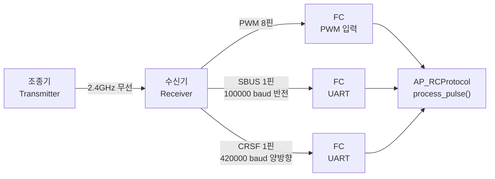
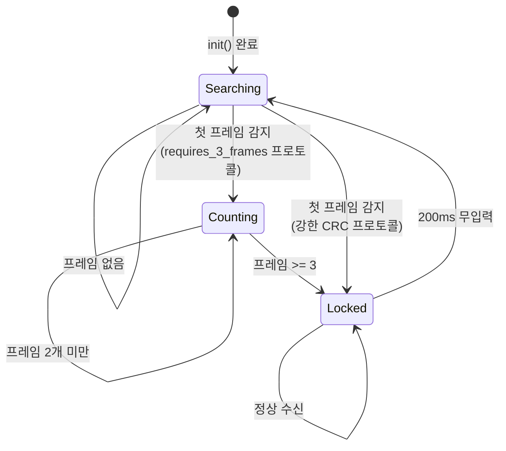
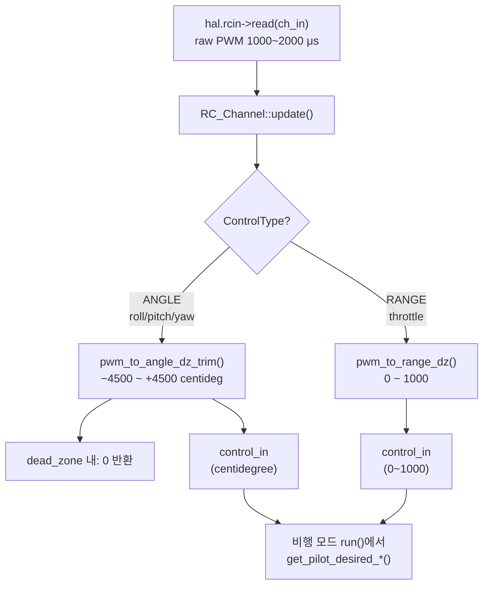
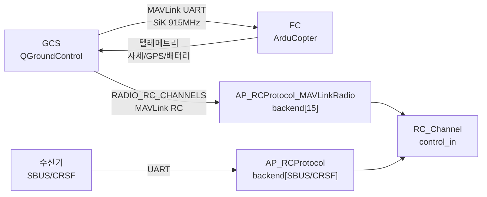

# CH24. RC 입력과 텔레메트리 링크

::: info 학습 목표
- PWM, SBUS, CRSF 세 프로토콜의 물리적 차이와 각각의 장단점을 설명할 수 있다.
- AP_RCProtocol의 backend 배열 패턴과 자동 감지 알고리즘(process_pulse/process_byte 흐름)을 코드로 추적할 수 있다.
- RC_Channel이 raw PWM을 roll/pitch/yaw 각도와 스로틀 범위값으로 변환하는 수식을 이해한다.
- AUX_FUNC 보조 스위치가 비행 모드 전환이나 아밍에 매핑되는 구조를 설명할 수 있다.
- SiK 라디오와 MAVLink RADIO 백엔드가 텔레메트리 링크를 구성하는 방식을 이해한다.
:::

## 1. 조종기 신호가 숫자가 되기까지

### 물리 신호의 두 종류

조종기(송신기)와 수신기 사이에는 2.4 GHz 무선 신호가 흐른다. 수신기는 FC(Flight Controller)에 채널 데이터를 전달할 때 두 가지 물리 방식 중 하나를 사용한다.

**PWM(Pulse Width Modulation)**: 채널마다 핀 하나를 사용한다. 핀이 HIGH인 시간이 1000~2000 μs 사이에서 채널값을 나타낸다. 1000 μs = 최솟값(스틱 아래/왼쪽), 1500 μs = 중립, 2000 μs = 최댓값(스틱 위/오른쪽). 8채널이면 핀 8개가 필요하다. 초기 RC 세계의 표준이었지만 배선이 많고 업데이트 레이트가 50~330 Hz 수준으로 낮다.

**직렬 바이트스트림**: 하나의 UART 핀에 여러 채널 데이터를 압축해 전송한다. 단일 선으로 16~18채널을 전달하고 업데이트 레이트가 높다.

| 프로토콜 | 방식 | 채널 | 전압레벨 | 업데이트 레이트 |
|---------|------|------|---------|---------------|
| PPM Sum | 펄스 | 8 | 3.3/5 V | 50 Hz |
| SBUS | 직렬(반전) | 16 | 3.3 V | 100 Hz |
| DSM/DSMX | 직렬 | 6~12 | 3.3 V | 22 ms |
| IBUS (FlySky) | 직렬 | 10 | 3.3 V | 7 ms |
| CRSF (TBS Crossfire) | 직렬(양방향) | 16 | 3.3 V | ~150 Hz |
| FPORT (FrSky) | 직렬(양방향) | 16 | 3.3 V | ~115 Hz |
| GHST (ImmersionRC) | 직렬(양방향) | 12 | 3.3 V | ~100 Hz |

**SBUS**: FrSky에서 만든 8E2 직렬 프로토콜, 100000 baud, 신호 반전(RC SBUS 핀은 TTL inverted). 11비트 채널값 16개를 25바이트 패킷에 담는다. `(libraries/AP_RCProtocol/AP_RCProtocol.cpp:62)`에서 `AP_RCProtocol_SBUS(*this, true, 100000)`로 초기화된다.

**CRSF**: TBS Crossfire 시스템의 양방향 직렬 프로토콜. 420000 baud. 패킷 헤더 + 타입 + 페이로드 + CRC8 구조다. 수신기 → FC 방향(채널 데이터)과 FC → 수신기 방향(텔레메트리)이 같은 선에서 반이중 동작한다.



## 2. AP_RCProtocol — backend 패턴

### 프로토콜 열거형

`AP_RCProtocol.h`는 지원 프로토콜을 `rcprotocol_t` 열거형으로 정의한다:

```cpp
enum rcprotocol_t {
    PPMSUM     =  0,
    IBUS       =  1,
    SBUS       =  2,
    SBUS_NI    =  3,
    DSM        =  4,
    SUMD       =  5,
    SRXL       =  6,
    SRXL2      =  7,
    CRSF       =  8,
    ST24       =  9,
    FPORT      = 10,
    FPORT2     = 11,
    FASTSBUS   = 12,
    DRONECAN   = 13,
    GHST       = 14,
    MAVLINK_RADIO = 15,
    ...
    NONE
};
```
`(libraries/AP_RCProtocol/AP_RCProtocol.h:35)`

각 값은 `backend[]` 배열의 인덱스다. `NONE`이 마지막이므로 배열 크기는 `NONE`개다.

### backend 배열

```cpp
AP_RCProtocol_Backend *backend[NONE];
```
`(libraries/AP_RCProtocol/AP_RCProtocol.h:298)`

`init()`에서 활성화된 프로토콜마다 구체 객체를 생성해 인덱스에 저장한다:

```cpp
backend[AP_RCProtocol::SBUS]  = NEW_NOTHROW AP_RCProtocol_SBUS(*this, true, 100000);
backend[AP_RCProtocol::CRSF]  = NEW_NOTHROW AP_RCProtocol_CRSF(*this);
backend[AP_RCProtocol::DSM]   = NEW_NOTHROW AP_RCProtocol_DSM(*this);
```
`(libraries/AP_RCProtocol/AP_RCProtocol.cpp:62~83)`

추상 베이스 클래스 `AP_RCProtocol_Backend`는 세 가지 순수 가상 함수를 정의한다:

```cpp
virtual void process_pulse(uint32_t width_s0, uint32_t width_s1) {}
virtual void process_byte(uint8_t byte, uint32_t baudrate) {}
virtual void update(void) {}
```
`(libraries/AP_RCProtocol/AP_RCProtocol_Backend.h:33~45)`

PPM Sum처럼 펄스 기반 프로토콜은 `process_pulse`를 구현하고, SBUS/CRSF처럼 직렬 프로토콜은 `process_byte`를 구현한다. `update`는 DroneCAN처럼 외부에서 폴링해야 하는 프로토콜이 사용한다.

## 3. 자동 프로토콜 감지

### 감지 전략

ArduPilot은 어떤 수신기를 연결했는지 사용자가 설정할 필요가 없다. `process_pulse`/`process_byte`를 **모든 backend에 동시에 던져** 어떤 backend의 `rc_frame_count`가 증가하는지 보고 프로토콜을 결정한다.

### process_pulse 흐름

```cpp
void AP_RCProtocol::process_pulse(uint32_t width_s0, uint32_t width_s1)
{
    bool searching = should_search(now);

    // 프로토콜이 확정됐으면 해당 backend만 사용
    if (_detected_protocol != NONE && !searching) {
        backend[_detected_protocol]->process_pulse(width_s0, width_s1);
        return;
    }

    // 아직 모르면 모든 backend 시도
    for (uint8_t i = 0; i < ARRAY_SIZE(backend); i++) {
        const uint32_t frame_count = backend[i]->get_rc_frame_count();
        backend[i]->process_pulse(width_s0, width_s1);
        const uint32_t frame_count2 = backend[i]->get_rc_frame_count();
        if (frame_count2 > frame_count) {
            if (requires_3_frames((rcprotocol_t)i) && frame_count2 < 3) {
                continue;  // 약한 CRC 프로토콜은 3프레임 대기
            }
            _detected_protocol = (rcprotocol_t)i;
            break;
        }
    }
}
```
`(libraries/AP_RCProtocol/AP_RCProtocol.cpp:161~219)`

`process_byte`도 같은 구조로 동작하며, 바이트 스트림으로 감지됐으면 `_detected_with_bytes = true`로 표시하고 `hal.rcin->pulse_input_enable(false)`를 호출해 불필요한 펄스 처리를 중단한다.

### 3프레임 확정 요건

CRC가 약한 프로토콜(DSM, SBUS, FPORT, CRSF, GHST 등)은 우연히 올바른 프레임처럼 보이는 바이트 패턴을 갖는 다른 데이터와 오감지될 수 있다. 따라서 `requires_3_frames()` 목록에 포함된 프로토콜은 3번 연속 성공 후 확정한다:

```cpp
bool requires_3_frames(enum rcprotocol_t p) {
    switch (p) {
    case DSM: case SBUS: case SBUS_NI: case PPMSUM:
    case FPORT: case FPORT2: case CRSF: case GHST:
        return true;
    default:
        return false;
    }
}
```
`(libraries/AP_RCProtocol/AP_RCProtocol.h:146)`



## 4. RC_Channel — 채널 변환

### 채널 파라미터

`RC_Channel`은 채널 하나를 관리한다. EEPROM에 저장되는 세 파라미터가 변환의 기준이다:

```cpp
AP_GROUPINFO("MIN",  1, RC_Channel, radio_min,  1100),
AP_GROUPINFO("TRIM", 2, RC_Channel, radio_trim, 1500),
AP_GROUPINFO("MAX",  3, RC_Channel, radio_max,  1900),
```
`(libraries/RC_Channel/RC_Channel.cpp:74~92)`

기본값은 MIN=1100 μs, TRIM=1500 μs, MAX=1900 μs다. 조종기 캘리브레이션을 하면 실측값으로 갱신된다.

### update() — raw PWM 읽기

```cpp
bool RC_Channel::update(void)
{
    raw_radio_in = hal.rcin->read(ch_in);   // HAL에서 PWM 읽기
    radio_in = raw_radio_in;

    if (type_in == ControlType::RANGE) {
        control_in = pwm_to_range();
    } else {
        control_in = pwm_to_angle();        // roll/pitch/yaw
    }
    return true;
}
```
`(libraries/RC_Channel/RC_Channel.cpp:304~323)`

`hal.rcin->read(ch_in)`은 HAL 추상화 레이어를 통해 실제 하드웨어 PWM 레지스터나 UART 버퍼에서 값을 읽는다.

### pwm_to_angle — 각도 변환

`ControlType::ANGLE`은 roll, pitch, yaw 채널에 사용한다. 출력 범위는 `-high_in`~`+high_in` centidegree(기본 ±4500 centidegree = ±45°):

```cpp
float RC_Channel::pwm_to_angle_dz_trim(uint16_t _dead_zone, uint16_t _trim) const
{
    int16_t radio_trim_high = _trim + _dead_zone;
    int16_t radio_trim_low  = _trim - _dead_zone;
    float reverse_mul = (reversed ? -1 : 1);
    int16_t r_in = constrain_int16(radio_in, radio_min, radio_max);

    if (r_in > radio_trim_high && radio_max != radio_trim_high) {
        return reverse_mul * ((float)high_in * (float)(r_in - radio_trim_high))
               / (float)(radio_max - radio_trim_high);
    } else if (r_in < radio_trim_low && radio_trim_low != radio_min) {
        return reverse_mul * ((float)high_in * (float)(r_in - radio_trim_low))
               / (float)(radio_trim_low - radio_min);
    } else {
        return 0;  // dead zone 내
    }
}
```
`(libraries/RC_Channel/RC_Channel.cpp:346~363)`

데드존(`dead_zone` 파라미터, 기본 0)은 trim 주변 구간에서 출력을 강제로 0으로 만든다. 스틱이 완전히 중립으로 돌아오지 않아도 의도치 않은 미세 입력이 전달되지 않게 한다.

### pwm_to_range — 스로틀 변환

`ControlType::RANGE`는 스로틀 채널에 사용한다. 출력 범위는 0~`high_in`(기본 1000):

```cpp
float RC_Channel::pwm_to_range_dz(uint16_t _dead_zone) const
{
    int16_t r_in = constrain_int16(radio_in, radio_min, radio_max);
    int16_t radio_trim_low = radio_min + _dead_zone;
    if (r_in > radio_trim_low) {
        return (((float)high_in * (float)(r_in - radio_trim_low))
               / (float)(radio_max - radio_trim_low));
    }
    return 0;
}
```
`(libraries/RC_Channel/RC_Channel.cpp:388~402)`

스로틀은 중립(trim)이 없고 바닥(min)에서 시작한다. 최저 데드존 이하에서는 0을 반환한다.

### norm_input — 정규화 입력

일부 모드는 원시 centidegree 대신 -1~+1 범위의 정규화 값을 사용한다:

```cpp
float RC_Channel::norm_input() const
{
    // radio_in을 radio_min..radio_max에서 -1..+1로 선형 변환
}
```



## 5. 보조 스위치 — AUX_FUNC

### 기능 매핑

채널 5번 이상의 스위치 채널에는 RC_Channel::AUX_FUNC를 통해 기능을 매핑한다. `RC_Channel.h`에 정의된 주요 값들:

```cpp
enum class AUX_FUNC {
    RTL              =  4,   // RTL 모드 전환
    AUTO             = 16,   // Auto 모드 전환
    LAND             = 18,   // Land 모드 전환
    ARMDISARM_UNUSED = 41,   // UNUSED
    GUIDED           = 55,   // Guided 모드 전환
    LOITER           = 56,   // Loiter 모드 전환
    STABILIZE        = 68,   // Stabilize 모드 전환
    ALTHOLD          = 70,   // AltHold 모드 전환
    ARMDISARM        = 153,  // 아밍/디스아밍
    ARMDISARM_AIRMODE= 154,  // 에어모드 포함 아밍
    ...
};
```
`(libraries/RC_Channel/RC_Channel.h:134~)`

GCS(QGroundControl, Mission Planner)에서 `RCx_OPTION` 파라미터로 채널에 기능 번호를 지정하면 스위치 ON/OFF/MID 상태에 따라 해당 기능이 실행된다.

## 6. 텔레메트리 링크

### SiK 라디오 — 직렬 MAVLink

지상국(GCS)과 FC 사이의 양방향 통신은 대부분 SiK 라디오(433/915 MHz)나 WiFi/LTE 링크를 통한 MAVLink 프로토콜이 담당한다. FC 측은 UART 포트에서 MAVLink 직렬 스트림을 주고받는다. 텔레메트리 링크로는 FC 상태(자세, GPS, 배터리 등)가 GCS로 올라가고, 미션 명령이나 파라미터 변경이 GCS에서 FC로 내려온다.

### MAVLink RADIO 백엔드

GCS는 MAVLink 채널을 통해 RC 채널값을 FC에 직접 주입할 수 있다. 이 경우 `AP_RCProtocol_MAVLinkRadio` backend가 `MAVLINK_RADIO = 15` 인덱스에 등록된다:

```cpp
backend[AP_RCProtocol::MAVLINK_RADIO] =
    NEW_NOTHROW AP_RCProtocol_MAVLinkRadio(*this);
```
`(libraries/AP_RCProtocol/AP_RCProtocol.cpp:101)`

GCS가 MAVLink `RADIO_RC_CHANNELS` 메시지를 보내면 `handle_radio_rc_channels()`를 통해 `update_radio_rc_channels()` 가상 함수가 호출되고, backend는 `add_input()`으로 채널값을 내부 버퍼에 저장한다. 실제 수신기가 없는 컴패니언 컴퓨터 기반 시스템에서 유용하다.

27장에서 MAVLink 프로토콜 전체 구조를 다룬다.



::: tip 핵심 정리
- PWM은 채널당 핀 1개, 1000~2000 μs 펄스폭으로 채널값을 나타낸다. SBUS/CRSF는 단일 UART 선에 다채널을 직렬 스트림으로 압축한다.
- AP_RCProtocol은 `rcprotocol_t` 열거형 인덱스로 backend 배열을 관리한다. `init()`에서 모든 backend 인스턴스를 생성하고, 수신 데이터를 전체 backend에 던져 `rc_frame_count` 증가 여부로 프로토콜을 자동 감지한다.
- CRC가 약한 DSM/SBUS/FPORT/CRSF/GHST는 `requires_3_frames()` 조건에 해당해 3프레임 연속 성공 후 확정된다.
- RC_Channel은 `radio_min`(1100), `radio_trim`(1500), `radio_max`(1900) 파라미터를 기준으로 `pwm_to_angle()`은 centidegree, `pwm_to_range()`는 0~1000 범위로 변환한다. 데드존 구간에서는 0을 반환한다.
- AUX_FUNC로 보조 채널에 RTL/AUTO/LAND/ARMDISARM 등 기능을 매핑한다.
- SiK 라디오는 UART 직렬 MAVLink를 반송하는 투명 직렬 링크다. MAVLink RADIO backend는 GCS가 RC 채널값을 직접 주입할 수 있는 소프트웨어 경로를 제공한다.
:::

## 다음 챕터

[CH25. 비행 모드 구조](/study/ardupilot/25-flight-modes)에서는 Mode 베이스 클래스와 Stabilize/AltHold/Loiter/Auto 등 구체 모드의 run() 루프를 분석한다.
