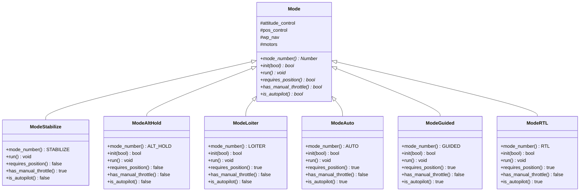
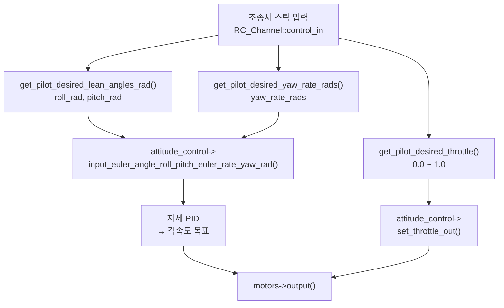
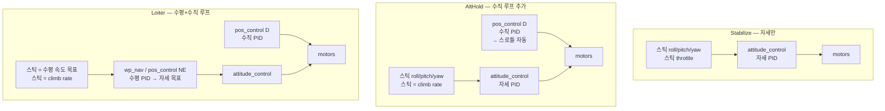

# CH25. 비행 모드 구조

::: info 학습 목표
- Mode 베이스 클래스의 핵심 가상 함수(mode_number, init, run, requires_position, has_manual_throttle, is_autopilot)의 역할을 설명할 수 있다.
- Stabilize, AltHold, Loiter 각 모드의 run() 루프가 제어 캐스케이드의 어느 계층에서 시작하는지 구분할 수 있다.
- 모드별 GPS 필요 여부·자동조종 여부·스로틀 형태를 표로 정리할 수 있다.
- 비행 모드 전환 시 init() 실패 조건을 이해한다.
:::

## 1. Mode 베이스 클래스

### 모드 번호 열거형

ArduCopter는 수십 개의 비행 모드를 지원한다. 각 모드는 고유한 번호를 가진다:

```cpp
enum class Number : uint8_t {
    STABILIZE  =  0,  // 수동 자세 + 수동 스로틀
    ACRO       =  1,  // 수동 각속도 + 수동 스로틀
    ALT_HOLD   =  2,  // 수동 자세 + 자동 고도
    AUTO       =  3,  // 완전 자동 미션
    GUIDED     =  4,  // GCS/SDK 실시간 명령
    LOITER     =  5,  // 자동 수평 + 자동 고도
    RTL        =  6,  // 자동 귀환
    CIRCLE     =  7,  // 자동 원형 비행
    LAND       =  9,  // 자동 착륙
    ...
    POSHOLD    = 16,  // 자동 위치 + 수동 오버라이드
    BRAKE      = 17,  // 완전 제동
    SMART_RTL  = 21,  // 경로 역추적 귀환
    FLOWHOLD   = 22,  // Optical Flow 위치 유지
    ZIGZAG     = 24,
    ...
};
```
`(ArduCopter/mode.h:77)`

이 번호는 MAVLink `HEARTBEAT` 메시지의 `custom_mode` 필드로 GCS에 전달된다.

### 핵심 가상 함수

`Mode` 클래스는 모든 구체 모드가 반드시 구현해야 하는 순수 가상 함수와 선택적 가상 함수를 정의한다:

```cpp
class Mode {
public:
    // 모드 고유 번호 — 반드시 구현
    virtual Number mode_number() const = 0;

    // 모드 진입 — 실패하면 false 반환, 모드 전환 거부
    virtual bool init(bool ignore_checks) { return true; }

    // 매 루프(400Hz) 제어 계산 — 반드시 구현
    virtual void run() = 0;

    // GPS 위치 추정이 필요한 모드인가
    virtual bool requires_position() const = 0;

    // 조종사가 스로틀을 직접 제어하는가
    virtual bool has_manual_throttle() const = 0;

    // 자동조종 모드인가(GPS 자율비행 포함)
    virtual bool is_autopilot() const = 0;
};
```
`(ArduCopter/mode.h:120~131)`

`run()`이 순수 가상(`= 0`)이라는 점이 핵심이다. 모드 객체가 존재한다면 반드시 실제 제어 코드가 있어야 한다. 메인 루프(`fast_loop`, 약 400Hz)는 `flightmode->run()`을 매 사이클 호출한다.

### 제어 계층(cascade) 복습

20장에서 다룬 제어 캐스케이드를 떠올리자:

```
조종사 입력
   ↓
[위치 루프]    — GPS 위치 오차 → 목표 속도
   ↓
[속도 루프]    — 속도 오차 → 목표 가속도/자세
   ↓
[자세 루프]    — 자세 오차 → 목표 각속도
   ↓
[각속도 루프]  — 각속도 오차 → 모터 출력
```

모드는 이 계층의 **어느 입구부터 열어줄 것인가**를 결정한다. Stabilize는 자세 루프만, AltHold는 수직 속도 루프 + 자세 루프, Loiter는 전체 루프를 사용한다.

## 2. Mode 클래스 계층



## 3. Stabilize 모드

### 특성

| 항목 | 값 |
|------|-----|
| requires_position() | false (GPS 불필요) |
| has_manual_throttle() | true |
| is_autopilot() | false |
| 사용 제어 계층 | 자세 루프 + 각속도 루프 |

### run() 분석

```cpp
void ModeStabilize::run()
{
    // 스틱 → 목표 롤/피치 각도
    float target_roll_rad, target_pitch_rad;
    get_pilot_desired_lean_angles_rad(
        target_roll_rad, target_pitch_rad,
        attitude_control->lean_angle_max_rad(),
        attitude_control->lean_angle_max_rad());

    // 스틱 → 목표 요 각속도
    float target_yaw_rate_rads = get_pilot_desired_yaw_rate_rads();

    // 스로틀 → 스풀 상태 결정
    if (copter.ap.throttle_zero) {
        motors->set_desired_spool_state(
            AP_Motors::DesiredSpoolState::GROUND_IDLE);
    } else {
        motors->set_desired_spool_state(
            AP_Motors::DesiredSpoolState::THROTTLE_UNLIMITED);
    }

    float pilot_desired_throttle = get_pilot_desired_throttle();

    // 자세 컨트롤러 호출 — 목표 롤/피치(각도) + 목표 요(각속도)
    attitude_control->input_euler_angle_roll_pitch_euler_rate_yaw_rad(
        target_roll_rad, target_pitch_rad, target_yaw_rate_rads);

    // 스로틀 직접 출력 — 위치 컨트롤러 사용 안 함
    attitude_control->set_throttle_out(
        pilot_desired_throttle, true, g.throttle_filt);
}
```
`(ArduCopter/mode_stabilize.cpp:9~64)`

`input_euler_angle_roll_pitch_euler_rate_yaw_rad`는 자세 컨트롤러(AC_AttitudeControl)에 **각도 목표**를 전달한다. 자세 컨트롤러 내부에서 현재 자세와의 오차를 계산해 각속도 목표를 생성하고, 각속도 PID를 통해 모터 출력을 결정한다.

중요한 점은 `set_throttle_out`을 직접 호출한다는 것이다. 위치 컨트롤러(`pos_control`)를 거치지 않으므로 고도는 조종사가 스로틀로 직접 제어한다. 손을 놓으면 그 자리에 멈추지 않고 천천히 내려간다.

### Stabilize 흐름



## 4. AltHold 모드

### 특성

| 항목 | 값 |
|------|-----|
| requires_position() | false (GPS 불필요) |
| has_manual_throttle() | false |
| is_autopilot() | false |
| 사용 제어 계층 | 수직 속도 루프 + 자세 루프 |

### run() 분석

AltHold는 Stabilize와 비슷하지만 스로틀 부분이 다르다. 조종사의 스로틀 스틱은 **목표 상승/하강 속도(climb rate)**로 해석된다:

```cpp
void ModeAltHold::run()
{
    // 수평 자세: Stabilize와 동일
    float target_roll_rad, target_pitch_rad;
    get_pilot_desired_lean_angles_rad(target_roll_rad, target_pitch_rad, ...);
    float target_yaw_rate_rads = get_pilot_desired_yaw_rate_rads();

    // 스로틀 스틱 → 목표 상승 속도 (m/s)
    float target_climb_rate_ms = get_pilot_desired_climb_rate_ms();

    AltHoldModeState althold_state = get_alt_hold_state_D_ms(target_climb_rate_ms);

    switch (althold_state) {
    case AltHoldModeState::Flying:
        // 위치 컨트롤러에 목표 상승 속도 전달
        pos_control->D_set_pos_target_from_climb_rate_ms(target_climb_rate_ms);
        break;
    ...
    }

    // 자세 컨트롤러 (수평)
    attitude_control->input_euler_angle_roll_pitch_euler_rate_yaw_rad(
        target_roll_rad, target_pitch_rad, target_yaw_rate_rads);

    // 수직 위치 컨트롤러 실행 → 스로틀 자동 출력
    pos_control->D_update_controller();
}
```
`(ArduCopter/mode_althold.cpp:26~103)`

`D_set_pos_target_from_climb_rate_ms`는 현재 고도를 기준으로 목표 고도를 적분한다. `D_update_controller`는 목표 고도와 현재 고도의 오차를 PID로 처리해 스로틀을 자동 출력한다. 조종사는 스로틀에서 손을 놓으면(중립) 현재 고도를 유지하게 된다.

## 5. Loiter 모드

### 특성

| 항목 | 값 |
|------|-----|
| requires_position() | true (GPS 필수) |
| has_manual_throttle() | false |
| is_autopilot() | false |
| 사용 제어 계층 | 수평 위치 루프 + 수직 속도 루프 + 자세 루프 |

Loiter는 수평 방향도 위치 컨트롤러가 관리한다. 스틱 중립에서 현재 GPS 위치를 유지하고, 스틱을 밀면 목표 위치가 이동한다. 강한 바람이 불어도 GPS 피드백으로 위치를 보정한다. `requires_position() = true`이므로 EKF GPS 위치 추정이 없으면 모드 전환이 거부된다.

## 6. 모드별 제어 계층 비교

| 모드 | GPS 필요 | 수평 위치 루프 | 수직 위치 루프 | 스로틀 | 자동조종 |
|------|---------|--------------|--------------|--------|---------|
| Stabilize | N | X | X | 직접 | N |
| Acro | N | X | X | 직접 | N |
| AltHold | N | X | O (수직) | 자동 | N |
| PosHold | Y | O (느슨) | O | 자동 | N |
| Loiter | Y | O | O | 자동 | N |
| Auto | Y | O | O | 자동 | Y |
| Guided | Y | O | O | 자동 | Y |
| RTL | Y | O | O | 자동 | Y |
| Land | Y | O | O | 자동 | Y |

"수평 위치 루프 O"는 `wp_nav` 또는 `pos_control`의 NE 축이 활성화됨을 의미한다.



## 7. 모드 전환과 init()

비행 중 조종사가 모드 전환 스위치를 조작하면 `Copter::set_mode()`가 호출된다. 새 모드의 `init()`이 false를 반환하면 전환이 거부된다.

Auto 모드 전환 거부 조건의 예:

```cpp
bool ModeAuto::init(bool ignore_checks)
{
    if (motors->armed() && copter.ap.land_complete
        && !mission.starts_with_takeoff_cmd()) {
        gcs().send_text(MAV_SEVERITY_CRITICAL,
            "Auto: Missing Takeoff Cmd");
        return false;   // 착지 + 아밍 상태에서 이륙 명령 없으면 거부
    }
    ...
    return true;
}
```
`(ArduCopter/mode_auto.cpp:23~67)`

Loiter 모드는 `requires_position() = true`이므로, 이를 체크하는 `Copter::set_mode()`에서 EKF GPS 위치 추정이 없으면 자동 거부된다.

::: tip 핵심 정리
- Mode 베이스 클래스는 `mode_number()`, `run()`을 순수 가상으로 강제한다. `requires_position()`, `has_manual_throttle()`, `is_autopilot()`이 모드 특성을 선언한다.
- Stabilize: 자세 루프만. 스로틀 직접 출력. GPS 불필요. `attitude_control->set_throttle_out()` 직접 호출.
- AltHold: 자세 루프 + 수직 위치 루프. 스틱은 climb rate. `pos_control->D_set_pos_target_from_climb_rate_ms()` + `D_update_controller()`.
- Loiter: 자세 + 수직 + 수평 위치 루프 모두. GPS 필수.
- Auto/Guided/RTL은 `is_autopilot() = true`로, 모든 제어 루프를 FC가 자율 관리한다.
- 모드 전환 시 `init()` 실패는 전환 거부를 의미한다. Loiter 이상의 모드는 EKF GPS 위치 추정이 없으면 진입 자체가 차단된다.
:::

## 다음 챕터

[CH26. 자동 비행과 미션](/study/ardupilot/26-auto-mission)에서는 AP_Mission의 명령 저장 구조, ModeAuto의 서브모드 디스패치, 이륙 시퀀스, Guided 모드의 외부 명령 주입, RTL 상태 머신을 분석한다.
