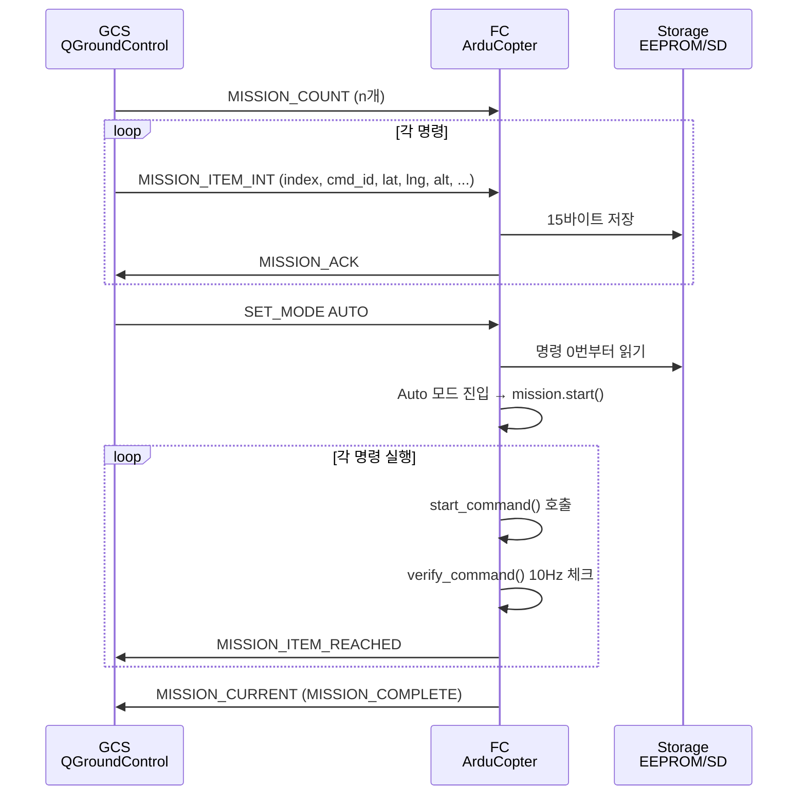
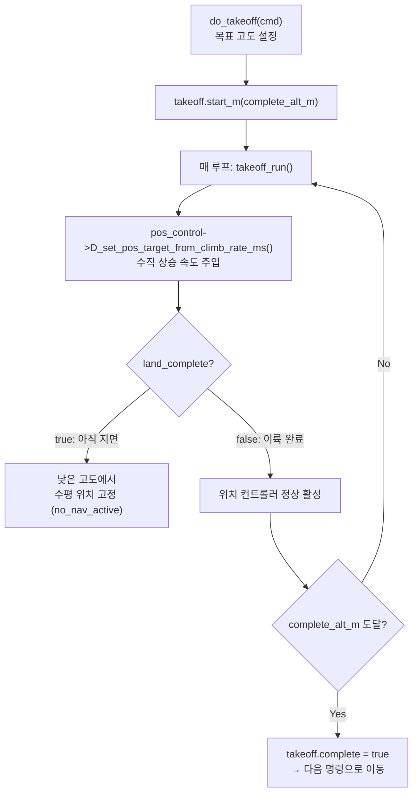
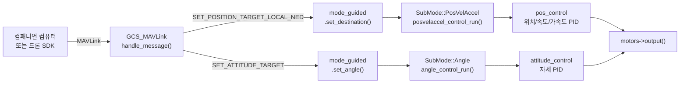
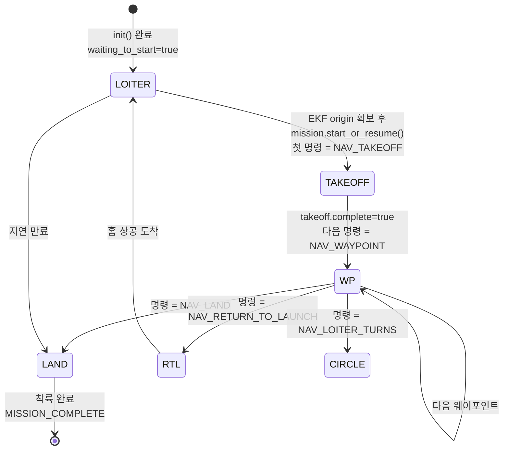
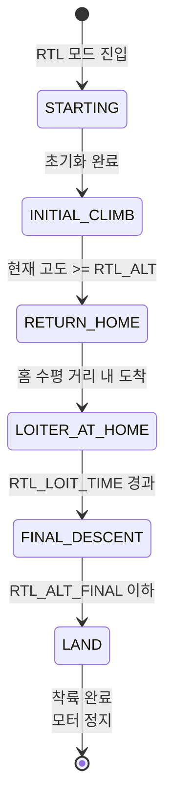

# CH26. 자동 비행과 미션

::: info 학습 목표
- AP_Mission의 Mission_Command 구조(index/id/p1/content)와 15바이트 저장 방식을 이해한다.
- ModeAuto의 init()이 이륙 명령을 요구하는 이유와 run()의 서브모드 디스패치 흐름을 코드로 추적할 수 있다.
- 이륙 시퀀스(_AutoTakeoff)의 단계를 설명할 수 있다.
- ModeGuided의 SubMode와 외부 명령 주입 경로를 설명할 수 있다.
- RTL 상태 머신의 6단계를 순서대로 설명할 수 있다.
:::

## 1. 웨이포인트 미션이란

### 개념

자율 비행에서 "미션"은 순서대로 실행할 MAVLink 명령 목록이다. 각 명령은 "어디로 이동해라", "이륙해라", "착륙해라", "카메라를 찍어라" 같은 작업을 나타낸다.

사용자는 QGroundControl이나 Mission Planner 같은 GCS에서 지도 위에 웨이포인트를 찍어 미션을 만든다. GCS는 MAVLink `MISSION_ITEM_INT` 메시지로 명령 목록을 FC에 업로드한다. FC는 이를 EEPROM 또는 SD 카드에 저장한다. Auto 모드에 진입하면 FC가 저장된 명령을 순차 실행한다.



## 2. AP_Mission — 명령 저장 구조

### AP_MISSION_EEPROM_COMMAND_SIZE

명령 하나는 15바이트 고정 크기로 저장된다:

```cpp
#define AP_MISSION_EEPROM_COMMAND_SIZE  15
```
`(libraries/AP_Mission/AP_Mission.h:27)`

15바이트 안에 인덱스, 명령 ID, p1, content 유니온을 압축한다.

### Mission_Command 구조체

```cpp
struct Mission_Command {
    uint16_t index;          // 미션 내 순서 번호
    uint16_t id;             // MAVLink CMD ID (NAV_WAYPOINT=16, NAV_TAKEOFF=22 등)
    uint16_t p1;             // 범용 파라미터 1 (지연 시간, 선회 횟수 등)
    Content  content;        // 명령별 구체 데이터 유니온
    uint8_t  type_specific_bits;
};
```
`(libraries/AP_Mission/AP_Mission.h:426)`

`content`는 유니온이다. 명령 종류에 따라 해석이 달라진다:

```cpp
union Content {
    Location location{};    // 웨이포인트, 이륙, 착륙 등 — lat/lng/alt
    Jump_Command jump;      // DO_JUMP — target, num_times
    Change_Speed_Command speed;  // DO_CHANGE_SPEED
    Yaw_Command yaw;        // CONDITION_YAW
    Guided_Limits_Command guided_limits; // NAV_GUIDED_ENABLE
    ...
};
```
`(libraries/AP_Mission/AP_Mission.h:317)`

### 주요 MAVLink 명령 ID

| 상수명 | ID | 설명 |
|--------|-----|------|
| MAV_CMD_NAV_WAYPOINT | 16 | 웨이포인트 이동 |
| MAV_CMD_NAV_RETURN_TO_LAUNCH | 20 | RTL |
| MAV_CMD_NAV_LAND | 21 | 착륙 |
| MAV_CMD_NAV_TAKEOFF | 22 | 이륙 |
| MAV_CMD_DO_CHANGE_SPEED | 178 | 속도 변경 |
| MAV_CMD_DO_SET_CAM_TRIGG_DIST | 206 | 카메라 트리거 |
| MAV_CMD_DO_JUMP | 177 | 명령 반복 점프 |

### mission_state 열거형

```cpp
enum mission_state {
    MISSION_STOPPED  = 0,
    MISSION_RUNNING  = 1,
    MISSION_COMPLETE = 2
};
```
`(libraries/AP_Mission/AP_Mission.h:505)`

`start()`, `stop()`, `resume()`, `start_or_resume()`, `update()` 공개 함수로 미션 진행을 제어한다.

## 3. ModeAuto — 서브모드 디스패치

### init() — 이륙 명령 검사

```cpp
bool ModeAuto::init(bool ignore_checks)
{
    // 착지 + 아밍 상태인데 첫 명령이 이륙이 아니면 거부
    if (motors->armed() && copter.ap.land_complete
        && !mission.starts_with_takeoff_cmd()) {
        gcs().send_text(MAV_SEVERITY_CRITICAL,
            "Auto: Missing Takeoff Cmd");
        return false;
    }

    _mode = SubMode::LOITER;
    waiting_to_start = true;    // EKF origin 확보 대기
    ...
    return true;
}
```
`(ArduCopter/mode_auto.cpp:23~67)`

착지 상태에서 첫 명령이 `NAV_TAKEOFF`가 아니면 입력을 거부한다. 이륙 명령 없이 Auto를 시작하면 모터가 갑자기 최대 출력으로 돌 수 있기 때문이다.

### SubMode 열거형

```cpp
enum class SubMode : uint8_t {
    TAKEOFF,
    WP,
    LAND,
    RTL,
    CIRCLE_MOVE_TO_EDGE,
    CIRCLE,
    NAVGUIDED,
    LOITER,
    LOITER_TO_ALT,
    NAV_PAYLOAD_PLACE,
    NAV_SCRIPT_TIME,
    NAV_ATTITUDE_TIME,
};
```
`(ArduCopter/mode.h:563)`

### run() — 서브모드 디스패치

```cpp
void ModeAuto::run()
{
    if (waiting_to_start) {
        Location loc;
        if (copter.ahrs.get_origin(loc)) {    // EKF origin 확보됐으면
            mission.start_or_resume();
            waiting_to_start = false;
        }
    } else {
        mission.update();   // 명령 진행 체크 (10Hz)
    }

    // 현재 서브모드에 맞는 컨트롤러 실행
    switch (_mode) {
    case SubMode::TAKEOFF:   takeoff_run();     break;
    case SubMode::WP:        wp_run();          break;
    case SubMode::LAND:      land_run();        break;
    case SubMode::RTL:       rtl_run();         break;
    case SubMode::CIRCLE:    circle_run();      break;
    case SubMode::LOITER:    loiter_run();      break;
    ...
    }
}
```
`(ArduCopter/mode_auto.cpp:85~175)`

`mission.update()`는 AP_Mission 내부에서 현재 명령의 `verify_command()` 콜백을 호출한다. 명령이 완료되면 다음 명령의 `start_command()` 콜백을 호출해 서브모드를 변경한다.

### start_command() — 명령 디스패치

```cpp
bool ModeAuto::start_command(const AP_Mission::Mission_Command& cmd)
{
    switch(cmd.id) {
    case MAV_CMD_NAV_TAKEOFF:      // 22
        do_takeoff(cmd);   break;
    case MAV_CMD_NAV_WAYPOINT:     // 16
        do_nav_wp(cmd);    break;
    case MAV_CMD_NAV_LAND:         // 21
        do_land(cmd);      break;
    case MAV_CMD_NAV_RETURN_TO_LAUNCH:
        do_RTL();          break;
    ...
    }
}
```
`(ArduCopter/mode_auto.cpp:708~)`

`do_takeoff`는 `set_submode(SubMode::TAKEOFF)`, `do_nav_wp`는 `set_submode(SubMode::WP)`를 호출해 다음 `run()` 사이클부터 다른 컨트롤러가 실행되게 한다.

## 4. 이륙 시퀀스

### _AutoTakeoff

이륙은 Auto와 Guided 모두에서 공유하는 `_AutoTakeoff` 클래스가 담당한다:

```cpp
class _AutoTakeoff {
public:
    void run();
    void start_m(float complete_alt_m, bool is_terrain_alt);
    bool get_completion_pos_ned_m(Vector3p& pos_ned_m);

    bool complete;          // 목표 고도 도달 시 true

private:
    bool no_nav_active;     // 낮은 고도에서 수평 위치 제어 비활성
    float no_nav_alt_m;
    float complete_alt_m;   // 완료 고도
    Vector3p complete_pos_ned_m;
};
```
`(ArduCopter/mode.h:19~36)`

### 이륙 흐름



이륙 초기(`no_nav_active` 구간)에는 수평 위치 제어가 꺼진다. 아직 지면에 닿아 있는 상태에서 수평 위치를 유지하려 하면 기체가 옆으로 밀릴 수 있기 때문이다. 일정 고도(`no_nav_alt_m`)를 넘어서면 수평 위치 제어가 활성화된다.

## 5. ModeGuided — 실시간 외부 명령

### 개요

Guided 모드는 드론 SDK나 컴패니언 컴퓨터가 실시간으로 비행을 제어하는 모드다. DJI SDK, PX4 offboard에 해당하는 ArduPilot의 "프로그래밍 비행" 모드다. MAVLink `SET_POSITION_TARGET_LOCAL_NED`, `SET_ATTITUDE_TARGET` 등의 메시지로 목표를 실시간 주입한다.

### SubMode 열거형

```cpp
enum class SubMode {
    TakeOff,        // 이륙 중
    WP,             // 단일 웨이포인트로 이동
    Pos,            // 위치 고정
    PosVelAccel,    // 위치+속도+가속도 복합 목표
    VelAccel,       // 속도+가속도 목표
    Accel,          // 가속도 목표
    Angle,          // 자세각 직접 제어
};
```
`(ArduCopter/mode.h:1163)`

### run() — SubMode 디스패치

```cpp
void ModeGuided::run()
{
    switch (guided_mode) {
    case SubMode::TakeOff:     takeoff_run();         break;
    case SubMode::WP:          wp_control_run();      break;
    case SubMode::Pos:         pos_control_run();     break;
    case SubMode::VelAccel:    velaccel_control_run(); break;
    case SubMode::PosVelAccel: posvelaccel_control_run(); break;
    case SubMode::Accel:       accel_control_run();   break;
    case SubMode::Angle:       angle_control_run();   break;
    }
}
```
`(ArduCopter/mode_guided.cpp:64~110)`

### Guided_Limit — 안전 제한

```cpp
struct Guided_Limit {
    uint32_t timeout_ms;     // 외부 명령 타임아웃 (0 = 무제한)
    float alt_min_m;         // 최소 고도 (0 = 제한 없음)
    float alt_max_m;         // 최대 고도 (0 = 제한 없음)
    float horiz_max_m;       // 수평 이동 최대 거리 (0 = 제한 없음)
    uint32_t start_time_ms;
    Vector3p start_pos_ned_m;
};
```
`(ArduCopter/mode_guided.cpp:24~31)`

외부 컴퓨터의 버그나 통신 두절 시 드론이 엉뚱한 곳으로 날아가는 것을 막는다. `timeout_ms` 안에 새 명령이 없으면 제자리 호버링으로 전환한다.

### 외부 명령 주입 경로



## 6. Auto 서브모드 상태 다이어그램



## 7. RTL 상태 머신

### SubMode 열거형

```cpp
enum class SubMode : uint8_t {
    STARTING,        // 초기화
    INITIAL_CLIMB,   // RTL 고도까지 상승
    RETURN_HOME,     // 홈 방향으로 이동
    LOITER_AT_HOME,  // 홈 상공에서 대기
    FINAL_DESCENT,   // 천천히 하강
    LAND             // 착륙
};
```
`(ArduCopter/mode.h:1534)`

### 단계별 동작

| 단계 | 동작 |
|------|------|
| STARTING | RTL 파라미터 로드, 현재 위치에서 INITIAL_CLIMB 진입 |
| INITIAL_CLIMB | RTL_ALT(기본 15 m) 이상으로 상승, 장애물 위를 넘기 위함 |
| RETURN_HOME | 홈 GPS 좌표를 향해 수평 이동, 수직은 RTL_ALT 유지 |
| LOITER_AT_HOME | 홈 상공에서 RTL_LOIT_TIME(기본 0 s) 동안 대기 |
| FINAL_DESCENT | RTL_ALT_FINAL(기본 0 m)까지 하강 |
| LAND | 착륙 모드 실행 |

`INITIAL_CLIMB`가 먼저인 이유는 현재 고도가 RTL_ALT보다 낮을 때 낮게 수평 이동하면 나무나 건물에 부딪힐 수 있기 때문이다. 항상 먼저 안전 고도까지 올라가고 이동한다.



::: tip 핵심 정리
- AP_Mission은 MAVLink 명령 목록을 15바이트 단위(`AP_MISSION_EEPROM_COMMAND_SIZE`)로 EEPROM/SD에 저장한다. Mission_Command는 index/id/p1/content(유니온) 구조다.
- mission_state는 STOPPED/RUNNING/COMPLETE 세 상태다. `start()`, `update()`, `stop()`으로 제어한다.
- ModeAuto의 `init()`은 착지 + 아밍 상태에서 첫 명령이 `NAV_TAKEOFF`가 아니면 진입을 거부한다. `run()`은 `mission.update()` → `start_command()` 콜백 → SubMode 전환 → 서브모드 컨트롤러 실행 구조로 동작한다.
- 이륙은 `_AutoTakeoff`가 담당한다. 낮은 고도에서는 수평 위치 제어를 끄고 수직 상승만 한다. 목표 고도 도달 시 `complete = true`가 되어 다음 명령으로 넘어간다.
- ModeGuided는 TakeOff/WP/Pos/VelAccel/PosVelAccel/Accel/Angle 7개 SubMode를 가진다. 드론 SDK 자율비행이 이 모드를 사용한다. `Guided_Limit`으로 타임아웃/고도/수평 이동 안전 제한을 건다.
- RTL은 STARTING → INITIAL_CLIMB → RETURN_HOME → LOITER_AT_HOME → FINAL_DESCENT → LAND 6단계 상태 머신으로 동작한다. INITIAL_CLIMB가 먼저인 이유는 장애물 회피 고도 확보다.
:::

## 다음 챕터

[CH27. MAVLink 프로토콜](/study/ardupilot/27-mavlink)에서는 GCS와 FC 사이의 MAVLink 메시지 포맷, 패킷 구조, 미션 업로드/다운로드 핸드셰이크, HEARTBEAT와 상태 메시지 스트리밍을 분석한다.
