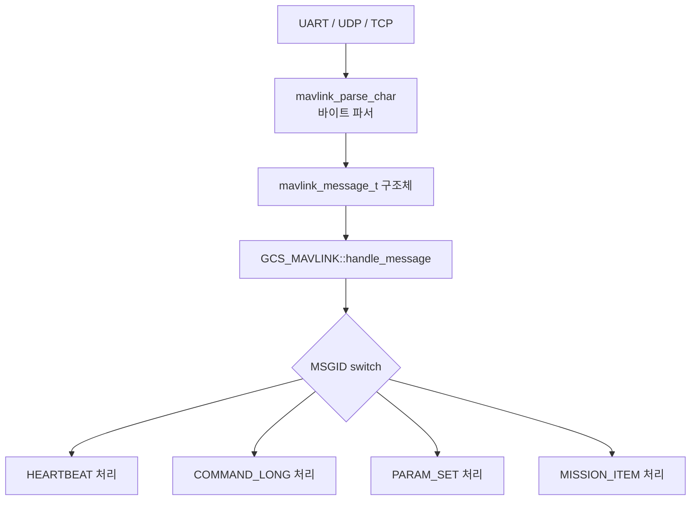
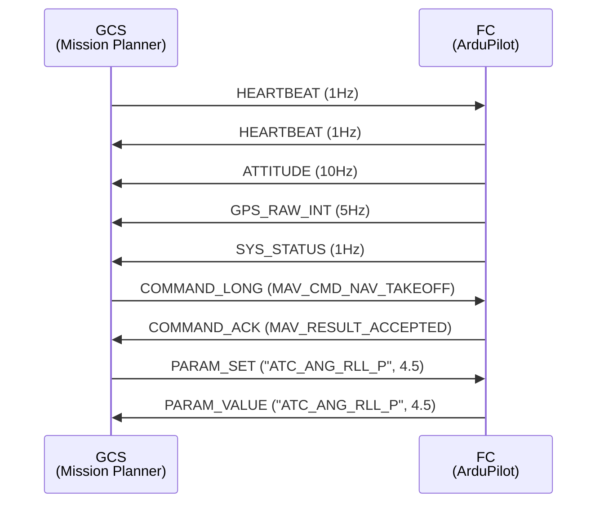
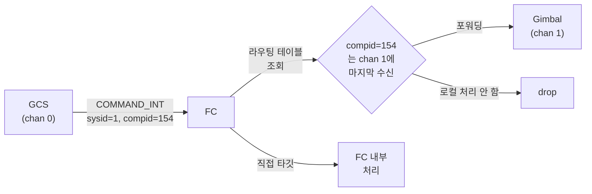

# CH27. MAVLink — 드론의 공용어

::: info 학습 목표
- MAVLink가 직렬 통신 위에서 어떻게 동작하는지 패킷 수준으로 이해한다.
- ArduPilot이 UART 채널을 MAVLink 채널로 초기화하는 과정을 코드로 추적할 수 있다.
- ap_message 테이블의 역할과 heartbeat의 1초 주기 메커니즘을 설명할 수 있다.
- 수신 메시지가 handle_message → case 분기를 거치는 흐름을 이해한다.
- sysid/compid 기반 라우팅 테이블로 멀티컴포넌트 시스템을 구성하는 방법을 안다.
- HAVE_PAYLOAD_SPACE 매크로가 버퍼 오버런을 막는 원리를 설명할 수 있다.
:::

## 1. MAVLink란

### 왜 공용어인가

드론 생태계는 제조사가 제각각이다. DJI 펌웨어, ArduPilot, PX4, 각종 GCS(Mission Planner, QGroundControl, MAVProxy)가 뒤섞여 운용된다. 이 모든 소프트웨어가 같은 메시지를 이해할 수 있는 이유가 **MAVLink(Micro Air Vehicle Link)** 프로토콜이다.

MAVLink는 경량 이진 직렬 프로토콜이다. UART, UDP, TCP 위에서 동작하며, 패킷 하나는 헤더 + 페이로드 + 체크섬으로 구성된다. MAVLink 1은 최대 255바이트, MAVLink 2는 최대 280바이트 페이로드를 지원한다.


핵심 필드만 짚어보자.

- **SYSID** — 기체 식별자(1~255). 멀티기체 환경에서 어떤 드론인지 구분.
- **COMPID** — 컴포넌트 식별자. FC, 짐벌, 카메라 등 하나의 기체 내 여러 장치를 구분.
- **MSGID** — 메시지 종류. HEARTBEAT는 0, ATTITUDE는 30, GPS_RAW_INT는 24.
- **SEQ** — 8비트 시퀀스 번호. 패킷 손실 감지에 사용.

### 계층 구조

MAVLink는 전송 계층을 추상화한다. FC 입장에서는 UART 바이트 스트림을 받아 파서에 넣으면 `mavlink_message_t` 구조체가 나온다. 어떤 물리 매체인지는 관계없다.



## 2. 채널 초기화

### UART → MAVLink 채널 매핑

ArduPilot은 최대 `MAVLINK_COMM_NUM_BUFFERS`(보통 4~6)개의 MAVLink 채널을 동시에 운용한다. 채널 0은 보통 텔레메트리 라디오, 채널 1은 USB 시리얼, 그 이상은 추가 포트다.

초기화는 `GCS_MAVLINK::init(uint8_t instance)`에서 일어난다.

```cpp
// libraries/GCS_MAVLink/GCS_Common.cpp:143
bool GCS_MAVLINK::init(uint8_t instance)
{
    // 인스턴스 번호로 채널 번호 결정
    chan = (mavlink_channel_t)(MAVLINK_COMM_0 + instance);
    if (!valid_channel(chan)) {
        return false;
    }

    // SerialManager에서 MAVLink 프로토콜이 설정된 UART 포트 탐색
    uartstate = AP::serialmanager().find_protocol_instance(
        AP_SerialManager::SerialProtocol_MAVLink, instance);
    if (uartstate == nullptr) {
        return false;
    }
    // ...
    _port->begin(uartstate->baudrate());

    // 전역 포트 배열에 등록 — mavlink_comm_port[chan] = _port
    mavlink_comm_port[chan] = _port;
```

`(libraries/GCS_MAVLink/GCS_Common.cpp:146)`에서 `MAVLINK_COMM_0 + instance` 산술로 채널 번호를 결정한다. `(libraries/GCS_MAVLink/GCS_MAVLink.cpp:72)`에 선언된 전역 배열 `mavlink_comm_port[]`에 UART 드라이버 포인터를 등록하면, 이후 MAVLink 라이브러리가 이 배열을 통해 직접 쓰기/읽기를 수행한다.

`GCS::setup_uarts()`는 `SerialProtocol_MAVLink`로 설정된 포트를 순회하며 인스턴스 0부터 차례로 채널을 만든다 `(libraries/GCS_MAVLink/GCS_Common.cpp:2848)`.

### SiK 라디오 부트로더 우회

`init()` 내부에는 흥미로운 코드가 있다. 115200 bps로 먼저 열어서 `0x30 0x20`을 3회 송신한다 `(libraries/GCS_MAVLink/GCS_Common.cpp:207~213)`. 이는 SiK 라디오의 부트로더가 CTS 핀 상태 때문에 펌웨어 수신 모드로 멈추는 문제를 해결하는 워크어라운드다. 이 바이트를 받은 부트로더는 정상 부팅으로 전환한다.

## 3. 메시지 스트림 테이블

### ap_message 열거형

`(libraries/GCS_MAVLink/ap_message.h:14)`에 정의된 `ap_message` 열거형은 ArduPilot 내부에서 "어떤 텔레메트리를 보낼 것인가"를 나타내는 식별자 집합이다.

| ap_message ID | 값 | 대응 MAVLink 메시지 |
|---|---|---|
| `MSG_HEARTBEAT` | 0 | HEARTBEAT (ID 0) |
| `MSG_ATTITUDE` | 3 | ATTITUDE (ID 30) |
| `MSG_VFR_HUD` | 6 | VFR_HUD (ID 74) |
| `MSG_SYS_STATUS` | 7 | SYS_STATUS (ID 1) |
| `MSG_GPS_RAW` | 22 | GPS_RAW_INT (ID 24) |
| `MSG_BATTERY_STATUS` | 65 | BATTERY_STATUS (ID 147) |
| `MSG_EKF_STATUS_REPORT` | 55 | EKF_STATUS_REPORT (ID 193) |

`(libraries/GCS_MAVLink/GCS_Common.cpp:1044~1095)`에는 MAVLink 숫자 ID에서 내부 `ap_message` 로의 역방향 매핑 테이블도 있다. 이는 "GCS가 이 메시지를 요청할 때 내부적으로 어떤 메시지인지" 찾기 위해 사용된다.

### 스트림 레이트 제어

GCS는 `REQUEST_DATA_STREAM` 메시지로 스트림별 Hz를 요청한다. ArduPilot은 스트림을 `RAW_SENSORS`, `EXTENDED_STATUS`, `RC_CHANNELS`, `POSITION`, `EXTRA1`(자세) 등 그룹으로 묶어서 관리한다. 각 그룹에 속한 `ap_message`들은 설정된 레이트로 주기 송신된다.

## 4. Heartbeat — 연결 살아있음 증명

### 1초 주기 송신

heartbeat는 MAVLink의 핵심 메시지다. FC는 1초에 한 번 GCS에게 heartbeat를 보낸다. GCS도 1초마다 FC에게 보낸다. 3~5초 동안 heartbeat가 오지 않으면 연결이 끊긴 것으로 판단한다.

`(libraries/GCS_MAVLink/GCS_Common.cpp:7293)`에서 초기화 시 heartbeat 주기를 1000 ms로 설정한다.

```cpp
// libraries/GCS_MAVLink/GCS_Common.cpp:3166
void GCS_MAVLINK::send_heartbeat() const
{
    mavlink_msg_heartbeat_send(
        chan,
        gcs().frame_type(),        // MAV_TYPE: 쿼드콥터/고정익 등
        MAV_AUTOPILOT_ARDUPILOTMEGA,
        base_mode(),               // MAV_MODE_FLAG: 아밍 상태 등
        gcs().custom_mode(),       // ArduPilot 비행 모드 번호
        system_status());          // MAV_STATE: ACTIVE/STANDBY 등
}
```

필드 의미를 정리하면 다음과 같다.

- **frame_type** — 기체 유형(MAV_TYPE_QUADROTOR=2, MAV_TYPE_FIXED_WING=1 등). GCS가 기체에 맞는 UI를 그리는 데 사용.
- **base_mode** — `MAV_MODE_FLAG_SAFETY_ARMED`(0x80)이 켜지면 아밍 상태. GCS가 이 비트로 아밍 여부를 표시.
- **custom_mode** — ArduPilot 고유 비행 모드 번호(Stabilize=0, Loiter=5, Auto=3 등).
- **system_status** — `MAV_STATE_ACTIVE`, `MAV_STATE_STANDBY`, `MAV_STATE_CRITICAL` 등.

GCS는 이 한 패킷만 받아도 기체 상태를 파악할 수 있다.

## 5. 수신 메시지 분기

### handle_message switch-case

UART에서 바이트를 읽어 `mavlink_parse_char()`로 파싱이 완료되면 `GCS_MAVLINK::handle_message()`가 호출된다 `(libraries/GCS_MAVLink/GCS_Common.cpp:4362)`.

```cpp
// libraries/GCS_MAVLink/GCS_Common.cpp:4362
void GCS_MAVLINK::handle_message(const mavlink_message_t &msg)
{
    switch (msg.msgid) {
    case MAVLINK_MSG_ID_HEARTBEAT:
        handle_heartbeat(msg);
        break;
    case MAVLINK_MSG_ID_PARAM_SET:
        handle_param_set(msg);
        break;
    case MAVLINK_MSG_ID_COMMAND_LONG:
        handle_command_long(msg);
        break;
    case MAVLINK_MSG_ID_COMMAND_INT:
        handle_command_int(msg);
        break;
    case MAVLINK_MSG_ID_MISSION_ITEM_INT:
        // ...
    }
}
```

### COMMAND_LONG 처리

`handle_command_long()`은 GCS의 명령(이륙, 착륙, RTL, 재보정 등)을 처리하는 진입점이다 `(libraries/GCS_MAVLink/GCS_Common.cpp:5409)`.

```cpp
// libraries/GCS_MAVLink/GCS_Common.cpp:5409
void GCS_MAVLINK::handle_command_long(const mavlink_message_t &msg)
{
    mavlink_command_long_t packet;
    mavlink_msg_command_long_decode(&msg, &packet);

    // COMMAND_LONG을 내부적으로 COMMAND_INT로 변환해 처리
    const MAV_RESULT result = try_command_long_as_command_int(packet, msg);

    // 결과를 ACK로 즉시 응답
    mavlink_msg_command_ack_send(chan, packet.command, result,
                                 0, 0, msg.sysid, msg.compid);
}
```

COMMAND_LONG과 COMMAND_INT는 같은 명령을 표현하지만 좌표 정밀도가 다르다. ArduPilot은 내부적으로 COMMAND_LONG을 COMMAND_INT로 변환해서 처리한다. 모든 명령은 처리 후 반드시 `COMMAND_ACK`를 반환해야 한다. GCS는 ACK 없이는 명령이 수신됐는지 알 수 없다.



## 6. 메시지 라우팅

### 멀티컴포넌트 환경

하나의 기체에 FC(compid=1), 짐벌(compid=154), 카메라(compid=100)가 MAVLink로 연결되는 경우가 흔하다. GCS가 짐벌에 명령을 보내려면 FC가 해당 메시지를 짐벌 포트로 포워딩해야 한다.

`MAVLink_routing` 클래스 `(libraries/GCS_MAVLink/MAVLink_routing.h:15)`가 이 역할을 담당한다.

```cpp
// libraries/GCS_MAVLink/MAVLink_routing.h:57
struct route {
    uint8_t sysid;
    uint8_t compid;
    mavlink_channel_t channel;  // 어느 포트에서 이 컴포넌트가 보였는가
    uint8_t mavtype;
} routes[MAVLINK_MAX_ROUTES];  // MAVLINK_MAX_ROUTES = 20
```

라우팅 테이블은 **자동 학습**된다. FC가 어느 포트에서 특정 sysid/compid 조합의 패킷을 받으면, 해당 컴포넌트는 그 포트에 연결돼 있다고 학습한다. 이후 그 컴포넌트를 타깃으로 하는 메시지는 자동으로 해당 포트로 포워딩된다.

`check_and_forward()` `(libraries/GCS_MAVLink/MAVLink_routing.cpp:97)`는 수신 메시지마다 호출돼 다음을 결정한다.

1. 타깃이 없거나 타깃이 자신이면 → 로컬 처리
2. 알려진 다른 컴포넌트를 타깃으로 하면 → 해당 채널로 포워딩
3. 미확인 타깃이면 → 브로드캐스트(모든 채널)



## 7. 버퍼 보호 — HAVE_PAYLOAD_SPACE

### 왜 필요한가

MAVLink 메시지 송신은 내부 링 버퍼에 쓰는 것이다. 버퍼가 가득 찬 상태에서 무조건 쓰면 이전 데이터가 덮어써지거나 패킷이 깨진다. 특히 많은 텔레메트리를 동시에 보내야 할 때 이 문제가 발생한다.

`(libraries/GCS_MAVLink/GCS.h:61)`의 `HAVE_PAYLOAD_SPACE` 매크로가 이를 막는다.

```cpp
// libraries/GCS_MAVLink/GCS.h:55
#define PAYLOAD_SIZE(chan, id) \
    (unsigned(GCS_MAVLINK::packet_overhead_chan(chan) + MAVLINK_MSG_ID_ ## id ## _LEN))

// libraries/GCS_MAVLink/GCS.h:61
#define HAVE_PAYLOAD_SPACE(_chan, id) \
    (comm_get_txspace(_chan) >= PAYLOAD_SIZE(_chan, id) \
        ? true \
        : (gcs_out_of_space_to_send(_chan), false))

// libraries/GCS_MAVLink/GCS.h:68
#define CHECK_PAYLOAD_SIZE(id) \
    if (!check_payload_size(MAVLINK_MSG_ID_ ## id ## _LEN)) return false
```

`HAVE_PAYLOAD_SPACE`는 현재 TX 버퍼 여유 공간(`comm_get_txspace`)이 보낼 패킷 크기(`PAYLOAD_SIZE`)보다 큰지 확인한다. 공간이 없으면 카운터(`gcs_out_of_space_to_send`)를 증가시키고 `false`를 반환한다. 각 `send_*` 함수는 맨 앞에서 이 매크로를 검사하고, 공간이 없으면 즉시 `return false`로 빠져나온다.

```cpp
// 실제 사용 예 (GCS_Common.cpp:6626~6629)
case MSG_HEARTBEAT:
    CHECK_PAYLOAD_SIZE(HEARTBEAT);   // 공간 없으면 return false
    send_heartbeat();
    break;
```

`(libraries/GCS_MAVLink/GCS.h:206~213)`에서 `txspace()`는 실제 UART 버퍼 여유 공간을 반환하되, 최대 8192바이트로 제한한다. 이는 운영체제 소켓처럼 커진 버퍼가 지연을 유발하는 것을 막기 위함이다.

::: tip 핵심 정리
- MAVLink는 SYSID/COMPID/MSGID로 구성된 경량 이진 직렬 프로토콜이다. 어떤 물리 매체(UART, UDP)든 동일하게 동작한다.
- `GCS_MAVLINK::init(instance)`는 `MAVLINK_COMM_0 + instance`로 채널 번호를 결정하고, SerialManager에서 찾은 UART 포트를 `mavlink_comm_port[]`에 등록한다.
- `ap_message` 열거형은 내부 텔레메트리 식별자이며, 숫자 MAVLink ID와 별도로 관리된다. 스트림 레이트는 그룹 단위로 제어된다.
- `send_heartbeat()`는 1초마다 frame_type/base_mode/custom_mode/system_status를 포함한 패킷을 송신한다. 끊기면 연결 손실로 판단한다.
- `MAVLink_routing`은 최대 20개 sysid/compid 조합을 자동 학습하고, 포워딩 여부를 결정한다.
- `HAVE_PAYLOAD_SPACE` 매크로는 TX 버퍼 여유 공간을 실시간 확인해 오버런을 방지한다.
:::

## 다음 챕터

[CH28. DroneCAN — CAN 버스로 연결하는 스마트 주변장치](/study/ardupilot/28-dronecan)에서는 MAVLink가 아닌 CAN 버스 기반 통신 레이어를 다룬다. PWM 대비 CAN의 장점, AP_CANManager/AP_DroneCAN 구조, DNA 동적 노드 주소 할당을 소스 코드로 추적한다.
