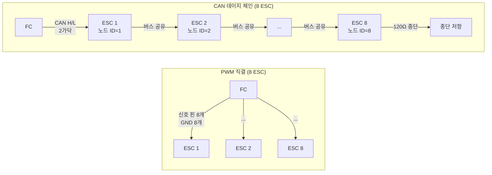
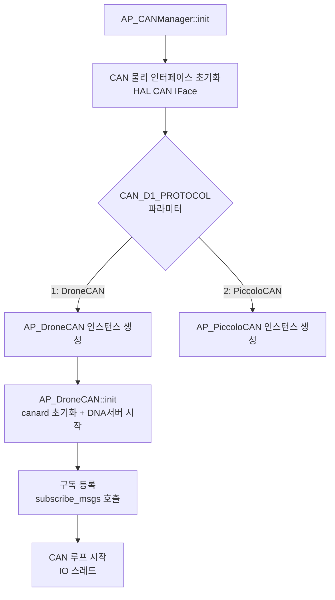
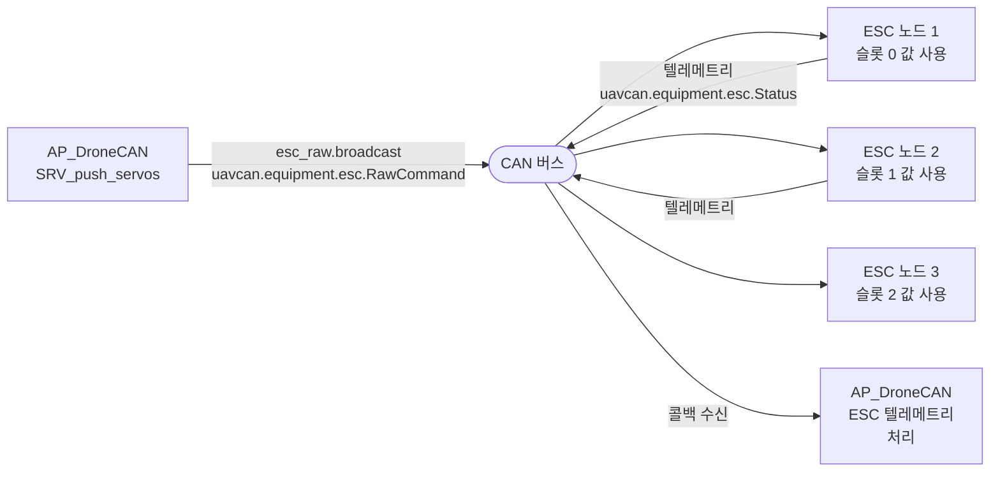
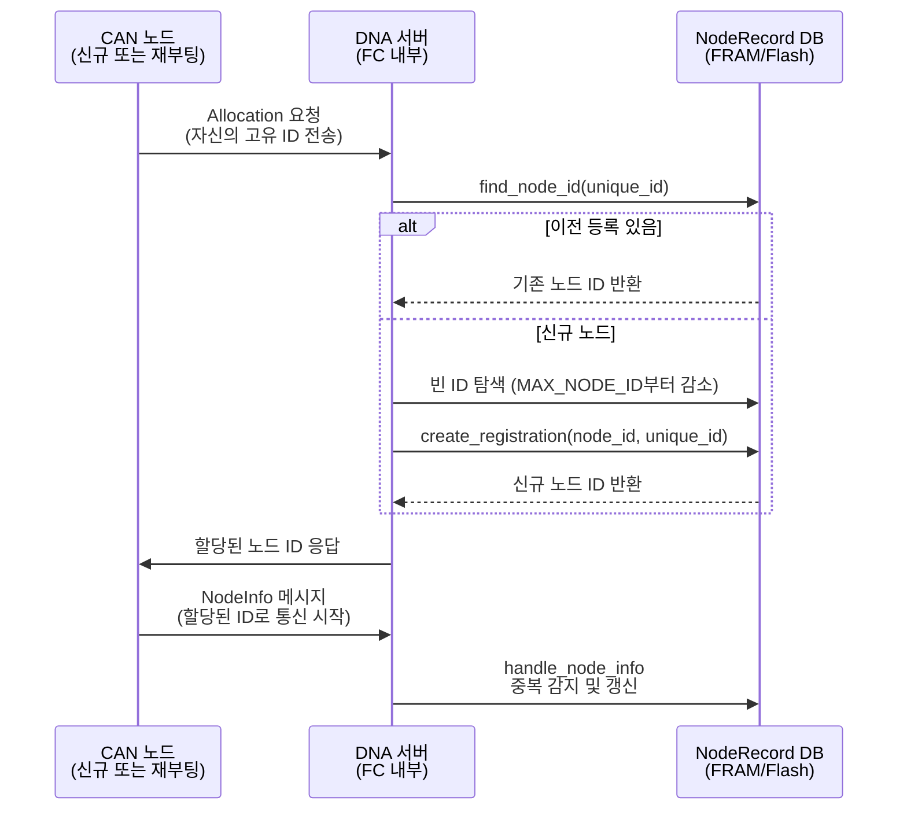
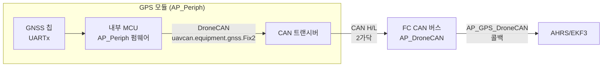

# CH28. DroneCAN — CAN 버스로 연결하는 스마트 주변장치

::: info 학습 목표
- PWM의 배선/노이즈 한계를 이해하고 CAN 버스가 이를 해결하는 방식을 설명할 수 있다.
- AP_CANManager가 CAN 인터페이스와 드라이버를 중앙 관리하는 구조를 파악한다.
- AP_DroneCAN의 구독 등록 코드를 읽고 어떤 센서가 CAN을 통해 연결되는지 안다.
- DNA 서버가 전원 재인가 후에도 동일한 노드 ID를 유지하는 원리를 설명할 수 있다.
- AP_Periph 개념과 DroneCAN ESC 명령 브로드캐스트 흐름을 이해한다.
:::

## 1. PWM의 한계와 CAN의 등장

### PWM 배선 문제

기존 서보/ESC 제어는 PWM(Pulse Width Modulation) 신호를 사용한다. 각 장치마다 GND + 신호선 1가닥이 필요하다. 8개 ESC를 연결하면 최소 16가닥 배선이 필요하고, FC의 신호 핀도 8개 소모된다. 배선이 길어지면 EMI(전자기 간섭)로 신호가 흔들려 ESC가 오작동하거나 자리 비율이 달라진다.

PWM은 단방향 신호다. FC → ESC로 스로틀 명령을 보낼 수 있지만, ESC → FC로 RPM·전류·온도 텔레메트리를 돌려보내려면 별도 UART 포트가 필요하다.

### CAN 버스의 해결책

CAN(Controller Area Network)은 자동차 산업에서 1986년부터 사용해온 산업용 버스다.

- **2선 꼬임쌍선(CAN H/CAN L)** 으로 차동 신호 전송 → 노이즈 내성이 PWM과 비교 불가
- **데이지 체인** 토폴로지 — 모든 노드를 버스 하나에 연결. 8개 ESC도 CAN H/CAN L 2가닥으로 연결
- **각 노드 고유 ID(1~127)** — 메시지마다 어느 장치가 보냈는지 식별
- **양방향** — 같은 버스로 명령과 텔레메트리가 동시에 오간다



DroneCAN(구 UAVCAN v0)은 CAN 위에서 동작하는 드론 전용 애플리케이션 레이어 프로토콜이다. 메시지 직렬화 형식(DSDL), 서비스 디스커버리, 노드 상태 모니터링을 표준화했다.

## 2. AP_CANManager — CAN 계층 중앙 관리자

### 구조

`AP_CANManager` `(libraries/AP_CANManager/AP_CANManager.h:34)`는 물리 CAN 인터페이스(IFace)와 애플리케이션 프로토콜 드라이버를 분리해서 관리한다.

```cpp
// libraries/AP_CANManager/AP_CANManager.h:61
// 드라이버 등록
bool register_driver(AP_CAN::Protocol dtype, AP_CANDriver *driver);

// 등록된 드라이버 조회
AP_CANDriver* get_driver(uint8_t i) const;

// 드라이버 타입 조회 (DroneCAN, PiccoloCAN, None 등)
AP_CAN::Protocol get_driver_type(uint8_t i) const;
```

`AP_CAN::Protocol`로 어떤 프로토콜 드라이버를 로드할지 선택한다. `CAN_D1_PROTOCOL` 파라미터에 1을 설정하면 DroneCAN, 2를 설정하면 PiccoloCAN이 로드된다.

초기화 흐름은 다음과 같다.



## 3. AP_DroneCAN — DroneCAN 드라이버

### 클래스 계층

`AP_DroneCAN` `(libraries/AP_DroneCAN/AP_DroneCAN.h:81)`은 두 클래스를 상속한다.

```cpp
// libraries/AP_DroneCAN/AP_DroneCAN.h:81
class AP_DroneCAN : public AP_CANDriver, public AP_ESC_Telem_Backend {
```

- **AP_CANDriver** — CAN 드라이버 인터페이스. `init()`, `add_interface()` 등 구현 강제.
- **AP_ESC_Telem_Backend** — ESC 텔레메트리 백엔드. 회전수/전류/온도를 FC 내부 텔레메트리 시스템으로 전달.

### 구독 등록 — subscribe_msgs

`AP_DroneCAN::init()` 내부에서 모든 DroneCAN 지원 드라이버의 `subscribe_msgs()`를 일괄 호출한다 `(libraries/AP_DroneCAN/AP_DroneCAN.cpp:362~404)`.

```cpp
// libraries/AP_DroneCAN/AP_DroneCAN.cpp:362
bool subscribed = true;
#if AP_GPS_DRONECAN_ENABLED
    subscribed = subscribed && AP_GPS_DroneCAN::subscribe_msgs(this);
#endif
#if AP_COMPASS_DRONECAN_ENABLED
    subscribed = subscribed && AP_Compass_DroneCAN::subscribe_msgs(this);
#endif
#if AP_BARO_DRONECAN_ENABLED
    subscribed = subscribed && AP_Baro_DroneCAN::subscribe_msgs(this);
#endif
    subscribed = subscribed && AP_BattMonitor_DroneCAN::subscribe_msgs(this);
#if AP_AIRSPEED_DRONECAN_ENABLED
    subscribed = subscribed && AP_Airspeed_DroneCAN::subscribe_msgs(this);
#endif
// ... 총 12개 이상의 드라이버
if (!subscribed) {
    AP_BoardConfig::allocation_error("DroneCAN callback");
}
```

각 드라이버의 `subscribe_msgs()`는 canard 라이브러리의 Subscriber 객체를 생성해서 특정 DroneCAN 메시지 타입이 수신될 때마다 콜백 함수를 호출하도록 등록한다. GPS 드라이버라면 `uavcan.equipment.gnss.Fix2` 메시지를 구독하고, 배터리 드라이버라면 `uavcan.equipment.power.BatteryInfo`를 구독한다.

### ESC 명령 브로드캐스트

FC가 모터에 스로틀 명령을 내릴 때, DroneCAN ESC라면 `SRV_push_servos()` → 내부 브로드캐스트 경로를 거친다.

```cpp
// libraries/AP_DroneCAN/AP_DroneCAN.cpp:821
uavcan_equipment_esc_RawCommand esc_msg;
// ...
// 활성 ESC가 하나라도 있으면 전체 ESC 배열을 브로드캐스트
if (active_esc_num > 0) {
    esc_msg.cmd.len = k;
    if (esc_raw.broadcast(esc_msg)) {  // (AP_DroneCAN.cpp:854)
        _esc_send_count++;
    }
    // CAN 버스로 즉시 전송
    canard_iface.processTx(true);
}
```

`esc_raw`는 `uavcan_equipment_esc_RawCommand` 타입의 Publisher 객체다. `broadcast()`를 호출하면 해당 DroneCAN 메시지가 버스에 연결된 모든 노드에 전송된다. ESC는 자신의 슬롯 번호에 해당하는 값만 읽어 모터를 제어한다.



## 4. DNA 서버 — 동적 노드 주소 할당

### 문제: 전원을 껐다 켜면 노드 ID가 바뀐다

DroneCAN 노드는 켜질 때 자신의 ID를 모른다. 수동으로 각 노드에 ID를 설정해야 한다면 관리가 번거롭다. 더 큰 문제는 전원을 껐다 켜면 버스 상의 초기화 순서가 달라져 ID가 바뀔 수 있다는 점이다. GPS가 노드 ID 5로 잡혀 있어야 하는데 재부팅 후 7이 됐다면 FC는 GPS를 찾지 못한다.

### DNA 서버의 해결책

**Dynamic Node Allocation(DNA)** 서버 `(libraries/AP_DroneCAN/AP_DroneCAN_DNA_Server.h:17)`는 FC 내부에 상주하며 노드 ID 등록 데이터베이스를 관리한다.

핵심 자료구조는 `NodeRecord`다.

```cpp
// libraries/AP_DroneCAN/AP_DroneCAN_DNA_Server.h:21
struct NodeRecord {
    uint8_t uid_hash[6];  // 장치 고유 ID의 FNV-1a 해시 (6바이트)
    uint8_t crc;          // uid_hash의 CRC8 체크섬
};
```

각 노드는 공장에서 부여받은 **전역 고유 ID(128비트 UUID)** 를 가진다. DNA 서버는 이 UUID를 해시해서 `NodeRecord`에 저장하고, 노드 ID(1~127)와 매핑한다. 이 데이터베이스는 `StorageManager`가 관리하는 플래시/FRAM에 기록되므로 재부팅 후에도 남는다.

### 할당 시퀀스



`handle_allocation()` `(libraries/AP_DroneCAN/AP_DroneCAN_DNA_Server.cpp:119)` 내부를 보면, 이미 등록된 UUID라면 기존 ID를 그대로 반환하고, 처음 보는 UUID라면 `MAX_NODE_ID`(127)에서 하나씩 줄이며 빈 슬롯을 찾아 등록한다.

```cpp
// libraries/AP_DroneCAN/AP_DroneCAN_DNA_Server.cpp:119
uint8_t AP_DroneCAN_DNA_Server::Database::handle_allocation(const uint8_t unique_id[])
{
    uint8_t resp_node_id = find_node_id(unique_id, 16);
    if (resp_node_id == 0) {
        // 신규 노드: MAX_NODE_ID부터 빈 슬롯 탐색
        resp_node_id = MAX_NODE_ID;
        while (resp_node_id > 0) {
            if (!node_registered.get(resp_node_id)) {
                break;
            }
            resp_node_id--;
        }
        if (resp_node_id != 0) {
            create_registration(resp_node_id, unique_id, 16);
        }
    }
    return resp_node_id;
}
```

UUID 해시는 FNV-1a 64비트 해시 후 56비트 xor-folding으로 6바이트로 압축한다 `(libraries/AP_DroneCAN/AP_DroneCAN_DNA_Server.cpp:159~170)`. 이 6바이트가 `NodeRecord.uid_hash`에 저장되고, CRC8 체크섬으로 데이터 무결성을 검증한다.

## 5. AP_Periph — CAN 노드 펌웨어

### 스마트 CAN 모듈

DroneCAN 생태계에서 GPS 모듈, 나침반 모듈, 기류 속도 센서 등은 더 이상 단순 UART 장치가 아니다. 내부에 소형 MCU가 탑재되고, 그 위에 **AP_Periph** 펌웨어가 올라간다. AP_Periph는 ArduPilot 라이브러리(AP_GPS, AP_Compass 등)를 그대로 사용하면서 출력을 DroneCAN 메시지로 내보내는 경량 펌웨어다.



FC는 GPS 모듈의 내부 동작을 전혀 알 필요가 없다. 그냥 `uavcan.equipment.gnss.Fix2` 메시지가 버스에 올라오면 받아서 처리하면 된다. GPS 모듈을 교체해도 DroneCAN 메시지 형식만 같다면 FC 펌웨어를 수정할 필요가 없다.

::: tip 핵심 정리
- CAN 버스는 2선 꼬임쌍선으로 8개 ESC를 데이지 체인 연결한다. PWM 대비 배선 수와 노이즈 취약성을 대폭 줄인다.
- `AP_CANManager`는 물리 CAN IFace와 프로토콜 드라이버를 분리 관리한다. `CAN_D1_PROTOCOL` 파라미터로 드라이버 선택.
- `AP_DroneCAN`은 `AP_CANDriver`와 `AP_ESC_Telem_Backend`를 상속한다. 초기화 시 GPS/Compass/Baro/Battery 등 12종 이상 드라이버의 `subscribe_msgs()`를 일괄 등록한다.
- DNA 서버는 장치 고유 ID(UUID)를 FNV-1a 해시로 압축해 `NodeRecord`에 저장한다. 재부팅 후에도 동일 ID를 유지한다.
- `AP_Periph`는 CAN 노드 내부 MCU에 탑재되는 경량 ArduPilot 펌웨어로, 센서 데이터를 DroneCAN 메시지로 변환해 버스에 내보낸다.
:::

## 다음 챕터

[CH29. 파라미터 시스템](/study/ardupilot/29-parameters)에서는 앞 챕터들에서 계속 등장한 파라미터(`EK3_*`, `ATC_*`, `CAN_D1_PROTOCOL` 등)가 EEPROM에 저장되고 부팅 시 로드되는 범용 KV 스토어 메커니즘을 분석한다.
