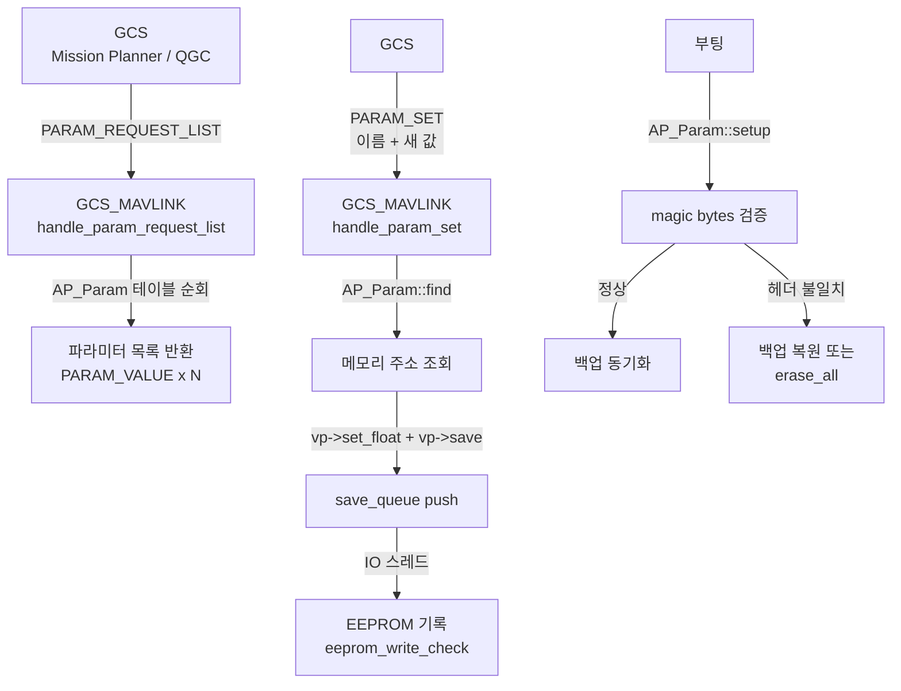
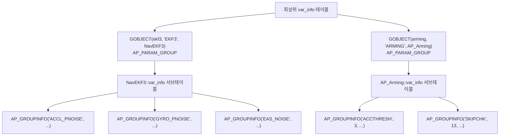
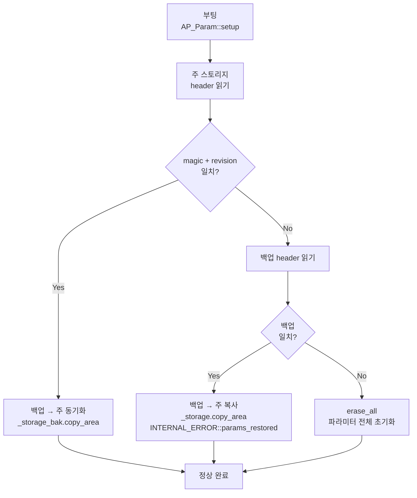
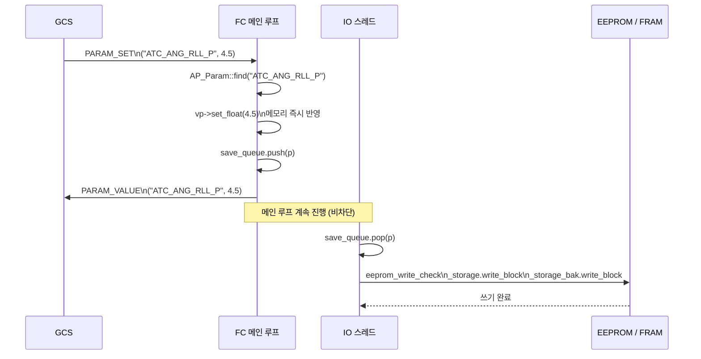

# CH29. 파라미터 시스템 — 수천 개 설정값의 KV 스토어

::: info 학습 목표
- 파라미터 시스템이 왜 범용 KV 스토어로 설계됐는지 이해한다.
- `AP_GROUPINFO` 매크로가 클래스 멤버 변수의 메모리 오프셋을 어떻게 인코딩하는지 설명할 수 있다.
- 부팅 시 magic bytes 검증과 백업 복원 경로를 코드로 추적할 수 있다.
- GCS에서 파라미터를 변경할 때 `save_queue`를 통한 비동기 기록 흐름을 이해한다.
- 이중화 스토리지(`_storage` + `_storage_bak`)가 데이터 안전성을 보장하는 방식을 안다.
:::

## 1. 파라미터 시스템이란

### 수천 개의 설정값

ArduPilot은 기체 종류, 센서 구성, 제어 튜닝 등에 따라 달라지는 수천 개의 설정값을 파라미터로 노출한다. 앞 챕터들에서 만났던 `EK3_ENABLE`, `INS_ACCOFFS_X`, `ATC_ANG_RLL_P`, `CAN_D1_PROTOCOL`, `ARMING_CHECK` 등이 모두 파라미터다.

이 값들을 하드코딩하면 기체마다 펌웨어를 다시 빌드해야 한다. 파라미터 시스템은 이 값들을 런타임에 읽고 쓸 수 있게 하면서 비휘발성 스토리지(EEPROM/FRAM)에 저장한다.

파라미터 시스템은 본질적으로 **이름 → 메모리 주소 + 타입** 테이블이다. "EK3_ENABLE"이라는 이름을 주면 메모리 어디에 있는 어떤 타입의 변수인지 찾아준다.

### 접근 경로



## 2. var_info 테이블과 AP_GROUPINFO 매크로

### GroupInfo 구조체

파라미터 시스템의 핵심은 `AP_Param::GroupInfo` 구조체 `(libraries/AP_Param/AP_Param.h:206)`다.

```cpp
// libraries/AP_Param/AP_Param.h:206
struct GroupInfo {
    const char *name;       // 파라미터 이름 문자열 (최대 16자)
    ptrdiff_t offset;       // 클래스 내 멤버 변수의 바이트 오프셋
    union {
        const struct GroupInfo *group_info;  // 중첩 그룹
        const float def_value;               // 기본값
    };
    uint16_t flags;         // AP_PARAM_FLAG_* 플래그
    uint8_t idx;            // 그룹 내 식별 인덱스 (EEPROM 키 일부)
    uint8_t type;           // ap_var_type: INT8/INT16/INT32/FLOAT/GROUP
};
```

`offset` 필드가 핵심이다. 파라미터 이름이 주어졌을 때 `GroupInfo`를 찾으면, 클래스 인스턴스 포인터 + `offset` 산술로 실제 메모리 주소를 계산할 수 있다.

### AP_GROUPINFO 매크로

`(libraries/AP_Param/AP_Param.h:152)`에 정의된 `AP_GROUPINFO` 매크로가 `GroupInfo`를 컴파일 타임에 채운다.

```cpp
// libraries/AP_Param/AP_Param.h:131
// AP_VAROFFSET: __builtin_offsetof를 사용해 컴파일 타임 오프셋 계산
#define AP_VAROFFSET(clazz, element) \
    ((void)sizeof(std::declval<clazz>().element), \
     (ptrdiff_t)__builtin_offsetof(clazz, element))

// libraries/AP_Param/AP_Param.h:140
#define AP_GROUPINFO_FLAGS(name, idx, clazz, element, def, flags) \
    { name, AP_VAROFFSET(clazz, element), {def_value : def}, flags, idx, \
      AP_CLASSTYPE(clazz, element) }

// libraries/AP_Param/AP_Param.h:152
#define AP_GROUPINFO(name, idx, clazz, element, def) \
    AP_GROUPINFO_FLAGS(name, idx, clazz, element, def, 0)
```

실제 사용 예로 `AP_Arming`의 var_info를 보자.

```cpp
// libraries/AP_Arming/AP_Arming.cpp:119
const AP_Param::GroupInfo AP_Arming::var_info[] = {
    // "ACCTHRESH", 인덱스 3, AP_Arming 클래스의 accel_error_threshold 멤버
    // 기본값 AP_ARMING_ACCEL_ERROR_THRESHOLD
    AP_GROUPINFO("ACCTHRESH", 3, AP_Arming, accel_error_threshold,
                 AP_ARMING_ACCEL_ERROR_THRESHOLD),

    AP_GROUPINFO("MIS_ITEMS", 7, AP_Arming, _required_mission_items, 0),

    AP_GROUPINFO("OPTIONS",   9, AP_Arming, _arming_options, 0),

    AP_GROUPINFO("SKIPCHK",  13, AP_Arming, checks_to_skip, 0),

    AP_GROUPEND  // 테이블 종료 마커
};
```

`AP_GROUPINFO("ACCTHRESH", 3, AP_Arming, accel_error_threshold, 0.35f)`가 컴파일되면:

- `name` = `"ACCTHRESH"`
- `offset` = `offsetof(AP_Arming, accel_error_threshold)` (컴파일 타임 계산)
- `def_value` = `0.35f`
- `idx` = `3` (EEPROM 키 계산에 사용)
- `type` = `AP_PARAM_FLOAT` (accel_error_threshold의 타입 자동 추론)

파라미터 이름 `"ARMING_ACCTHRESH"`가 조회되면 시스템은 `AP_Arming` 인스턴스 포인터 + offset으로 `accel_error_threshold` 변수의 주소를 직접 얻는다.

### ap_var_type 열거형

```cpp
// libraries/AP_Param/AP_Param.h:185
enum ap_var_type {
    AP_PARAM_NONE    = 0,
    AP_PARAM_INT8    = 1,
    AP_PARAM_INT16   = 2,
    AP_PARAM_INT32   = 3,
    AP_PARAM_FLOAT   = 4,
    AP_PARAM_VECTOR3F= 5,
    AP_PARAM_GROUP   = 6,  // 중첩 그룹 (서브테이블)
};
```

`AP_PARAM_GROUP`은 `GroupInfo` 테이블을 재귀적으로 중첩할 때 사용한다. 예를 들어 `EKF3` 그룹 안에 `ACCL_PNOISE` 같은 서브파라미터가 있으면, EKF3의 var_info가 AP_PARAM_GROUP 엔트리로 EKF3 내부 테이블을 가리킨다.



## 3. EEPROM 저장 구조

### 이중화 스토리지

`(libraries/AP_Param/AP_Param.cpp:143~147)`에서 두 개의 스토리지 영역을 선언한다.

```cpp
// libraries/AP_Param/AP_Param.cpp:143
StorageAccess AP_Param::_storage(StorageManager::StorageParam);

// libraries/AP_Param/AP_Param.cpp:147
StorageAccess AP_Param::_storage_bak(StorageManager::StorageParamBak);
```

주 스토리지와 백업 스토리지는 물리적으로 다른 영역이다(EEPROM의 앞/뒤 반이거나, FRAM + Flash 같이 매체가 다를 수도 있다). `eeprom_write_check()`는 쓰기 시 두 영역에 동시 기록한다.

```cpp
// libraries/AP_Param/AP_Param.cpp:154
void AP_Param::eeprom_write_check(const void *ptr, uint16_t ofs, uint8_t size)
{
    _storage.write_block(ofs, ptr, size);
#if AP_PARAM_STORAGE_BAK_ENABLED
    _storage_bak.write_block(ofs, ptr, size);
#endif
}
```

### EEPROM 헤더와 magic bytes

스토리지의 맨 앞에는 `EEPROM_header` 구조체가 있다. 헤더에는 두 개의 magic bytes와 revision 번호가 들어 있어, 이 값이 일치해야 유효한 파라미터 저장소로 인정한다.

```cpp
// libraries/AP_Param/AP_Param.cpp:182~186
hdr.magic[0] = k_EEPROM_magic0;
hdr.magic[1] = k_EEPROM_magic1;
hdr.revision = k_EEPROM_revision;
```

헤더 뒤로 파라미터 레코드가 이어진다. 각 레코드는 `Param_header`(키 + 그룹 + 타입)와 실제 값 바이트로 구성된다. 레코드 끝에는 센티넬(sentinel) 레코드가 있어 파라미터 목록의 끝을 알린다.

### 부팅 시 검증 — AP_Param::setup

`(libraries/AP_Param/AP_Param.cpp:360)`의 `setup()`은 부팅마다 한 번 호출된다.

```cpp
// libraries/AP_Param/AP_Param.cpp:360
bool AP_Param::setup(void)
{
    struct EEPROM_header hdr {};
    _storage.read_block(&hdr, 0, sizeof(hdr));

    struct EEPROM_header hdr2 {};
    _storage_bak.read_block(&hdr2, 0, sizeof(hdr2));

    if (hdr.magic[0] != k_EEPROM_magic0 ||
        hdr.magic[1] != k_EEPROM_magic1 ||
        hdr.revision != k_EEPROM_revision) {
        // 주 스토리지 헤더 불일치
        if (hdr2.magic[0] == k_EEPROM_magic0 &&
            hdr2.magic[1] == k_EEPROM_magic1 &&
            hdr2.revision == k_EEPROM_revision &&
            _storage.copy_area(_storage_bak)) {
            // 백업에서 복원 성공
            INTERNAL_ERROR(AP_InternalError::error_t::params_restored);
            return true;
        }
        // 백업도 불일치 → 전체 초기화
        erase_all();
    }

    // 주 스토리지가 정상이면 백업을 주 스토리지와 동기화
    _storage_bak.copy_area(_storage);
    return true;
}
```

복구 경로를 정리하면:

| 주 스토리지 헤더 | 백업 헤더 | 결과 |
|---|---|---|
| 정상 | 무관 | 정상 로드, 백업 동기화 |
| 불일치 | 정상 | 백업에서 주 스토리지로 복사 복원 |
| 불일치 | 불일치 | `erase_all()` — 모든 파라미터 초기화, 기본값으로 시작 |



## 4. GCS 파라미터 변경 경로

### PARAM_SET 수신

GCS가 파라미터를 변경하면 `MAVLINK_MSG_ID_PARAM_SET` 메시지가 전송된다. `GCS_MAVLINK::handle_param_set()` `(libraries/GCS_MAVLink/GCS_Param.cpp:265)`이 이를 처리한다.

```cpp
// libraries/GCS_MAVLink/GCS_Param.cpp:265
void GCS_MAVLINK::handle_param_set(const mavlink_message_t &msg)
{
    mavlink_param_set_t packet;
    mavlink_msg_param_set_decode(&msg, &packet);

    char key[AP_MAX_NAME_SIZE+1];
    strncpy(key, (char *)packet.param_id, AP_MAX_NAME_SIZE);

    // 이름으로 파라미터 포인터 조회
    enum ap_var_type var_type;
    AP_Param *vp = AP_Param::find(key, &var_type, &parameter_flags);
    if (vp == nullptr) {
        send_param_error(msg, packet, MAV_PARAM_ERROR_DOES_NOT_EXIST);
        return;
    }

    float old_value = vp->cast_to_float(var_type);

    // 메모리에 즉시 반영
    vp->set_float(packet.param_value, var_type);

    // 이전 값과 다를 때만 강제 저장 플래그 설정
    bool force_save = !is_equal(packet.param_value, old_value);

    // save_queue에 저장 요청 push
    vp->save(force_save);
}
```

`vp->set_float()`는 메모리에 즉시 반영한다. 이후 `vp->save()`는 EEPROM에 직접 쓰는 것이 아니라 `save_queue`에 넣는다.

### save_queue 비동기 처리

비행 중에 EEPROM 쓰기가 메인 루프를 막으면 제어 루프 주기가 깨진다. 그래서 EEPROM 기록은 IO 스레드에서 비동기로 처리한다.

```cpp
// libraries/AP_Param/AP_Param.cpp:1248
void AP_Param::save(bool force_save)
{
    struct param_save p;
    p.param = this;
    p.force_save = force_save;

    // save_queue에 이미 같은 파라미터가 맨 앞에 있으면 중복 skip
    if (save_queue.peek(p2) && p2.param == this ...) {
        return;
    }

    // 큐가 가득 차면 대기 (비행 중 메인스레드라면 즉시 포기)
    while (!save_queue.push(p)) {
        if (hal.util->get_soft_armed() && hal.scheduler->in_main_thread()) {
            INTERNAL_ERROR(...);
            return;
        }
        hal.scheduler->delay_microseconds(500);
    }
}
```

`(libraries/AP_Param/AP_Param.cpp:118)`에서 `save_queue`는 30개 슬롯의 링 버퍼로 선언된다. IO 스레드가 `save_io_handler()`를 주기적으로 호출하며 큐를 비운다.

```cpp
// libraries/AP_Param/AP_Param.cpp:1282
void AP_Param::save_io_handler(void)
{
    struct param_save p;
    while (save_queue.pop(p)) {
        p.param->save_sync(p.force_save, true);  // 실제 EEPROM 기록
    }
}
```

`save_sync()`가 `eeprom_write_check()`를 호출해서 주 스토리지와 백업 스토리지 양쪽에 기록한다.



### AP_Param::find의 이름 → 주소 변환

`AP_Param::find(key, &var_type)` `(libraries/AP_Param/AP_Param.cpp:513~606)` 내부는 최상위 var_info 테이블을 순회하면서 이름 접두사로 그룹을 찾고, 그룹 내 서브테이블을 재귀 탐색해서 최종 멤버 변수의 포인터를 반환한다.

이름은 `그룹접두사_멤버이름` 형태다. `"ARMING_ACCTHRESH"`라면 `"ARMING"` 그룹을 먼저 찾고, 그 서브테이블에서 `"ACCTHRESH"`를 찾는다. `GroupInfo.offset`을 그룹 인스턴스 포인터에 더하면 `accel_error_threshold` 변수의 메모리 주소가 나온다.

::: tip 핵심 정리
- 파라미터 시스템은 클래스 멤버 변수의 컴파일 타임 오프셋을 `GroupInfo` 테이블에 기록해두고, 런타임에 이름으로 주소를 조회하는 KV 스토어다.
- `AP_GROUPINFO(name, idx, clazz, element, def)` 매크로가 `__builtin_offsetof`로 오프셋, `AP_CLASSTYPE`으로 타입을 자동 추론한다.
- 부팅 시 `AP_Param::setup()`이 magic bytes를 검증한다. 주 스토리지가 깨지면 백업에서 복원하고, 양쪽 다 깨지면 `erase_all()`로 초기화한다.
- `PARAM_SET` MAVLink 메시지는 메인 루프에서 즉시 메모리에 반영하고, 실제 EEPROM 기록은 `save_queue`를 통해 IO 스레드에서 비동기 처리한다. 비행 중 메인 루프를 막지 않는다.
- 주 스토리지와 백업 스토리지에 모든 쓰기를 이중으로 기록해 단일 스토리지 손상 시에도 복구가 가능하다.
:::

## 다음 챕터

[CH30. 아밍과 페일세이프](/study/ardupilot/30-arming-failsafe)에서는 이 챕터에서 살펴본 `AP_Arming` var_info 테이블이 실제로 어떻게 아밍 조건을 검사하는지, 그리고 RC 신호 손실/배터리 부족 같은 페일세이프 조건이 트리거될 때 기체가 어떻게 반응하는지를 분석한다.
