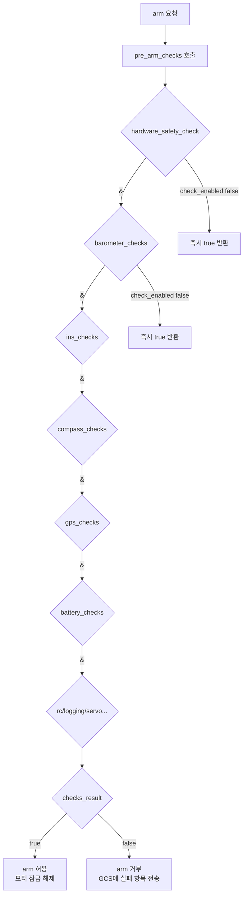
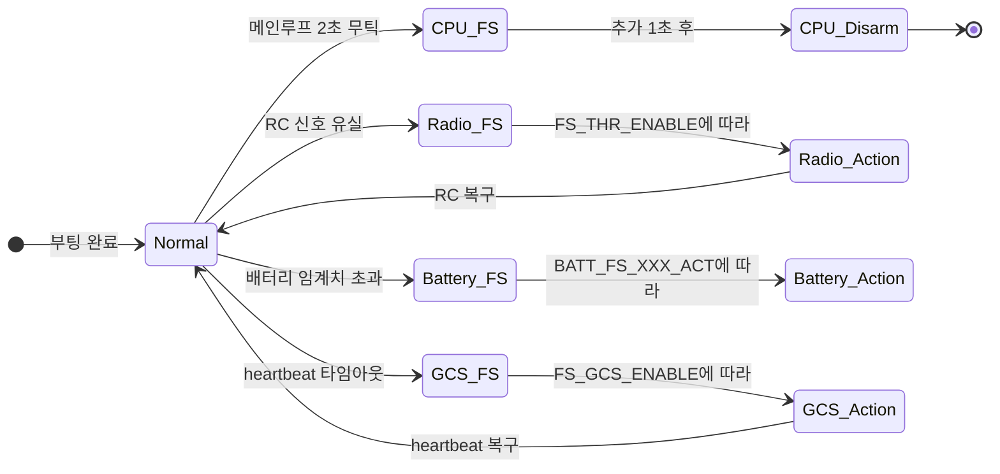
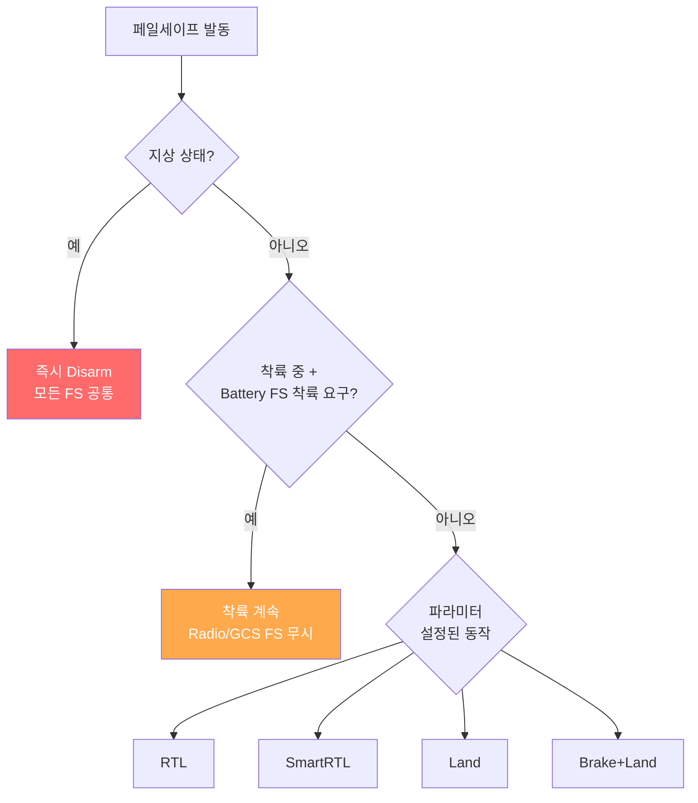

# CH30. Arming과 Failsafe

::: info 학습 목표
- Arming이 필요한 이유와 arm 시점에 수행되는 점검 항목을 설명할 수 있다.
- `AP_Arming::Check` 비트마스크와 `pre_arm_checks`의 AND 결합 구조를 코드로 추적할 수 있다.
- `ARMING_SKIPCHK` 파라미터로 특정 체크를 건너뛰는 원리를 이해한다.
- CPU watchdog, Radio, Battery, GCS 페일세이프 각각의 동작 조건과 대응 동작을 설명할 수 있다.
- 여러 페일세이프가 동시에 발생했을 때 우선순위 결정 원리를 이해한다.
:::

## 1. Arming이 왜 필요한가

드론 모터에 연결된 ESC는 신호만 받으면 즉시 프롭을 돌린다. FC(Flight Controller)가 부팅된 직후, 센서 초기화가 끝나지 않은 상태, 또는 조종사가 잘못 건드린 순간에도 모터가 돌 수 있다면 부상이나 기체 파손이 생긴다.

Arming은 "조종사가 의도적으로 비행 준비를 선언하기 전까지 모터 출력을 잠근다"는 안전 장치다. Arm 상태가 되기 전에 ArduPilot은 기압계·IMU·나침반·GPS·배터리·RC 등 비행에 필수적인 모든 서브시스템을 일괄 점검한다. 하나라도 실패하면 Arm이 거부된다.

::: warning 실제 안전 중요성
프롭은 손가락을 순식간에 절단할 수 있다. Arming 전에 반드시 프롭 반경 안에 사람이 없는지 확인해야 한다. GCS에서 강제로 `ARMING_SKIPCHK = -1`을 설정하면 모든 체크를 건너뛸 수 있지만, 이는 센서 이상 상태에서도 모터가 작동함을 뜻한다. 실외 비행에서는 절대 사용하지 마라.
:::

## 2. Check 비트마스크

`AP_Arming::Check` enum은 각 점검 항목을 2의 거듭제곱 비트로 정의한다. 여러 체크를 하나의 32비트 정수로 조합할 수 있다.

```cpp
// libraries/AP_Arming/AP_Arming.h:26
enum class Check {
    BARO        = (1U << 1),   // 기압계
    COMPASS     = (1U << 2),   // 나침반
    GPS         = (1U << 3),   // GPS 위성 수 / 정확도
    INS         = (1U << 4),   // IMU 일관성
    PARAMETERS  = (1U << 5),   // 파라미터 유효성
    RC          = (1U << 6),   // RC 채널 캘리브레이션
    VOLTAGE     = (1U << 7),   // 보드 전압
    BATTERY     = (1U << 8),   // 배터리 잔량
    AIRSPEED    = (1U << 9),   // 대기속도계(Fixed-wing)
    LOGGING     = (1U << 10),  // SD카드 로거
    SWITCH      = (1U << 11),  // 하드웨어 안전 스위치
    GPS_CONFIG  = (1U << 12),  // GPS 설정 정합성
    SYSTEM      = (1U << 13),  // 시스템 전반
    MISSION     = (1U << 14),  // 미션 항목
    RANGEFINDER = (1U << 15),  // 거리계
    CAMERA      = (1U << 16),  // 카메라
    AUX_AUTH    = (1U << 17),  // 보조 인증
    VISION      = (1U << 18),  // Visual Odometry
    FFT         = (1U << 19),  // 자이로 FFT
    OSD         = (1U << 20),  // OSD
    CHECK_LAST  = (1U << 21),  // 끝 마커
};
```
`(AP_Arming.h:26)`

### ARMING_SKIPCHK 파라미터

`ARMING_SKIPCHK`는 건너뛸 체크 항목을 같은 비트마스크로 지정한다. `check_enabled()` 함수가 이를 확인한다.

```cpp
// libraries/AP_Arming/AP_Arming.cpp:328
bool AP_Arming::check_enabled(const AP_Arming::Check check) const
{
    return (checks_to_skip & uint32_t(check)) == 0;
}
```
`(AP_Arming.cpp:328)`

비트가 1이면 해당 체크를 건너뛴다(`return false` → 비활성화). `SKIPCHK = -1`(모든 비트 1)이면 모든 체크가 비활성화된다. 기본값은 0(모든 체크 활성화).

## 3. pre_arm_checks — AND 결합 구조

`pre_arm_checks()`는 활성화된 모든 서브체크를 `&` 연산(bitwise AND, short-circuit 없음)으로 묶어 하나라도 실패하면 `false`를 반환한다.

```cpp
// libraries/AP_Arming/AP_Arming.cpp:1687
bool AP_Arming::pre_arm_checks(bool report)
{
    bool checks_result = hardware_safety_check(report)
        &  barometer_checks(report)
        &  ins_checks(report)
        &  compass_checks(report)
        &  gps_checks(report)
        &  battery_checks(report)
        &  logging_checks(report)
        &  manual_transmitter_checks(report)
        &  mission_checks(report)
        &  rangefinder_checks(report)
        &  servo_checks(report)
        &  board_voltage_checks(report)
        &  system_checks(report)
        &  terrain_checks(report)
        // ... 추가 체크 생략
```
`(AP_Arming.cpp:1697)`

`&&`(논리 AND)가 아니라 `&`(비트 AND)를 쓴 이유는 **모든 체크를 실행**해서 실패한 항목을 GCS에 전부 보고하기 위해서다. `&&`였다면 첫 번째 실패에서 이후 체크를 건너뛴다.

각 서브체크 함수(예: `barometer_checks`)는 내부에서 `check_enabled(Check::BARO)`를 먼저 호출한다. SKIPCHK에 해당 비트가 세트되어 있으면 즉시 `true`(통과)를 반환한다.



### arm() 함수에서의 조건

`pre_arm_checks`는 `arm()` 내부에서 다음과 같이 호출된다.

```cpp
// libraries/AP_Arming/AP_Arming.cpp:1897
if ((!do_arming_checks && mandatory_checks(true))
    || (pre_arm_checks(true) && arm_checks(method))) {
    armed = true;
```
`(AP_Arming.cpp:1897)`

`do_arming_checks = false`이면 `pre_arm_checks`를 건너뛰고 필수(mandatory) 체크만 수행한다. 강제 Arm(MAVLink 강제 명령 등) 경로다. 일반 Arm은 `pre_arm_checks` + `arm_checks` 모두 통과해야 한다.

## 4. Arm Method

Arm을 요청하는 주체는 여럿이다. `AP_Arming::Method` enum이 이를 구분한다.

```cpp
// libraries/AP_Arming/AP_Arming.h:52
enum class Method {
    RUDDER       = 0,   // 스틱 러더 조작
    MAVLINK      = 1,   // GCS MAVLink 명령
    AUXSWITCH    = 2,   // 보조 채널 스위치
    MOTORTEST    = 3,   // 모터 테스트
    SCRIPTING    = 4,   // Lua 스크립트
    // ... disarm 전용 항목
    RADIOFAILSAFE    = 16,
    GCSFAILSAFE      = 18,
    BATTERYFAILSAFE  = 7,
    CPUFAILSAFE      = 6,
    CRASH            = 12,
};
```
`(AP_Arming.h:52)`

Disarm 전용 Method(예: `RADIOFAILSAFE`, `BATTERYFAILSAFE`)는 페일세이프가 disarm을 직접 호출할 때 사용된다. 로그에 disarm 원인을 기록하는 데 쓰인다.

## 5. Failsafe 개요

Failsafe는 비행 중 발생하는 이상 상황을 자동으로 감지하고 미리 정해진 대응 동작을 실행하는 시스템이다. ArduCopter는 다음 네 가지 주요 페일세이프를 갖는다.



## 6. CPU Watchdog 페일세이프

CPU Watchdog은 메인 스케줄러 루프가 멈추는 "데드락" 상황을 감지한다. 1kHz 하드웨어 타이머 인터럽트에서 실행된다.

```cpp
// ArduCopter/failsafe.cpp:35
void Copter::failsafe_check()
{
    uint32_t tnow = AP_HAL::micros();

    const uint16_t ticks = scheduler.ticks();
    if (ticks != failsafe_last_ticks) {
        // the main loop is running, all is OK
        failsafe_last_ticks = ticks;
        failsafe_last_timestamp = tnow;
        if (in_failsafe) {
            in_failsafe = false;
            LOGGER_WRITE_ERROR(LogErrorSubsystem::CPU,
                               LogErrorCode::FAILSAFE_RESOLVED);
        }
        return;
    }

    if (!in_failsafe && failsafe_enabled &&
        tnow - failsafe_last_timestamp > 2000000) {
        // 2초 무틱: output_min으로 모터 최소 출력
        in_failsafe = true;
        if (motors->armed()) {
            motors->output_min();
        }
        LOGGER_WRITE_ERROR(LogErrorSubsystem::CPU,
                           LogErrorCode::FAILSAFE_OCCURRED);
    }

    if (failsafe_enabled && in_failsafe &&
        tnow - failsafe_last_timestamp > 1000000) {
        // 추가 1초 후: disarm
        failsafe_last_timestamp = tnow;
        if(motors->armed()) {
            motors->armed(false);
            motors->output();
        }
    }
}
```
`(ArduCopter/failsafe.cpp:35)`

동작 순서:
1. 1kHz 타이머 인터럽트에서 `scheduler.ticks()`가 변했는지 확인한다.
2. 틱이 2초 동안 바뀌지 않으면 `output_min()`으로 모터를 최소 출력으로 낮추고 로그를 기록한다.
3. 그 후 1초가 더 지나면 `motors->armed(false)`로 Disarm한다.

즉시 Disarm하지 않고 `output_min` 단계를 두는 이유는 **로그를 기록할 시간**을 벌기 위해서다.

::: warning CPU Watchdog과 비행 안전
CPU 페일세이프가 발동하는 상황은 소프트웨어 버그나 과부하로 메인루프가 완전히 멈춘 것이다. 이 상태에서 모터를 즉시 끄면 고도에서 추락한다. ArduPilot은 2+1초의 유예를 두지만 어떤 경우에도 기체를 안전한 고도에서 비행시키는 것이 최우선이다.
:::

## 7. Radio(RC) 페일세이프

RC 신호가 유실되면 `failsafe_radio_on_event()`가 호출된다.

```cpp
// ArduCopter/events.cpp:13
void Copter::failsafe_radio_on_event()
{
    LOGGER_WRITE_ERROR(LogErrorSubsystem::FAILSAFE_RADIO,
                       LogErrorCode::FAILSAFE_OCCURRED);

    FailsafeAction desired_action;
    switch ((FS_THR_Action)g.failsafe_throttle) {
        case FS_THR_Action::ALWAYS_RTL:
            desired_action = FailsafeAction::RTL;
            break;
        case FS_THR_Action::ALWAYS_LAND:
            desired_action = FailsafeAction::LAND;
            break;
        // ...
    }

    if (should_disarm_on_failsafe()) {
        // 지상에 있으면 즉시 Disarm
        arming.disarm(AP_Arming::Method::RADIOFAILSAFE);
        desired_action = FailsafeAction::NONE;
    }
    // ...
    do_failsafe_action(desired_action, ModeReason::RADIO_FAILSAFE);
}
```
`(ArduCopter/events.cpp:13)`

`FS_THR_ENABLE` 파라미터(코드의 `g.failsafe_throttle`) 값에 따라 `desired_action`이 결정된다. 선택지는 RTL, Land, SmartRTL, Brake+Land 등이다.

`should_disarm_on_failsafe()`는 현재 기체가 지상에 있는지(또는 이륙 지연 중인지) 확인한다. 지상 상태라면 비행 동작이 의미 없으므로 바로 Disarm한다.

RC 신호가 복구되면 `failsafe_radio_off_event()`가 호출되어 로그에 `FAILSAFE_RESOLVED`를 기록한다.
`(ArduCopter/events.cpp:82)`

## 8. Battery 페일세이프

배터리 임계치(전압 또는 잔량)에 도달하면 `handle_battery_failsafe()`가 호출된다.

```cpp
// ArduCopter/events.cpp:99
void Copter::handle_battery_failsafe(const char *type_str,
                                      const int8_t action)
{
    LOGGER_WRITE_ERROR(LogErrorSubsystem::FAILSAFE_BATT,
                       LogErrorCode::FAILSAFE_OCCURRED);

    FailsafeAction desired_action = (FailsafeAction)action;

    if (should_disarm_on_failsafe()) {
        arming.disarm(AP_Arming::Method::BATTERYFAILSAFE);
        desired_action = FailsafeAction::NONE;
    } else if (flightmode->is_landing() &&
               failsafe_option(FailsafeOption::CONTINUE_IF_LANDING) &&
               desired_action != FailsafeAction::NONE) {
        desired_action = FailsafeAction::LAND;
    }

    do_failsafe_action(desired_action, ModeReason::BATTERY_FAILSAFE);
}
```
`(ArduCopter/events.cpp:99)`

배터리 임계치는 레벨 1(경고), 레벨 2(위험) 두 단계로 설정할 수 있다. 각각 별도의 `BATT_FS_LOW_ACT`, `BATT_FS_CRT_ACT` 파라미터로 대응 동작을 지정한다.

착륙 중(`flightmode->is_landing()`)이고 `FS_OPTIONS`에 `CONTINUE_IF_LANDING`이 설정되어 있으면 착륙 동작을 계속한다. 착륙 중에 RTL로 바꾸면 오히려 위험하기 때문이다.

## 9. GCS 페일세이프

GCS(지상국) heartbeat가 일정 시간 수신되지 않으면 GCS 페일세이프가 발동한다.

```cpp
// ArduCopter/events.cpp:126
void Copter::failsafe_gcs_check()
{
    if (g.failsafe_gcs == FS_GCS_Action::DISABLED) {
        return;
    }

    const uint32_t gcs_last_seen_ms =
        gcs().sysid_mygcs_last_seen_time_ms();
    if (gcs_last_seen_ms == 0) {
        return; // GCS가 한 번도 연결된 적 없음
    }

    const uint32_t last_gcs_update_ms = millis() - gcs_last_seen_ms;
    const uint32_t gcs_timeout_ms =
        uint32_t(g2.fs_gcs_timeout * 1000.0f);

    if (last_gcs_update_ms > gcs_timeout_ms && !failsafe.gcs) {
        set_failsafe_gcs(true);
        failsafe_gcs_on_event();
    }
}
```
`(ArduCopter/events.cpp:126)`

GCS가 한 번도 연결된 적 없으면(`gcs_last_seen_ms == 0`) 페일세이프를 발동하지 않는다. 처음부터 GCS 없이 비행하는 경우를 허용하기 위해서다.

`failsafe_gcs_on_event()`의 대응 동작도 Radio 페일세이프와 유사하게 `FS_GCS_ENABLE` 파라미터로 제어한다. 비무장 상태면 아무것도 하지 않고, 지상 상태면 Disarm, 비행 중이면 RTL/Land 등을 수행한다.
`(ArduCopter/events.cpp:163)`

## 10. 페일세이프 우선순위

여러 페일세이프가 동시에 발생하면 "더 위험한 상황"이 우선한다. `events.cpp`의 `failsafe_radio_on_event`에서 배터리 페일세이프와의 결합 처리가 그 예다.

```cpp
// ArduCopter/events.cpp:53
} else if (flightmode->is_landing() &&
    (battery.has_failsafed() &&
     battery.get_highest_failsafe_priority() <= FAILSAFE_LAND_PRIORITY)) {
    // 배터리 페일세이프가 이미 착륙을 요구 중
    // → Radio FS가 발동해도 착륙을 계속한다
    announce_failsafe("Radio + Battery", "Continuing Landing");
    desired_action = FailsafeAction::LAND;
```
`(ArduCopter/events.cpp:53)`

동일한 패턴이 GCS 페일세이프에도 적용된다.
`(ArduCopter/events.cpp:208)`

우선순위 원칙을 정리하면 다음과 같다.



Battery FS가 착륙을 요구하면 Radio FS나 GCS FS는 그것을 중단시키지 않는다. 배터리 고갈이 더 심각한 위험이기 때문이다.

::: warning 페일세이프 설정 실수
`FS_THR_ENABLE = DISABLED`로 설정하면 RC 신호가 끊겨도 드론이 아무 동작도 하지 않고 계속 날아간다. 특히 Manual/Stabilize 모드에서는 스로틀이 그대로 유지되어 기체가 제어 불가 상태로 사라질 수 있다. 실외 비행에서는 반드시 적절한 FS_THR_ENABLE 값을 설정해야 한다.
:::

## 11. do_failsafe_action — 통합 대응 실행기

모든 페일세이프 이벤트 핸들러는 최종적으로 `do_failsafe_action()`을 호출한다. 이 함수가 실제 모드 전환을 수행한다.

```cpp
// ArduCopter/events.cpp:485
void Copter::do_failsafe_action(FailsafeAction action,
                                 ModeReason reason)
{
    switch (action) {
        case FailsafeAction::NONE:    return;
        case FailsafeAction::LAND:
            set_mode_land_with_pause(reason);   break;
        case FailsafeAction::RTL:
            set_mode_RTL_or_land_with_pause(reason); break;
        case FailsafeAction::SMARTRTL:
            set_mode_SmartRTL_or_RTL(reason);   break;
        case FailsafeAction::TERMINATE:
            arming.disarm(
                AP_Arming::Method::FAILSAFE_ACTION_TERMINATE); break;
        // ...
    }
}
```
`(ArduCopter/events.cpp:485)`

`set_mode_RTL_or_land_with_pause()`는 RTL 모드 전환이 실패하면(GPS 없음 등) Land 모드로 폴백한다. 이처럼 각 동작이 더 안전한 대안으로 자동 폴백하는 구조다.

::: tip 핵심 정리
- **Arming Check 비트마스크**: `AP_Arming::Check` enum이 각 점검 항목을 비트로 정의한다. `ARMING_SKIPCHK`로 특정 비트를 세트하면 해당 체크를 건너뛴다 `(AP_Arming.h:26, AP_Arming.cpp:328)`.
- **pre_arm_checks AND 결합**: `&` 연산으로 모든 서브체크를 실행해 GCS에 전체 실패 목록을 보고한다 `(AP_Arming.cpp:1697)`. 하나라도 실패하면 Arm 거부.
- **CPU Watchdog**: 1kHz 타이머에서 메인루프 틱을 감시. 2초 무틱 → output_min → 1초 후 Disarm `(ArduCopter/failsafe.cpp:35)`.
- **Radio FS**: `FS_THR_ENABLE`에 따라 RTL/Land/SmartRTL 등을 수행. 지상 상태면 즉시 Disarm `(ArduCopter/events.cpp:13)`.
- **Battery FS**: 배터리 임계 도달 시 호출. 착륙 중이면 착륙을 계속하는 예외 처리 포함 `(ArduCopter/events.cpp:99)`.
- **GCS FS**: heartbeat 타임아웃 감지. GCS가 한 번도 연결된 적 없으면 발동 안 함 `(ArduCopter/events.cpp:126)`.
- **우선순위**: Battery가 착륙을 요구하면 Radio/GCS FS가 이를 덮지 않는다. 더 위험한 상황이 우선.
:::

## 다음 챕터

[CH31. 로깅](/study/ardupilot/31-logging) — ArduPilot의 블랙박스 시스템을 분석한다. SD카드/FLASH/MAVLink 백엔드, LogStructure 자기기술 포맷, Write API, 그리고 Arm 전후 지속 기록 메커니즘을 소스로 따라간다.
