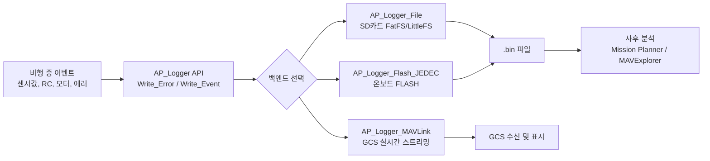
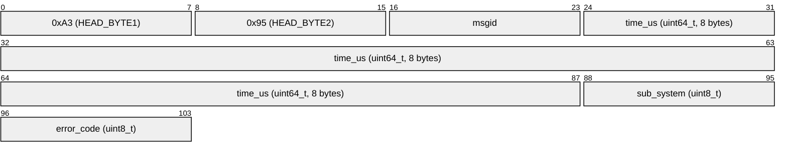
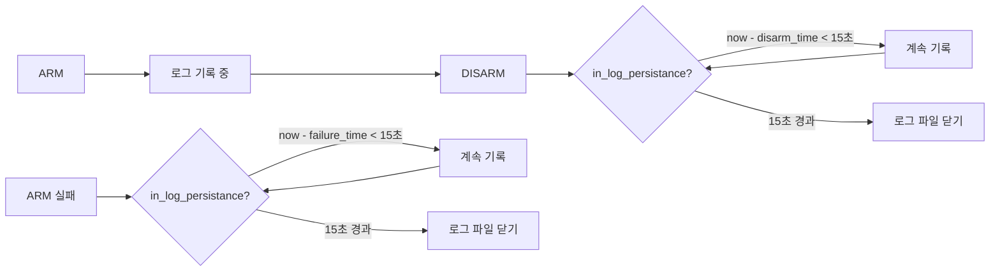
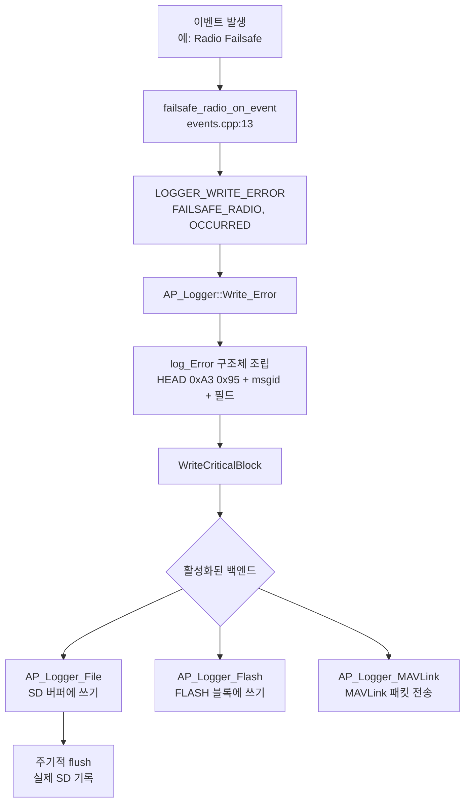
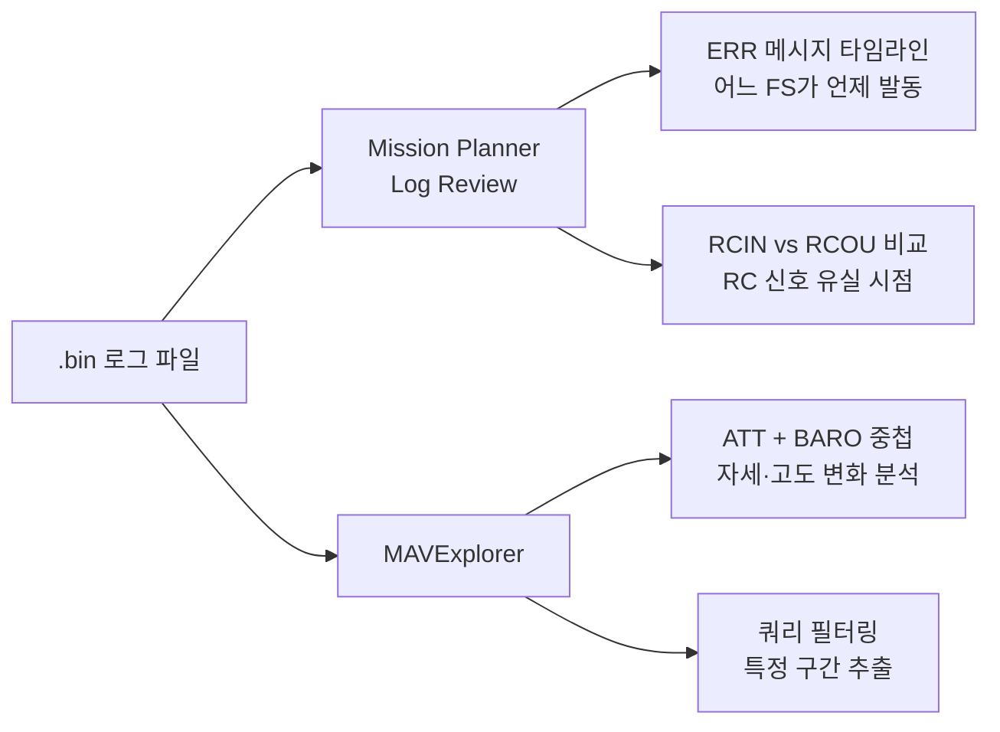

# CH31. 로깅

::: info 학습 목표
- ArduPilot 로거의 세 가지 백엔드(File/Flash/MAVLink)의 역할과 선택 기준을 설명할 수 있다.
- `LogStructure`의 자기기술(self-describing) 포맷 필드를 코드로 읽을 수 있다.
- `HEAD_BYTE1/2` 매직 바이트의 역할을 이해한다.
- `Write_Event`, `Write_Error`, `LOGGER_WRITE_ERROR` 매크로를 연결해서 30장의 failsafe 코드와 대응할 수 있다.
- Arm 후 Disarm 이후에도 로그가 유지되는 `HAL_LOGGER_ARM_PERSIST` 메커니즘을 이해한다.
:::

## 1. 로깅이란 — 드론의 블랙박스

항공기 사고 조사에서 블랙박스(비행기록장치)는 사고 원인을 밝히는 핵심 증거다. ArduPilot의 로거는 같은 역할을 한다. 비행 중 발생하는 모든 데이터(자세·GPS·RC 입력·모터 출력·센서값·이벤트·에러)를 SD카드나 온보드 FLASH에 바이너리 형태로 기록한다.

기록된 로그는 비행 후 Mission Planner의 Log Review나 MAVExplorer로 열어 시계열 그래프로 분석할 수 있다. 비정상 진동, 페일세이프 발동 원인, PID 튜닝 결과 등을 사후에 검증하는 데 필수적이다.



## 2. 백엔드 종류

AP_Logger는 복수의 백엔드를 동시에 활성화할 수 있다. `LOG_BACKEND_TYPE` 파라미터(비트마스크)로 제어한다.

```cpp
// libraries/AP_Logger/AP_Logger.cpp:244
static const struct {
    Backend_Type type;
    AP_Logger_Backend* (*probe_fn)(AP_Logger&,
                                   LoggerMessageWriter_DFLogStart*);
} backend_configs[] {
    { Backend_Type::FILESYSTEM, AP_Logger_File::probe },
    { Backend_Type::BLOCK,      HAL_LOGGING_DATAFLASH_DRIVER::probe },
    { Backend_Type::MAVLINK,    AP_Logger_MAVLink::probe },
};
```
`(AP_Logger.cpp:244)`

### AP_Logger_File

SD카드를 FatFS 또는 LittleFS로 접근한다. 가장 일반적인 백엔드다. Pixhawk 계열 보드는 microSD 슬롯이 있어 이 백엔드를 기본으로 사용한다. 로그 파일은 `/APM/LOGS/` 디렉터리에 `0001.bin`, `0002.bin` 형식으로 순번 저장된다.

### AP_Logger_Flash_JEDEC / AP_Logger_W25NXX

별도 SD 슬롯 없이 JEDEC 표준 SPI FLASH(W25Q 계열)나 NAND FLASH(W25N 계열)를 직접 사용하는 백엔드다. 소형 보드에서 SD카드 연결이 불가능할 때 사용한다. 파일 시스템 없이 블록 단위로 직접 기록한다(`AP_Logger_Block` 기반).

### AP_Logger_MAVLink

로그를 SD카드에 저장하지 않고 MAVLink 프로토콜로 GCS에 실시간 스트리밍한다. 텔레메트리 링크가 충분히 빠를 때 사용한다. SD카드가 없는 상황이나 실시간 모니터링이 필요한 경우에 유용하다.

::: warning SD카드 선택
SD카드 속도가 느리면 로거 버퍼가 가득 찰 수 있다. ArduPilot은 `DSF` 로그 메시지에서 `dropped`(드롭된 메시지 수), `buf_space_min`(최소 잔여 버퍼) 등을 기록한다. 비행 로그에서 dropped 값이 0이 아니라면 빠른 SD카드로 교체해야 한다.
:::

## 3. LogStructure — 자기기술 포맷

로그 파일이 자기기술적(self-describing)이란 말은 파일 안에 메시지 포맷 정의가 내장되어 있어, 소스코드 없이도 파싱할 수 있다는 뜻이다. `LogStructure` 구조체가 이를 담당한다.

```cpp
// libraries/AP_Logger/LogStructure.h:166
struct LogStructure {
    uint8_t      msg_type;     // 메시지 타입 번호 (고유 ID)
    uint8_t      msg_len;      // 패킷 전체 길이 (바이트)
    const char  *name;         // 메시지 이름 (예: "ATT", "GPS", "ERR")
    const char  *format;       // 필드 타입 코드열 (예: "QBB")
    const char  *labels;       // 필드 이름 목록 (예: "TimeUS,Subsys,ECode")
    const char  *units;        // 단위 코드열 (예: "s--")
    const char  *multipliers;  // 스케일 코드열 (예: "F--")
    bool         streaming;    // 속도 제한 가능 여부
};
```
`(LogStructure.h:166)`

### format 코드

format 문자 하나가 필드 하나의 C 타입을 지정한다.

| 코드 | C 타입 | 설명 |
|------|--------|------|
| `Q` | uint64_t | 주로 타임스탬프(마이크로초) |
| `I` | uint32_t | 32비트 부호없는 정수 |
| `i` | int32_t | 32비트 부호있는 정수 |
| `H` | uint16_t | 16비트 부호없는 정수 |
| `B` | uint8_t | 8비트 부호없는 정수 |
| `b` | int8_t | 8비트 부호있는 정수 |
| `f` | float | 32비트 부동소수점 |
| `N` | char[16] | 16바이트 문자열 |
| `c` | int16_t * 100 | 센티 단위 정수 |
| `L` | int32_t | 위도/경도 (1e-7도) |
| `M` | uint8_t | 비행 모드 |

### ERR 메시지 실제 정의

```cpp
// libraries/AP_Logger/LogStructure.h:1260
{ LOG_ERROR_MSG, sizeof(log_Error),
  "ERR", "QBB", "TimeUS,Subsys,ECode", "s--", "F--" },
```
`(LogStructure.h:1260)`

- `msg_type` = `LOG_ERROR_MSG`
- `name` = `"ERR"`
- `format` = `"QBB"` → TimeUS(uint64), Subsys(uint8), ECode(uint8)
- `labels` = `"TimeUS,Subsys,ECode"`
- `units` = `"s--"` → 초, 없음, 없음
- `multipliers` = `"F--"` → 1e-6(마이크로초→초), 없음, 없음

### EV 이벤트 메시지

```cpp
// libraries/AP_Logger/LogStructure.h:1256
{ LOG_EVENT_MSG, sizeof(log_Event),
  "EV", "QB", "TimeUS,Id", "s-", "F-" },
```
`(LogStructure.h:1256)`

### 매직 바이트

모든 로그 패킷은 `HEAD_BYTE1 = 0xA3`, `HEAD_BYTE2 = 0x95` 두 바이트로 시작한다.

```cpp
// libraries/AP_Logger/LogStructure.h:125
#define HEAD_BYTE1  0xA3    // Decimal 163
#define HEAD_BYTE2  0x95    // Decimal 149
```
`(LogStructure.h:125)`

파서는 이 두 바이트를 찾아 패킷 경계를 식별한다. 그 다음 `msgid` 1바이트가 따라오고(`LOG_PACKET_HEADER`), 이 msgid로 `LogStructure` 테이블에서 포맷을 조회해 남은 필드를 파싱한다.



## 4. Write API

AP_Logger는 서브시스템마다 특화된 Write 함수와 범용 Write 함수를 제공한다.

### Write_Event

Arm/Disarm 같은 이산적 이벤트를 기록한다.

```cpp
// libraries/AP_Logger/AP_Logger.cpp:1514
void AP_Logger::Write_Event(LogEvent id)
{
    const struct log_Event pkt{
        LOG_PACKET_HEADER_INIT(LOG_EVENT_MSG),
        time_us  : AP_HAL::micros64(),
        id       : (uint8_t)id
    };
    WriteCriticalBlock(&pkt, sizeof(pkt));
}
```
`(AP_Logger.cpp:1514)`

`LogEvent::ARMED = 10`, `LogEvent::DISARMED = 11` 상수로 이벤트를 구분한다.
`(AP_Logger.h:26)`

`WriteCriticalBlock()`은 일반 `WriteBlock()`과 달리 버퍼가 가득 찬 상태에서도 드롭하지 않고 블로킹으로 기록한다. 페일세이프·Arm/Disarm 같은 중요 이벤트에 사용한다.

### Write_Error

페일세이프 발생/해제를 기록한다. 30장에서 살펴본 모든 페일세이프 핸들러가 이 함수를 호출한다.

```cpp
// libraries/AP_Logger/AP_Logger.cpp:1525
void AP_Logger::Write_Error(LogErrorSubsystem sub_system,
                            LogErrorCode error_code)
{
    const struct log_Error pkt{
        LOG_PACKET_HEADER_INIT(LOG_ERROR_MSG),
        time_us    : AP_HAL::micros64(),
        sub_system : uint8_t(sub_system),
        error_code : uint8_t(error_code),
    };
    WriteCriticalBlock(&pkt, sizeof(pkt));
}
```
`(AP_Logger.cpp:1525)`

### LOGGER_WRITE_ERROR 매크로

30장의 failsafe 코드에서 직접 호출한 `LOGGER_WRITE_ERROR`는 이 함수의 편의 래퍼다.

```cpp
// libraries/AP_Logger/AP_Logger.h:630
#define LOGGER_WRITE_ERROR(subsys, err) \
    AP::logger().Write_Error(subsys, err)
```
`(AP_Logger.h:630)`

실제 사용 예(CPU watchdog):
```cpp
// ArduCopter/failsafe.cpp:61
LOGGER_WRITE_ERROR(LogErrorSubsystem::CPU,
                   LogErrorCode::FAILSAFE_OCCURRED);
```

### 주요 Write 함수 목록

| 함수 | 로그 메시지 | 내용 |
|------|------------|------|
| `Write_Event(id)` | `EV` | Arm/Disarm/AutoArm 이벤트 |
| `Write_Error(subsys, code)` | `ERR` | 페일세이프 발생/해제 |
| `Write_Parameter(name, val)` | `PARM` | 파라미터 값 |
| `Write_Mode(mode, reason)` | `MODE` | 비행 모드 전환 |
| `Write_RCIN()` | `RCIN` | RC 입력 채널 PWM값 (16채널) |
| `Write_RCOUT()` | `RCOU` | 서보/모터 출력 PWM값 |
| `Write_Power()` | `POWR` | 보드 전압·전류 |

### LogErrorSubsystem과 failsafe 연결

`LogErrorSubsystem` enum의 페일세이프 관련 항목:

```cpp
// libraries/AP_Logger/AP_Logger.h:112
enum class LogErrorSubsystem : uint8_t {
    FAILSAFE_RADIO    = 5,
    FAILSAFE_BATT     = 6,
    FAILSAFE_GCS      = 8,
    CPU               = 19,
    FAILSAFE_TERRAIN  = 23,
    FAILSAFE_DEADRECKON = 31,
    // ...
};
```
`(AP_Logger.h:112)`

30장의 각 이벤트 핸들러가 이 subsystem 코드로 로그를 남긴다. 사후 분석 시 ERR 메시지의 Subsys 필드 값으로 어떤 페일세이프가 발동했는지 특정한다.

## 5. Arm 전후 로그 지속 기록

### PrepForArming

Arm 직전에 로거를 준비 상태로 전환한다. 각 백엔드의 `PrepForArming()`이 호출되어 새 로그 파일을 열거나 블록 디바이스를 준비한다.

```cpp
// libraries/AP_Logger/AP_Logger.cpp:692
void AP_Logger::PrepForArming()
{
    FOR_EACH_BACKEND(PrepForArming());
}
```
`(AP_Logger.cpp:692)`

### HAL_LOGGER_ARM_PERSIST

Disarm 후에도 로그가 즉시 닫히지 않고 일정 시간 기록을 계속한다.

```cpp
// libraries/AP_Logger/AP_Logger.cpp:56
#ifndef HAL_LOGGER_ARM_PERSIST
#define HAL_LOGGER_ARM_PERSIST 15
#endif
```
`(AP_Logger.cpp:56)`

기본값 15초. `in_log_persistance()` 함수가 이를 제어한다.

```cpp
// libraries/AP_Logger/AP_Logger.cpp:1542
bool AP_Logger::in_log_persistance(void) const
{
    uint32_t persist_ms = HAL_LOGGER_ARM_PERSIST * 1000U;

    // Disarm 후 persist_ms 동안 계속 기록
    const uint32_t arm_change_ms = hal.util->get_last_armed_change();
    if (!hal.util->get_soft_armed() && arm_change_ms != 0 &&
        now - arm_change_ms < persist_ms) {
        return true;
    }

    // Arm 실패 후에도 persist_ms 동안 기록
    if (_last_arming_failure_ms &&
        now - _last_arming_failure_ms < persist_ms) {
        return true;
    }

    return false;
}
```
`(AP_Logger.cpp:1542)`

Disarm 직후의 착지 충격, 프롭 정지 과정, 마지막 센서 데이터가 모두 기록된다. Arm 실패 후에도 같은 지속 시간이 적용되어 실패 원인을 로그로 추적할 수 있다.



## 6. 로그 기록 흐름 전체



## 7. 사후 분석

비행 후 로그를 분석하는 주요 도구는 두 가지다.

**Mission Planner Log Review**: `.bin` 파일을 불러와 각 메시지 타입을 체크박스로 선택해 시계열 그래프로 본다. ATT(자세), GPS, RCIN, ERR 등을 겹쳐 보면 페일세이프 발동 시점의 전후 맥락을 파악할 수 있다.

**MAVExplorer**: ArduPilot 공식 CLI 분석 도구. 파이썬 기반이며 더 유연한 쿼리와 그래프 조합이 가능하다.



::: tip 핵심 정리
- **세 가지 백엔드**: `AP_Logger_File`(SD), `AP_Logger_Flash_JEDEC/W25NXX`(온보드 FLASH), `AP_Logger_MAVLink`(GCS 스트리밍). 비트마스크 파라미터 `LOG_BACKEND_TYPE`으로 복수 동시 활성화 가능 `(AP_Logger.cpp:244)`.
- **LogStructure 자기기술**: `msg_type`, `msg_len`, `name`, `format`, `labels`, `units`, `multipliers` 필드가 파싱 스키마를 내장 `(LogStructure.h:166)`. 소스코드 없이 파싱 가능.
- **매직 바이트**: 모든 패킷은 `0xA3 0x95`로 시작하고 그 뒤에 `msgid`가 따른다 `(LogStructure.h:125)`.
- **Write_Error / LOGGER_WRITE_ERROR**: 30장의 페일세이프 핸들러가 이 API로 ERR 메시지를 남긴다. `LogErrorSubsystem::FAILSAFE_RADIO/BATT/GCS/CPU` 등으로 subsystem을 구분 `(AP_Logger.h:112, AP_Logger.cpp:1525)`.
- **WriteCriticalBlock**: Arm/Disarm, 페일세이프 같은 중요 이벤트는 버퍼 드롭 없이 반드시 기록한다.
- **HAL_LOGGER_ARM_PERSIST = 15초**: Disarm 또는 Arm 실패 후에도 15초간 로그를 계속 기록해 착지 데이터를 보존한다 `(AP_Logger.cpp:56, AP_Logger.cpp:1542)`.
:::

## 다음 챕터

[CH32. SITL](/study/ardupilot/32-sitl) — 실제 하드웨어 없이 ArduPilot을 실행하는 Software In The Loop 시뮬레이터를 다룬다. SITL 빌드, MAVProxy 연결, 가상 비행 환경 구성을 소스 수준에서 분석한다.
