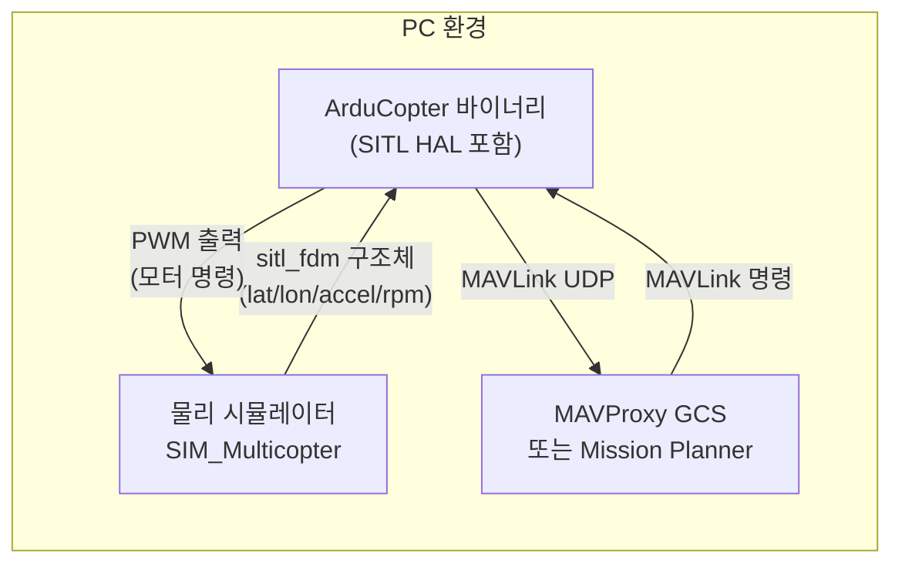
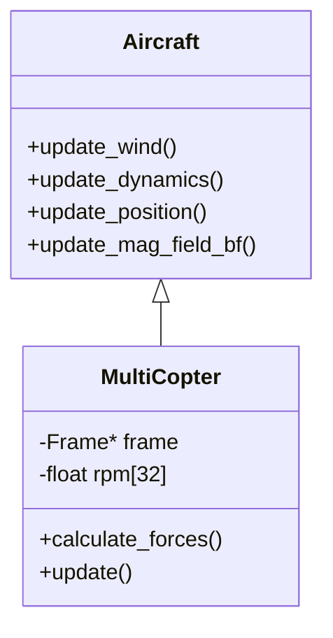
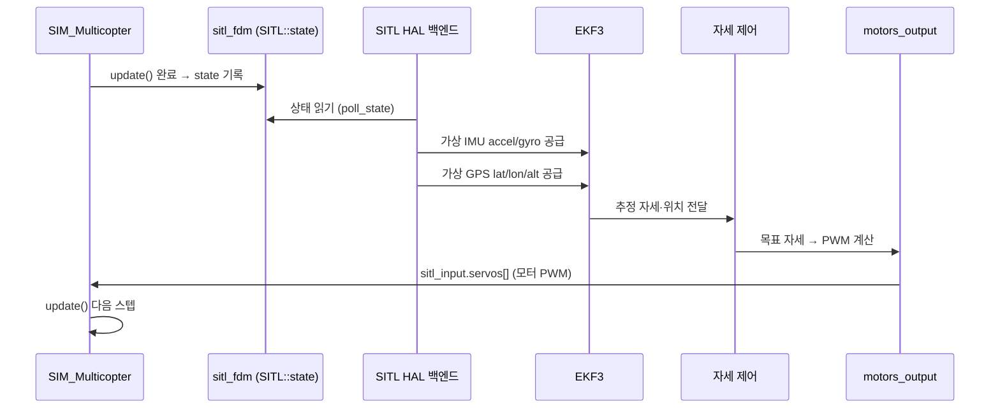

# CH32. SITL 시뮬레이션

::: info 학습 목표
- SITL이 하드웨어 없이 실제 펌웨어를 실행할 수 있는 이유를 HAL 추상화 측면에서 설명할 수 있다.
- sim_vehicle.py가 빌드·물리 시뮬레이터·MAVProxy 세 요소를 조율하는 방식을 이해한다.
- SIM_Multicopter::update()의 한 스텝에서 update_wind → calculate_forces → update_dynamics → update_position → update_mag_field_bf 순서를 코드로 확인할 수 있다.
- sitl_fdm 구조체가 물리 엔진 결과를 어떻게 가상 센서로 변환하는지 설명할 수 있다.
- AutoTestCopter가 CI에서 하드웨어 없이 회귀 테스트를 수행하는 구조를 이해한다.
:::

## 1. SITL이란

### 개념과 위치

SITL(Software In The Loop)은 ArduPilot 펌웨어 바이너리를 **PC 프로세스**로 실행하는 시뮬레이션 환경이다. 실제 FC 보드에 올라가는 것과 **동일한 소스 코드**를 컴파일하되, HAL(Hardware Abstraction Layer) 백엔드만 리눅스/시뮬 버전으로 교체한다. 결과적으로 EKF, PID 제어, 미션 실행 코드는 하나도 바꾸지 않은 채 PC에서 돌아간다.

SITL 외에도 HIL(Hardware In The Loop)이라는 방식이 있다. HIL은 실제 FC 보드가 있지만 모터·물리 법칙은 시뮬레이터가 대신한다. 차이를 정리하면 다음과 같다.

| 구분 | FC 보드 | 물리 시뮬 | 모터·ESC |
|------|---------|-----------|----------|
| SITL | 없음(PC 프로세스) | 소프트웨어 | 없음 |
| HIL | 실 보드 | 소프트웨어 | 없음 |
| 실제 비행 | 실 보드 | 없음(실제) | 실물 |

비개발자에게 SITL의 의미는 간단하다. 드론 없이도 GCS를 열고 웨이포인트를 짜서 비행 경로를 검증할 수 있다. 개발자에게는 코드 한 줄 수정 후 CI가 자동으로 이륙~착륙 전 구간을 검증해 준다.

### SITL 구성요소



세 요소의 역할:

- **ArduCopter 바이너리**: 실제 펌웨어. EKF, 제어 루프, 미션 플래너 전부 포함. `--board sitl`로 빌드하면 HAL 백엔드가 POSIX 구현으로 교체된다.
- **물리 시뮬레이터**: `SIM_Multicopter` 클래스. 모터 PWM을 받아 6DOF(6 자유도) 운동 방정식으로 위치·자세를 계산한다. 같은 바이너리 프로세스 안에서 동작한다.
- **MAVProxy**: 파이썬 GCS. UDP로 MAVLink를 교환한다. 비행 명령 전송, 파라미터 수정, 로그 다운로드 모두 가능하다.

## 2. sim_vehicle.py

### 역할

`Tools/autotest/sim_vehicle.py`는 이 세 요소를 한 번에 올리는 오케스트레이터다. 직접 빌드를 실행하고, 바이너리와 MAVProxy를 프로세스로 띄운 뒤 포트를 연결해 준다.

```bash
# 1. 빌드
./waf configure --board sitl
./waf copter

# 2. 실행
Tools/autotest/sim_vehicle.py -v ArduCopter
```

옵션 파싱 코드를 보면 `-v` 플래그가 기체 타입을 선택한다:

```python
parser.add_option("-v", "--vehicle",
                  type='choice',
                  default=None,
                  help="vehicle type (%s)" % vehicle_options_string,
                  choices=vehicle_choices)
parser.add_option("-f", "--frame", type='string', default=None, help=...)
```
`(Tools/autotest/sim_vehicle.py:1270)`

`-v ArduCopter -f quad`처럼 기체 타입과 프레임을 지정한다. 프레임 정보는 `VehicleInfo` 클래스가 관리하며, waf 빌드 타겟이 자동으로 결정된다.

### 빌드 호출부

```python
waf_light = os.path.join(root_dir, "modules/waf/waf-light")
configure_target = frame_options.get('configure_target', 'sitl')
cmd_configure = [waf_light, "configure", "--board", configure_target]
```
`(Tools/autotest/sim_vehicle.py:518)`

`configure_target`이 `'sitl'`이면 `--board sitl`로 waf를 호출해 SITL HAL 버전을 빌드한다.

## 3. SIM_Multicopter — 물리 시뮬레이터

### 클래스 계층



`MultiCopter`는 `Aircraft` 추상 클래스를 상속한다. `Aircraft`에 공통 물리(바람·동역학·위치·자력계) 로직이 있고, `MultiCopter`가 모터 힘 계산(`calculate_forces`)을 추가한다.

### update() — 한 스텝

```cpp
void MultiCopter::update(const struct sitl_input &input)
{
    // get wind vector setup
    update_wind(input);

    Vector3f rot_accel;
    calculate_forces(input, rot_accel, accel_body);
    ...
    update_dynamics(rot_accel);
    update_external_payload(input);

    // update lat/lon/altitude
    update_position();
    time_advance();

    // update magnetic field
    update_mag_field_bf();
}
```
`(libraries/SITL/SIM_Multicopter.cpp:63)`

각 단계를 따라가보자.

**update_wind**: 파라미터로 설정된 풍속·풍향을 시뮬레이터 내부 wind 벡터에 반영한다.

**calculate_forces**: 모터 PWM(`sitl_input::servos[]`)을 RPM으로 변환하고, 각 모터의 추력과 반토크를 기체 좌표계 합력으로 합산한다.

```cpp
void MultiCopter::calculate_forces(const struct sitl_input &input,
                                    Vector3f &rot_accel, Vector3f &body_accel)
{
    motor_mask |= ((1U<<frame->num_motors)-1U) << frame->motor_offset;
    frame->calculate_forces(*this, input, rot_accel, body_accel, rpm);
    ...
}
```
`(libraries/SITL/SIM_Multicopter.cpp:48)`

`frame->calculate_forces()`가 실제 힘 계산을 담당한다. `Frame` 객체가 X, +, hex 등 프레임별 믹싱 행렬을 갖고 있다.

**update_dynamics**: 6DOF 운동 방정식. 각가속도로 자이로를 적분하고, DCM을 회전시켜 자세를 갱신하며, 선가속도를 지구 좌표계로 변환해 속도·위치를 적분한다.

```cpp
void Aircraft::update_dynamics(const Vector3f &rot_accel)
{
    const float delta_time = frame_time_us * 1.0e-6f;
    gyro += rot_accel * delta_time;
    ...
    dcm.rotate(gyro * delta_time);
    dcm.normalize();

    Vector3f accel_earth = dcm * accel_body;
    accel_earth += Vector3f(0.0f, 0.0f, GRAVITY_MSS);
    ...
}
```
`(libraries/SITL/SIM_Aircraft.cpp:729)`

**update_position**: 속도를 적분해 위도·경도·고도를 갱신한다.

**update_mag_field_bf**: 지구 자력계 모델(WMM)로 기체 좌표계 자력 벡터를 계산한다.

## 4. sitl_fdm — 물리→HAL 상태 패킷

### 구조체 정의

`sitl_fdm`은 물리 엔진이 계산한 항공기 상태를 HAL 백엔드로 전달하는 구조체다.

```cpp
struct sitl_fdm {
    uint64_t timestamp_us;
    Location home;
    double latitude, longitude; // degrees
    double altitude;  // MSL
    double heading;   // degrees
    double speedN, speedE, speedD; // m/s
    double xAccel, yAccel, zAccel; // m/s/s in body frame
    double rollRate, pitchRate, yawRate; // degrees/s
    double rollDeg, pitchDeg, yawDeg;   // euler angles
    Quaternion quaternion;
    double airspeed;
    float rpm[32];
    uint8_t rcin_chan_count;
    float rcin[12];  // RC input 0..1
    Vector3f bodyMagField; // milli-Gauss
    ...
};
```
`(libraries/SITL/SITL.h:59)`

이 구조체 하나에 IMU(accel/gyro), GPS(lat/lon/alt/speed), 기압계(altitude), 자력계(bodyMagField), RC 입력(rcin), 모터 RPM이 모두 들어간다.

### 데이터 흐름

물리 시뮬레이터가 한 스텝을 계산하면 결과를 `SITL::state` 필드(`libraries/SITL/SITL.h:179`)에 써넣는다. SITL HAL 백엔드(AP_HAL_SITL)는 이 필드를 읽어 가상 IMU, GPS, 기압계 드라이버에 주입한다. 펌웨어 입장에서는 실제 센서와 동일한 API로 데이터를 읽는다.



루프가 닫힌다. 모터 PWM → 물리 → 센서 데이터 → EKF → 제어 → 모터 PWM. 이 사이클이 400Hz로 반복된다.

## 5. autotest — 자동화 테스트

### 구조

`Tools/autotest/arducopter.py`의 `AutoTestCopter`는 `vehicle_test_suite.TestSuite`를 상속한다. 각 테스트 메서드가 SITL을 띄우고 MAVProxy를 통해 비행을 수행한 뒤 결과를 검증한다.

```python
class AutoTestCopter(vehicle_test_suite.TestSuite):
    ...
    def takeoff(self, alt_min=30, takeoff_throttle=1700, ...):
        """Takeoff get to 30m altitude."""
        self.progress("TAKEOFF")
        self.change_mode(mode)
        if not self.armed():
            self.wait_ready_to_arm(...)
            self.arm_vehicle()
        ...
        self.wait_altitude(alt_min-1, alt_min+max_err, relative=True, ...)
        self.progress("TAKEOFF COMPLETE")
```
`(Tools/autotest/arducopter.py:59,147)`

`fly_mission()`은 미션 파일을 로드하고 마지막 웨이포인트까지 비행한 뒤 착륙 해제를 기다린다:

```python
def fly_mission(self, filename, strict=True):
    num_wp = self.load_and_start_mission(filename, strict)
    self.wait_waypoint(num_wp-1, num_wp-1)
    self.wait_disarmed()
```
`(Tools/autotest/arducopter.py:5512)`

### CI 연동

GitHub Actions 워크플로우에서 `autotest.py`를 호출하면, 하드웨어 없이 수백 개의 비행 시나리오가 자동으로 검증된다. 풀 리퀘스트마다 전체 테스트가 돌아 회귀가 없는지 확인한다.

## 6. 직접 실행해보기

### 빌드와 실행 순서

```bash
# 의존 패키지 설치 (Ubuntu/Debian)
sudo apt install python3-dev python3-opencv python3-wxgtk4.0 \
  python3-pip python3-matplotlib python3-lxml python3-pygame \
  ccache g++ gawk git valgrind

# ArduPilot 소스 클론 후
git submodule update --init --recursive

# 1. SITL 빌드
./waf configure --board sitl
./waf copter

# 2. 실행 (기본 쿼드콥터)
Tools/autotest/sim_vehicle.py -v ArduCopter

# 3. 헬리콥터 프레임으로 실행
Tools/autotest/sim_vehicle.py -v ArduCopter -f heli

# 4. MAVProxy 콘솔에서 이륙
# mode guided
# arm throttle
# takeoff 10
```

### 자주 쓰는 옵션

| 옵션 | 설명 |
|------|------|
| `-v ArduCopter` | 기체 타입 |
| `-f quad` | 프레임 타입 (quad/hexa/octa/heli) |
| `--console` | MAVProxy 콘솔 창 열기 |
| `--map` | 지도 창 열기 |
| `--no-rebuild` | 빌드 생략, 기존 바이너리 사용 |
| `-S 2` | 시뮬레이션 속도 2배 |

::: tip 핵심 정리
- SITL은 동일한 펌웨어 바이너리를 PC에서 실행한다. HAL 백엔드만 POSIX/시뮬 구현으로 바꾼다.
- `sim_vehicle.py`가 빌드·바이너리 실행·MAVProxy 세 요소를 오케스트레이션한다.
- `SIM_Multicopter::update()`의 스텝 순서: update_wind → calculate_forces → update_dynamics → update_position → update_mag_field_bf.
- `sitl_fdm` 구조체가 물리 엔진 결과(lat/lon/accel/gyro/rpm)를 HAL로 전달한다. 펌웨어 EKF는 실제 센서와 동일한 API로 읽는다.
- `AutoTestCopter`가 `TestSuite`를 상속해 CI에서 하드웨어 없이 이륙~미션 전 구간을 자동 검증한다.
:::

## 다음 챕터

다음 챕터에서는 펌웨어 재컴파일 없이 SD카드의 .lua 파일로 동작을 확장하는 **Lua 스크립팅** 시스템을 분석한다.

[CH33. Lua 스크립팅](/study/ardupilot/33-scripting)
