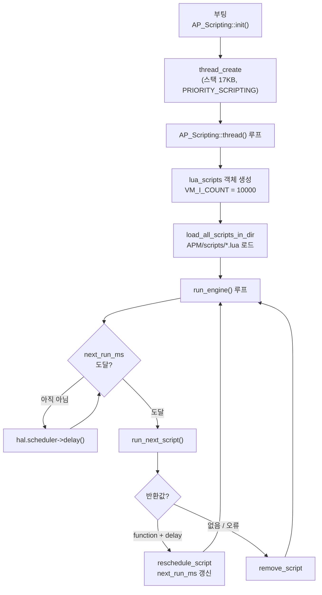
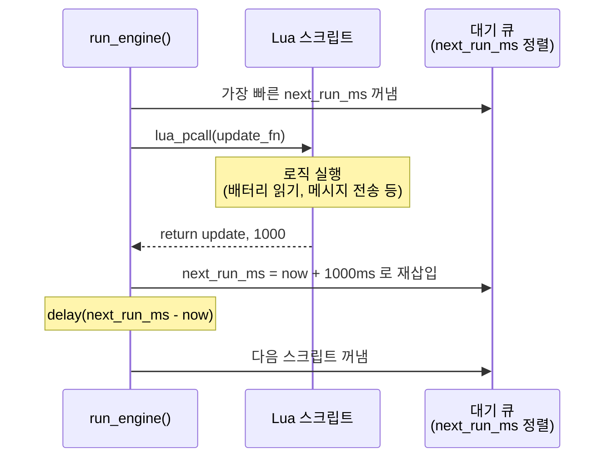

# CH33. Lua 스크립팅

::: info 학습 목표
- Lua 스크립팅이 펌웨어 재컴파일 없이 동작을 확장할 수 있는 이유를 VM 샌드박스 측면에서 설명할 수 있다.
- AP_Scripting::thread()가 전용 스레드를 생성하는 방식과 스택 크기·우선순위 설정을 코드로 확인할 수 있다.
- lua_scripts의 스크립트 로딩, next_run_ms 기반 재스케줄 구조를 이해한다.
- VM_I_COUNT 제한과 `Exceeded CPU time` 에러 발생 경로를 추적할 수 있다.
- bindings.desc → lua_generated_bindings.cpp 자동 생성 원리를 이해한다.
- `return update, 1000` 패턴이 재스케줄로 이어지는 과정을 설명할 수 있다.
:::

## 1. Lua 스크립팅이란

### 개념

ArduPilot의 Lua 스크립팅은 SD카드의 `APM/scripts/*.lua` 파일을 부팅 시 자동으로 로드해 실행하는 기능이다. 펌웨어 소스를 건드리지 않고 다음과 같은 확장이 가능하다.

- 배터리 SOC(충전 상태) 커스텀 추정
- 특정 고도·위치 도달 시 카메라 트리거
- MAVLink 메시지 가로채기와 재가공
- 커스텀 비행 패턴 (나선, 격자 탐색)
- 파라미터 값 자동 조정

핵심 제약은 두 가지다. 첫째, Lua VM은 ArduPilot이 화이트리스트로 허용한 API만 호출할 수 있다(sandbox). 둘째, 한 번의 스케줄 실행에서 쓸 수 있는 VM 인스트럭션 수가 제한된다. 이 두 제약 덕분에 스크립트 버그가 펌웨어 전체를 멈출 수 없다.

### 실행 모델 개요



## 2. 전용 스레드 생성

### SCRIPTING_STACK_SIZE

스크립팅 스레드의 스택 크기는 컴파일 타임에 결정된다.

```cpp
#define SCRIPTING_STACK_SIZE (17 * 1024) // Linux experiences stack corruption
                                          // at ~16.25KB when handed bad scripts
```
`(libraries/AP_Scripting/AP_Scripting.cpp:35)`

17KB는 Lua VM 자체 스택과 ArduPilot 바인딩 호출 깊이를 모두 감당할 수 있는 최솟값이다. 상수 범위 검사도 컴파일 타임에 이뤄진다:

```cpp
static_assert(SCRIPTING_STACK_SIZE >= SCRIPTING_STACK_MIN_SIZE, ...);
static_assert(SCRIPTING_STACK_SIZE <= SCRIPTING_STACK_MAX_SIZE, ...);
```
`(libraries/AP_Scripting/AP_Scripting.cpp:52)`

### VM_I_COUNT 파라미터

VM 인스트럭션 제한은 파라미터로 노출된다.

```cpp
AP_GROUPINFO("VM_I_COUNT", 2, AP_Scripting, _script_vm_exec_count, 10000),
```
`(libraries/AP_Scripting/AP_Scripting.cpp:80)`

기본값 10000이다. GCS에서 `SCR_VM_I_COUNT` 파라미터로 조정 가능하다.

### thread_create 호출

```cpp
if (!hal.scheduler->thread_create(
        FUNCTOR_BIND_MEMBER(&AP_Scripting::thread, void),
        "Scripting", SCRIPTING_STACK_SIZE, priority, 0)) {
    GCS_SEND_TEXT(MAV_SEVERITY_ERROR, "Scripting: %s", "failed to start");
    _thread_failed = true;
}
```
`(libraries/AP_Scripting/AP_Scripting.cpp:257)`

우선순위는 `SCR_THD_PRIORITY` 파라미터로 설정하며, 기본값은 `PRIORITY_SCRIPTING`(가장 낮은 실시간 우선순위)다. 스크립팅이 비행 제어 루프를 방해하지 않도록 의도적으로 낮게 설정한다.

### thread() 루프

```cpp
void AP_Scripting::thread(void) {
    while (true) {
        _stop = false;
        _restart = false;
        _init_failed = false;

        lua_scripts *lua = NEW_NOTHROW lua_scripts(
                _script_vm_exec_count, _script_heap_size, _debug_options);
        ...
        lua->run();  // 스크립팅이 살아있는 동안 반환하지 않음

        GCS_SEND_TEXT(MAV_SEVERITY_CRITICAL, "Scripting: %s", "stopped");
        ...
    }
}
```
`(libraries/AP_Scripting/AP_Scripting.cpp:297)`

`lua->run()`은 스크립팅이 멈출 때까지(오류, 재시작 명령) 반환하지 않는다. 재시작 시 while 루프가 새 `lua_scripts` 객체를 생성해 다시 시작한다.

## 3. 스크립트 로딩

### load_all_scripts_in_dir

```cpp
void lua_scripts::load_all_scripts_in_dir(lua_State *L, const char *dirname) {
    auto *d = AP::FS().opendir(dirname);
    ...
    for (struct dirent *de = AP::FS().readdir(d); de; de = AP::FS().readdir(d)) {
        ...
        if ((de->d_name[0] == '.') ||
            strncmp(&de->d_name[length-4], ".lua", 4)) {
            continue;  // .로 시작하거나 .lua 아닌 파일 건너뜀
        }
        ...
        bool success = load_script(L, script);
    }
}
```
`(libraries/AP_Scripting/lua_scripts.cpp:246)`

`APM/scripts/` 디렉터리의 `.lua` 파일을 모두 로드한다. 로드에 성공하면 `reschedule_script()`를 호출해 `next_run_ms = AP_HAL::millis64() - 1`로 즉시 실행 대기 상태로 만든다:

```cpp
new_script->next_run_ms = AP_HAL::millis64() - 1; // force the script to be stale
```
`(libraries/AP_Scripting/lua_scripts.cpp:200)`

### luaL_loadfile

```cpp
bool lua_scripts::load_script(lua_State *L, script_info *new_script) {
    ...
    if (int error = luaL_loadfile(L, filename)) {
        ...
    }
    ...
}
```
`(libraries/AP_Scripting/lua_scripts.cpp:162)`

`luaL_loadfile`이 Lua 파일을 파싱해 바이트코드로 컴파일한다. 실패하면 오류 메시지를 GCS로 전송하고 해당 스크립트만 제거한다. 나머지 스크립트는 계속 실행된다.

## 4. VM 안전장치

### 인스트럭션 카운트 훅

Lua VM의 `lua_sethook`으로 N개 인스트럭션마다 콜백을 설정한다.

```cpp
void lua_scripts::reset_loop_overtime(lua_State *L) {
    ...
    lua_sethook(L, hook, LUA_MASKCOUNT, vm_steps);
}
```
`(libraries/AP_Scripting/lua_scripts.cpp:316)`

`vm_steps`가 `VM_I_COUNT` 파라미터값(기본 10000)이다. 스크립트가 이 수만큼 인스트럭션을 실행하면 `hook`이 호출된다.

```cpp
void lua_scripts::hook(lua_State *L, lua_Debug *ar) {
    lua_scripts::overtime = true;
    // 초과 시 1 인스트럭션마다 훅 호출로 빠르게 탈출
    lua_sethook(L, hook, LUA_MASKCOUNT, 1);
    luaL_error(L, "Exceeded CPU time");
}
```
`(libraries/AP_Scripting/lua_scripts.cpp:63)`

`luaL_error`가 Lua 오류를 던지면 `lua_pcall`이 잡아서 처리한다. 스크립트가 제거되고 다른 스크립트는 영향을 받지 않는다.

### 샌드박스

`create_sandbox()`가 Lua 표준 라이브러리 중 `math`, `table`, `string`과 ArduPilot 바인딩만 허용한다. `io`, `os`, `package` 등 파일시스템·프로세스 접근 라이브러리는 차단된다.

## 5. 재스케줄 메커니즘

### run_next_script

```cpp
void lua_scripts::run_next_script(lua_State *L) {
    ...
    if (lua_pcall(L, 0, LUA_MULTRET, 0)) {
        if (overtime) {
            set_and_print_new_error_message(..., "%s exceeded time limit", ...);
        }
        remove_script(L, script);
        return;
    } else {
        int returned = lua_gettop(L) - stack_top;
        switch (returned) {
            case 0:
                remove_script(L, script);  // 반환값 없음 → 종료
                break;
            case 2:
                // function + delay_ms 반환 → 재스케줄
                script->next_run_ms = start_time_ms +
                        (uint64_t)luaL_checknumber(L, -1);
                ...
                reschedule_script(script);
                break;
        }
    }
}
```
`(libraries/AP_Scripting/lua_scripts.cpp:323)`

반환값이 `(function, delay_ms)` 쌍이면 `next_run_ms`를 갱신하고 `reschedule_script()`로 대기 큐에 재삽입한다. 반환값이 없으면 스크립트가 자연 종료된다.

### 재스케줄 sequenceDiagram



### Lua 스크립트 패턴

모든 ArduPilot Lua 스크립트는 같은 패턴을 따른다.

```lua
-- 초기화 코드 (스크립트 로드 시 한 번)
local MAV_SEVERITY = {INFO=6, WARNING=4}

local function update()
    -- 매 호출마다 실행
    local batt_voltage = battery:voltage(0)
    if batt_voltage < 3.5 then
        gcs:send_text(MAV_SEVERITY.WARNING, "Low battery!")
    end
    return update, 1000  -- 1000ms 후 재실행
end

return update, 1000  -- 최초 등록
```

`return update, 1000`이 핵심이다. 함수 참조와 다음 실행까지의 지연(ms)을 반환한다. `run_next_script`가 이 쌍을 받아 `next_run_ms`를 계산하고 큐에 재삽입한다.

## 6. 바인딩 생성기

### bindings.desc → C++ 코드

ArduPilot API를 Lua에서 호출할 수 있게 하는 바인딩은 수작업으로 쓰지 않는다. `libraries/AP_Scripting/generator/description/bindings.desc` 파일에 선언적으로 정의하면, 빌드 시 `gen/` 스크립트가 `lua_generated_bindings.cpp`를 자동 생성한다.

```
# GCS singleton 선언
singleton GCS rename gcs
singleton GCS method send_text void MAV_SEVERITY'enum ... string

# vehicle singleton
singleton AP_Vehicle rename vehicle

# param singleton
singleton AP_Param rename param
singleton AP_Param method get float string
```
`(libraries/AP_Scripting/generator/description/bindings.desc:313,349,504)`

`singleton` 키워드는 전역 싱글턴 객체를 Lua에 노출한다. `userdata`는 객체 타입을 정의하고, `method`는 해당 객체의 메서드를 바인딩한다.

결과로 생성된 코드에서 Lua 스크립트는 다음 API를 사용할 수 있다.

```lua
gcs:send_text(6, "Hello from Lua!")
vehicle:set_mode(4)          -- GUIDED 모드
local v = param:get("WPNAV_SPEED")
local loc = ahrs:get_location()
```

## 7. 실제 Applet 예제

### BattEstimate.lua

`libraries/AP_Scripting/applets/BattEstimate.lua`는 전압 기반 배터리 SOC 추정기다. 표준 배터리 모니터를 Lua로 대체할 수 있음을 보여준다.

```lua
local MAV_SEVERITY = {EMERGENCY=0, ..., INFO=6, DEBUG=7}
local PARAM_TABLE_KEY = 14
local PARAM_TABLE_PREFIX = "BATT_SOC"

function bind_param(name)
   local p = Parameter()
   assert(p:init(name), ...)
   return p
end

assert(param:add_table(PARAM_TABLE_KEY, PARAM_TABLE_PREFIX, 32), ...)
local BATT_SOC_COUNT = bind_add_param('_COUNT', 1, 0)

if BATT_SOC_COUNT:get() <= 0 then
   return  -- 반환값 없음 → 스크립트 종료
end
```
`(libraries/AP_Scripting/applets/BattEstimate.lua:1)`

파라미터 테이블을 동적으로 추가하고, 파라미터 값에 따라 스크립트를 조건부로 활성화하는 패턴이다. `return update, 1000`으로 이어지면 1초마다 SOC를 재계산한다.

::: tip 핵심 정리
- Lua 스크립팅은 SD카드 `APM/scripts/*.lua`를 부팅 시 자동 로드한다. 펌웨어 재컴파일 없이 동작 확장이 가능하다.
- 전용 스레드(스택 17KB, 최저 우선순위)에서 실행된다. 비행 제어 루프를 방해하지 않는다.
- VM_I_COUNT(기본 10000) 인스트럭션 초과 시 `Exceeded CPU time` 오류로 해당 스크립트만 제거된다.
- 스크립트가 `(function, delay_ms)`를 반환하면 `next_run_ms`를 갱신해 재스케줄한다. 반환값이 없으면 종료된다.
- `bindings.desc` 파일이 `lua_generated_bindings.cpp`로 자동 컴파일되어 `gcs:send_text()`, `vehicle:set_mode()`, `param:get()` 등을 제공한다.
:::

## 다음 챕터

다음 챕터에서는 지금까지 배운 센서, EKF, 제어, 모터, SITL, 스크립팅이 실제 한 루프(2.5ms)에서 어떻게 협력하는지 전체 비행 흐름을 코드로 통합한다.

[CH34. 전체 비행 흐름 통합](/study/ardupilot/34-integration)
