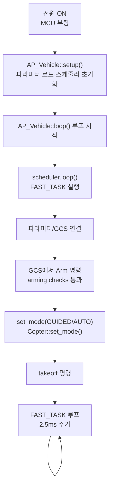
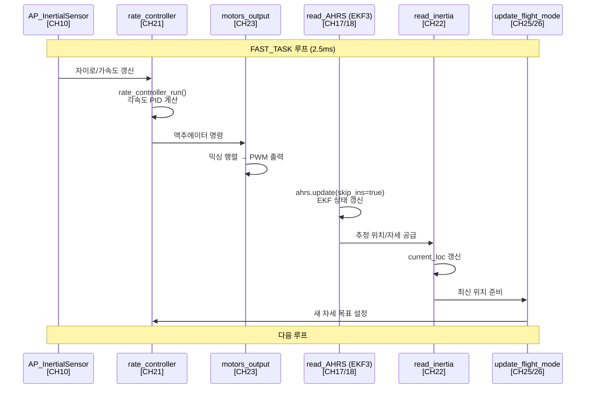
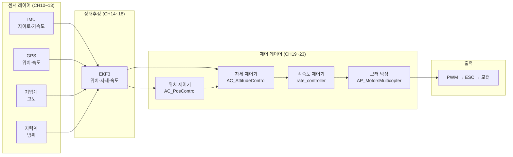
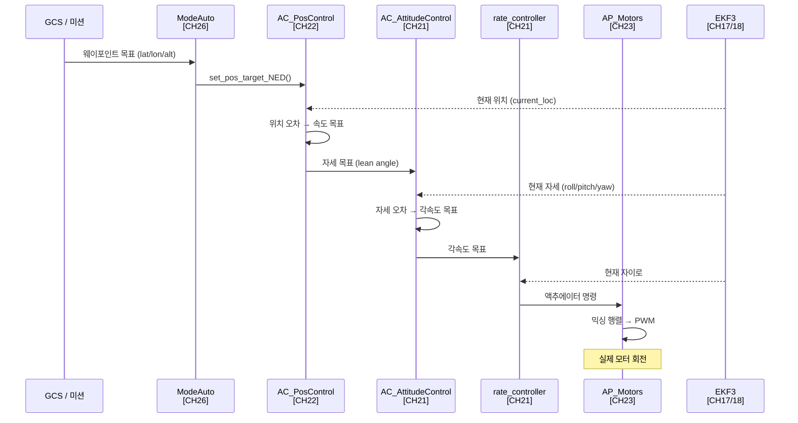

# CH34. 전체 비행 흐름 통합

::: info 학습 목표
- `setup()` → `loop()` → `scheduler.loop()` 진입 경로를 소스로 추적할 수 있다.
- FAST_TASK 순서(INS → rate_controller → motors_output → read_AHRS → read_inertia → update_flight_mode)가 왜 이 순서인지 설명할 수 있다.
- 센서 데이터가 IMU → EKF → 위치제어 → 자세제어 → 모터까지 흐르는 전체 경로를 각 챕터와 연결해 설명할 수 있다.
- 이륙 시나리오(arming → 모드 전환 → takeoff → 웨이포인트)의 코드 레벨 흐름을 이해한다.
:::

## 1. 진입 경로

### setup() — 차량 초기화

ArduPilot은 C++ Arduino 스타일 구조를 따른다. MCU 부팅 후 `setup()`이 한 번 호출되고, 이후 `loop()`가 반복 실행된다. `AP_Vehicle::setup()`이 모든 하위 시스템을 초기화한다.

```cpp
void AP_Vehicle::setup()
{
    // 파라미터 기본값 로드
    AP_Param::setup_sketch_defaults();

    // 스케줄러 초기화: 기체별 task 목록 등록
    get_scheduler_tasks(tasks, task_count, log_bit);
    AP::scheduler().init(tasks, task_count, log_bit);

    G_Dt = scheduler.get_loop_period_s();
    ...
}
```
`(libraries/AP_Vehicle/AP_Vehicle.cpp:308)`

`get_scheduler_tasks()`가 기체별(ArduCopter, ArduPlane …) task 목록을 반환한다. ArduCopter는 `Copter::scheduler_tasks[]` 배열을 반환한다.

### loop() — 메인 루프

```cpp
void AP_Vehicle::loop()
{
    scheduler.loop();
    G_Dt = scheduler.get_loop_period_s();
    ...
}
```
`(libraries/AP_Vehicle/AP_Vehicle.cpp:558)`

`loop()`는 그냥 `scheduler.loop()`를 감싼다. 스케줄러가 실제 task 실행을 담당한다. [CH7. 스케줄러](/study/ardupilot/07-scheduler)에서 다룬 `AP_Scheduler`가 여기 등장한다.

### 부팅~이륙 전체 흐름



## 2. FAST_TASK 실행 순서

### scheduler_tasks 배열

ArduCopter의 FAST_TASK는 매 스케줄러 루프(400Hz, 2.5ms)마다 순서대로 실행된다.

```cpp
const AP_Scheduler::Task Copter::scheduler_tasks[] = {
    // 1. IMU 업데이트 — 자이로/가속도 최신 데이터 확보
    FAST_TASK_CLASS(AP_InertialSensor, &copter.ins, update),

    // 2. rate controller — IMU 데이터로 각속도 PID
    FAST_TASK(run_rate_controller_main),

    // 3. 모터 출력 — rate controller 결과를 PWM으로
    FAST_TASK(motors_output_main),

    // 4. EKF 업데이트 — 비싼 상태추정 (INS skip 플래그)
    FAST_TASK(read_AHRS),

    // 5. 위치 추정 — AHRS에서 lat/lon/alt 뽑기
    FAST_TASK(read_inertia),

    // 6. EKF 리셋 확인
    FAST_TASK(check_ekf_reset),

    // 7. 비행 모드 실행 — 위치/자세 목표 계산
    FAST_TASK(update_flight_mode),
    ...
};
```
`(ArduCopter/Copter.cpp:113)`

순서가 왜 중요한지 이해해야 한다. 각 단계는 이전 단계의 결과를 입력으로 쓴다.

**1 → 2**: rate controller는 최신 IMU 자이로 데이터가 필요하다. INS update가 먼저다.

**2 → 3**: motors_output은 rate controller가 계산한 액추에이터 명령을 PWM으로 변환한다.

**4**: EKF는 비용이 크다. INS는 이미 1번에서 했으므로 `ahrs.update(true)`로 INS 재실행을 건너뛴다.

**5 → 7**: `update_flight_mode`(위치/자세 목표 계산)가 최신 위치(`current_loc`)를 쓰므로 `read_inertia`가 먼저다.

### 각 함수 본체

**run_rate_controller_main** — rate PID 실행:

```cpp
void Copter::run_rate_controller_main()
{
    pos_control->set_dt_s(last_loop_time_s);
    attitude_control->set_dt_s(last_loop_time_s);

    if (!using_rate_thread) {
        attitude_control->rate_controller_run();
    }
    attitude_control->rate_controller_target_reset();
}
```
`(ArduCopter/Attitude.cpp:10)`

[CH21. 자세 제어](/study/ardupilot/21-attitude-control)에서 다룬 `AC_AttitudeControl::rate_controller_run()`이 여기 호출된다.

**motors_output_main** — PWM 출력:

```cpp
void Copter::motors_output_main()
{
    if (!using_rate_thread) {
        motors_output();
    }
}
```
`(ArduCopter/motors.cpp:122)`

[CH23. 모터 믹싱](/study/ardupilot/23-motor-mixing)에서 다룬 믹싱 행렬 계산과 PWM 스케일링이 `motors_output()` 안에서 이뤄진다.

**read_AHRS** — EKF 상태 추정:

```cpp
void Copter::read_AHRS(void)
{
    // we tell AHRS to skip INS update as we have already done it in FAST_TASK.
    ahrs.update(true);
}
```
`(ArduCopter/Copter.cpp:916)`

`true` 플래그가 INS 재실행을 막는다. [CH17. EKF3 구조](/study/ardupilot/17-ekf3-structure), [CH18. EKF3 동작](/study/ardupilot/18-ekf3-operation)에서 다룬 EKF가 여기서 갱신된다.

**read_inertia** — 위치 추정:

```cpp
void Copter::read_inertia()
{
    pos_control->update_estimates(vibration_check.high_vibes);

    Location loc;
    UNUSED_RESULT(ahrs.get_location(loc));
    current_loc.lat = loc.lat;
    current_loc.lng = loc.lng;

    float pos_d_m;
    if (!AP::ahrs().get_relative_position_D_origin_float(pos_d_m)) {
        return;
    }
    current_loc.set_alt_m(alt_above_origin_m, Location::AltFrame::ABOVE_ORIGIN);
    ...
}
```
`(ArduCopter/inertia.cpp:4)`

AHRS(EKF3)에서 현재 위치를 읽어 `current_loc`를 갱신한다. [CH22. 위치·항법](/study/ardupilot/22-position-nav)에서 다룬 위치 제어기가 이 데이터를 쓴다.

**update_flight_mode** — 자세 목표 계산:

```cpp
void Copter::update_flight_mode()
{
    attitude_control->landed_gain_reduction(copter.ap.land_complete);
    pos_control->set_reset_handling_method(...);
    flightmode->run();  // 현재 비행 모드 run()
}
```
`(ArduCopter/mode.cpp:497)`

`flightmode->run()`이 현재 비행 모드(STABILIZE, LOITER, AUTO 등)를 실행한다. 모드는 EKF 위치·자세를 입력으로 받아 자세 목표를 계산하고 `attitude_control`에 설정한다.

### 한 루프 내 FAST_TASK 협력



## 3. 전체 시스템 데이터 흐름

### 센서에서 모터까지



각 블록이 어느 챕터였는지:

| 블록 | 챕터 |
|------|------|
| IMU | [CH10. IMU](/study/ardupilot/10-imu) |
| GPS | [CH12. GPS](/study/ardupilot/12-gps) |
| 기압계·자력계 | [CH13. 기압계·자력계·거리 센서](/study/ardupilot/13-baro-compass-rangefinder) |
| EKF3 | [CH17. EKF3 구조](/study/ardupilot/17-ekf3-structure), [CH18. EKF3 동작](/study/ardupilot/18-ekf3-operation) |
| 위치 제어기 | [CH22. 위치·항법](/study/ardupilot/22-position-nav) |
| 자세 제어기 | [CH21. 자세 제어](/study/ardupilot/21-attitude-control) |
| 모터 믹싱 | [CH23. 모터 믹싱](/study/ardupilot/23-motor-mixing) |
| 스케줄러 | [CH7. 스케줄러](/study/ardupilot/07-scheduler) |

## 4. 이륙 시나리오 한 바퀴

### Arming

[CH30. Arming과 Failsafe](/study/ardupilot/30-arming-failsafe)에서 다룬 arming check가 이 시점에 실행된다. EKF 상태, 배터리 전압, RC 신호, 지자기 등 다수의 조건이 통과해야 arming이 허용된다. arming이 완료되면 `motors->armed()` 플래그가 `true`가 된다.

### 모드 전환

```cpp
bool Copter::set_mode(Mode::Number mode, ModeReason reason)
{
    ...
    Mode *new_flightmode = mode_from_mode_num(mode);
    bool ignore_checks = !motors->armed(); // 비암밍 상태에서는 체크 생략
    ...
    if (!new_flightmode->init(ignore_checks)) {
        mode_change_failed(new_flightmode, "init failed");
        return false;
    }
    flightmode = new_flightmode;
    ...
}
```
`(ArduCopter/mode.cpp:313)`

`new_flightmode->init()`가 실패하면 모드 전환이 거부된다. AUTO 모드는 `init()`에서 저장된 미션 명령이 있는지 확인한다([CH26. 자동 비행과 미션](/study/ardupilot/26-auto-mission)).

### Takeoff 시퀀스

GUIDED 모드에서 `takeoff` 명령이 오면:

1. `ModeGuided`가 takeoff SubMode로 전환
2. `update_flight_mode()` → `flightmode->run()` → `ModeGuided::run()` → `takeoff_run()` 호출
3. `takeoff_run()`이 목표 고도를 위치 제어기에 설정
4. 위치 제어기가 목표 고도 도달을 위한 스로틀 목표 계산
5. 자세 제어기가 스로틀 목표를 자세 명령으로 변환
6. rate controller → 믹싱 → PWM → 모터 실제 출력

AUTO 미션에서는 [CH26. 자동 비행과 미션](/study/ardupilot/26-auto-mission)에서 다룬 `_AutoTakeoff` 서브모드가 이 과정을 담당한다.

### 웨이포인트 비행 데이터 흐름



## 5. 더 공부할 방향

### SITL로 직접 빌드

[CH32. SITL 시뮬레이션](/study/ardupilot/32-sitl)에서 다룬 방법으로 빌드하고, 실제로 미션을 짜서 날려본다. 로그를 `mavlogdump.py`로 분석하면 EKF 상태, PID 출력, 모터 PWM을 타임스탬프로 볼 수 있다.

```bash
# SITL 빌드 + 실행
./waf configure --board sitl
./waf copter
Tools/autotest/sim_vehicle.py -v ArduCopter --console --map

# MAVProxy에서 AUTO 미션 실행
# wp load mission.txt
# mode auto
# arm throttle
```

### 코드 읽기 팁

1. **진입점 찾기**: `Copter::scheduler_tasks[]`가 모든 기능의 진입점 목록이다. 궁금한 동작이 있으면 여기서 시작한다.
2. **단방향 추적**: 데이터는 항상 센서 → EKF → 제어 → 모터 방향으로 흐른다. 역방향 참조는 거의 없다.
3. **HAL 경계**: `hal.`로 시작하는 호출이 하드웨어 경계다. SITL에서는 이 경계가 `libraries/AP_HAL_SITL/`로 교체된다.
4. **파라미터 추적**: `AP_GROUPINFO("WPNAV_SPEED", ...)` 패턴을 grep하면 파라미터가 실제 어느 변수에 묶이는지 바로 찾는다.
5. **Lua로 가볍게 실험**: [CH33. Lua 스크립팅](/study/ardupilot/33-scripting)으로 파라미터 읽기, 센서값 출력, 간단한 비행 패턴을 펌웨어 재컴파일 없이 실험할 수 있다.

::: tip 핵심 정리
- 진입 경로: `setup()` → `AP_Param·스케줄러 초기화` → `loop()` → `scheduler.loop()` → FAST_TASK.
- FAST_TASK 순서: INS update → run_rate_controller_main → motors_output_main → read_AHRS(EKF) → read_inertia(위치) → update_flight_mode(자세 목표). 각 단계가 이전 단계의 결과에 의존한다.
- 데이터는 IMU/GPS/기압계 → EKF3 → 위치제어 → 자세제어 → rate controller → 모터 믹싱 → PWM 방향으로 흐른다.
- 이륙 시나리오: arming(체크 통과) → set_mode(init() 호출) → takeoff(위치 제어기 목표 설정) → 웨이포인트(FAST_TASK 루프 반복).
- 코드 추적 시작점은 `Copter::scheduler_tasks[]` 배열이다.
:::

## 다음 챕터

스터디의 전체 내용을 정리한 용어집과 참고 자료가 이어진다.

[부록. 용어집](/study/ardupilot/appendix-glossary)
