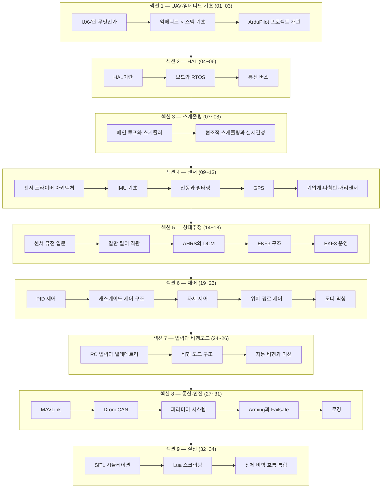
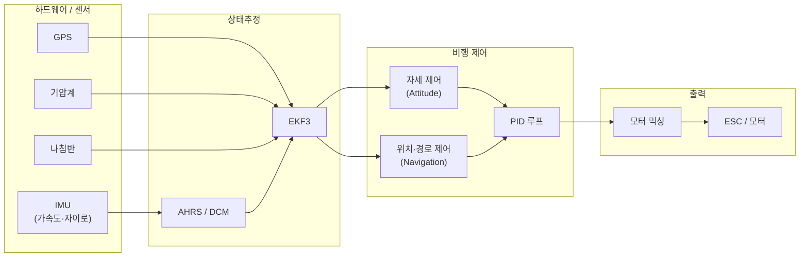

# ArduPilot로 배우는 UAV 임베디드 시스템

<strong>ArduPilot</strong>은 2010년부터 개발된 오픈소스 오토파일럿 소프트웨어다. 멀티콥터·고정익·로버·보트·잠수정 등 거의 모든 무인이동체를 제어할 수 있으며, C++ 약 1,600개 cpp 파일과 154개 라이브러리로 구성된 대규모 실전 임베디드 프로젝트다.

이 스터디는 **"UAV·임베디드를 모르는 사람도 이해하면서 실제 코드 레벨까지 파고드는"** 것을 목표로 한다. HAL(하드웨어 추상화 계층)부터 센서 드라이버, EKF 상태추정, PID 제어, MAVLink 통신까지 — 개념과 ArduPilot 실제 소스(파일:라인)를 함께 제시해 "왜 이렇게 구현했는가"까지 납득할 수 있도록 구성한다.

이 스터디에서 배우는 것:

- **UAV·임베디드 기초** — 비행 원리, RTOS, HAL 설계 철학
- **센서 드라이버 아키텍처** — IMU·GPS·기압계·나침반의 실제 드라이버 구조
- **상태추정** — 칼만 필터 직관부터 EKF3 코드 레벨까지
- **비행제어** — PID, 캐스케이드 제어, 자세·위치 제어 루프
- **비행모드와 미션** — Stabilize·Loiter·Auto 모드의 실제 전환 로직
- **통신과 안전** — MAVLink, DroneCAN, Failsafe, 파라미터 시스템
- **실전** — SITL 시뮬레이션, Lua 스크립팅, 전체 비행 흐름 통합

## 대상 독자 / 학습 방식

이 스터디는 다음 독자를 대상으로 한다:

- C/C++ 기초 문법은 알지만 임베디드·드론은 처음인 개발자
- 드론을 날려봤지만 내부 동작 원리가 궁금한 엔지니어
- 오픈소스 비행제어 소프트웨어를 커스터마이징하거나 기여하려는 개발자

각 챕터는 **개념 설명 → ArduPilot 소스 인용(파일명:라인) → 핵심 흐름 정리** 순서로 진행한다. 모든 코드 인용은 ArduPilot GitHub 레포지토리(`ArduPilot/ardupilot`) 실제 소스를 근거로 한다. 하드웨어 없이도 SITL(소프트웨어 인 더 루프) 시뮬레이션으로 대부분의 내용을 실습할 수 있다.

## 학습 로드맵

## 전체 목차

### 섹션 1 — UAV·임베디드 기초 (01~03)

| 챕터 | 제목 | 한줄 설명 |
|------|------|-----------|
| 01 | [UAV란 무엇인가](/study/ardupilot/01-what-is-uav) | 드론의 분류, 비행 원리, 오토파일럿이 필요한 이유 |
| 02 | [임베디드 시스템 기초](/study/ardupilot/02-embedded-basics) | MCU·RTOS·실시간성 개념, ArduPilot이 동작하는 하드웨어 환경 |
| 03 | [ArduPilot 프로젝트 개관](/study/ardupilot/03-ardupilot-overview) | 레포지토리 구조, 빌드 시스템, 비히클별 진입점 |

### 섹션 2 — HAL: 하드웨어 추상화 계층 (04~06)

| 챕터 | 제목 | 한줄 설명 |
|------|------|-----------|
| 04 | [HAL이란](/study/ardupilot/04-hal) | AP_HAL 설계 원칙, 인터페이스 클래스 구조 |
| 05 | [보드와 RTOS](/study/ardupilot/05-board-rtos) | ChibiOS·Linux·SITL HAL, 스택·힙 구성 |
| 06 | [통신 버스](/study/ardupilot/06-comm-bus) | SPI·I2C·UART·CAN 드라이버 추상화 |

### 섹션 3 — 스케줄링 (07~08)

| 챕터 | 제목 | 한줄 설명 |
|------|------|-----------|
| 07 | [메인 루프와 스케줄러](/study/ardupilot/07-scheduler) | AP_Scheduler 구조, fast/slow loop 분리 |
| 08 | [협조적 스케줄링과 실시간성](/study/ardupilot/08-realtime-scheduling) | 태스크 우선순위, 슬립·오버런 처리 |

### 섹션 4 — 센서 (09~13)

| 챕터 | 제목 | 한줄 설명 |
|------|------|-----------|
| 09 | [센서 드라이버 아키텍처](/study/ardupilot/09-sensor-architecture) | AP_HAL 기반 드라이버 계층, 백엔드 패턴 |
| 10 | [IMU 기초](/study/ardupilot/10-imu) | AP_InertialSensor, 캘리브레이션, 멀티 IMU |
| 11 | [진동과 필터링](/study/ardupilot/11-vibration-filtering) | 진동이 비행에 미치는 영향, LPF·노치 필터 |
| 12 | [GPS](/study/ardupilot/12-gps) | AP_GPS 드라이버, RTK, GPS 블렌딩 |
| 13 | [기압계·나침반·거리센서](/study/ardupilot/13-baro-compass-rangefinder) | AP_Baro·AP_Compass·RangeFinder 드라이버 구조 |

### 섹션 5 — 상태추정 (14~18)

| 챕터 | 제목 | 한줄 설명 |
|------|------|-----------|
| 14 | [센서 퓨전 입문](/study/ardupilot/14-sensor-fusion-intro) | 다중 센서를 합치는 이유, AHRS 개요 |
| 15 | [칼만 필터 직관](/study/ardupilot/15-kalman-filter) | 예측·보정 단계, 공분산, 선형·비선형 확장 |
| 16 | [AHRS와 DCM](/study/ardupilot/16-ahrs-dcm) | DCM 알고리즘, 자세 표현, AP_AHRS 인터페이스 |
| 17 | [EKF3 구조](/study/ardupilot/17-ekf3-structure) | NavEKF3 클래스 구조, 상태 벡터, 공분산 행렬 |
| 18 | [EKF3 운영](/study/ardupilot/18-ekf3-operation) | 이노베이션 테스트, 레인 전환, 리셋 처리 |

### 섹션 6 — 제어 (19~23)

| 챕터 | 제목 | 한줄 설명 |
|------|------|-----------|
| 19 | [PID 제어](/study/ardupilot/19-pid) | AC_PID 구현, 적분 윈드업, 필터 |
| 20 | [캐스케이드 제어 구조](/study/ardupilot/20-cascade-control) | 외부 루프·내부 루프 분리, 대역폭 설계 |
| 21 | [자세 제어](/study/ardupilot/21-attitude-control) | AC_AttitudeControl, 쿼터니언 기반 오차 계산 |
| 22 | [위치·경로 제어](/study/ardupilot/22-position-nav) | AC_PosControl·AC_WPNav, 속도·가속도 제한 |
| 23 | [모터 믹싱](/study/ardupilot/23-motor-mixing) | AP_MotorsMulticopter, 믹싱 행렬, 출력 스케일링 |

### 섹션 7 — 입력과 비행모드 (24~26)

| 챕터 | 제목 | 한줄 설명 |
|------|------|-----------|
| 24 | [RC 입력과 텔레메트리](/study/ardupilot/24-rc-telemetry) | RC 수신기 프로토콜, MAVLink 텔레메트리 스트림 |
| 25 | [비행 모드 구조](/study/ardupilot/25-flight-modes) | FlightMode 클래스 계층, 모드 전환 로직 |
| 26 | [자동 비행과 미션](/study/ardupilot/26-auto-mission) | MissionItem, AP_Mission, AUTO 모드 실행 흐름 |

### 섹션 8 — 통신과 안전 (27~31)

| 챕터 | 제목 | 한줄 설명 |
|------|------|-----------|
| 27 | [MAVLink](/study/ardupilot/27-mavlink) | MAVLink 프로토콜, GCS_MAVLink 핸들러 구조 |
| 28 | [DroneCAN](/study/ardupilot/28-dronecan) | CAN 버스, DroneCAN 드라이버, 페리프 아키텍처 |
| 29 | [파라미터 시스템](/study/ardupilot/29-parameters) | AP_Param, EEPROM 저장, 파라미터 탐색 |
| 30 | [Arming과 Failsafe](/study/ardupilot/30-arming-failsafe) | 암밍 체크 목록, RC·GCS·배터리 Failsafe |
| 31 | [로깅](/study/ardupilot/31-logging) | AP_Logger, DataFlash 포맷, 로그 분석 |

### 섹션 9 — 실전 (32~34)

| 챕터 | 제목 | 한줄 설명 |
|------|------|-----------|
| 32 | [SITL 시뮬레이션](/study/ardupilot/32-sitl) | sim_vehicle.py, Gazebo 연동, HIL 구성 |
| 33 | [Lua 스크립팅](/study/ardupilot/33-scripting) | AP_Scripting, Lua 바인딩, 자율 행동 예제 |
| 34 | [전체 비행 흐름 통합](/study/ardupilot/34-integration) | 이륙부터 착륙까지 코드 레벨 전체 흐름 추적 |

### 부록

| | 제목 | 설명 |
|--|------|------|
| | [용어집](/study/ardupilot/appendix-glossary) | ArduPilot·UAV·임베디드 핵심 용어 정리 |
| | [참고 자료](/study/ardupilot/appendix-references) | ArduPilot 공식 문서·논문·심화 학습 링크 |

::: tip 시작하기
UAV와 임베디드 시스템이 처음이라면 CH1부터 순서대로 읽는다. 이미 기초가 있다면 관심 섹션으로 바로 건너뛰어도 된다. 각 챕터는 독립적으로 읽을 수 있도록 필요한 사전 지식을 챕터 앞에 명시한다.

[CH1. UAV란 무엇인가](/study/ardupilot/01-what-is-uav)
:::
