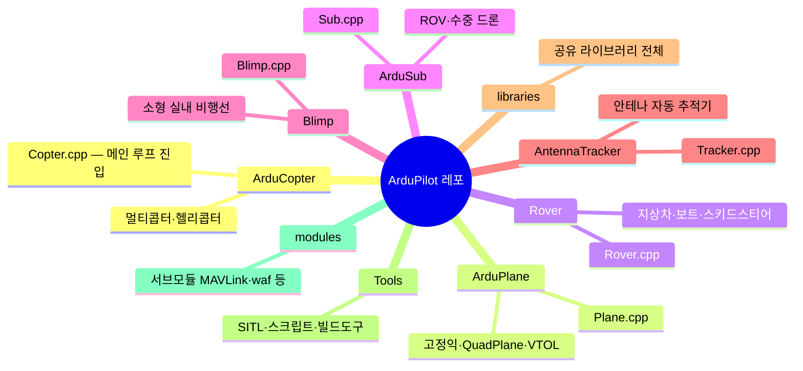

# 참고 자료

## 1. ArduPilot 공식 리소스

| 리소스 | URL | 설명 |
|--------|-----|------|
| GitHub 저장소 | [github.com/ArduPilot/ardupilot](https://github.com/ArduPilot/ardupilot) | 소스 코드 전체. 이슈·PR·릴리즈 태그 관리. |
| 개발자 위키 | [ardupilot.org/dev/](https://ardupilot.org/dev/) | 빌드 환경 설정, 아키텍처 문서, 기여 가이드. |
| 사용자 문서 | [ardupilot.org](https://ardupilot.org) | ArduCopter·ArduPlane·Rover 등 각 차량별 운용 매뉴얼. |
| 포럼 | [discuss.ardupilot.org](https://discuss.ardupilot.org) | 커뮤니티 Q&A. 개발 논의·버그 리포트. |
| Discord | [discord.com/channels/ardupilot](https://discord.com/channels/ardupilot) | 실시간 개발자 채팅. `#dev` 채널에서 빠른 답변 가능. |
| Autotest | [autotest.ardupilot.org](https://autotest.ardupilot.org) | SITL 기반 자동 회귀 테스트 결과 대시보드. |

::: tip GitHub 코드 탐색 팁
GitHub에서 `libraries/` 하위 라이브러리를 탐색할 때, 각 라이브러리 디렉토리에 있는 `README.md`나 헤더 파일(.h) 첫 주석이 가장 빠른 진입점이다. `Ctrl+T`(파일 검색)로 클래스명을 검색하면 정의로 바로 이동할 수 있다.
:::

## 2. 소스 코드 맵

### 차량 진입점



### 주요 라이브러리 역할

| 라이브러리 | 역할 | 다룬 챕터 |
|-----------|------|-----------|
| `AP_HAL` | 하드웨어 추상화 인터페이스(GPIO·SPI·I2C·UART·Timer). 플랫폼 독립적인 드라이버 API 정의. | [CH4](/study/ardupilot/04-hal) |
| `AP_HAL_ChibiOS` | ChibiOS(STM32) 타깃용 HAL 구현체. Pixhawk 계열 실제 하드웨어에서 동작. | [CH5](/study/ardupilot/05-board-rtos) |
| `AP_Scheduler` | 메인 루프 태스크 테이블 관리·실행. FAST_TASK 우선 처리, 루프 오버런 감지. | [CH7](/study/ardupilot/07-scheduler) |
| `AP_InertialSensor` | IMU(자이로+가속도계) 드라이버 추상화. FIFO 읽기, 노치필터, 다중 IMU 관리. | [CH10](/study/ardupilot/10-imu), [CH11](/study/ardupilot/11-vibration-filtering) |
| `AP_GPS` | GNSS 수신기 드라이버 추상화. u-blox·NMEA·DroneCAN GPS 지원, RTK 처리. | [CH12](/study/ardupilot/12-gps) |
| `AP_Baro` | 기압계 드라이버 추상화. 고도 추정, 온도 보상, 다중 기압계 failover. | [CH13](/study/ardupilot/13-baro-compass-rangefinder) |
| `AP_Compass` | 자기 나침반 드라이버 추상화. 캘리브레이션, 모터 간섭 보상, 다중 나침반 관리. | [CH13](/study/ardupilot/13-baro-compass-rangefinder) |
| `AP_AHRS` | 자세·기수 기준 시스템 인터페이스. EKF3/DCM 결과를 통합 API로 제공. | [CH16](/study/ardupilot/16-ahrs-dcm) |
| `AP_NavEKF3` | Extended Kalman Filter v3. GPS·IMU·나침반·기압계 퓨전, lane 다중화, GSF yaw 추정. | [CH17](/study/ardupilot/17-ekf3-structure), [CH18](/study/ardupilot/18-ekf3-operation) |
| `AC_PID` | 범용 PID 제어기. target/error/derivative 필터, 와인드업 방지(IMAX), SMAX slew rate 제한. | [CH19](/study/ardupilot/19-pid) |
| `AC_AttitudeControl` | roll·pitch·yaw 자세 제어 루프. 쿼터니언 오차 계산, 각속도 목표 생성. | [CH21](/study/ardupilot/21-attitude-control) |
| `AC_PosControl` | XY·Z 위치/속도 제어 루프. 가속도 목표 생성, 기울기 각도 제한. | [CH22](/study/ardupilot/22-position-nav) |
| `AC_WPNav` | 웨이포인트 항법. S-curve 속도 프로파일, 위치 오차 감지, loiter 제어. | [CH22](/study/ardupilot/22-position-nav) |
| `AP_Motors` | 모터 믹싱 행렬. thrust linearization, 멀티콥터 형상별 출력 계산. | [CH23](/study/ardupilot/23-motor-mixing) |
| `AP_RCProtocol` | RC 수신기 프로토콜 디코딩. PWM·SBUS·CRSF·IBUS 등 복수 프로토콜 자동 감지. | [CH24](/study/ardupilot/24-rc-telemetry) |
| `RC_Channel` | RC 채널 매핑·스케일링·데드존·오버라이드 관리. 조종사 입력을 제어 명령으로 변환. | [CH24](/study/ardupilot/24-rc-telemetry) |
| `AP_Mission` | 웨이포인트 미션 저장·실행. EEPROM/SD에 MAVLink 명령 저장, 순차 디스패치. | [CH26](/study/ardupilot/26-auto-mission) |
| `GCS_MAVLink` | MAVLink 메시지 인코딩·디코딩·라우팅. telemetry 스트리밍, 파라미터·미션 업로드. | [CH24](/study/ardupilot/24-rc-telemetry) |
| `AP_CANManager` | CAN 버스 드라이버 관리. 복수 CAN 포트, 프로토콜 플러그인(DroneCAN 등) 등록. | [CH6](/study/ardupilot/06-comm-bus) |
| `AP_DroneCAN` | DroneCAN(구 UAVCAN) 프로토콜 구현. 노드 검색, GPS·ESC·전력 모듈 연동. | [CH6](/study/ardupilot/06-comm-bus) |
| `AP_Param` | 런타임 파라미터 시스템. var_info 테이블로 GCS 노출, EEPROM 저장·복원. | [CH3](/study/ardupilot/03-ardupilot-overview) |
| `AP_Arming` | Arm/Disarm 조건 검사. GPS fix·자이로 캘리브레이션·안전 스위치 등 다수 체크. | [CH25](/study/ardupilot/25-flight-modes) |
| `AP_Logger` | 비행 데이터 로거. SD 카드 `.bin` 파일에 센서·제어 데이터를 고속 기록. | [CH3](/study/ardupilot/03-ardupilot-overview) |
| `AP_Scripting` | 내장 Lua 인터프리터. 재컴파일 없이 커스텀 비행 로직·주변장치 드라이버 작성 가능. | [CH26](/study/ardupilot/26-auto-mission) |
| `SITL` | Software In The Loop 시뮬레이터 백엔드. 물리 모델·센서 노이즈 시뮬레이션, UART/UDP 가상 포트 제공. | [CH3](/study/ardupilot/03-ardupilot-overview) |

## 3. 관련 표준 및 프로토콜

| 표준/프로토콜 | 공식 사이트 | 설명 |
|--------------|------------|------|
| MAVLink | [mavlink.io](https://mavlink.io) | 드론 통신 표준 프로토콜. XML 메시지 정의, 다중 다이얼렉트 지원(common·ardupilotmega). v2는 서명·확장 페이로드 추가. |
| DroneCAN | [dronecan.github.io](https://dronecan.github.io) | CAN 기반 드론 주변장치 통신 표준. UAVCAN v1 기반 재명명. 노드 ID 자동 할당(dynamic node ID). |
| NMEA 0183 | [nmea.org](https://www.nmea.org) | GPS 수신기 텍스트 출력 표준. `$GPGGA`, `$GPRMC` 문장으로 위치·속도·시각 전달. `AP_GPS` NMEA 드라이버가 파싱. |
| u-blox UBX | [u-blox.com](https://www.u-blox.com) | u-blox GPS 모듈 전용 이진 프로토콜. NMEA보다 고속·고정밀. `AP_GPS_UBLOX` 드라이버로 지원. |

## 4. 빌드 및 실습 명령 요약

### 환경 설치 (Ubuntu 22.04 기준)

```bash
# 의존 패키지 설치
Tools/environment_install/install-prereqs-ubuntu.sh -y
. ~/.profile

# Python 의존성
pip3 install empy==3.3.4 pexpect
```

### waf 빌드

```bash
# 처음 한 번: waf configure (보드 지정)
./waf configure --board Pixhawk4

# 빌드
./waf copter

# 결과물 위치
# build/Pixhawk4/bin/arducopter.apj
```

::: tip 자주 쓰는 보드 이름
`Pixhawk4`, `CubeOrange`, `MatekF405`, `sitl` (SITL 전용), `linux` (라즈베리파이 등 Linux SBC)
:::

### SITL 실행

```bash
# 기본 ArduCopter SITL (MAVProxy 자동 연결)
cd ArduCopter
../Tools/autotest/sim_vehicle.py -v ArduCopter --console --map

# 특정 프레임 지정 (쿼드콥터 기본값 = quad)
../Tools/autotest/sim_vehicle.py -v ArduCopter -f quad --console

# ArduPlane SITL
../Tools/autotest/sim_vehicle.py -v ArduPlane -f plane --console --map

# 파라미터 파일 로드
../Tools/autotest/sim_vehicle.py -v ArduCopter --add-param-file=my_params.parm
```

### Mission Planner / QGC 연결 (SITL)

SITL은 기본적으로 UDP 14550번 포트를 열어 GCS 연결을 기다린다. Mission Planner에서 `UDP > 14550`으로 연결하면 된다.

```bash
# MAVProxy에서 포트 포워딩 (다른 GCS 동시 연결)
output add 127.0.0.1:14551
```

## 5. 이 스터디 전체 목차

### 1부. 임베디드 기반

| 챕터 | 제목 |
|------|------|
| [CH1](/study/ardupilot/01-what-is-uav) | UAV란 무엇인가 |
| [CH2](/study/ardupilot/02-embedded-basics) | 임베디드 기초 |
| [CH3](/study/ardupilot/03-ardupilot-overview) | ArduPilot 개요 |
| [CH4](/study/ardupilot/04-hal) | HAL |
| [CH5](/study/ardupilot/05-board-rtos) | 보드와 RTOS |
| [CH6](/study/ardupilot/06-comm-bus) | 통신 버스 |

### 2부. 스케줄러

| 챕터 | 제목 |
|------|------|
| [CH7](/study/ardupilot/07-scheduler) | 메인 루프와 스케줄러 |
| [CH8](/study/ardupilot/08-realtime-scheduling) | 실시간 스케줄링 |

### 3부. 센서

| 챕터 | 제목 |
|------|------|
| [CH9](/study/ardupilot/09-sensor-architecture) | 센서 아키텍처 |
| [CH10](/study/ardupilot/10-imu) | IMU |
| [CH11](/study/ardupilot/11-vibration-filtering) | 진동과 필터링 |
| [CH12](/study/ardupilot/12-gps) | GPS |
| [CH13](/study/ardupilot/13-baro-compass-rangefinder) | 기압계·나침반·거리센서 |

### 4부. 상태 추정

| 챕터 | 제목 |
|------|------|
| [CH14](/study/ardupilot/14-sensor-fusion-intro) | 센서 퓨전 개론 |
| [CH15](/study/ardupilot/15-kalman-filter) | 칼만필터 |
| [CH16](/study/ardupilot/16-ahrs-dcm) | AHRS와 DCM |
| [CH17](/study/ardupilot/17-ekf3-structure) | EKF3 구조 |
| [CH18](/study/ardupilot/18-ekf3-operation) | EKF3 동작 |

### 5부. 제어

| 챕터 | 제목 |
|------|------|
| [CH19](/study/ardupilot/19-pid) | PID 제어 |
| [CH20](/study/ardupilot/20-cascade-control) | 캐스케이드 제어 |
| [CH21](/study/ardupilot/21-attitude-control) | 자세제어 |
| [CH22](/study/ardupilot/22-position-nav) | 위치·항법 |
| [CH23](/study/ardupilot/23-motor-mixing) | 모터 믹싱 |

### 6부. 통신·안전·자동 비행

| 챕터 | 제목 |
|------|------|
| [CH24](/study/ardupilot/24-rc-telemetry) | RC와 텔레메트리 |
| [CH25](/study/ardupilot/25-flight-modes) | 비행 모드 |
| [CH26](/study/ardupilot/26-auto-mission) | 자동 비행과 미션 |

### 부록

| 파일 | 제목 |
|------|------|
| [용어집](/study/ardupilot/appendix-glossary) | 핵심 용어 정리 |
| [참고 자료](/study/ardupilot/appendix-references) | 공식 리소스·소스 맵·표준 |

## 6. 더 깊이 공부할 주제

이 스터디가 다루지 않은 주제들이다. 관심 있는 영역을 선택해 심화 학습하라.

::: info 고정익 / 헬리콥터 제어
- **고정익 TECS(Total Energy Control System)**: 속도와 고도를 스로틀·피치로 동시 제어하는 ArduPlane 고유 알고리즘. `libraries/AP_TECS/` 참고.
- **L1 항법**: 고정익의 측면 경로 추종 알고리즘. `libraries/AP_L1_Control/` 참고.
- **전통 헬리콥터**: 스와시플레이트·테일로터 믹싱. `libraries/AC_AttitudeControl/AC_AttitudeControl_Heli.*` 참고.
:::

::: info 부트로더 / OTA 업데이트
- **AP_Bootloader**: `Tools/AP_Bootloader/`. 시리얼·DroneCAN·WiFi를 통한 OTA 펌웨어 업데이트 지원.
- **ChibiOS 부트로더 분리 빌드**: `--bootloader` waf 옵션으로 별도 빌드하며, 플래시 앞부분에 먼저 올린다.
:::

::: info AP_Periph 펌웨어
- DroneCAN 노드로 동작하는 독립 주변장치 펌웨어. GPS·나침반·전력 모듈·LED 등을 ArduPilot 없는 소형 보드에서 구동.
- `Tools/AP_Periph/` 와 `libraries/AP_Periph/` 참고.
- `./waf configure --board CUAV_GPS && ./waf AP_Periph` 형태로 빌드.
:::

::: info ROS2 연동 (AP_DDS)
- `libraries/AP_DDS/`: ArduPilot 내장 DDS 클라이언트. ROS2 토픽으로 자세·위치 데이터를 직접 퍼블리시.
- `AP_DDS_ENABLED` 빌드 플래그 필요. Micro-XRCE-DDS Agent를 PC 측에 실행 후 UDP로 연결.
- [ardupilot.org/dev/docs/ros2.html](https://ardupilot.org/dev/docs/ros2.html) 참고.
:::

::: info 커스텀 컨트롤러
- `libraries/AC_CustomControl/`: 기존 자세제어 루프를 완전히 대체하는 실험용 커스텀 컨트롤러 플러그인. 연구용 컨트롤러 알고리즘 적용에 활용.
- Lua 스크립팅(`AP_Scripting`)으로 경량 커스텀 로직을 재컴파일 없이 올릴 수도 있다.
:::

::: info 고급 항법
- **Precision Landing**: `libraries/AC_PrecLand/`. IR-Lock·Computer Vision 기반 정밀 착륙.
- **Avoidance**: `libraries/AC_Avoidance/`, `AP_Avoidance/`. 장애물 감지·회피.
- **Terrain Following**: `AP_Terrain/`. 지형 데이터베이스를 활용한 AGL(above ground level) 고도 유지.
:::
