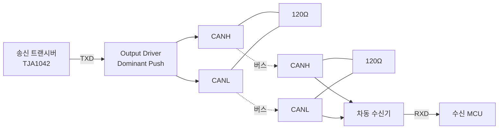
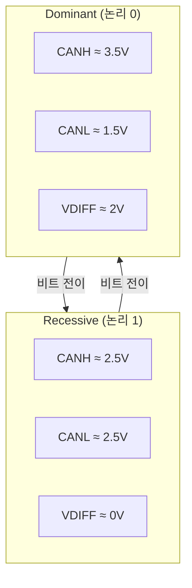

# CH1. 차동 신호와 버스 전기

::: info 학습 목표
- 단일 종단(single-ended)과 차동(differential) 신호의 차이를 전압·노이즈 관점에서 설명할 수 있다.
- HS-CAN의 CANH/CANL 전압 준위와 dominant/recessive의 전기적 의미를 이해한다.
- 120Ω 종단 저항을 양끝에 배치하는 이유를 반사파·임피던스 매칭 관점에서 설명할 수 있다.
- 스터브 길이 제한이 왜 필요한지, split termination과 CMC가 EMC에 어떻게 기여하는지 안다.
:::

## 1. 단일 종단 vs 차동 — 노이즈를 이기는 구조

UART나 SPI가 쓰는 <strong>단일 종단 신호</strong>는 "한 선의 전압"을 기준 그라운드(GND)와 비교해 0과 1을 구분한다. GND에 노이즈가 실리면 신호도 같이 흔들린다. 차량처럼 엔진·얼터네이터·점화 코일에서 수십 볼트짜리 과도 전압이 유도되는 환경에서는 이 방식이 한계를 맞는다.

<strong>차동 신호</strong>는 두 선(CANH, CANL)의 <strong>전압 차</strong>만 본다. 외부 노이즈가 두 선에 동일하게 실리면(common-mode noise) 차이는 0에 가깝게 유지되므로 수신기는 영향을 받지 않는다. 이 "공통 모드 제거 능력"을 수치로 나타낸 것이 <strong>CMRR(Common-Mode Rejection Ratio)</strong>이다. 고성능 차동 수신기는 80~100dB의 CMRR을 보장한다.

CAN이 차동 신호를 택한 이유는 단 하나, <strong>전자기 노이즈가 많은 환경에서 무선 모뎀 수준의 복잡한 필터 없이도 견디기 위해서</strong>다.

## 2. CANH/CANL 전압 준위 — HS-CAN과 LS-CAN

ISO 11898-2(HS-CAN, 최대 1Mbps) 기준 전압 준위는 다음과 같다.

| 상태 | CANH | CANL | VDIFF (CANH - CANL) |
|------|------|------|---------------------|
| Recessive | ≈ 2.5V | ≈ 2.5V | ≈ 0V |
| Dominant | ≈ 3.5V | ≈ 1.5V | ≈ 2V |

Recessive 상태에서는 CANH/CANL 모두 약 2.5V 근방의 <strong>bias 전압</strong>으로 떠 있다. 트랜시버 내부의 수동 분압·종단 저항에 의해 자연스럽게 고정된 중간 전위다. Dominant 상태에서는 트랜시버가 능동적으로 두 선을 밀어내 약 2V의 전압 차를 만든다.

ISO 11898-3(LS-CAN, Fault-Tolerant, 125kbps 이하)은 전압이 다르다. Recessive에서 CANH≈0V, CANL≈5V로 떨어져 있고, dominant에서 CANH≈3.6V, CANL≈1.4V로 모인다. 전압 폭이 크고 느리지만, 한 선이 끊어져도 나머지 한 선으로 동작을 지속하는 내결함성을 가진다.

## 3. Recessive/Dominant의 전기적 의미

CAN 버스는 <strong>wired-AND</strong> 구조다. 여러 노드가 동시에 송신하면, 한 노드라도 dominant(0)를 쏘는 순간 버스 전체가 dominant로 끌려간다. 이 특성이 중재(arbitration) 메커니즘의 근간이다.

트랜시버 출력단은 전통 CMOS의 push-pull이 아니라 <strong>open-collector/open-drain 유사 구조</strong>다. Dominant를 내보낼 때만 능동적으로 드라이브하고, recessive일 때는 선을 놓아 종단 저항과 bias가 중간 전위를 유지하도록 한다. 그래서 누군가 dominant를 쏘면 recessive 노드는 "진다". 충돌이 파괴적이지 않고, 낮은 ID가 자연스럽게 승리하는 버스 중재가 가능해진다.

## 4. 종단 저항 — 왜 120Ω 2개인가

종단 저항은 <strong>DC bias</strong>를 위한 것이 아니라 <strong>AC 임피던스 매칭</strong>을 위한 것이다.

트위스티드 페어 케이블의 <strong>특성 임피던스(characteristic impedance)</strong>는 약 120Ω이다. 신호는 파동이기 때문에, 케이블 끝에서 임피던스가 급격히 달라지면 반사파가 되돌아와 원래 신호와 간섭한다. 반사 계수는 다음 식으로 계산된다.

$$
\Gamma = \frac{Z_L - Z_0}{Z_L + Z_0}
$$

케이블 끝에 아무것도 없다면 $Z_L=\infty$이므로 $\Gamma=1$, 100% 반사된다. 양끝에 120Ω을 달면 $Z_L=Z_0$가 되어 $\Gamma=0$, 반사가 사라진다.

::: tip 흔한 실수
종단 저항 2개를 병렬로 보면 60Ω이다. 초심자는 "그럼 버스 중간 아무 데나 60Ω 하나만 달면 되는 것 아닌가?"라고 생각하지만, 그건 DC 저항만 맞추는 것이다. <strong>반사파는 케이블 양 끝에서 발생</strong>하므로 양끝에 각각 120Ω이 있어야 물리적으로 반사가 흡수된다.
:::

## 5. 스터브 — 곁가지가 반사를 부른다

<strong>스터브(stub)</strong>는 메인 버스에서 분기되어 노드까지 가는 짧은 선이다. 스터브도 전송선이므로, 스터브 끝(노드의 트랜시버 입력)이 고임피던스라면 여기서도 반사가 일어난다.

ISO 11898-2는 1Mbps 기준 스터브 길이를 <strong>0.3m 이하</strong>로 권장한다. 500kbps라면 여유가 좀 있고, 125kbps면 수 미터도 가능하다. 핵심은 <strong>신호의 rising edge가 스터브를 왕복하는 시간이 bit time보다 훨씬 짧아야</strong> 반사파가 다음 비트에 영향을 주지 않는다는 것이다.

스터브를 길게 빼면 파형에 <strong>ringing(울림)</strong>이 생긴다. 오실로스코프로 보면 dominant 진입부에 날카로운 오버슛과 진동이 있다가 settling되는 모습이 보인다. 이게 누적되면 수신기가 샘플 포인트에서 잘못된 레벨을 읽을 수 있다.

## 6. 접지·전원 노이즈 — Split Termination과 CMC

실전 차량 환경에서는 단순 120Ω 두 개만으로는 부족하다. <strong>Split termination</strong>은 종단을 60Ω + 60Ω으로 쪼개고, 가운데 점을 수~수십nF 커패시터로 GND에 흘려보내는 방식이다.

```
CANH ──[60Ω]──┬──[60Ω]── CANL
              │
              C (≈ 4.7nF)
              │
             GND
```

차동 신호 입장에서는 여전히 120Ω이지만, <strong>공통 모드 노이즈</strong>는 커패시터를 통해 GND로 빠져나간다. 고주파 EMC 성능이 눈에 띄게 좋아진다.

<strong>CMC(Common Mode Choke)</strong>는 CANH/CANL에 직렬로 삽입되는 이중 권선 인덕터다. 차동 신호는 서로 상쇄되는 자속이라 통과하고, 공통 모드 신호(양쪽 같은 방향)는 자속이 더해져 큰 임피던스를 만나 저지된다. 트랜시버 출력단에 CMC + Split termination 조합이 들어가면 자동차 EMC 시험(ISO 11452, CISPR 25)을 여유 있게 통과할 수 있다.

## 7. 트랜시버→버스→수신기 구조



양끝 120Ω이 있고, 트랜시버가 dominant에서만 능동 드라이브한다는 점이 핵심이다.

## 8. VDIFF 전압 준위 시각화



수신기의 <strong>판정 임계값</strong>은 보통 VDIFF 0.5V(recessive) / 0.9V(dominant) 언저리다. 이 사이에 들어간 값은 노이즈 여유 구간이다. 종단이 잘못되거나 EMC가 심하면 dominant 전압이 1V 이하로 떨어져 수신 에러가 생긴다.

## 9. 실무 실수 모음

::: warning 현장에서 자주 보는 종단·물리 실수
- <strong>종단 저항을 한쪽에만 설치</strong>: 반대편 끝에서 반사파가 생겨 ringing. Eye diagram이 크게 닫힌다.
- <strong>60Ω을 중간에 설치</strong>: DC로는 120Ω 두 개 병렬과 같아 보이지만 AC 반사는 전혀 막지 못한다.
- <strong>스터브 과다</strong>: 여러 노드를 분기로 길게 빼면 누적 반사로 파형이 심하게 망가진다. Hub-and-spoke 구조로 개선하거나 스터브를 더 짧게.
- <strong>Split termination 커패시터 누락</strong>: DC 성능은 같지만 공통 모드 노이즈 시험에서 실패.
- <strong>CANH/CANL 트위스트 해제</strong>: 커넥터 직전에 꼬임을 풀면 그 구간이 거대한 안테나처럼 동작한다.
:::

::: details 종단 저항 측정 팁
CAN 버스 전원을 내린 상태에서 CANH-CANL 사이 저항을 멀티미터로 재면 정상적으로 양끝 120Ω이 있을 때 60Ω이 측정된다. 120Ω이 나오면 종단 하나가 빠진 것이고, 40Ω 미만이면 누군가 추가 종단을 박아놨을 가능성이 있다. 이 측정 하나만으로 현장 트러블슈팅의 절반이 끝나기도 한다.
:::

## 다음 챕터

전기적 레벨을 이해했다면, 이제 이 파형을 <strong>실제로 측정하고 해석하는 법</strong>을 배워야 한다. 다음 챕터에서는 오실로스코프·로직 분석기·Eye Diagram으로 실제 CAN 비트를 관측한다.

다음: [CH2. 파형·계측](/study/can/02-waveform-measurement)

::: tip 핵심 정리
- CAN은 차동 신호로 공통 모드 노이즈를 제거한다. VDIFF만 보기 때문에 CMRR이 높다.
- HS-CAN의 recessive는 VDIFF≈0V(bias 2.5V), dominant는 VDIFF≈2V. Wired-AND로 중재가 성립한다.
- 120Ω은 케이블 특성 임피던스. 반사를 막기 위해 <strong>양끝에 각각</strong> 달아야 한다. 중간 하나는 틀린 설계다.
- 스터브는 짧게(≤0.3m@1Mbps). Split termination + CMC가 EMC 여유를 만든다.
:::
