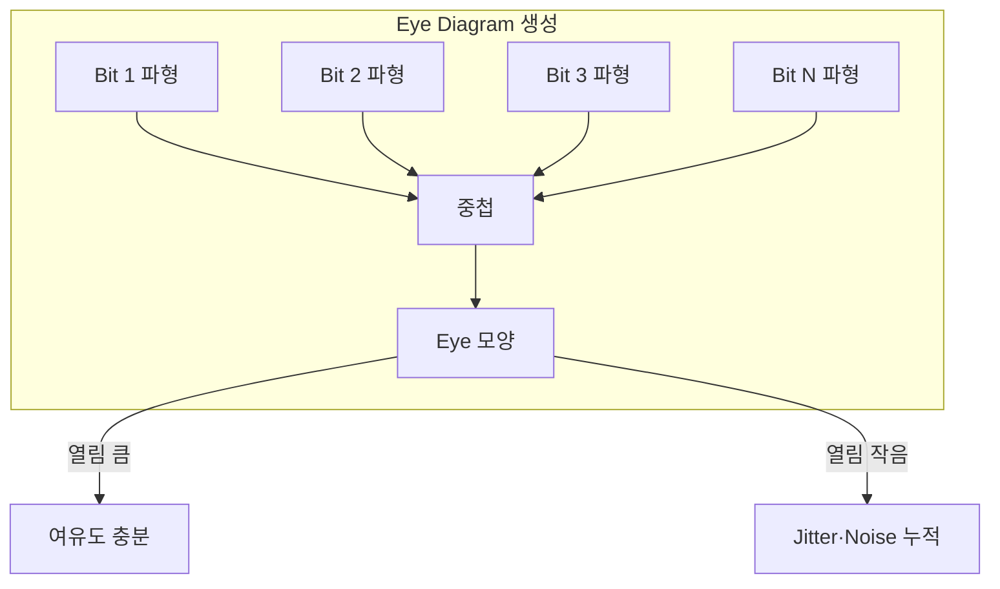
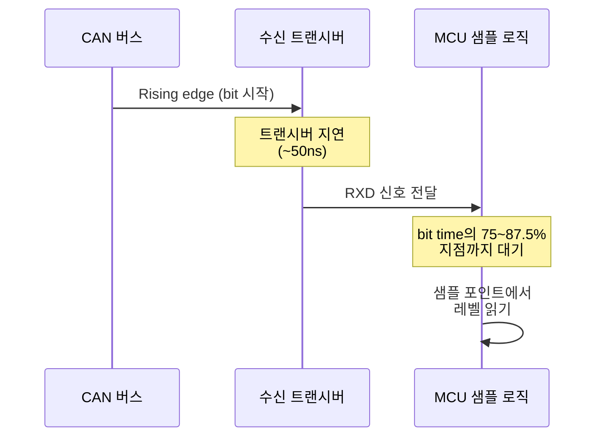

# CH2. 파형·계측

::: info 학습 목표
- CAN 파형 측정에 필요한 오실로스코프·로직 분석기 사양과 프로브 연결 방법을 안다.
- Bit time, 상승/하강 시간, 오버슛·링잉을 파형에서 읽어낼 수 있다.
- Eye Diagram이 무엇을 시각화하는지, "열림"의 의미를 설명할 수 있다.
- 샘플 포인트 위치가 파형 상 어디에 있어야 정상인지 판단할 수 있다.
:::

## 1. 왜 파형을 봐야 하는가

CAN 버스가 말썽을 부릴 때 로직 분석기만으로는 원인을 찾지 못하는 경우가 많다. 로직 분석기는 "비트가 0이냐 1이냐"만 본다. 반면 오실로스코프는 <strong>전압·시간 축의 실제 모습</strong>을 보여준다.

종단 저항이 빠졌을 때, 트랜시버가 죽어가고 있을 때, 케이블이 너무 길 때, EMC 환경이 나쁠 때 — 이런 문제는 모두 파형에 남는다. "에러 프레임이 뜬다"는 증상은 같아도 원인은 파형에서만 구별된다.

## 2. 측정 장비

### 2.1 오실로스코프

- <strong>대역폭</strong>: 최소 <strong>100MHz</strong>. 1Mbps CAN의 상승 시간이 약 50ns이므로 그 기본파(≈10MHz)의 10배 대역폭이 필요하다. CAN FD(2~8Mbps)는 <strong>200~500MHz</strong> 권장.
- <strong>샘플링 레이트</strong>: 대역폭의 최소 2.5배, 실전은 4~5배. 100MHz면 500MSa/s 이상.
- <strong>채널 수</strong>: CANH, CANL, TXD/RXD(MCU 쪽)를 동시에 보려면 4채널 권장.
- <strong>차동 측정</strong>: 전용 차동 프로브가 가장 깔끔하다. 없으면 두 채널을 CANH/CANL에 걸고 오실로스코프의 "MATH → CH1 - CH2" 기능으로 VDIFF를 산출한다.

### 2.2 로직 분석기

- <strong>Saleae Logic 8/Pro</strong>, <strong>Kingst LA</strong>, <strong>DSLogic</strong>이 대중적이다.
- <strong>CAN 디코더 옵션</strong>: 대부분 내장되어 있다. 25MSa/s 이상으로 캡처하면 1Mbps CAN을 안정적으로 디코딩한다.
- 로직 분석기는 <strong>프로토콜 레벨</strong> 분석에 강하고, 파형 품질 분석에는 약하다. 둘을 병용해야 한다.

### 2.3 CAN 버스 해석 옵션

많은 오실로스코프(Keysight, Tektronix, R&S)가 <strong>CAN/CAN FD 트리거·디코드 옵션</strong>을 판매한다. 특정 ID·에러 프레임 트리거, 비트 스터핑 자동 해제, ASCII 디코드가 된다. 가격이 비싸지만 복잡한 트러블슈팅에서는 가치가 있다.

## 3. 프로브 연결

```mermaid
flowchart LR
    Scope[오실로스코프] --> CH1[CH1 프로브]
    Scope --> CH2[CH2 프로브]
    Scope --> MATH[MATH: CH1 - CH2]
    CH1 --> CANH[CANH 라인]
    CH2 --> CANL[CANL 라인]
    CANH --> RCV[차동 수신]
    CANL --> RCV
    MATH --> EYE[Eye Diagram 분석]
    CH1 --> CM[공통 모드: (CH1+CH2)/2]
```

::: warning 프로브 연결 주의
- <strong>접지 리드는 가능한 짧게</strong>. 긴 GND 리드는 수 nH의 인덕턴스로 수십 MHz 공진을 만든다. 이게 파형에 링잉으로 섞여 버린다.
- <strong>접지 루프 주의</strong>: 오실로스코프의 PE(접지)와 DUT의 GND가 다른 경로로 연결되면 루프 전류가 흘러 공통 모드 노이즈가 유입된다.
- <strong>리턴 경로</strong>: CAN은 차동이라 GND 리턴이 불명확하다. Shield/Drain을 통해 노이즈 리턴이 어디로 흐르는지 의식해야 한다.
:::

## 4. 비트 단위 관측

500kbps CAN의 bit time은 1/500,000 = <strong>2μs</strong>다. 1Mbps는 1μs, 125kbps는 8μs. 오실로스코프 타임베이스를 bit time의 10배(예: 500kbps면 20μs/div)로 잡으면 수십 비트가 한 화면에 들어온다.

샘플 포인트는 각 비트의 75~87.5% 지점에 위치한다. 500kbps라면 rising edge에서 1.5μs 뒤가 샘플이다. 오실로스코프의 커서로 직접 이 거리를 재 보면 "트랜시버의 실제 rising edge → 수신기 내부 샘플" 사이 지연이 시각적으로 확인된다.

## 5. 주요 측정 지표

| 지표 | 정상 범위 (1Mbps HS-CAN) | 의미 |
|------|----------------------------|------|
| VDIFF (dominant) | 1.5 ~ 3.0V | 너무 낮으면 종단 과다·전원 부족 |
| VDIFF (recessive) | -0.5 ~ +0.05V | 음수 방향 오버슛은 차동 링잉 |
| 상승 시간 (10~90%) | ≤ 50ns | 길면 스터브/용량성 부하 과다 |
| 하강 시간 | ≤ 50ns | 상승과 비슷해야 정상 |
| 오버슛 | VDIFF의 10% 이내 | 종단 저항 문제 |
| 링잉 settling | 비트의 20% 이내 | 샘플 포인트 전에 안정 |

오버슛과 링잉이 샘플 포인트까지 이어지면 수신기는 recessive를 dominant로, 혹은 그 반대로 오판한다. Stuff error, CRC error가 무작위로 튀기 시작한다.

## 6. Eye Diagram — 여유도의 시각화

Eye Diagram은 <strong>수십~수백 비트를 하나의 bit time에 중첩</strong>해서 그린 도형이다. 현대 오실로스코프의 Eye Diagram 기능이나 persistence 모드로 구현한다.



눈처럼 생긴 도형의 <strong>중앙부 "열림"의 크기</strong>가 여유도다. 시간 축 방향의 열림은 <strong>jitter 여유</strong>, 전압 축 방향의 열림은 <strong>noise 여유</strong>를 나타낸다. 이 둘을 한 화면에서 동시에 볼 수 있다는 것이 Eye Diagram의 강력한 점이다.

눈이 크게 열려 있으면 파형 품질이 좋다. 눈이 닫혀가면 언젠가 수신 에러가 발생한다. 실제로 자동차 OEM은 납품 ECU에 대해 "Eye mask" 스펙(최소 열림 크기)을 정의해두고 검수한다.

## 7. 샘플 포인트 확인



오실로스코프에서 CANH/CANL rising edge를 기준점으로 잡고, 같은 bit 안에서 MCU의 내부 샘플 신호(디버그 핀으로 토글시키면 관측 가능)까지의 거리를 측정한다. 이 거리가 <strong>설정한 샘플 포인트 ± 오실레이터 편차</strong> 범위에 있어야 정상이다.

샘플 포인트가 너무 앞당겨져 있으면 상승 파형이 안정되기 전에 샘플해 잘못된 값을 읽는다. 너무 뒤로 가 있으면 다음 비트의 edge에 휘말린다. 비트 타이밍은 CH4에서 깊이 다룬다.

## 8. 실전 케이스 — 파형이 말해주는 원인

### 8.1 종단 저항 1개만 있는 경우

Dominant 구간이 평평하지 않고 계단식으로 올라간다. 반사파가 돌아와 신호에 더해지기 때문이다. VDIFF가 2V까지 올라가는 데 정상의 2~3배 시간이 걸린다. Recessive 직전에 오버슛·언더슛이 크게 튄다.

### 8.2 스터브가 긴 경우

Dominant 진입부에 날카로운 첫 피크 뒤 감쇠 진동(ringing)이 여러 주기 이어진다. 스터브를 왕복한 반사가 원래 신호에 뒤늦게 겹쳐서 생긴다. 1Mbps에서 스터브 1m를 가진 노드 파형을 보면 이 현상이 바로 드러난다.

### 8.3 EMC 환경이 나쁜 경우

CANH/CANL 각각의 파형에 50kHz~수 MHz의 <strong>ripple</strong>이 실린다. 하지만 MATH로 VDIFF를 뽑으면 리플이 깨끗이 사라진다. 공통 모드 노이즈의 전형적인 형상이다. Split termination + CMC 적용이 해답이다.

### 8.4 트랜시버가 약해진 경우

Dominant VDIFF가 2V가 아니라 1.2V 정도로 낮아진다. 내부 출력 드라이버의 열화(특히 24V 버스 과전압을 먹은 후)가 의심된다. 정상 트랜시버로 교체하면 바로 복구된다.

## 9. 측정 체크리스트

::: tip 현장에서 바로 쓰는 계측 순서
1. CANH/CANL 두 채널 연결. MATH로 VDIFF 생성.
2. 한 dominant bit 캡처. VDIFF 피크, 상승/하강 시간, 오버슛 측정.
3. 같은 시점의 CH1+CH2 평균으로 공통 모드 레벨 확인(2.5V 근처인가).
4. 타임베이스를 늘려 수백 bit 모은 뒤 persistence로 Eye Diagram 생성.
5. 눈의 열림 폭과 높이가 스펙 대비 얼마나 여유 있는지 확인.
6. 에러 프레임 트리거로 잡아 에러 직전 파형 확인.
:::

## 다음 챕터

지금까지는 HS-CAN 파형만 다뤘다. 다음 챕터에서는 LS-CAN, SW-CAN, CAN FD, 광 절연 등 <strong>물리 계층 variant</strong>를 비교하고, 어떤 상황에 무엇을 고를지 정리한다.

다음: [CH3. 물리 variant](/study/can/03-physical-variants)

::: tip 핵심 정리
- 오실로스코프는 최소 100MHz, CAN FD는 200MHz 이상. 차동 프로브가 없으면 MATH로 CH1-CH2 연산.
- 1Mbps bit time = 1μs, 샘플 포인트는 75~87.5% 지점. Rising edge에서 커서로 거리를 직접 잰다.
- Eye Diagram은 jitter와 noise 여유를 동시에 시각화한다. 중앙 "열림"이 클수록 마진이 크다.
- 종단·스터브·EMC·트랜시버 열화는 모두 파형에 고유한 흔적을 남긴다. 현장에서 파형 하나로 원인의 절반을 잡을 수 있다.
:::
