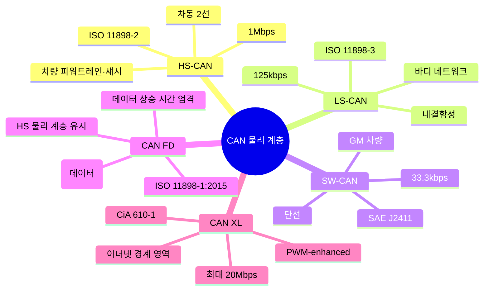
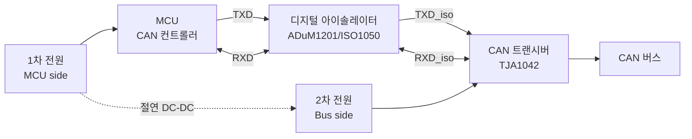

# CH3. 물리 variant

::: info 학습 목표
- HS-CAN, LS-CAN, SW-CAN, CAN FD의 물리 계층 차이를 속도·내결함성·전압 관점에서 설명할 수 있다.
- Galvanic isolation이 필요한 상황과 구현 방식(옵토커플러·디지털 아이솔레이터)을 안다.
- 대표 트랜시버 IC(TJA1042, TJA1043, TJA1145, TCAN1042, MCP2562)의 특성과 용도를 구분한다.
- 속도·거리·EMC·isolation·partial networking 조건으로 트랜시버를 선택할 수 있다.
:::

## 1. CAN 물리 계층의 지도

"CAN"이라는 하나의 이름 아래 사실은 여러 물리 계층 표준이 공존한다. 각각 목적이 다르다.

## 2. HS-CAN (ISO 11898-2)

가장 흔한 버전이다. 지금까지 다룬 "차동 신호, VDIFF 0V/2V, 120Ω 종단"이 모두 HS-CAN 얘기다.

| 항목 | 값 |
|------|-----|
| 최대 속도 | 1 Mbps |
| 신호 방식 | 차동 2선 (CANH, CANL) |
| 종단 | 양끝 120Ω |
| 최대 버스 길이 | 약 40m @1Mbps, 1km @50kbps |
| 노드 수 | 전기적으로 ~30개(실무), 논리적으로 ID 한도까지 |

파워트레인, 엔진 ECU, 변속기, ABS, 에어백 등 <strong>실시간성과 대역폭이 중요한</strong> 네트워크에 쓰인다. 현대 자동차의 메인 CAN도 대부분 HS-CAN이다.

## 3. LS-CAN (ISO 11898-3, Fault-Tolerant)

<strong>한 선이 끊어지거나 GND/Battery에 short 되어도 통신이 지속</strong>되는 것이 핵심이다. 그래서 이름에 "Fault-Tolerant"가 붙는다.

| 항목 | 값 |
|------|-----|
| 최대 속도 | 125 kbps |
| 전압 (Recessive) | CANH≈0V, CANL≈5V |
| 전압 (Dominant) | CANH≈3.6V, CANL≈1.4V |
| 종단 | 분산 RTH/RTL (노드마다) |
| 내결함성 | 1선 단선, GND/VBAT short 시 single-wire 모드 |

문 제어 모듈, 시트 ECU, 미러, 실내등 같은 <strong>바디 네트워크</strong>에 쓴다. 속도는 낮지만 고장을 허용하는 설계라 안전성이 중요한 곳에 들어간다. 최근 차량은 LIN으로 대체하는 추세지만, 기존 플랫폼에는 여전히 남아 있다.

LS-CAN 트랜시버는 고장을 감지하면 자동으로 <strong>단선 모드</strong>로 전환해 남은 선으로 통신을 유지한다. 복원되면 다시 차동 모드로 돌아간다.

## 4. SW-CAN (SAE J2411)

GM이 주로 채택한 <strong>단선 CAN</strong>이다. 전선 하나만 쓰고 리턴은 차체 GND로 한다.

| 항목 | 값 |
|------|-----|
| 최대 속도 | 33.3 kbps (표준), 83.3 kbps (고속 모드) |
| 전압 | Recessive 0V, Dominant 4V |
| 배선 | 1 wire + GND |
| 특징 | Sleep/Wakeup 모드 지원, 저전력 |

저속·저전력이 목적이므로 <strong>사이드미러·파워윈도우·도어락</strong> 같은 비실시간 액세서리에 쓰인다. GM의 GMLAN 네트워크 중 저속 계층이 SW-CAN 기반이다. EMC 성능은 차동 방식보다 떨어지지만, 배선과 비용이 절반이다.

## 5. CAN FD의 물리 계층 — 같으면서도 다른

CAN FD(Flexible Data-rate)는 <strong>HS-CAN의 물리 계층(ISO 11898-2)을 그대로 사용</strong>한다. 같은 CANH/CANL, 같은 120Ω 종단, 같은 트랜시버로 동작한다. 그런데 데이터 구간 속도가 2~8Mbps로 뛰기 때문에 <strong>상승/하강 시간 요구가 훨씬 엄격</strong>하다.

- <strong>FD-tolerant 트랜시버</strong>: 1Mbps까지만 보증하지만 2Mbps 이상 데이터도 "통과는 시킨다". 속도 보증은 없음.
- <strong>FD-active 트랜시버</strong>: 2Mbps, 5Mbps, 8Mbps 동작을 보증. 상승 시간·loop delay가 타이트하게 규정됨.
- <strong>FD-passive</strong>: 수신만 하고 송신은 하지 않는 역할. 게이트웨이 모니터링에 쓰임.

TJA1042는 1Mbps HS-CAN용. 같은 회로에 CAN FD를 돌릴 계획이라면 <strong>TJA1044/TJA1051</strong> 같은 FD-optimized 제품을 써야 한다. 이 부분이 신규 설계에서 자주 놓치는 함정이다.

## 6. Galvanic Isolation — 버스와 MCU를 전기적으로 끊기

<strong>Galvanic isolation(전기적 절연)</strong>은 CAN 버스와 MCU 사이에 <strong>전기적 도통 경로를 끊는</strong> 기법이다. 두 회로는 신호만 주고받고, 전원과 GND는 완전히 분리된다.

### 6.1 언제 필요한가

- <strong>고전압 장비</strong>: EV 배터리 관리, 인버터, 산업용 모터 드라이브. 수백~수천 볼트 계통의 사고 전압이 MCU로 유입되면 안 된다.
- <strong>긴 케이블</strong>: 산업 현장에서 수십 미터 떨어진 노드 간 GND 전위차가 수 볼트~수십 볼트에 이르면 그라운드 루프 전류가 트랜시버를 태운다.
- <strong>의료·안전 기기</strong>: 환자 안전 관점에서 2차 회로 절연이 요구된다.
- <strong>EMC 시험 통과</strong>: 강한 서지 시험에서 절연이 마진을 만든다.

### 6.2 구현 방식

- <strong>옵토커플러</strong>: 전통적. LED + 포토트랜지스터로 광학적 절연. 속도·수명 한계(수백 kbps).
- <strong>디지털 아이솔레이터</strong>(ADuM1201, ISO1050, Si8662): 미니어처 변압기나 커패시터 결합 방식. 10Mbps 이상, 수천 V 절연 내압.
- <strong>통합 아이솔레이티드 트랜시버</strong>(TI ISO1042, ADI ADM3053): 트랜시버와 절연을 한 패키지에. 배선 단순화.

절연 회로에서 주의할 점은 <strong>버스 쪽 전원을 어떻게 공급할지</strong>다. 절연 DC-DC 컨버터가 별도 필요하고, 이 컨버터의 EMC 특성이 CAN 버스 파형 품질에 영향을 준다.

## 7. 대표 트랜시버 IC

| 모델 | 제조사 | 특징 | 용도 |
|------|--------|------|------|
| <strong>TJA1042</strong> | NXP | HS-CAN 기본형, low standby | 일반 HS-CAN 노드 |
| <strong>TJA1043</strong> | NXP | Partial networking, 웨이크업 | 저전력 ECU |
| <strong>TJA1145</strong> | NXP | CAN PN(Partial Networking) + SPI | 슬립 지원 자동차 ECU |
| <strong>TJA1044/TJA1051</strong> | NXP | CAN FD active, 5Mbps | CAN FD 노드 |
| <strong>TCAN1042</strong> | TI | HS-CAN + CAN FD, ±58V 보호 | 산업·자동차 |
| <strong>ISO1042</strong> | TI | 이소레이티드 CAN FD 트랜시버 | 고전압 시스템 |
| <strong>MCP2562</strong> | Microchip | HS-CAN, SPLIT pin 지원 | MCP2515 짝꿍 |

<strong>Partial Networking(PN)</strong>은 슬립 상태에서도 특정 ID 패턴을 받으면 깨어나는 기능이다. TJA1145 같은 PN 트랜시버는 엔진이 꺼진 동안 메인 MCU는 자고, 트랜시버만 저전력으로 버스를 감시한다. 키-리스 엔트리, 텔레매틱스 웨이크업에 필수적이다.

## 8. 트랜시버 Selector 가이드

| 요구 조건 | 추천 |
|-----------|------|
| 일반 1Mbps HS-CAN | TJA1042, MCP2562 |
| CAN FD 2~5Mbps | TJA1051, TCAN1042 |
| 저전력 슬립 + 웨이크업 | TJA1043 |
| Partial Networking | TJA1145 |
| 고전압 Galvanic isolation | ISO1042, ADM3053 |
| 산업 환경 과전압 내성 | TCAN1042H (±58V) |
| 양산 차량 규모 | TJA1042/TJA1145 (AEC-Q100) |

선택 기준은 다음 순서로 좁혀 가는 것이 좋다.

1. <strong>속도</strong> — CAN FD 여부, 몇 Mbps까지 필요한가.
2. <strong>절연</strong> — 버스 쪽과 MCU 쪽이 다른 접지인가, 고전압 계통이 붙어 있는가.
3. <strong>저전력</strong> — 슬립 모드 지원, 웨이크업 이벤트 필요 여부.
4. <strong>보호 수준</strong> — 자동차급(±58V), 산업급(±36V), 일반(±5V)인가.
5. <strong>인증</strong> — AEC-Q100 (자동차), IEC 61131-2 (산업), ISO 26262 (safety).

## 9. 현업 조합 예시

::: details 실제 차량 플랫폼에서 볼 수 있는 조합
- <strong>파워트레인 메인 CAN</strong>: TJA1042 + 양끝 Split termination + CMC, 500kbps~1Mbps HS.
- <strong>바디 CAN</strong>: 과거는 TJA1054 (LS-CAN), 최근은 LIN으로 이전.
- <strong>차량 진단 OBD-II 포트</strong>: HS-CAN 500kbps. 진단 시 게이트웨이가 내부 서브 버스로 중계.
- <strong>EV 배터리팩 내부</strong>: TI ISO1042로 절연, 400V/800V 계통과 12V MCU 분리.
- <strong>텔레매틱스 웨이크업</strong>: TJA1145 Partial Networking. 주차 중에도 특정 ID로 차량을 깨울 수 있음.
- <strong>산업 로봇 관절</strong>: CAN FD 2Mbps, ADM3053 절연, 케이블 실드 드레인 와이어 1점 접지.
:::

## 다음 챕터

지금까지 전기·파형·물리 variant를 다뤘다. 다음 챕터부터는 <strong>비트 타이밍</strong>의 세계로 들어간다. 같은 500kbps라도 bit time을 어떻게 TQ(Time Quantum)로 쪼개고, 어디를 샘플 포인트로 잡느냐에 따라 버스의 안정성이 크게 달라진다.

다음: [CH4. Bit Time 구조](/study/can/04-bit-time)

::: tip 핵심 정리
- HS-CAN(1Mbps, 차동 2선)이 가장 흔하다. LS-CAN은 125kbps 내결함성, SW-CAN은 33kbps 단선(GM).
- CAN FD는 HS 물리 계층을 공유하지만 데이터 구간 상승 시간 요구가 엄격하다. FD-active 트랜시버를 써야 한다.
- Galvanic isolation은 고전압·긴 케이블·의료·EMC 마진용. 디지털 아이솔레이터가 옵토커플러를 대체하는 추세다.
- 트랜시버 선택은 속도 → 절연 → 저전력 → 보호 수준 → 인증 순서로 좁힌다. TJA1145의 Partial Networking은 자동차 저전력 설계의 핵심 부품.
:::
