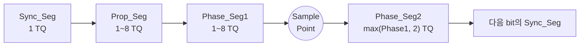
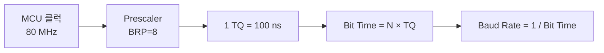

# CH4. Bit Time 구조

::: info 학습 목표
- CAN 1비트를 구성하는 네 개의 segment(Sync / Prop / Phase1 / Phase2)의 역할을 구분한다.
- Time Quantum(TQ)과 Bit Time의 관계식을 이해하고, MCU 클럭에서 BRP와 TQ를 계산할 수 있다.
- SJW(Synchronization Jump Width)의 의미와 Sample Point 배치 전략을 실전 레지스터 값으로 도출한다.
- 주요 컨트롤러(STM32 bxCAN, MCP2515)의 레지스터 필드에 계산 결과를 매핑한다.
:::

CAN은 별도의 클럭선이 없다. 모든 노드가 자기 MCU의 크리스털로 비트 시간을 세고, 버스에 흐르는 edge를 기준으로 자신의 시간을 보정하며 같은 순간에 샘플링한다. 이 "언제 샘플링할 것인가"를 결정하는 구조가 <strong>Bit Time</strong>이다. 1비트는 단순한 고정 구간이 아니라 네 개의 segment가 합쳐진 조립 구조이며, 그 비례를 잘못 고르면 물리 계층은 멀쩡한데도 프레임이 계속 error로 떨어진다.

실제로 현장에서 가장 많이 발생하는 CAN 통신 불량의 원인 중 하나가 바로 이 bit time 파라미터의 잘못된 설정이다. 종단 저항이 정확하고 전선도 문제없는데 노드가 붙지 않을 때, 가장 먼저 의심해야 할 값이 Prop_Seg, Phase_Seg1, Phase_Seg2의 비율과 SJW다. 이번 챕터에서는 이 네 개의 숫자를 어떤 기준으로 정하는지, 그리고 실제 MCU 레지스터에 어떤 값을 써야 하는지를 단계별로 정리한다.

## 1. Bit Time의 네 segment

비트 하나의 시간이 왜 한 덩어리가 아니라 네 구간으로 나뉘는지를 먼저 짚고 가자. 만약 각 노드가 자기 클럭만 믿고 비트의 정확히 한가운데에서 샘플링한다면, 클럭이 조금만 틀어져도 샘플 지점이 비트 경계 근처까지 밀려날 수 있다. 거기에 버스 전파 지연, 송수신기 지연, 반사파 같은 물리적 jitter가 더해지면 경계 근처에서는 어느 순간 dominant를 recessive로 잘못 읽을 위험이 커진다. 그래서 CAN은 비트 안에 "전파를 기다리는 구간(Prop_Seg)"과 "jitter를 흡수하는 버퍼(Phase_Seg1, Phase_Seg2)"를 따로 둬서, 샘플링이 중간 근처가 아니라 안정된 뒤쪽(보통 75~87.5%)에서 일어나도록 설계한 것이다.

CAN 컨트롤러 내부에서 1비트는 다음 네 구간으로 쪼개진다.

### Synchronization Segment (Sync_Seg)

항상 <strong>1 TQ 고정</strong>이다. 1비트가 시작되는 기준점이며, 버스의 recessive→dominant edge가 이 구간 안에 들어와야 "정상 동기"로 간주된다. Edge가 Sync_Seg에서 벗어나면 컨트롤러는 Phase Error로 기록하고 resynchronization을 시도한다. Sync_Seg는 변경이 불가능한 고정값이기 때문에 설계 과정에서 따로 계산할 필요가 없다. 다만 Bit Time을 구성하는 전체 TQ 수에서 1 TQ가 여기에 먼저 배당된다는 것만 기억하면 된다.

### Propagation Segment (Prop_Seg)

버스의 <strong>전파 지연을 보상</strong>하는 구간이다. 두 노드가 물리적으로 떨어져 있으면 신호가 한쪽에서 다른 쪽으로 도달하는 데 시간이 걸린다. 특히 arbitration 중에는 한 노드가 dominant를 드라이브하고, 그 결과를 자기 자신이 다시 읽어야 한다. Prop_Seg는 <strong>(송신 지연 + 버스 전파 + 수신 지연)의 왕복 합의 2배 이상</strong>으로 잡아야 안전하다.

버스 길이 40m, 전파속도 약 5ns/m이면 편도 200ns, 왕복 400ns다. 여기에 송수신기(transceiver) loop delay 150ns 정도를 더해 최소 Prop_Seg는 ~700ns 정도가 된다. 버스가 더 길어질수록 Prop_Seg를 키워야 하므로, 설계 단계에서 최대 버스 길이를 먼저 확정하고 거기에 맞춰 Prop_Seg의 TQ 수를 역산하는 것이 안전하다.

Prop_Seg는 arbitration 단계에서 특히 중요하다. 여러 노드가 동시에 송신을 시작하고 각자가 낸 비트를 비교하기 때문에, 가장 먼 노드가 보낸 dominant 비트가 반대편 끝 노드까지 도달한 뒤 샘플링되어야 한다. Prop_Seg가 부족하면 먼 노드가 자기 식별자를 잃지 않으려고 다시 송신을 시작하는 경우가 발생해, 다중 송신 충돌이 일어난다.

### Phase Segment 1 / Phase Segment 2

Sample Point를 <strong>가운데 두고 양쪽에서 edge jitter를 흡수</strong>하는 버퍼다. Phase_Seg1은 Sample Point 앞쪽, Phase_Seg2는 뒤쪽에 위치한다.

- Phase_Seg1은 edge가 예상보다 늦게 올 때 늘어날 수 있다.
- Phase_Seg2는 edge가 예상보다 일찍 올 때 줄어들 수 있다.
- Phase_Seg2의 최소값은 <code>max(2, Information Processing Time)</code>이다. IPT는 보통 2 TQ이며, 컨트롤러가 샘플 결과를 비트 해석 로직에 넘기는 데 필요한 시간이다.

두 Phase 세그먼트는 서로 대칭적으로 배치하는 것이 기본이지만, 실전에서는 전파 지연이 크지 않은 짧은 버스에서 Phase_Seg1을 Phase_Seg2보다 조금 더 크게 잡아 sample point를 뒤로 밀어주는 경우가 많다. 이렇게 하면 jitter가 큰 환경에서도 샘플링이 안정적이다. 반대로 오실레이터 편차가 걱정되는 환경이라면 Phase_Seg2도 충분히 키워서 SJW가 양쪽 방향 모두로 움직일 수 있게 해야 한다.

## 2. Time Quantum (TQ)

Time Quantum은 CAN 컨트롤러가 비트를 세는 <strong>최소 시간 단위</strong>다. CAN 스펙이 "비트 시간 = N TQ"라는 형태로 정의된 이유는, 각 세그먼트의 길이를 모든 노드가 <strong>정수 배수의 TQ</strong>로 공유해야 서로 동일한 bit 구조를 만들 수 있기 때문이다. TQ 크기 자체는 노드마다 다를 수 있어도, 비트 안에서의 "비율" 즉 Sync/Prop/Phase1/Phase2의 TQ 개수와 Sample Point 위치는 동일해야 같은 순간에 샘플링이 맞아떨어진다. MCU의 CAN 클럭(<code>f_CAN</code>)을 <strong>Baud Rate Prescaler(BRP)</strong>로 분주해 만든다.

TQ = BRP / f_CAN

예를 들어 <code>f_CAN = 80 MHz</code>, <code>BRP = 8</code>이면 <code>TQ = 8 / 80MHz = 100 ns</code>다. 1비트는 이 TQ를 여러 개 이어붙여 구성한다.

## 3. Bit Time 계산식

Bit Time을 수식으로 풀면 네 세그먼트 TQ 수의 합에 TQ 크기를 곱한 것이다. 이 간단한 관계식으로부터, baud rate를 정하면 자동으로 "BRP × Total_TQ"의 값이 하나의 상수로 결정된다는 것을 알 수 있다. 이 상수를 어떻게 두 수의 곱으로 분해하느냐가 bit timing 설계의 핵심 결정이다.

Bit Time은 네 segment의 TQ 합이다.

Total_TQ = 1 (Sync_Seg) + Prop_Seg + Phase_Seg1 + Phase_Seg2

Bit Time = Total_TQ × TQ = Total_TQ × (BRP / f_CAN)

Baud Rate = 1 / Bit Time = f_CAN / (BRP × Total_TQ)

500 kbps를 맞추려면 Bit Time은 2 μs여야 한다. <code>f_CAN = 80 MHz</code>에서 <code>BRP × Total_TQ = 160</code>이라는 조건이 나온다. 후보를 나열하면:

| BRP | Total_TQ | TQ | Sample Point 배치 예 |
|-----|----------|----|----------------------|
| 8 | 20 | 100 ns | Sync=1, Prop=7, P1=7, P2=5 → SP = 15/20 = 75% |
| 10 | 16 | 125 ns | Sync=1, Prop=5, P1=7, P2=3 → SP = 13/16 = 81.25% |
| 16 | 10 | 200 ns | Sync=1, Prop=3, P1=4, P2=2 → SP = 8/10 = 80% |

TQ 개수가 많을수록(BRP가 작을수록) resync 해상도가 높아진다. 반대로 TQ가 너무 적으면 SJW 조정 단위가 거칠어 장시간 동작 시 drift를 흡수하기 어렵다. 보통 <strong>Total_TQ = 8~25</strong> 범위에서 고른다.

같은 500 kbps를 만드는 방법이 여러 가지 존재하지만, 무조건 TQ 개수를 많이 하는 것이 좋은 것도 아니다. TQ가 많아지면 각 TQ의 폭이 작아지고, 이는 클럭 jitter의 상대적 크기가 커진다는 뜻이 된다. 실무에서는 MCU 클럭에 맞춰 BRP를 정수로 맞추기 좋은 조합을 먼저 고르고, 그 다음 Sample Point가 권장 범위 안에 들어오는지 확인하는 방식으로 접근한다. 이 과정에서 BRP가 아주 큰 값이 나와 버리면(예: BRP=64) 다른 baud rate로 바꾸는 게 어려워지므로, 멀티 레이트 지원이 필요한 프로젝트는 공약수가 잘 맞는 BRP를 선호한다.

## 4. SJW (Synchronization Jump Width)

앞서 Bit Time 네 세그먼트의 역할을 정리했지만, 실제 통신 중에는 클럭 편차가 누적되며 Sample Point가 조금씩 어긋난다. 이를 보정해주는 메커니즘이 바로 [다음 챕터](/study/can/05-synchronization)에서 자세히 다루는 resynchronization이며, 이 재동기화가 한 번에 얼마까지 Phase 세그먼트를 움직일 수 있는지를 제한하는 값이 SJW다.

SJW는 resynchronization 시 <strong>Phase 세그먼트를 최대 얼마까지 늘리거나 줄일지</strong>를 제한하는 값이다. Edge가 기대보다 늦으면 Phase_Seg1을 최대 SJW TQ만큼 연장하고, 일찍 오면 Phase_Seg2를 최대 SJW TQ만큼 단축한다.

- 허용 범위: <code>1 ≤ SJW ≤ min(4, Phase_Seg1)</code>
- SJW를 키우면 큰 오실레이터 편차에도 동기화가 유지되지만, 일시적 noise edge에 과도하게 반응할 수 있다.
- SJW를 너무 작게 잡으면 drift 누적에 따라가지 못해 stuff error/form error로 이어진다.
- 실무 기본값은 <strong>SJW = 1~4 TQ</strong>, CAN FD 데이터 구간에선 별도로 재계산한다.

SJW는 "클럭 편차 허용 예산"과 같은 개념으로 볼 수 있다. 노드 사이의 클럭 차이가 크다면 SJW를 키워서 재동기화 폭을 넓혀야 하고, 반대로 정밀 크리스털을 쓰는 환경이라면 SJW가 작아도 충분히 안정적이다. 다만 SJW를 무작정 키우면 bit period 자체가 순간적으로 길어져, 버스 상의 실제 bit rate가 미세하게 변동하는 효과가 생긴다. 장기간의 타이밍 분석이 필요한 시스템(예: 정밀 제어)에서는 SJW를 필요 이상으로 크게 잡지 않는다.

## 5. Sample Point

Bit Time 설계에서 가장 실전적으로 드러나는 값이 바로 Sample Point다. 네트워크 분석 도구나 로직 분석기는 SP를 퍼센트로 표시해주며, 이 값을 네트워크 전반에 걸쳐 동일하게 유지하는 것이 안정적인 통신의 전제 조건이다.

Sample Point는 컨트롤러가 버스 값을 <strong>dominant인지 recessive인지</strong> 실제로 읽는 순간이다. 위치는 Bit Time 내 비율로 표현한다.

Sample Point (%) = (Sync_Seg + Prop_Seg + Phase_Seg1) / Total_TQ × 100

### 권장 배치

- ISO 11898-1은 <strong>75% ~ 87.5%</strong> 사이를 권고한다.
- CAN 2.0 / CAN FD arbitration 구간은 보통 <strong>80% 근처</strong>를 기본값으로 쓴다. 여러 노드가 동시에 송신하며 wired-AND 결과를 읽어야 하므로 버스 전파 완료 후 샘플링해야 한다.
- <strong>CAN FD 데이터 구간은 더 뒤쪽(80~90%)</strong>에 둔다. 빠른 비트 레이트에서 transceiver loop delay가 상대적으로 커지기 때문이다.
- 장거리 / 다수 노드 / 큰 stub → Prop_Seg을 늘려 Sample Point를 뒤로 미룬다.

같은 버스에 붙은 모든 노드는 <strong>Sample Point 위치를 동일하게 맞춰야</strong> 한다. 한 노드가 75%, 다른 노드가 85%를 쓰면, 두 노드가 서로 다른 순간에 버스를 읽기 때문에 특정 비트에서는 서로 다른 값을 보게 된다. 차량 개발 표준에서 OEM들이 Sample Point 기준값을 명시하는 이유가 여기에 있다. 보통 신규 노드를 추가할 때는 기존 노드의 Sample Point를 먼저 계측하고, 거기에 맞춰 새 노드의 bit timing을 설계한다.

## 6. 실전 계산 예제

아래 예제는 대표적인 MCU 클럭과 baud rate 조합이다. 각 단계에서 <strong>왜 그 값을 골랐는지</strong>를 함께 읽어두면, 다른 환경에서도 동일한 흐름으로 계산할 수 있다. 실무에서는 비슷한 과정을 엑셀이나 벤더 도구로 자동화하지만, 한 번은 손으로 풀어봐야 각 단계의 의미가 몸에 남는다.

<strong>조건:</strong> MCU 클럭 80 MHz, CAN 클럭도 80 MHz로 공급. 목표 500 kbps, SP 약 80%.

<strong>STEP 1.</strong> Bit Time = 1 / 500kbps = 2 μs.

<strong>STEP 2.</strong> BRP × Total_TQ = 80MHz × 2μs = 160.

<strong>STEP 3.</strong> 해상도를 위해 Total_TQ = 16으로 선택 → BRP = 10, TQ = 125 ns.

<strong>STEP 4.</strong> Sync = 1, Prop_Seg = 5, Phase_Seg1 = 7, Phase_Seg2 = 3 배치.
Sample Point = (1+5+7)/16 = 81.25%. 일반적으로 이 정도의 SP는 차량 환경에서 널리 쓰이는 기본값이며, OEM이 제시하는 스펙의 중앙값에 가깝다.

<strong>STEP 5.</strong> SJW = 3 (Phase_Seg2와 같은 값이 한계). Drift 허용도와 노이즈 내성의 균형.

또 다른 예: 250 kbps, 120 MHz CAN 클럭. Bit Time = 4 μs, BRP × Total_TQ = 480. BRP = 24, Total_TQ = 20 → TQ = 200 ns. Sync=1, Prop=8, P1=6, P2=5 → SP = 15/20 = 75%, SJW=4.

1 Mbps(CAN FD arbitration까지), 80 MHz: Bit Time = 1 μs, BRP × Total_TQ = 80. BRP=4, Total_TQ=20, TQ=50 ns → Sync=1, Prop=7, P1=8, P2=4 → SP = 80%, SJW = 4.

실무에서는 TI, NXP, ST 같은 반도체 업체들이 자사 MCU용 <strong>bit timing 계산 도구</strong>를 제공한다. 이들 도구는 위에서 계산한 네 단계를 자동화하고, 권장 SP 범위를 벗어나는 조합은 경고로 띄워준다. 프로젝트 초기에는 이런 도구로 후보 조합을 몇 개 뽑아두고, 최종적으로는 실제 오실로스코프 계측을 통해 파라미터를 확정하는 순서가 일반적이다. 계산 값만으로는 실제 하드웨어의 지연과 jitter를 완전히 반영하지 못하기 때문이다.

## 7. 컨트롤러별 레지스터 매핑

실제 하드웨어에 값을 쓰는 단계다. 각 벤더마다 레지스터 이름과 비트 폭이 조금씩 다르지만, 공통적으로 <strong>레지스터에 저장하는 값과 실제 TQ 수가 1 차이</strong>가 난다는 점을 기억한다. 예를 들어 Prop_Seg를 5 TQ로 쓰고 싶다면 레지스터에는 4를 기록한다. 이 오프셋을 놓치면 의도한 것보다 비트 시간이 짧아지거나 길어져 다른 노드와 동기가 맞지 않는다.

### STM32 bxCAN: CAN_BTR

- <code>BRP[9:0]</code> — prescaler (레지스터값 = BRP - 1)
- <code>TS1[3:0]</code> — Prop_Seg + Phase_Seg1 합 (값 = 합 - 1)
- <code>TS2[2:0]</code> — Phase_Seg2 (값 = Phase2 - 1)
- <code>SJW[1:0]</code> — SJW (값 = SJW - 1, 최대 4)

예: BRP=10, Prop+P1=12, P2=3, SJW=3 → 레지스터는 BRP=9, TS1=11, TS2=2, SJW=2. 주의할 점은 STM32 bxCAN은 <strong>Prop_Seg와 Phase_Seg1을 구분하지 않는다</strong>는 것이다. 두 값의 합만 TS1 필드에 설정하면 된다. 이 때문에 STM32 기반 설계에서는 "TSEG1 = Prop+P1"이라는 합성값을 직접 관리하고, 실제 배분은 Sample Point 계산에만 의미가 있다.

### Microchip MCP2515: CNF1/2/3

- <code>CNF1.BRP[5:0]</code> — prescaler (실제 BRP = CNF1.BRP + 1, 2배 후에 분주)
- <code>CNF1.SJW[1:0]</code> — SJW (실제값 = CNF1.SJW + 1)
- <code>CNF2.PRSEG[2:0]</code> — Prop_Seg (+1)
- <code>CNF2.PHSEG1[2:0]</code> — Phase_Seg1 (+1)
- <code>CNF2.BTLMODE</code> — Phase_Seg2 길이 결정 방식(1이면 CNF3에서 설정)
- <code>CNF3.PHSEG2[2:0]</code> — Phase_Seg2 (+1)
- <code>CNF2.SAM</code> — 1 sample / 3 sample majority

### STM32 FDCAN: NBTP (nominal), DBTP (data)

CAN FD는 nominal과 data 구간을 분리해 두 세트의 BRP/TS1/TS2/SJW를 가진다. Data 구간은 TDC(Transmitter Delay Compensation)까지 함께 설정한다. STM32 H7 계열의 FDCAN 주변 장치에서는 NBTP와 DBTP를 모두 설정하지 않으면 FD 프레임 전송 자체가 불가능하므로, 초기화 코드에서 두 레지스터가 모두 프로그래밍됐는지 확인해야 한다.

### NXP MCAN / Microchip SAM C21의 CAN 모듈

AUTOSAR 표준을 따르는 대부분의 현대 CAN 컨트롤러는 Bosch M_CAN IP를 기반으로 한다. 레지스터 이름은 벤더마다 다르지만 필드 구성(BRP, TSEG1, TSEG2, SJW)은 거의 동일하다. 한 번 bit timing 계산 흐름을 익혀두면 여러 MCU에 공통으로 적용할 수 있다는 뜻이다.

## 8. Bit Timing 설계 체크리스트

실무에서 bit timing을 새로 잡거나 문제를 진단할 때 순서대로 확인하면 좋은 체크리스트다.

1. <strong>최대 버스 길이</strong>를 확정하고 왕복 전파 지연을 계산한다. 여기에 송수신기 loop delay를 더해 최소 Prop_Seg의 실제 시간(ns)을 얻는다.
2. <strong>목표 baud rate</strong>와 MCU의 <strong>CAN 클럭 소스</strong>(PLL 분주 결과)를 확인한다. PLL이 변하면 bit timing도 다시 계산해야 하므로, 초기화 코드에서 클럭 설정을 건드리는 순서를 꼼꼼히 본다.
3. <strong>BRP × Total_TQ</strong>가 나오는 조합을 열거하고, 가능한 한 <strong>Total_TQ가 큰 쪽</strong>을 우선 시도한다(해상도 우선).
4. Sample Point 목표(보통 80%)에 맞춰 Prop_Seg/Phase_Seg1/Phase_Seg2를 배분한다.
5. <strong>SJW</strong>는 Phase_Seg2 이하로, 오실레이터 편차를 고려해 정한다.
6. 실제 파형을 계측해 <strong>ACK slot</strong>에서 다른 노드들이 제때 응답하는지 확인한다. ACK 실패는 타이밍 불일치의 가장 흔한 증상이다.

이 체크리스트는 새 하드웨어에만 적용되는 것이 아니다. 기존 네트워크에 새 노드를 추가할 때도 반드시 거쳐야 한다. 기존 노드와 한 개 TQ라도 어긋나면 새 노드가 자기 메시지를 보낼 때 ACK를 받지 못하거나, 오히려 기존 노드의 메시지를 잘못 디코딩해 에러 프레임을 쏟아낸다.

## 9. 흔한 실수

::: warning 실전 주의
- <strong>Prop_Seg를 너무 작게</strong> 잡으면 40m 이상 긴 버스에서 arbitration이 실패한다. 물리 길이와 노드 수를 함께 고려한다.
- <strong>SJW = 0</strong>은 아예 금지다. 최소 1 TQ 이상이어야 재동기화가 동작한다.
- <strong>CAN FD에서 data 구간 sample point를 잊고</strong> arbitration과 같은 비율로 두면, 빠른 비트 레이트에서 transceiver delay 때문에 bit error가 난다. TDC도 같이 활성화한다.
- <strong>세라믹 오실레이터</strong>는 크리스털 대비 편차(±0.5% 이상)가 커서, SJW를 최대치로 올려도 drift를 흡수 못 하는 경우가 있다. CAN 노드는 <strong>크리스털 권장</strong>이다.
- 레지스터에 값을 넣을 때 <strong>"-1" 오프셋</strong>을 잊지 않는다. STM32와 MCP2515 모두 계산값 - 1을 써야 한다.
:::

## 다음 챕터

다음은 [CH5. 동기화](/study/can/05-synchronization)다. Bit Time 구조를 잡았다면, 실제로 어떻게 Hard Sync와 Resync가 동작해 여러 노드가 같은 순간에 같은 bit를 샘플링하는지, 오실레이터 편차의 수학적 상한을 어떻게 계산하는지 이어서 본다.

::: tip 핵심 정리
- 1비트는 <strong>Sync_Seg(1 TQ) + Prop_Seg + Phase_Seg1 + Phase_Seg2</strong>로 구성된다.
- <strong>TQ = BRP / f_CAN</strong>, <strong>Bit Time = Total_TQ × TQ</strong>, <strong>Baud Rate = 1 / Bit Time</strong>.
- <strong>Sample Point</strong>는 (Sync+Prop+P1)/Total로 계산하며, CAN 2.0/arbitration은 ~80%, CAN FD data 구간은 더 뒤쪽.
- <strong>SJW</strong>는 1~4 TQ, Phase_Seg1과 Phase_Seg2보다 커서는 안 된다.
- STM32 bxCAN BTR, MCP2515 CNF1/2/3 모두 <strong>레지스터값 = 실제값 - 1</strong> 오프셋에 주의.
:::
